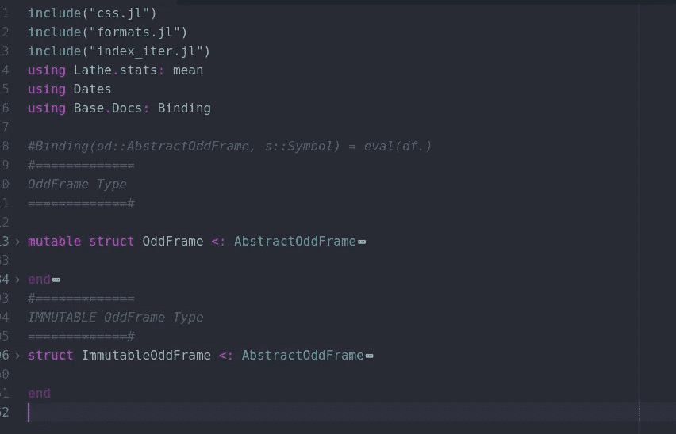

# 摧毁你和 Julia 的所有编程概念

> 原文：<https://towardsdatascience.com/destroying-every-programming-concept-you-know-with-julia-131044f3d1b6?source=collection_archive---------7----------------------->

## 使用 Julia 打破计算机编程的传统方法


(src =[https://pixabay.com/images/id-1994520/](https://pixabay.com/images/id-1994520/)

# 介绍

在给计算机编程的艺术中，有许多不同的方法来完成工作。这个描述中的“作业”是类型、操作(方法)和数据之间的交互。从历史上看，对于计算机科学来说，这是一个非常独特的实验领域。现实情况是，有很多方法和途径，有些当然更适合不同的任务。

也就是说，Julia——对于我的应用程序来说，通常会完全颠覆人们对范式的典型看法。在我们进入我提到的内容之前，让我们快速地回顾一下编程范例的主题，以防我的读者对这个概念不熟悉。

# 范例

在 Lisp 编程语言发布之前，编程范式的存在并不像以前那样被定义。在此之前，有一些我们现在称之为命令式编程语言的语言，但是这些语言和它们各自的类型系统就像今天一样——混乱不堪。

Lisp 编程语言引入了函数式编程范式，随后是另一种众所周知的现代编程范式，面向对象编程。许多程序员可能熟悉这两个主题，但不确定它们的确切含义。

编程范式是不同定义的数据与编程语言中的操作进行交互的方式。例如，在面向对象编程范例中，我们看到方法通常是类型的属性。类型不是在方法参数中调用，而是作为结构的子级调用。这提供了一些语法上的优势，比如不需要为一些函数调用传递任何参数，此外还使得在每次方法调用时不再需要调用函数想要使用的类型成为可能。这种范式也非常强调子类型和分类。所有这些都来自于 Simula 编程语言中的思想，可以肯定地说，Simula 编程语言是所有面向对象编程之父。

尽管大多数编程语言都有一个特定的范例，但大多数现代编程语言都遵循一个流行趋势——多范例编程。多范例编程需要什么？有一个完全独立的能力联盟，也可以用来改变或增强编程语言的范式，这些被称为泛型编程概念。人们使用的大多数编程语言可能不是纯粹的 X 或 Y 语言，而是几种语言的混合。

例如，没有多重分派和其他编程泛型的 Julia 将是一种具有简单类型和函数的普通函数式语言。然而，多分派，参数多态，不需要太多的阅读就可以意识到将方法作为定义应用到它们各自的结构并不是一个函数声明性的概念。也就是说，Julia 仍然这样做，因为它可以，当然，当涉及到面向对象编程之类的东西时，这个特性并不那么有用，所以函数范式的应用更有意义。另一个例子是更流行的语言 Python。Python 有全局定义的变量和方法——这在任何情况下都不是面向对象编程的特性。在纯面向对象编程中，情况并非如此。然而，我们看到 Python 是如何从这种泛型编程概念中受益的，因为如果不是这样，它就不太可能被广泛用于数据科学。

# 摧毁范式

既然我们已经了解了范例，现在让我们用一些非常有趣(并且令人困惑)的代码来摧毁我们刚刚了解的一切。这个项目的代码是一个名为 OddFrames.jl 的包。这是一个面向对象的基于索引的 Julia 数据帧模块，旨在使处理数据更容易，更像 Python 的 API。如果你想了解更多关于这个项目的信息，你可以查看这里链接的 Github 页面:

[](https://github.com/ChifiSource/OddFrames.jl) [## GitHub-chifi source/odd frames . JL:面向对象的、基于 dict 的 DataFrames 包！

### jl 是 Julia 的一种新的数据管理和操作包。然而，许多类似的软件包…

github.com](https://github.com/ChifiSource/OddFrames.jl) 

这个项目还很年轻，这也是为什么很多方法仍然存在问题的原因。现在，请允许我揭示这个包的面向对象特性是如何工作的，这是接下来的怪异之处的先决条件。它从外部构造函数开始调用:

```
mutable struct OddFrame <: AbstractOddFrame labels::Array{Symbol} columns::Array{Any} coldata::Array{Pair} head::Function drop::Function dropna::Function dtype::Function
```

此类型由外部构造函数构成。我们能够传递该函数中使用的所有数据，并从局部范围将其放入类型中。这意味着，如果我们想查看数据帧，我们不需要使用

```
head(::OddFrame)
```

相反，在面向对象的场景中，我们可以这样称呼它:

```
OddFrame.head()
```

内部构造函数相对较短，因为它练习提取，所以我当然可以分享整个函数——并逐一运行每一行，这样我们就可以了解这个函数真正是如何工作的。我有一篇文章是关于为什么抽取实际上是一个很好的编程实践，如果你有兴趣了解更多的话，你可以看看这篇文章，但是我认为下面的演示肯定会准确地演示为什么这是编程时的一个很好的实践。不管怎样，这篇文章是这样的:

[](/more-methods-means-better-code-1d3b237f6cf2) [## 更多的方法意味着更好的代码

towardsdatascience.com](/more-methods-means-better-code-1d3b237f6cf2) 

```
function OddFrame(p::Pair ...)# Labels/Columnslabels = [pair[1] for pair in p]columns = [pair[2] for pair in p]length_check(columns)name_check(labels)types = [typeof(x[1]) for x in columns]# coldatacoldata = generate_coldata(columns, types)# Headhead(x::Int64) = _head(labels, columns, coldata, x)head() = _head(labels, columns, coldata, 5)# Dropdrop(x) = _drop(x, columns)drop(x::Symbol) = _drop(x, labels, columns, coldata)drop(x::String) = _drop(Symbol(x), labels, columns, coldata)dropna() = _dropna(columns)dtype(x::Symbol) = typeof(coldata[findall(x->x == x,labels)[1]][1])dtype(x::Symbol, y::Type) = _dtype(columns[findall(x->x == x,labels)[1]], y)# typeself = new(labels, columns, coldata, head, drop, dropna, dtype);select!(self)return(self);end
```

因为这是一个接受 pairs 的函数，所以这个函数的第一步是将它们从一个组中取出并放入一个数组中。这是为了让我们能够有效地与我们的搭档合作。如果我们不这样做，您可能会对其局限性感到惊讶。我希望有一些我知道的更简单的方法，比如 Array{Pair}() cast，但是我不知道这样的事情:

```
labels = [pair[1] for pair in p]columns = [pair[2] for pair in p]
```

我还借此机会分离标签、每对的第一个索引和列，它们应该是包含我们的观察值的数组。接下来，我运行一些快速检查，以确保我们的数据实际上可以包含在一个数据帧中。这些要求只是没有一个列的名称是相同的，并且所有列的长度都是相同的。

```
length_check(columns)name_check(labels)
```

接下来，我们必须获得每条数据的类型，这实际上非常重要——我想我在早期低估了跟踪数据类型的重要性。实际上，你会惊讶于仅从字符串中找出这一点有多难，例如在 CSV 读取的场景中，我实际上写了另一篇关于这一点的文章，因为我用于编写它的代码非常令人沮丧，你可以在这里阅读它——解决方案当然很有趣:

[](/the-wretched-pain-i-experienced-creating-a-csv-reader-in-julia-e67520857b9c) [## 我在 Julia 中创建 CSV 阅读器时经历的痛苦

### 想知道 CSV 文件是如何解析的吗？这是字符串处理的好方法！

towardsdatascience.com](/the-wretched-pain-i-experienced-creating-a-csv-reader-in-julia-e67520857b9c) 

```
types = [typeof(x[1]) for x in columns]
```

接下来，我们为每一列生成列数据:

```
coldata = generate_coldata(columns, types)
```

我真的很想稍微修改一下，让外部构造函数保存类型，而不是像现在这样包含它的 coldata。不管怎样，接下来我们创建函数——然后奇怪的事情发生了:

```
# Headhead(x::Int64) = _head(labels, columns, coldata, x)head() = _head(labels, columns, coldata, 5)# Dropdrop(x) = _drop(x, columns)drop(x::Symbol) = _drop(x, labels, columns, coldata)drop(x::String) = _drop(Symbol(x), labels, columns, coldata)dropna() = _dropna(columns)dtype(x::Symbol) = typeof(coldata[findall(x->x == x,labels)[1]][1])dtype(x::Symbol, y::Type) = _dtype(columns[findall(x->x == x,labels)[1]], y)
```

类型部分是事情变得奇怪的地方。通常，这个 new()方法用作构造函数的最后一部分，因为它提供了我们新构造的类型的返回，该类型将被返回:

```
self = new(labels, columns, coldata, head, drop, dropna, dtype);select!(self)return(self);
```

然而，在这个实例中，在返回它之前，我们调用这个 select！()方法，我们把它赋给了一个变量。

> 这是干什么用的？

这就是这个包的范例变得有点古怪的地方。这个包中使用的大多数函数都被本地化为构造类型。例如，考虑包含这些类型的主文件。如果我折叠所有的类型，我们会看到在全局范围内声明的函数是如此之少。



(图片由作者提供)

所有全局定义的方法都放在 methods.jl 中，这是整个文件:

```
import Base: show, size, lengthshape(od::AbstractOddFrame) = [length(od.labels), length(od.columns[1])]size(od::AbstractOddFrame) = [length(od.labels), length(od.columns[1])]length(od::AbstractOddFrame) = length(od.columns[1])width(od::AbstractOddFrame) = length(od.labels)show(od::AbstractOddFrame) = od.head(length(od))function select!(od::OddFrame)global head = getfield(od, :head)global drop = getfield(od, :drop)global dropna = getfield(od, :dropna)global dtype = getfield(od, :dtype)end
```

因此，这个包当然更多地存在于面向对象的范例中，而不是函数式编程范例中。这个包实际上具有那个范例的所有特性——包括子类型。但是，我想请你注意选择！()函数:

```
function select!(od::OddFrame)global head = getfield(od, :head)global drop = getfield(od, :drop)global dropna = getfield(od, :dropna)global dtype = getfield(od, :dtype)end
```

这是我们在创建类型后调用的函数，它做什么，为什么在这里？嗯，我在 Julia 中使用这种面向对象的方法遇到了一个重要的问题—

> 文档。

你不能打电话吗？(od.whatever)在朱莉娅的任何种类的代码。基本上没有办法有效地记录类型的局部方法。除了我们将要使用的改变范例的方法之外，解决这样一个问题的唯一可用的方法是将方法文档添加到类型的文档中，例如它是如何在车床中完成的。

```
"""## Ordinal Encoder### DescriptionOrdinally Encodes an array.\n--------------------\n### InputOrdinalEncoder(x)\n--------------------\n#### Positional ArgumentsArray{Any} - x:: Array for which the original scaler should be basedoff of.\n--------------------\n### Outputencoder :: A Lathe Preprocesser object.---------------------\n### FunctionsPreprocesser.predict(xt) :: Returns an ordinally encoded xt.\n"""mutable struct OrdinalEncoder{P} <: Encoderpredict::Plookup::Dictfunction OrdinalEncoder(array::Array)lookup = Dict(v => i for (i,v) in array |> unique |> enumerate)predict(arr::Array) = map(x->lookup[x], arr)predict(df::DataFrame, symb::Symbol) = map(x->lookup[x], df[!, symb])P =  typeof(predict)return new{P}(predict, lookup)endend
```

不用说，这可能会造成一些混乱。对于 Julia 程序员来说尤其如此，他们可能不期望面向对象的接口。同样，这意味着上面例子中 predict()方法的唯一文档就是我们想要放入这个函数部分的内容。实际上，每种方法都需要它自己的文档，这些文档可以更深入地举例说明。

另外，OddFrames.jl 只是一个不同的项目。这个项目将需要更多的方法来处理单个类型，这意味着如果我们使用车床方法，函数部分将绝对是巨大的，难以阅读，并且通常是糟糕的文档。幸运的是，有一种方法可以让我们拥有全局文档，我们可以在函数风格中使用一个方法定义——并且为每个函数拥有全局文档。

```
function select!(od::OddFrame)global head = getfield(od, :head)global drop = getfield(od, :drop)global dropna = getfield(od, :dropna)global dtype = getfield(od, :dtype)end
```

回顾我们的选择！()方法，它由我们刚刚定义的 oddframe 提供。注意，所有这些方法都可以通过简单地调用 select！()方法，如果最终用户决定选择！()一个不同的 Oddframe，或者如果创建了一个新的 OddFrame，它将被自动选择。我们使用 getfield()方法来获取我们的函数，尽管代码还没有出来，下一步是使用@doc 宏，如下所示:

```
@doc " Displays the first five observations of a given OddFrame" head()
@doc " Displays a given number (x) of observations of a given OddFrame" head(::Int64)
```

请记住，由于这些方法现在是全局定义的，它们现在是函数式的、非常声明性的调用，可以在典型的函数式风格中使用——只有一个例外——我们根本不需要提供类型。相反，这个现在的全局函数被定义为自动提供类型。记住，如果我们像这样调用 head()方法:

```
head()
```

那么我们将得到我们的 OddFrame 的前五个观察值！

# 结论

我认为这是我们在朱莉娅能做的一件非常奇怪的事情。由于其独特和难以置信的灵活范式，Julia 拥有各种有趣的怪癖和能力。如果你有一个问题，Julia 往往能够做你可能需要做的任何事情来解决你的问题——即使它变得非常奇怪，就像这个例子一样。然而，我真正喜欢 Julia 的一点是，尽管找出一个解决方案可能非常困难，尤其是在缺乏大量语言用户的情况下，但语言永远不会碍事。

感谢您的阅读。我很高兴我有这个平台来分享我和 Julia 一起做的所有这些非常有趣和古怪的事情。祝您愉快，编程愉快！