# 简单线性回归的详细解释，评估，和用 ANOVA 的推断

> 原文：<https://towardsdatascience.com/detailed-explanation-of-simple-linear-regression-assessment-and-inference-with-anova-c5e11bb5943a?source=collection_archive---------10----------------------->


Clark Van Der Beken 在 [Unsplash](https://unsplash.com?utm_source=medium&utm_medium=referral) 上拍摄的照片

## 一步一步的讨论和例子，手动实现和 R

两个变量之间的线性关系很常见。因此，许多数学和统计模型被开发出来，以利用这一现象并提取更多关于数据的信息。本文将解释统计学中非常流行的方法简单线性回归(SLR)。

## 本文涵盖:

开发一个简单的线性回归模型

评估模型的拟合程度

使用 ANOVA 表进行假设检验

如果你读这篇文章是为了学习，那么一天之内你要学的东西会很多。所有主题都将包含一个工作示例。请自己动手做例子，以便更好地理解它。

开发单反机型应该不会太难。这很简单。只需使用公式并找到您的模型或使用软件。两者都很简单。

如果你完全是新手，评估和假设检验部分可能会令人困惑。你可能要慢慢的看几遍。我会尽量做到准确和中肯。

## 简单线性回归

当观察到两个定量变量之间的线性关系时，简单的线性回归可用于进一步解释和评估该数据。下面是两个变量之间线性关系的一个例子:

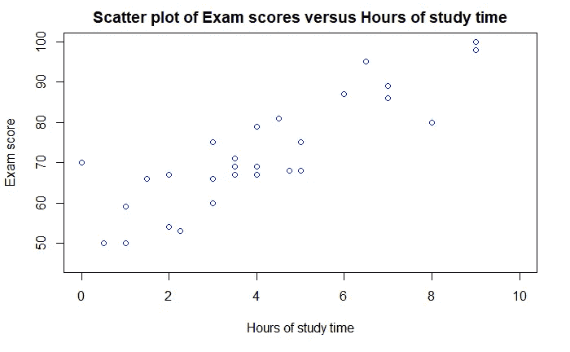

作者图片

图表中的点显示了积极的上升趋势。这意味着如果学习时间增加，考试成绩也会提高。换句话说，学习时间和考试成绩成正相关。从这样的图表中，可以推测出两个变量的相关性的强度和方向。但是不可能量化这种相关性，也不可能量化每增加一个小时的学习，考试分数会发生多大的变化。如果你能量化这一点，就有可能预测考试成绩，如果你知道学习时间的话。这将是非常有用的，对不对？

简单线性回归(SLR)就是这么做的。它使用的是我们在学校都学过的直线公式。公式如下:

y = c + mx

这里，

y 是因变量，

x 是独立变量，

m 是斜率，并且

c 是截距

在上图中，考试分数是 y，学习时间是 x。考试分数取决于学习时间。所以，考试分数是因变量，学习时间是自变量。

使用简单的线性回归确定斜率和截距。

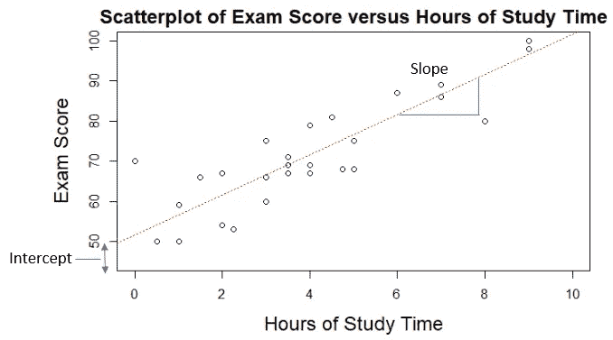

作者图片

线性回归就是拟合通过这些点的最佳拟合线，并找出截距和斜率。如果你能做到这一点，你就能量化考试分数，如果你有可用的学习时间数据。现在，对考试分数的准确估计将取决于更多的信息。我们会慢慢到达那里。

在统计学中，β0 和β1 是代替 c 和 m 的常用术语。因此，上面的等式看起来像这样:

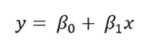

上图中的红色虚线应该尽可能靠近圆点。最常用的方法是最小二乘回归法。

## 回归方程

上图中的红色虚线称为最小二乘回归线。这条线应该尽可能地靠近这些点。

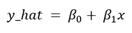

这里 y_hat 是因变量的估计值或预测值(上例中的考试成绩)。

> 记住，预测值可能与因变量的初始值不同。在上图中，原始数据点是分散的。但是上面等式中的预测值或期望值将在红色虚线上。所以，原始 y 和预测值 y_hat 之间会有差异。

β0 和β1 可以使用最小二乘回归公式计算，如下所示:

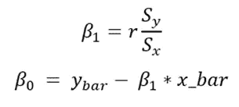

这里，

y_bar 是“y”变量的样本平均值。

x_bar 是“x”变量的样本平均值。

Sx 是“x”变量的样本标准偏差

Sy 是“y”变量的样本标准偏差

## 开发线性回归模型的示例

我希望上面的讨论是清楚的。如果没有，也没关系。现在，我们将研究一个例子，它将使一切变得清晰。

以下是用于本示例的数据集:

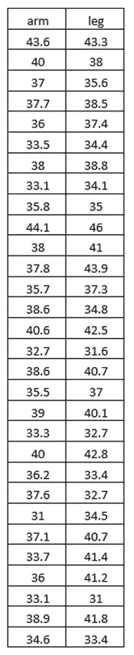

作者图片

该数据集包含 30 个人的臂长和腿长。散点图如下所示:


作者图片

请随意下载该数据集并跟随:

[](https://github.com/rashida048/Simple-Linear-Regression/blob/main/arm_leg.csv) [## main rashida048 处的简单线性回归/arm _ leg . CSV/简单线性回归

### SLR 模型开发、评估和推理，在 R-Simple-Linear-Regression/arm _ leg . CSV 主…

github.com](https://github.com/rashida048/Simple-Linear-Regression/blob/main/arm_leg.csv) 

这里有一个线性趋势。让我们看看是否可以使用数据开发一个线性回归方程，该方程可以使用臂长合理地预测腿长。

这里，

臂长是 x 变量

腿长是 y 变量

让我们看看上面的公式。如果我们想找到基于臂长的 y 的计算值，我们需要计算β0 和β1。

**计算β1 所需的参数:**相关系数，臂长标准差，腿长标准差。

**计算β0 所需的参数:**腿长的平均值β1 和臂长的平均值。

使用数据集可以非常容易地计算出所有参数。我用 R 来计算它们。你可以使用任何你觉得舒服的语言。

首先，将数据集读入 RStudio:

```
al = read.csv('arm_leg.csv')
```

我之前已经展示了整个数据集。它有两列:“胳膊”和“腿”，分别代表人的胳膊和腿的长度。

为了方便计算，我将把手臂的长度和腿的长度保存在单独的变量中:

```
arm = al$arm
leg = al$leg
```

以下是如何找到“臂”和“腿”列的平均值和标准偏差:

```
arm_bar = mean(arm)
leg_bar = mean(leg)s_arm = sd(arm)
s_leg = sd(leg)
```

r 还有一个“cor”函数来计算两列之间的相关性:

```
r = cor(arm, leg)
```

现在，我们有了计算β0 和β1 所需的所有信息。让我们使用之前描述的β0 和β1 的公式:

```
beta1 = r*s_leg/s_arm
beta0 = leg_bar - beta1*arm_bar
```

β1 和β0 分别为 0.9721 和 1.9877。

我想解释从头开始研究线性回归问题的过程。

否则，R 具有“lm”函数，您可以简单地向其传递两个变量，它输出斜率(β1)和截距(β0)。

```
m = lm(leg~arm)
```

输出:

```
Call:
lm(formula = leg ~ arm)Coefficients:
(Intercept)          arm  
     1.9877       0.9721
```

插入斜率和截距的值，该数据集的线性回归方程为:

y = 1.9877 + 0.9721x

如果你知道一个人的手臂长度，你现在可以用这个等式估计他或她的腿的长度。例如，如果一个人的手臂长度为 40.1，那么这个人的腿的长度估计为:

y = 1.9877 + 0.9721*40.1

一共是 40.99。这样，你也可以得到其他不同手臂长度的人的腿的长度。

> 但请记住，这只是对那个人腿长的估计或计算值。

不过，有一点需要注意。当你用手臂的长度来计算腿的长度时，记住不要外推。这意味着要注意你在模型中使用的数据范围。例如，在这个模型中，我们使用的臂长在 31 到 44.1 厘米之间。不要计算 20 厘米手臂长度的腿长。那可能不会给你一个正确的估计。

> 用通俗易懂的语言解释斜率和估计值:

0.9721 的斜率代表手臂长度每改变一个单位，腿的长度平均会增加 0.9721 个单位。请把注意力集中在“平均”这个词上。

> 每一个手臂长度为 40.1 的人，可能都没有 40.99 的腿长。可能会有点不同。但我们的模型显示，平均而言，它是 40.99。如你所见，并非所有的点都在红线上。红色虚线是所有平均值的直线。

1.9877 的截距意味着，如果臂的长度为零，则腿的平均长度仍然是 1.9877。臂的长度为零是不可能的。所以，在这种情况下，它只是理论上的。但在其他情况下，这是可能的。例如，考虑学习时间与考试分数之间的线性关系。可能存在线性关系，即考试分数随着学习时间的增加而增加。但是即使一个学生根本没有学习，她/他仍然可以获得一些分数。

## 这个估计有多好？

这是个好问题，对吧？我们可以估计。但是这个估计和那个人腿的真实长度有多接近。

要解释这一点，我们需要先看看回归线。

使用“abline”函数，可以在 R 中绘制一条回归线:

```
plot(arm, leg, main="Arm Length vs Leg Length",
     xlab="Length of Arms", ylab = "Length of Legs")
abline(m, lty = 8, col="red")
```


作者图片

看这张照片。原来的点(黑点)分散在周围。估计的点数将直接落在红色虚线上。在这种情况下，对于该数据集，估计的腿长度通常会与实际的腿长度不同。

因此，检查回归线与数据的吻合程度非常重要。

为了找到答案，我们需要真正理解 y 变量。对于任何给定的数据点，可能有三个 y 变量需要考虑。

1.  有真实的或观察到的 y 变量(我们从数据集中获得。在这个例子中是腿的长度)。让我们把这些“y”数据中的每一个都称为“y_i”。
2.  预测的 y 变量(我们可以通过线性回归方程计算的腿长。请记住，这可能不同于原始数据点 y_i)。在这个演示中，我们称它为“y_ihat”。
3.  y 变量的样本平均值。我们已经计算并保存在变量 y_bar 中。

为了评估回归模型与数据集的拟合程度，所有这些 y_i、y_ihat 和 y_bar 将非常重要。

y_ihat 和 y_bar 之间的距离称为回归分量。

**回归分量= y_ihat — y_bar**

原始 y 点 y_i 和计算出的 y 点 y_ihat 之间的距离称为残差分量。

**剩余分量= y_i — y_ihat**

> 经验法则是，与数据拟合良好的回归线的回归分量大于所有数据点的残差分量。相反，不适合数据的回归线的残差分量将大于所有数据点的回归分量。

有道理，对吧？如果观察到的数据点与计算出的数据点相差太大，则回归线拟合得不好。如果所有的数据点都落在回归线上，那么残差分量将为零或接近于零。

如果我们将回归分量和残差分量相加:

total =**y _ ihat—y _ bar+y _ I—y _ ihat = y _ I—y _ bar**

这个怎么量化？你可以简单地从观察到的 y 值(y_i)中减去平均值‘y’(y _ bar)。但这会给你一些正值和负值。而负值和正值会互相抵消。这意味着，这并不代表平均 y 值和观察到的 y 值的真正差异。

一种流行的量化方法是求平方和。这样的话，就不会有什么负面影响了。

总平方和或“总 SS”为:

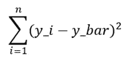

回归平方和或“Reg SS”为:

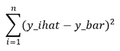

残差平方和或“Res SS”为:

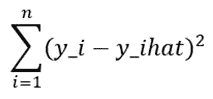

总 SS 也可以计算为“Reg SS”和“Res SS”的总和。

总 SS = Reg SS + Res SS

一切准备就绪！现在是计算 R 平方值的时候了。如前所述，R 平方是表示回归线与数据拟合程度的度量。以下是 R 平方的公式:

r 平方= Reg SS /总 SS

如果 R 平方值为 1，这意味着，响应变量(y 变量)的所有变化都可以用解释变量(x 变量)来解释。

相反，如果 R 平方值为 0，这意味着响应变量中的任何变化都不能用解释变量来解释。

## 方差分析表

这是评估模型与数据拟合程度的最流行方法之一。

下面是方差分析表的一般形式。您已经知道了表中使用的一些参数。我们将在餐桌后讨论其余的问题。

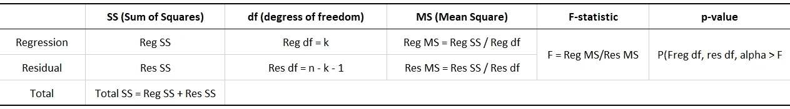

作者图片

此表中的关系和参数在回归分析中非常重要。这实际上有助于我们评估模型。我们已经学习了术语 Reg SS、Res SS 和 Total SS 以及如何计算它们。

上表中的 **Reg df** 是回归平方和的自由度。这等于除截距之外的估计参数的数量。在简单线性回归(SLR)中，它是 1。对于多元回归 k > 1。

**Res df** 是自由度的残差平方和。它的计算方法是数据点数(n)减去 k 减去 1 或(n-k-1)。我们之前提到过，对于单反来说 k 永远是 1。所以，单反的 Res df 是 n-2。

p 值是可以观察到的检验统计的观察值或更极端值的概率。

这里还需要提到一个术语。如果你在 R 中计算 R 的平方，就会得到两个 R 的平方值。我们之前已经讨论过一个 R 平方值和计算方法。但是还有一个。这是经过调整的 R 平方。公式如下:

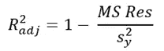

这里，Sy 是 y 变量的标准差。它表示模型可以解释的 y 变量的方差的比例。

对于大 n (n =数据点的数量):

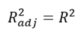

所有的表格和方程式都准备好了。我们来评估一下之前开发的模型！

## 计算 R 平方和方差分析表以评估模型和从中得出的推论

首先，生成一个包含所有参数的表:

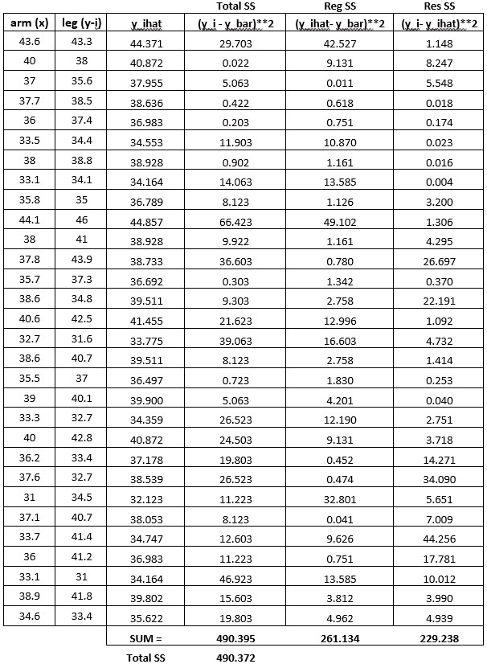

作者图片

请随意从此链接下载 excel 文件，这样您就可以看到实现和公式:

[](https://github.com/rashida048/Simple-Linear-Regression/blob/main/ss_ms_total.xlsx) [## 简单线性回归/ss _ ms _ total . xlsx at main rashida 048/简单线性回归

### 在 R -简单线性回归/ss_ms_total.xlsx 中的 SLR 模型开发、评估和推断主要…

github.com](https://github.com/rashida048/Simple-Linear-Regression/blob/main/ss_ms_total.xlsx) 

注意在表的末尾。我们使用公式计算了“总 SS ”,并将其作为“Reg SS”和“Res SS”的总和。两个“总 SS”几乎相同(490.395 和 490.372)。我们可以使用其中任何一个。从该表中:

总 SS = 490.372

Reg SS = 261.134

Res SS = 229.238

计算 R 平方和 R 平方调整值:

r 平方= Reg SS/Total SS = 261.134/490.372 = 0.5324

r 平方调整= 1–8.187/(s _ leg)* * 2 = 0.5159

正如所料，它们几乎是一样的。

这意味着腿长度的 51.59%的可变性可以由臂的长度来解释。

这个 R 平方值很好地估计了臂长和腿长之间的关系。

但是为了证实这两个变量之间有显著的线性关系，有必要进行假设检验。

如果你对假设检验完全陌生，你可能会想为什么我们需要确认它？我们已经开发了模型并计算了相关性。

但是我们只研究了 30 个样本，并在这 30 个样本上开发了模型。如果我们想从中推断出关于总人口的结论，我们需要假设检验。下面是一篇关于假设检验概念的详细文章:

[](/a-complete-guide-to-hypothesis-testing-for-data-scientists-using-python-69f670e6779e) [## 数据科学家使用 Python 进行假设检验的完整指南

### 用样本研究问题、解决步骤和完整代码清楚地解释

towardsdatascience.com](/a-complete-guide-to-hypothesis-testing-for-data-scientists-using-python-69f670e6779e) 

在这个例子中，我们将使用我们之前描述的 ANOVA 表进行假设检验。

## 使用 ANOVA 表的假设检验示例

有两种不同的等价检验来评估这些假设:1) t 检验和 2) F 检验。

我选择用 f 检验来做。如果你已经知道如何进行 t 检验，那就继续吧。对我来说，f 检验和 t 检验的工作量是一样的。所以，哪一个都好。下面是如何进行 f 检验

> ***F-test***

这个 f 检验有五个步骤。这几乎是一个普遍规律。你将能够在许多其他问题中使用同样的过程。

**第一步:**

建立假设:我们在开始时建立了两个假设。零假设和替代假设。然后根据证据，我们拒绝或未能拒绝零假设。

零假设:

β1 = 0

从线性回归方程中记住，β1 是回归线的斜率。我们将零假设设为β1 = 0 意味着我们假设臂长和腿长之间没有线性关联。

替代假设:

beta1！= 0

另一种情况是β1 不等于零，这意味着臂长和腿长之间存在线性关联。

设置显著性水平α= 0.05。这意味着 95%的置信度。如果您需要重温置信区间的概念，请查看这篇文章:

[](/a-complete-guide-to-confidence-interval-and-examples-in-python-ff417c5cb593) [## 置信区间的完整指南，以及 Python 中的示例

### 对统计学中一个非常流行的参数——置信区间及其计算的深入理解

towardsdatascience.com](/a-complete-guide-to-confidence-interval-and-examples-in-python-ff417c5cb593) 

**第二步:**

选择适当的测试统计。这里我们选择 F 统计量。

**第三步:**

定义决策规则。这意味着决定何时拒绝零假设。

由于这是一个 f 检验，我们需要从 f 分布中确定适当的值。您可以使用该表来确定 F 值。但是该表没有包括所有的 F 值。我更喜欢用 r，非常简单容易。r 有这个“qf”函数，它取置信水平和自由度。我们已经讨论了两种类型的自由度:“规则自由度”和“结果自由度”。

```
qf(0.95, df1 = 1, df2 = 28)
```

输出:

```
4.196
```

所以如果 F 大于或等于 4.196，拒绝零假设。否则，不要拒绝零假设。这是我们的决策规则。

**第四步:**

计算检验统计量。

有两种方法，我将在这里展示。首先，我将手动显示步骤。然后，我将简单地使用 r 的“anova”函数，我们已经知道了“Reg SS”、“Res SS”和自由度。这是方差分析表:

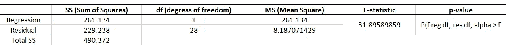

作者图片

请随意下载我做这些计算的原始 excel 文件:

[](https://github.com/rashida048/Simple-Linear-Regression/blob/main/anova%20table.xlsx) [## 简单线性回归/ANOVA table . xlsx at main rashida 048/简单线性回归

### SLR 模型的发展，评估和推断在 R -简单线性回归/方差分析表。xlsx 在主要…

github.com](https://github.com/rashida048/Simple-Linear-Regression/blob/main/anova%20table.xlsx) 

注意，我没有计算表中的 p 值。因为我想在这里展示计算。我将使用 R 从 F 统计量计算 p 值。

```
1-pf(31.896, 1, 28)
```

输出:

4.742e-06

您可以直接从 r 中的“anova”函数获得 anova 表。“ANOVA”函数采用线性回归模型。记得我们一开始得到了线性回归模型，并把它保存在变量‘m’里。请回去检查一下。我们将在“anova”函数中传递“m ”,以使用 R:

```
anova(m)
```

输出:

```
Analysis of Variance TableResponse: leg
          Df Sum Sq Mean Sq F value    Pr(>F)    
arm        1 261.16 261.157  31.899 4.739e-06 ***
Residuals 28 229.24   8.187                      
---
Signif. codes:  0 ‘***’ 0.001 ‘**’ 0.01 ‘*’ 0.05 ‘.’ 0.1 ‘ ’ 1
```

仔细查看输出。ANOVA 表从 Df(自由度)、Sq 均值(之前计算表中的 SS(平方和))、Mean Sq (MS(均方))、F 值、p 值开始。如果你注意到这些值，它们几乎是一样的。

第五步:

得出结论。我们之前定义了决策规则，如果 F ≥ 4.196，我们将拒绝零假设。f 值为 31.899。所以我们可以拒绝零假设。这意味着我们有足够的证据表明，在α= 0.05 的水平上，臂长和腿长之间存在显著的线性关系。我们的 p 值也小于α。这提供了另一个证据，证明我们可以拒绝零假设。

## 结论

如果你能完成所有这些，恭喜你！那是许多工作。这是最简单的模型之一，但却很受欢迎。许多其他模型都是基于线性回归的。把这个学得很好，掌握基本概念很重要。假设检验也是统计学和数据分析中常见的日常任务。因此，本文涵盖了许多有用且广泛使用的材料。希望这对你有帮助。

欢迎在推特上关注我，喜欢我的 T2 脸书页面。