# 多元线性回归模型、评估和推理的详细指南

> 原文：<https://towardsdatascience.com/detailed-guide-to-multiple-linear-regression-model-assessment-and-inference-in-r-e9b183b1441?source=collection_archive---------16----------------------->


由 [Unsplash](https://unsplash.com?utm_source=medium&utm_medium=referral) 上 [Alp Duran](https://unsplash.com/@alpduran?utm_source=medium&utm_medium=referral) 拍摄的照片

## 模型开发、解释、方差计算、f 检验和 t 检验

线性回归是仍然流行的老派统计建模方法之一。随着新语言和库的发展，它现在有了更好的版本，也更容易操作。

多元线性回归是简单线性回归的扩展。在简单线性回归中，我们研究一个自变量或解释变量和一个因变量或响应变量之间的关系。简单线性回归使用这个非常常见的通用公式:

y = mx + c

在哪里，

y =因变量或响应变量

x =独立变量或解释变量

m =斜率

c =截距

如果 x 和 y 共享一个线性关系，如果有可用的“x”数据，就可以预测“y”。

在统计学中，用β0 和β1 代替 c 和 m，因此，公式变为:

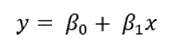

当你在利润和销售、手臂长度和腿长度、收缩压和舒张压等之间建立关系时，这个等式就足够好了。这意味着只有一个解释变量和一个响应变量。

但是在现实世界的场景中，我们经常想要分析一个响应变量和几个解释变量之间的关系。当响应变量是考试分数时，可能有几个解释变量，如学习时间、在学校的出勤率、游戏时间和睡眠时间。我们要分析所有可能的解释变量与响应变量(考试分数)之间的关系。

在这种情况下，线性回归方程变为:

**方程式 1**

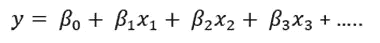

如果我们想到前面提到的例子中的考试分数，y 就是考试分数。x1、x2 和 x3 是学习时间、上学时间、游戏时间。我们需要确定β0、β1、β2、β3 的值…..

在 r 中，计算 betas 值非常简单明了。让我们看一个例子。

# 模型开发、解释和评估

在本次演示中，我们将使用一个包含年龄、体重、体重指数(身体质量指数)和收缩压的数据集。我们将收缩压视为因变量，体重、身体质量指数和年龄视为自变量或解释变量。我将在开始时把年龄作为唯一的解释变量。然后逐个添加重量和身体质量指数，以了解它们中的每一个对模型和响应变量(收缩压)的影响。

如果您想练习，请随意下载数据集并跟随:

<https://github.com/rashida048/Inferential-Statistics-in-R/blob/main/Multiple%20linear%20regression/health_data.csv>  

让我们先导入数据集。

```
data = read.csv("health_data.csv")
head(data)
```

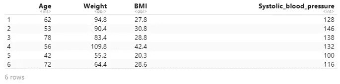

因为我们将首先检查年龄和收缩压之间的关系，所以看到年龄和收缩压的散点图将是有趣的。这是散点图:

```
plot(data$Age, data$Systolic_blood_pressure,
     main= "Systolic Blood Pressure vs Age",
     xlab = "Age", ylab = "Systolic Blood Pressure")
```

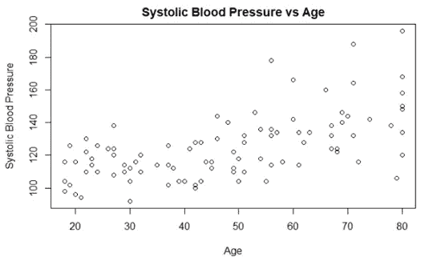

呈线性趋势。虽然周围有很多噪音。在 R 中，我们可以使用' lm '函数直接找到线性回归模型。我将把这个模型保存在一个变量' m '中。

```
m = lm(data$Systolic_blood_pressure ~ data$Age)
m
```

输出:

```
Call:
lm(formula = data$Systolic_blood_pressure ~ data$Age)Coefficients:
(Intercept)     data$Age  
     94.872        0.635
```

输出显示截距(β0)为 94.872，斜率为 0.635(β1)。我们认为 x1 是年龄。所以线性回归方程变成了:

y = 94.872+0.635 *年龄

因为我们只考虑了一个解释变量，没有 x2、x3 或β2、β3。

在这里，截距 94.872 意味着如果年龄为零或非常接近零，收缩压仍将为 94.872。在这个数据集中，数据集中的最小年龄是 18 岁(请自行检查)。所以，谈论零年龄远远超出了这个数据集的范围。这就是为什么在这种情况下不太合理。

0.635 的斜率意味着如果年龄增加 1 个单位，收缩压将平均增加 0.635 个单位。

如果你知道一个人的年龄，用这个方程你可以计算出他的收缩压。例如，如果一个人 32 岁，计算的收缩压将是:

y = 94.872 + 0.635*32 = 115.192

现在，这个估计有多正确，我们将在本文后面确定。是时候再添加一个变量了。

> ***给模型添加权重:***

这很简单。在“m”模型中，我们只考虑了一个解释变量“年龄”。这次我们将有两个解释变量:年龄和体重。这可以使用相同的“lm”函数来完成，我将把这个模型保存在变量“m1”中。

```
m1 = lm(data$Systolic_blood_pressure ~ data$Age + data$Weight)
m1
```

输出:

```
Call:
lm(formula = data$Systolic_blood_pressure ~ data$Age + data$Weight)Coefficients:
(Intercept)     data$Age  data$Weight  
    84.2799       0.6300       0.1386
```

这里截距(beta0)是 84.28。如果你注意到它不同于“m”(94.87)中的截距。年龄变量的时间斜率(β1)变为 0.63，与模型“m”中的β1 差别不大。这个斜率意味着当体重变量被控制或固定时，如果年龄增加 1 个单位，收缩压将平均增加 0.63 个单位。

另一方面，体重变量(β2)的斜率为 0.1386 意味着如果体重增加 1 个单位，当年龄变量被控制或固定时，收缩压将平均增加 0.1386 个单位。

线性回归方程变为:

y = 84.2799 + 0.63*年龄+ 0.1386 *体重

如果你知道一个人的年龄和体重，你就可以用这个公式来估计这个人的收缩压。

> ***将身体质量指数加入本款***

最后，我们把身体质量指数加入这个模型，看看身体质量指数是否改变了这个模型的动态。让我们再次使用“lm”函数，并将此模型保存在名为“m2”的变量中。

```
m2 = lm(data$Systolic_blood_pressure ~ data$Age + data$Weight+data$BMI)
m2
```

输出:

```
Call:
lm(formula = data$Systolic_blood_pressure ~ data$Age + data$Weight + 
    data$BMI)Coefficients:
(Intercept)     data$Age  data$Weight     data$BMI  
    89.5218       0.6480       0.3209      -0.7244
```

请仔细注意输出。截距又变了。这次是 89.52。年龄的斜率现在是 0.648。上一款是 0.63。重量的斜率是 0.3209，而在以前的模型中是 0.1386。因此，在模型中加入身体质量指数后，β0、β1 和β2 的值发生了相当大的变化。身体质量指数变量的斜率是-0.7244。

线性回归方程变为:

y = 89.5218+0.648 *年龄+0.3209 *体重-0.7244 *身体质量指数

呜！我们的多元线性回归模型准备好了！现在，如果我们知道一个人的年龄、体重和身体质量指数，我们将能够计算出这个人的收缩压！

> ***从这个方程计算出的收缩压有多精确？***

让我们找出答案。在多元线性回归中，评估数据拟合度的一种非常常见和流行的方法是变异系数(R 平方)。R 平方的公式与简单线性回归相同:

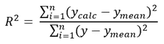

这里，

y_calc 是响应变量的计算值。在这种情况下，使用线性回归模型计算的收缩压值

y_mean 是原始收缩压值的平均值

y 是来自数据集的原始收缩压

R 平方值表示可由解释变量解释的响应变量的比例。

我会用 R 来计算 R 的平方。在 r 中非常简单，我们有三个模型，我们把它们保存在三个不同的变量 m，m1，和 m2 中。看到每个模型的适合度会很好。我将计算所有三个模型的 R 平方值。这是第一个模型“m”的 R 平方值，其中解释变量仅为“年龄”。

```
R_squared1 = sum((fitted(m) - mean(data$Systolic_blood_pressure))**2) / sum((data$Systolic_blood_pressure - mean(data$Systolic_blood_pressure))**2)
R_squared1
```

输出:

```
0.3795497
```

这意味着 37.95%的收缩压可以由年龄来解释。

第二个模型“m1”的 R 平方值，其中解释变量为“年龄”和“体重”:

```
R_squared2 = sum((fitted(m1) - mean(data$Systolic_blood_pressure))**2) / sum((data$Systolic_blood_pressure - mean(data$Systolic_blood_pressure))**2)
R_squared2
```

输出:

```
0.3958562
```

39.58%的收缩压可以由“年龄”和“体重”共同解释。在给模型增加权重后，看起来 R 平方有所改善。

最后，模型 m2 的 R 平方值，其中解释变量为“年龄”、“体重”和“身体质量指数”。

```
R_squared3 = sum((fitted(m2) - mean(data$Systolic_blood_pressure))**2) / sum((data$Systolic_blood_pressure - mean(data$Systolic_blood_pressure))**2)
R_squared3
```

输出:

```
0.4099555
```

40.99%的收缩压可以用“年龄”、“体重”和“身体质量指数”来解释。

如果你不熟悉置信区间或假设检验的概念，接下来的步骤对你来说可能有点难以完全理解。下面是一篇学习置信区间概念的文章:

</a-complete-guide-to-confidence-interval-and-examples-in-python-ff417c5cb593>  

这是一篇关于假设检验的文章。请检查:

</a-complete-guide-to-hypothesis-testing-for-data-scientists-using-python-69f670e6779e>  

> ***推论***

在本节中，我们将进行 f 检验，以确定模型是否显著。这意味着如果至少有一个解释变量与响应变量有线性关系。

执行假设检验有五个步骤:

第一步:

设置假设并选择 alpha 级别:

我们设置了一个零假设和一个替代假设。零假设是所有变量的斜率为零。这意味着任何变量和响应变量之间都没有关联。这是无效假设:

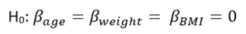

如果我们没有找到足够的证据证明零假设是真的，那么我们将拒绝零假设。这将为我们提供证据，至少有一个斜率不等于零。这意味着至少有一个解释变量与响应变量有线性关系。这是另一个假设:

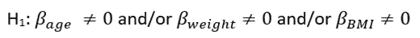

我将阿尔法值设置为 0.05。这意味着置信度为 95%。

第二步:

选择适当的测试统计。这里我们将使用 f 检验。测试统计数据为:

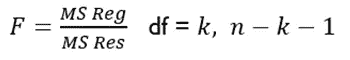

这里，df 是自由度。这就是解释变量的数量。在本例中是 3(年龄、体重和身体质量指数)。

n 是行数或数据点的数量。在这个数据集中，有 100 行。所以，n = 100。请使用“nrows(数据)”功能随意检查

我们稍后会讨论如何计算 F-stat。

第三步:

陈述决策规则:

我们需要从 df = 3，n-k-1 = 100–3-1 = 96，α= 0.05 的 F 分布中确定适当的值。

有两种方法可以找到合适的值。可以用 f 分布表。但我更喜欢用 R，这是用 R 计算的 F 分布的值:

```
qf(0.95, 3, 96)
```

输出:

```
[1] 2.699393
```

f 分布的合适值是 2.699。

> *决策规则是:*

如果 F ≥ 2.699，拒绝零假设

否则，不要拒绝零假设。

第四步:

计算 F 统计量。

这是计算 F 统计量的表格。

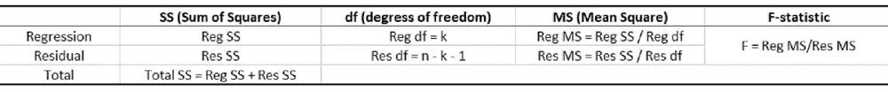

在上表中，

Reg SS 是可以用此公式计算的回归平方和

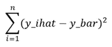

Res SS 是残差平方和，下面是计算它的表达式:

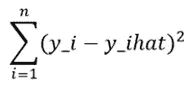

总 SS 也可以计算为“Reg SS”和“Res SS”的总和。下面的表达式也将给出与 Reg SS 和 Res SS 之和相同的结果。

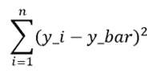

Reg df 或回归自由度是解释变量的数量。在这个例子中是 3。

n 是数据的行数。

我将使用 R 来计算 Reg SS、Res SS 和 n:

```
regSS = sum((fitted(m2) - mean(data$Systolic_blood_pressure))**2)
resSS = sum((data$Systolic_blood_pressure - mean(data$Systolic_blood_pressure))**2)
```

输出:

```
[1] 16050.88
[1] 39091.84
```

查找数据中的行数:

```
nrow(data)
```

输出:

```
[1] 100
```

现在可以计算表中的其余元素了。我使用 excel 表格来生成表格。虽然在 r 中可以找到所有的东西，但是为了做成表格，我用了 excel。结果如下:

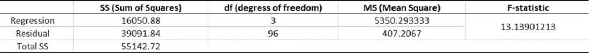

F 统计值为 13.139。

请随意在此下载该 excel 文件:

<https://github.com/rashida048/Inferential-Statistics-in-R/blob/main/Multiple%20linear%20regression/F-stat.xlsx>  

第五步:

**结论:** F 为 13.139，大于 2.699。所以，我们有足够的证据来拒绝零假设。这意味着至少有一个解释变量与响应变量有线性关系。所以，这个模型意义重大。

> 通过 f 检验，我们知道这个模型是有意义的。这意味着至少有一个解释变量与响应变量有线性关系。这将有助于准确了解哪些变量与反应变量(收缩压)具有线性关联。

**我们将对此进行 t 检验。**

> ***对个别解释变量进行 t 检验***

上述 f 检验表明该模型是显著的。现在，我们可以测试每个解释变量是否有线性关联。正如我们之前已经陈述过五步法则。我不会在这里一一讲述。

第一步:假设和 alpha 与上面的 f 检验完全相同。

第二步:

在步骤 2 中，检验统计量将是自由度为 n -k-1 的 t 统计量。我们将在后面的步骤 4 中使用 R 来寻找 t 统计量。

第三步:

在第三步中，我们需要从 t 分布中找到合适的值。有一个“t 分布”表来找出适当的值。我更喜欢用 r。

```
qt(0.975, 96)
```

输出:

```
[1] 1.984984
```

如果任何解释变量的 t 统计量大于或等于 1.985，则拒绝零假设。

否则，不要拒绝零假设。

第四步:

计算测试统计数据:

这就是 t 检验如此简单的原因。如果你对 R 中的线性回归模型进行总结，得到 t 统计量和 p 值。我将对模型“m2”进行总结，因为我们在该模型中包含了所有三个解释变量。

```
summary(m2)
```

输出:

```
Call:
lm(formula = data$Systolic_blood_pressure ~ data$Age + data$Weight + 
    data$BMI)Residuals:
    Min      1Q  Median      3Q     Max 
-33.218 -10.572  -0.187   8.171  47.071Coefficients:
            Estimate Std. Error t value Pr(>|t|)    
(Intercept) 90.14758    8.34933  10.797  < 2e-16 ***
data$Age     0.64315    0.08109   7.931 3.97e-12 ***
data$Weight  0.32226    0.14753   2.184   0.0314 *  
data$BMI    -0.73980    0.47751  -1.549   0.1246    
---
Signif. codes:  0 ‘***’ 0.001 ‘**’ 0.01 ‘*’ 0.05 ‘.’ 0.1 ‘ ’ 1Residual standard error: 15.49 on 96 degrees of freedom
Multiple R-squared:  0.4106, Adjusted R-squared:  0.3922 
F-statistic: 22.29 on 3 and 96 DF,  p-value: 4.89e-11
```

仔细查看输出。这里有每个解释变量的 t 统计量。以及它们各自的 p 值。

第五步:

以下是测试得出的结论:

根据我们的决策规则，如果 t 统计量大于或等于 1.985，我们应该拒绝零假设。你可以看到年龄和体重变量的 t 统计量大于 1.985。所以，我们可以拒绝两者的零假设。下面就一个一个说吧。

根据 t 检验，当控制体重和身体质量指数时，年龄变量是显著的，并且与收缩压呈线性相关。

同样，当年龄和身体质量指数得到控制时，体重变量也是显著的，并与收缩压呈线性相关。

另一方面，身体质量指数变量的 t 统计量为-1.549，小于 1.985。所以，我们没有足够的证据来拒绝身体质量指数变量的零假设。这意味着当年龄和体重得到控制时，身体质量指数变量与收缩压没有线性关系。

也可以用 p 值得出结论。如果 p 值大于或等于α水平(在本例中为 0.05)，我们就有足够的证据来拒绝零假设。如果您在上面的摘要输出中注意到，对于年龄和体重变量，p 值小于 alpha 级别 0.05。因此，这样我们也可以得出结论，年龄和体重变量与收缩压有线性关系。另一方面，身体质量指数的 p 值大于 0.05。使用 p 值也可以确定身体质量指数变量与收缩压没有线性关系。

> 如果你读了我关于简单线性回归的文章，你可能会奇怪为什么我在这里没有使用方差分析进行推断。在多元线性回归中使用方差分析不是一个好主意。因为如果你把响应变量按不同的顺序排列，会得到不同的结果。变得非常混乱。尝试在 R 中对“年龄”、“体重”和“身体质量指数”使用一次“anova()”函数。和体重，年龄，身体质量指数一次。你可能会得到一个不同的方差分析表。

## 结论

我希望这有所帮助。这是本文涵盖的大量材料。如果所有这些材料对你来说都是全新的，你可能需要一些时间来真正掌握所有这些想法。这些不是唯一的测试。统计学中还有其他几个测试。这些只是一些常见和流行的假设检验。我建议，拿一个你自己的数据集，试着开发一个线性回归模型，并像本文一样进行假设检验。如果你读这个是为了学习，那是学习的唯一途径。

欢迎在推特上关注我，喜欢我的 T2 脸书页面。