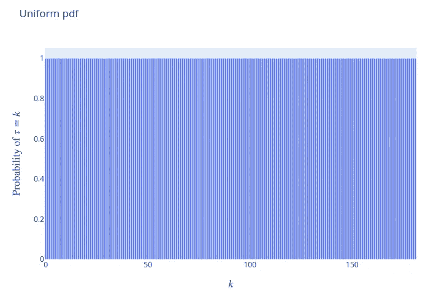

# 用贝叶斯推理和 PyMC3 检测变化点

> 原文：<https://towardsdatascience.com/detect-change-points-with-bayesian-inference-and-pymc3-3b4f3ae6b9bb?source=collection_archive---------2----------------------->

## 用观察到的数据更新你的信念

## 动机

想象一下，你使用谷歌分析来跟踪你的网站的浏览量。查看视图后，您怀疑某个日期后视图数量可能会突然变化。

如果确实存在一个浏览量突然变化的日期，如何找到那个日期？

如果你能利用观察到的数据和一些信念来高度确定地猜测变化点，那不是很好吗？


作者图片

这就是贝叶斯推理派上用场的时候。在本文中，我们将学习什么是贝叶斯推理，以及如何使用 PyMC3 来执行贝叶斯分析。

# 什么是贝叶斯推理？

贝叶斯推理是一种技术，其中贝叶斯定理用于指定一个人应该如何根据观察数据更新自己的信念。

</bayes-theorem-clearly-explained-with-visualization-5083ea5e9b14>  

例如，我们先前的信念可以是硬币是有偏差的，它遵循 Beta(1.36，2.36)分布。然而，在投掷硬币超过 100 次(观察真实数据)后，我们的信念转变为均值为 0.5 的正态分布。


作者 GIF 使用[视觉理论](https://seeing-theory.brown.edu/bayesian-inference/index.html#section2)创建

我们可以看到，收集更多数据后，后验分布可能与先验分布有很大不同。

# 探索数据

我们将使用显示从 2021 年 1 月到 2021 年 7 月从我的网站[数据科学简化版](https://mathdatasimplified.com/)收集的浏览量的数据。

现在，我们如何找到视图数量分布发生变化的日期？

让我们从寻找时间τ和视图数量的先验分布开始。

# 先验分布

## 视图数量的先验分布

由于视图的数量是计数数据，因此可以使用离散分布(如泊松分布)对其建模。

泊松分布显示了一个事件在固定的时间间隔内可能发生的次数。泊松分布使用参数 *λ* 来控制其形状。


作者图片

让我们画一个泊松分布来看看它是什么样子的。

*λ* = 1.5 的泊松分布:


作者图片

当增加 *λ* 时，我们给更大的值增加更多的概率。例如，将 *λ* 的值从 1.5 增加到 3 会将分布的平均值向右移动:


作者图片

从上面的图中，我们可以看到视图的平均数量接近于 *λ。*


作者图片

酷！现在我们知道了如何对视图数量的先验分布进行建模，我们如何找到一个合适的 *λ* ？

## *λ* 的先验分布

我们不知道 *λ，*的具体值，但是我们知道存在一个时间𝜏，在该时间之后，视图数量的分布发生显著变化。因此，我们可以说， *λ =* 𝜆₁在时间𝜏之前，而 *λ =* 𝜆₂在时间𝜏.之后


作者图片


作者图片

但是，我们如何对𝜆₁和𝜆₂的先验分布建模呢？由于𝜆₁和𝜆₂是[连续随机变量](http://www.henry.k12.ga.us/ugh/apstat/chapternotes/7supplement.html)，我们可以用指数分布来模拟他们的先验分布。

指数分布通常用于模拟事件之间经过的时间。指数分布也使用一个参数，比如𝛼，来控制它的形状。


作者图片

给定一个特定的𝛼，𝜆的期望值等于𝛼.的倒数


作者图片

让我们看看指数分布是什么样的。

𝛼 = 0.1 的指数分布:


作者图片

𝛼 = 1 的指数分布:


作者图片

现在，𝛼的价值是什么？我们可以把前面找到的两个方程结合起来估算𝛼.的值


作者图片

根据上面的等式，将𝛼设置为等于视图数量的反均值是合理的。


作者图片

## 时间的先验分布

因为所有日期都同样可能是𝜏，所以我们可以使用均匀分布来模拟𝜏.的先验分布

由于总共有 182 天，我们可以写:


作者图片

这意味着𝜏的概率等于𝑘的日期:


作者图片

让我们想象一下这种均匀分布的样子:



作者图片

从上面的图中我们可以看出，所有日期都同样可能是𝜏.

# 使用 PyMC3 的贝叶斯分析

接下来，我们将使用 PyMC3 执行贝叶斯分析。PyMC3 是一个 Python 包，使用直观的语法进行贝叶斯统计建模。

要安装 PyMC3，请键入:

```
pip install pymc3
```

## 模型变量

首先为𝜆₁、𝜆₂和𝜏.创建 PyMC3 变量

接下来，我们使用`pm.math.switch`给𝜆.赋值𝑡的日期代表𝜆的日期。如果𝑡比𝜏小，它会将𝜆₁的值赋给𝜆.否则，它会将𝜆₂的价值分配给𝜆。


作者图片

接下来，我们使用 Poisson(𝜆分布对视图数量进行建模:

注意，到目前为止，我们只模拟了𝜆₁、𝜆₂和𝜏.的先验分布为了从𝜆₁、𝜆₂和𝜏的后验分布中获得一些样本，我们将使用马尔可夫链蒙特卡罗(MCMC)。

## 使用 MCMC 获取后验分布的样本

[MCMC](https://machinelearningmastery.com/markov-chain-monte-carlo-for-probability/) 是一种随机抽样概率分布的方法，它尊重样本之间的概率相关性。

基于 C [am Davidson-Pilon](https://nbviewer.org/github/CamDavidsonPilon/Probabilistic-Programming-and-Bayesian-Methods-for-Hackers/blob/master/Chapter3_MCMC/Ch3_IntroMCMC_PyMC3.ipynb) ，一般来说，执行 MCMC 的算法有:

> 1.从当前位置开始。
> 
> 2.提议换一个新的职位。
> 
> 3.基于职位对数据和先前分配的坚持，接受/拒绝新职位**。**
> 
> 4.如果你接受:转到新的职位。返回步骤 1。
> 
> 否则:不要跳槽。返回步骤 1。
> 
> 5.经过大量迭代后，返回所有接受的位置。

下面的 GIF 展示了 Metropolis-Hastings 的搜索策略，一种 MCMC 方法。


作者 GIF—[来源](https://chi-feng.github.io/mcmc-demo/app.html?algorithm=RandomWalkMH&target=banana)

让我们使用 MCMC 从𝜆₁、𝜆₂和𝜏.的后验分布中获得数千个随机变量

接下来，想象一下这些随机变量的样子:


作者图片

从上面的图中，我们可以看出:

*   𝜆₁的后验分布和𝜆₂.的后验分布之间存在显著差异这表明确实存在一个日期𝜏，在该日期之后，观看次数的分布发生变化。
*   𝜏 = 91 的概率是 99.99%。这说明变化点有非常高的几率是 91。

# 查找预期的视图数量

现在我们有𝜆₁、𝜆₂和𝜏的 40k 个样本，让我们得到每天的预期浏览量。

计算𝑡:日期的预期浏览量的步骤

*   选择一个日期𝑡
*   对于每个𝜏样本，查看𝑡的日期是在𝜏.的日期之前还是之后
*   如果𝑡在𝜏之前，𝜆的价值就是𝜆₁.如果𝑡在𝜏之后，𝜆的价值就是𝜆₂.
*   取𝑡日期𝜆所有值的平均值

例如，如果只有𝜆₁、𝜆₂和𝜏的 3 个样本，我们的计算将类似于以下内容:


作者图片

使用上面的计算方法来计算每天的预期浏览量:

绘制每天的预期浏览量:

相当酷！我们可以看到，在第 91 天之后，预期的视图数量发生了变化。这与我们从真实数据中看到的相符。

# 结论

在结束本文之前，我们应该花点时间来欣赏一下贝叶斯推理是多么强大。我们仅使用观察到的数据和一些初始信念就能如此确定地得到变化点。

另外，我们得到了数据在变化点前后的分布。这些分布比单一值能告诉我们更多。


作者图片

希望这篇文章能给你使用贝叶斯推断和 PyMC3 分析身边其他有趣数据的知识和动力。

随意发挥，并在这里叉这篇文章的源代码:

<https://github.com/khuyentran1401/Data-science/blob/master/statistics/bayesian_example/google%20analytics.ipynb>  

我喜欢写一些基本的数据科学概念，并尝试不同的数据科学工具。你可以在 LinkedIn 和 T2 Twitter 上与我联系。

星[这个回购](https://github.com/khuyentran1401/Data-science)如果你想检查我写的所有文章的代码。在 Medium 上关注我，了解我的最新数据科学文章，例如:

</how-to-solve-a-staff-scheduling-problem-with-python-63ae50435ba4>  </observe-the-friend-paradox-in-facebook-data-using-python-314c23fd49e4>  </kats-a-generalizable-framework-to-analyze-time-series-data-in-python-3c8d21efe057>  </how-to-detect-seasonality-outliers-and-changepoints-in-your-time-series-5d0901498cff>  

# 参考

j . brown lee(2019 年 9 月 24 日)。*关于概率的马尔可夫链蒙特卡罗的温和介绍*。机器学习精通。检索于 2021 年 12 月 10 日，来自[https://machine learning mastery . com/Markov-chain-Monte-Carlo-for-probability/。](https://machinelearningmastery.com/markov-chain-monte-carlo-for-probability/.)

c .戴维森-皮隆(2016 年)。*黑客的贝叶斯方法:概率编程和贝叶斯推理*。艾迪森-韦斯利。