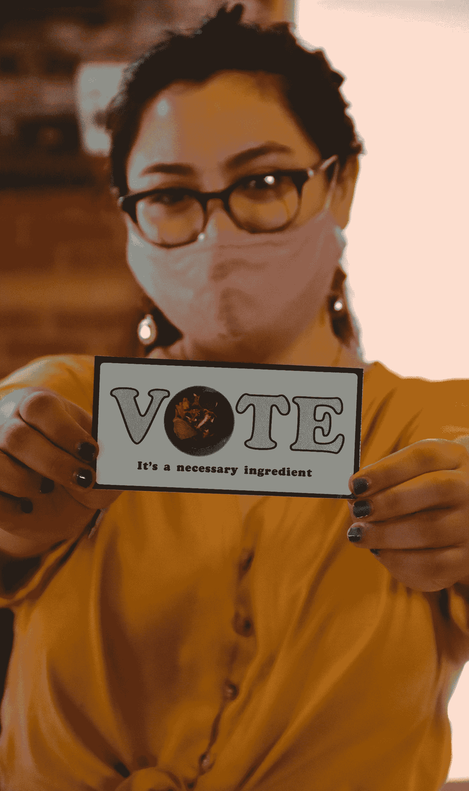
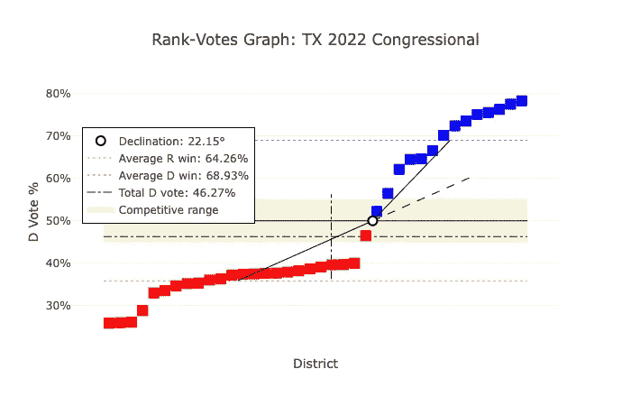

# 用 Python 检测和测量不公正的选区划分

> 原文：<https://towardsdatascience.com/detecting-and-measuring-gerrymandering-with-python-f85a1315acd4?source=collection_archive---------22----------------------->

## [变更数据](https://towardsdatascience.com/tagged/data-for-change)

## 快速介绍*偏角以及它如何成为检测不公正选区划分的有力工具*

> 我解决的每一个问题都变成了一条规则，以后用来解决其他问题。—勒内·笛卡尔


照片由[拉格斯技术人员](https://unsplash.com/@heylagostechie?utm_source=medium&utm_medium=referral)在 [Unsplash](https://unsplash.com?utm_source=medium&utm_medium=referral) 上拍摄

如果你读过最近的新闻，你可能会意识到各州正在重新划分选区，这是一个十年一次的过程，政治边界被重新划分以反映人口变化。如果你是经验主义者，你可能会合理地问是否有一些量化的方法来描述伤害的程度。在一个计划的偏差成为一个法律问题的地方，有没有一条数学界线？

在本帖中，我们将讨论一种叫做*倾角*的工具，它可以帮助我们解决这些问题。这是一个在天文学和物理学中广泛使用的几何概念，最近由佛蒙特大学的 Greg Warrington 教授作为一个启发引入。有一些实证方法探索这类事情，但我相信这在投票稀释的情况下是特别有趣的启发。它优雅、直观、方便。

但是在我们进入数学之前，让我们快速讨论一下定律。最终，我们这里的权威是 1965 年的选举权法案——除了别的以外，它禁止选票稀释。



曼尼·韦塞拉在 Unsplash 上的照片

选票稀释是有意削弱少数群体影响选举的权力。它有两种形式:**包装**或**裂解**。这两种策略都有效地将执政党与竞争隔离开来，并阻止了边缘社区的有意义的代表性。

这些计划听起来像做的那样。打包意味着将尽可能多的少数民族打包到一个选区中——通常达到该群体占总投票人口的 60%或更多。这个想法是，虽然该地区变得有利于少数群体，但更广泛的计划通过防止边界附近的社区受到邻近地区不受欢迎的影响而有利于大多数人。由国会议员詹姆斯·克莱伯恩代表的南卡罗来纳州第六国会选区是包装黑人选民的一个例子。

破解颠倒了思路。在地图上搜索临界数量的少数民族，而不是将群体集中到一个地区，会使他们分裂——将一个原本有凝聚力的社区分成几个地区。没有一个地区的规模大到足以具有竞争力。伯明翰和奥斯汀是他们各自国会地图破裂的例子。

偏角量化了这些现象。沿着 x 轴绘制计划的地区，我们能够查看每个地区的民主党投票百分比。自然，一些地区人口很少，而另一些地区人口很多。当你从左向右移动时，随着人口的增加，人们会认为会有一个拐点。在这一点上，我们发现一个向上的断裂角，因为选区从执政党控制变为反对党控制。该角度跟踪人口统计百分比；由于种族和党派关系之间的高度相关性(这种相关性使得计算成为可能)，它会断开。

然而，休息的*度*是我们发现洞察力的地方。沃林顿博士研究了全国各地受 VRA 挑战的地区，发现角度的严重程度与选区划分的严重程度直接相关。随着包装变得更加明显，倾斜角增加。



由戴夫重划选区应用程序制作。【https://davesredistricting.org/maps#home 

本周，我的家乡德克萨斯州被司法部以种族不公正划分选区为由起诉。我们可以看到上面美国众议院计划的倾斜角为 22.05%。该角度是在靠近 X 轴中间的倒数第二个共和党选区之后创建的。

该情节的一个启示性特征是红色共和党选区如何与民主党投票份额在 30%左右持平；曲线很快到达那个点，然后变平，并尽可能长时间保持在那个位置。这表明了地图设计的意图。

回到包装和裂解，包装区在 x 轴最右边。一般来说，一个选区多数席位的上限是 60%左右；这不是一个硬性规定，但当你进入 70 年代的游戏时，它就开始引人注目了。将近一半的民主党席位超过了这个门槛。

最后，我们如何将这种方法应用到我们遇到的地图上？有几个很棒的应用程序无需代码就能帮你做到这一点。我用戴夫的选区重划应用程序制作了上面的图，这是一个很棒的资源。[竞选法律中心](https://campaignlegal.org/)通过其 app[plan score](https://planscore.campaignlegal.org/)提供偏差计算。两个都免费！

```
import numpy as np
import mathdef calculate_declination_angle(dem_vote_share):
   majority_wins = sorted(filter(lambda x: x <= 0.5, dem_vote_share))
   minority_wins = sorted(filter(lambda x: x > 0.5,
dem_vote_share))
   theta = np.arctan((1 - 2 * np.mean(majority_wins)) * len(dem_vote_share) / len(majority_wins))
   gamma = np.arctan((2 * np.mean(minority_wins)-1) * len(dem_vote_share) / len(minority_wins))
   declination_angle = 2 * (gamma - theta) / np.pi
   return declination_angle
```

如果您正在操作 shapefiles，或者使用代码分析地图，也可以使用上面代码片段中的 Python 函数。只需将每个选区的民主党投票份额列表(在一次或一组选举中)作为浮点值传递给它。它将计算结果作为标量值返回。正如我所分享的，这是一个快速简单的计算，您可以将其集成到您的工作流程中。

我们应该将此理解为一种诊断工具，而不是责任的明确证明。正确的分析应该包含更丰富的数据集，当然，还需要一位经验丰富的投票权律师的指导。俗话说，所有的模型都是错的，但有些是有用的。

我希望这是教育。我也希望这是鼓舞人心的。我们生活在一个拥有更好工具的时代；我们应该利用他们来要求更好的代表性。