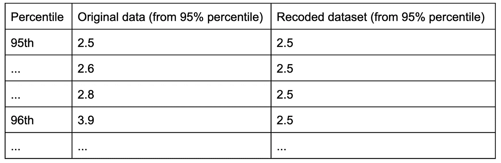
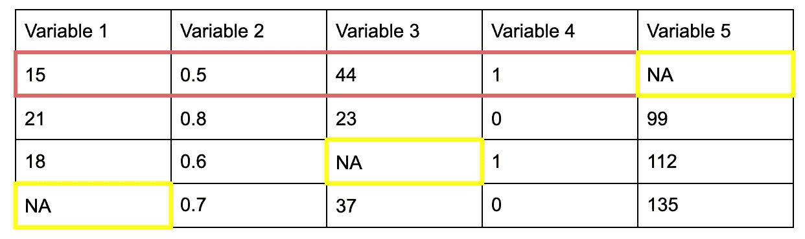

# 检测和处理 Python 中的异常值—第 3 部分

> 原文：<https://towardsdatascience.com/detecting-and-treating-outliers-in-python-part-3-dcb54abaf7b0?source=collection_archive---------9----------------------->

## 处理异常值的实践指南——winsoring 和插补

图片由 [RF 提供。_.来自](https://www.pexels.com/@rethaferguson?utm_content=attributionCopyText&utm_medium=referral&utm_source=pexels)[像素](https://www.pexels.com/photo/crop-focused-repairman-fixing-graphics-card-on-computer-3825582/?utm_content=attributionCopyText&utm_medium=referral&utm_source=pexels)的工作室

在从事数据科学项目时，探索性数据分析(EDA)至关重要。了解您的底层数据、其性质和结构可以简化对特性、算法或超参数的决策。EDA 的一个关键部分是异常值的检测和处理。**异常值**是在总体的随机样本中严重偏离其他数据点的观察值。

在之前发表的两篇文章中，我讨论了如何使用众所周知的统计方法检测不同类型的异常值。一篇文章关注的是[单变量](/detecting-and-treating-outliers-in-python-part-1-4ece5098b755)，另一篇文章关注的是[多变量](/detecting-and-treating-outliers-in-python-part-2-3a3319ec2c33)异常值。

在这最后一篇帖子里，我想讨论一下一旦检测到极端值该如何对待。在理论介绍之后，我将提供两个用 python 编写的实际例子。为此，我将像在我以前的帖子中一样使用波士顿住房数据集。

## 处理异常值:一项主观任务

类似于根本不检测异常值，处理异常值可能会承担对分析或机器学习模型的结果产生重大影响的风险。在实践中，如何处理异常观测值往往不是很明显。

好消息是:从数学的角度来看，对于如何看待外围观测值，没有正确和错误的答案。除了数学之外，一个更重要的角色可以赋予你在离群值决策过程中可用的定性信息。例如，知道一个异常值最初是如何产生的，对极值决策是有益的。

因此，在深入探讨异常值处理的可用选项之前，我想强调异常值的可能来源。

## 异常值的来源

除了单变量和多变量之间的区别之外，极值可以通过来源来区分。**误差异常值**是由不准确的测量、错误的数据输入或数据处理导致的异常观察值。在这种情况下，这些数据点通常不是感兴趣人群的一部分。

另一方面，**非误差异常值**，也称为**有趣的**或**随机异常值**，是感兴趣群体的一部分，可能包含有趣的信息。

# 处理误差异常值

错误异常值应该被移除或校正。最简单的方法是删除通过不准确的测量或数据处理出现的观察值。假设有一个原始版本的底层数据可用。在这种情况下，值得追溯数据点的原始条目，以避免由于删除而造成的大量信息丢失。

但是，如果您手头没有原始数据版本，但您确定您看到的是一个异常错误(例如，一个人的身高测量值为 4 米/200 英寸或一个维度的第四类，尽管您知道应该只有三个变量类)，您的最佳选择是简单地删除这些条目。

# 处理非错误异常值

关于如何处理非错误异常值，有三种不同的选择:

1.  保持
2.  删除
3.  重新编码

## 保持

当大多数检测到的异常值是非错误异常值，并且理所当然地属于感兴趣的总体时，这是一个好策略。此外，您通常很难确定某个极值是否是感兴趣总体的一部分。

当保留异常值时，要意识到它们会扭曲你实际任务的结果:例如，导致拒绝零假设或过于乐观的预测。因此，报告您的发现可能是值得的，包括异常值和排除异常值，以突出它们可能产生的影响。

另一个选择是用于实际预测任务或分析的健壮方法。这些方法使用更稳健的统计(例如中值)或其他非参数设置(例如秩检验、自举或支持向量机)来减少极值的影响。

**对于单变量和多变量异常值:**

*   通过在分析中包含和排除异常值来收集定性信息，以评估它们的实际影响
*   使用稳健的方法来减少异常值的影响
*   如果离群值可能属于感兴趣的人群，则保留离群值，并在做出决策时注意它们带来的风险
*   而且永远也是最重要的:*报告所有发现*！

## 删除

最直接的选择是删除任何无关的观察。然而，这种策略具有丢失信息的高风险。尤其是如果你发现很多外围数据点，尽量避免这种情况。此外，删除感兴趣和有影响的异常值(属于感兴趣总体的点)可能会错误地影响任何输出，例如，您想要实现的预测或测试结果。

**对于单变量和多变量异常值:**

*   移除低尺度上的异常值和那些不太可能来自另一个群体的异常值
*   如果你选择删除，总是提供两份你的分析或结果的报告:一份有，一份没有异常观察

## 重新编码

重新编码离群值是处理离群值并同时保留尽可能多的信息的好选择。这种选择应该总是伴随着合理的推理和解释。有几种不同的方法来记录异常值，在本文中，我想重点介绍两种广泛使用的方法:

*   Winsorizing
*   归罪

## Winsorizing

Winsorizing 由 Tukey & McLaughlin 于 [1963](https://www.jstor.org/stable/25049278?seq=1) 提出，并经常在处理异常值处理的研究论文(如 [2013](http://www.hermanaguinis.com/ORMoutliers.pdf) 或 [2019](http://doi.org/10.5334/irsp.289) )中推荐。使用 winsorizing，在变量分布的每一侧，高于或低于百分位 *k* 的任何变量值都将被第 *k-* 百分位本身的值替换。例如，如果 *k* =5，则高于第 95 个百分位数的所有观察值被重新编码为第 95 个百分位数的值，低于第 5 个百分位数的值被重新编码。与*修剪*相比，winsorizing 是一个不太极端的选择，它通过重新编码离群值而不是完全删除它们。

左:原始数据的值。右:k=5 的重新编码值-所有高于第 95 百分位的值都替换为第 95 百分位的值(此处为 2.5)。图片由作者提供。

Winsorization 还直接干预离群值检测过程。处理高于或低于某个阈值的数据点，不需要独立的检测方法。然而，它与 Tukey 的箱线图方法密切相关，因为通常建议将 *k* 设置在**样本的外部围栏**(平均值周围的 3 个标准偏差)。这通常在 k=5 时，因此用作默认值。

让我们看一个来自之前使用的波士顿住房数据集的例子。对于城镇的人均犯罪率，我们发现了 30 个可能的异常值(使用 Tukey 方法)。首先，我将重用第一篇教程中的一些代码来确定外部栅栏。

变量“CRIM”的上部外栅栏约为 14.46，而下端为零下*。因为零以下的犯罪率是没有意义的，数据应该只在它的右边*T21【winsorized】。现在，我们可以查看不同百分点的值来设置 **k** 。**

*看起来 92.5% (13.54)和 95% (15.79)处的值最接近上外部围栏。由于 95%更常见，我将使用 scipy 中的 winsorize 函数对 *k=5* 上的数据进行 winsorize:*

*随着 winsorizing，人均平均犯罪率从 3.61 变为 2.80 (95%)。*

***对于单变量异常值**:*

*   *Winsorize 保留尽可能多的数据*
*   *要找到合适的 winsorization 级别，了解你的数据！接近外围栏的一个百分点被认为是最佳做法*
*   **如果变量的值不能低于零，零限值*可能有意义*
*   *在 winsorizing 前后报告主要统计数据(例如，平均值、标准差)*

***为多元异常值**:*

*   *对于多元异常值，winsorizing 是在*椭球*上完成的(保存来自多个变量的信息)*
*   *似乎没有现有的 python 包处理椭球上的 winsorization。然而，作为 **R 包** [sdcMicro](https://www.rdocumentation.org/packages/sdcMicro/versions/5.5.0) 的一部分，存在一个名为 *mvTopCoding* 的函数，该函数能够消除由(稳健的)Mahalanobis 距离定义的椭球上的异常值。*

## *归罪*

*插补是处理*缺失数据*时经常使用的一种方法。但是，在处理极值时也适用。当使用插补时，异常值被移除(并成为缺失值)并替换为基于剩余数据的**估计值**。*

*有几种插补技术。一种经常使用的，但带有强烈偏见的方法是简单均值替换法。这里，所有异常值或缺失值都被变量的平均值所替代。另一种更好、更可靠的插补方法是**多重插补。***

*在多重插补中，缺失值或异常值由从预测模型中检索的 **M** 个似是而非的估计值替代。离群值成为预测模型(例如回归、随机森林等)的因变量。)，并且基于观察中的剩余信息非缺失/非异常值来估计。*

**

*第一行:变量 1-变量 4(红色)帮助预测变量 5(黄色)的 M 个可能值。图片作者。*

*为缺失值或异常值选择正确数量的可信估计值 **M** 在文献中经常讨论，并且经常推荐[M:](https://stefvanbuuren.name/fimd/sec-howmany.html)*

> *在中等缺失情况下，使用 m = 5-20 就足够了[…]*

*实际上，python 中的多重插补不像 R 中那样简单(例如，mice、missForest 等)。然而， **sklearn** **库**有一个可用于多重插补的迭代插补器。它基于 R 包 ***小鼠*** ，目前仍处于[实验阶段](https://scikit-learn.org/stable/modules/generated/sklearn.impute.IterativeImputer.html#sklearn.impute.IterativeImputer)。*

*Sklearns 的默认版本非常基本，使用均值替换，但可以通过将其他回归变量传递给函数来轻松调整，如线性回归、KNN 或决策树。为了获得多个估计值，就像 mice 在 R 中提供的那样，需要多次运行估算器(例如，在 for 循环中)。*

*回到我们的人均犯罪率的例子，我们首先需要将异常值转换为缺失值。为此，我使用 Tukey 方法检测到的可能异常值列表(参见第 1 篇文章)。*

*作为一个估计量，我选择了正则化线性回归(BayesianRidge)，为了简单起见，我将设置 m=1(单次插补)。如前所述，sklearns [用户指南](https://scikit-learn.org/stable/modules/impute.html#iterative-imputer)中也写道，估算器可用于多重估算*

> *“通过在`sample_posterior=True`时用不同的随机种子重复应用它[……]”。*

*同样，人均犯罪率从 3.61 变为 2.36。*

***对于单变量异常值**:*

*   *仅次于处理缺失数据，常用于记录异常值的技术*
*   *多重插补更稳健，单一(如平均值)插补有偏差*
*   *对于插补，R 提供了比 python 更成熟、更灵活的包。*

***对于多元异常值**:*

*   *插补对于多元异常值没有真正意义，因为它们被定义为多个变量的异常值观察值(对于多个异常值，所有条目都将变成缺失值，几乎没有预测空间)*

## *包扎*

*外围数据点的处理是一项高度主观的任务，因为没有数学上正确或错误的解决方案。定性信息，如了解异常值的来源或异常值的影响，可以简化治疗决策。错误异常值最好被纠正或删除，而非错误异常值可以**保留、删除或重新编码**。极值有几种重新编码的方法，其中最流行的是 **winsorizing** 和**多重插补**。*

*一项基本任务是报告有无异常值的结果，并在处理异常值时提供合理的推理和解释。*

***资源:***

*   *【http://www.hermanaguinis.com/ORMoutliers.pdf 号*
*   *【https://www.rips-irsp.com/articles/10.5334/irsp.289/ *
*   *[https://stefvanbuuren.name/fimd/sec-howmany.html](https://stefvanbuuren.name/fimd/sec-howmany.html)*
*   *[https://sci kit-learn . org/stable/modules/impute . html # iterative-imputr](https://scikit-learn.org/stable/modules/impute.html#iterative-imputer)*
*   *[https://www . r-bloggers . com/2019/01/a-new-way-to-handle-variable-outliers/](https://www.r-bloggers.com/2019/01/a-new-way-to-handle-multivariate-outliers/)*
*   *[https://WW2 . amstat . org/meetings/ices/2007/proceedings/ices 2007-000210。PDF](https://ww2.amstat.org/meetings/ices/2007/proceedings/ICES2007-000210.PDF)*