# 检测大脑发出的哔哔声

> 原文：<https://towardsdatascience.com/detecting-beeps-from-brains-64a02653e598?source=collection_archive---------31----------------------->

## [行业笔记](https://towardsdatascience.com/tagged/notes-from-industry)

## **开发更好的深部脑刺激治疗方法。**

**作者:** [乔丹·泰勒](https://www.linkedin.com/in/jordan-taylor-73268b200/)和[梅尔文·雅普](https://www.linkedin.com/in/melvyn-yap/)(神经科学研究小组在[马克斯·凯尔森](https://maxkelsen.com/))

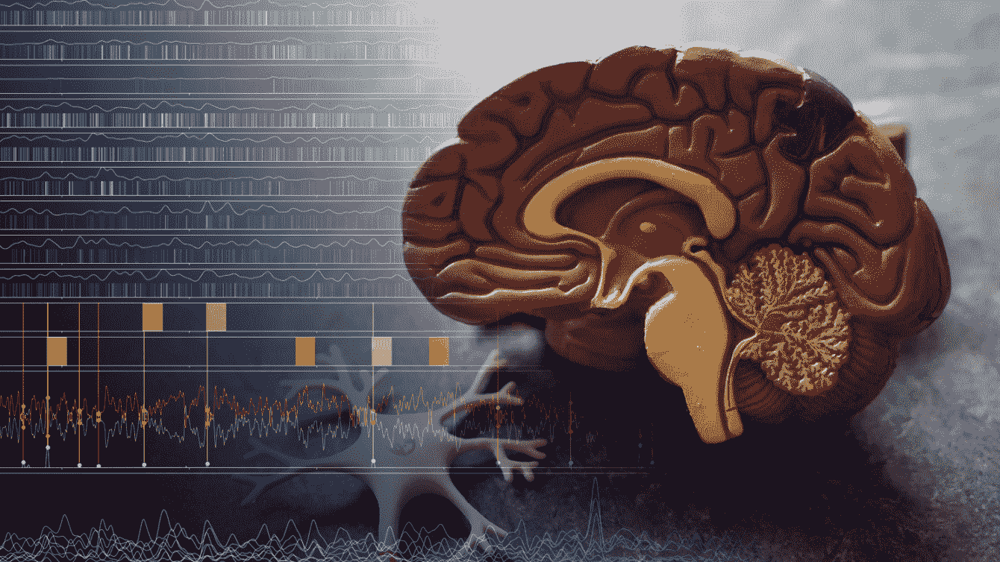

图片编辑自[https://unsplash.com/photos/IHfOpAzzjHM](https://unsplash.com/photos/IHfOpAzzjHM)。感谢 Robina Weermeijer。

我们利用老鼠大脑中少数神经元的活动来预测它们听到的音频哔哔声的时间。我们为这个问题开发的模型和见解有望最终有助于改善帕金森病和其他神经疾病的治疗。

# 背景

[深部脑刺激](https://pubmed.ncbi.nlm.nih.gov/30607748/)正被用于帮助缓解严重帕金森病、肌张力障碍和癫痫的症状(最近[在治疗严重抑郁症](https://www.ucsf.edu/news/2021/01/419616/personalized-brain-stimulation-alleviates-severe-depression-symptoms)方面取得了有希望的结果)。它包括将电极插入大脑的特定部位，如图 1 所示，然后调整电脉冲以缓解症状。一旦设置了脉冲模式，它通常会持续发出脉冲。

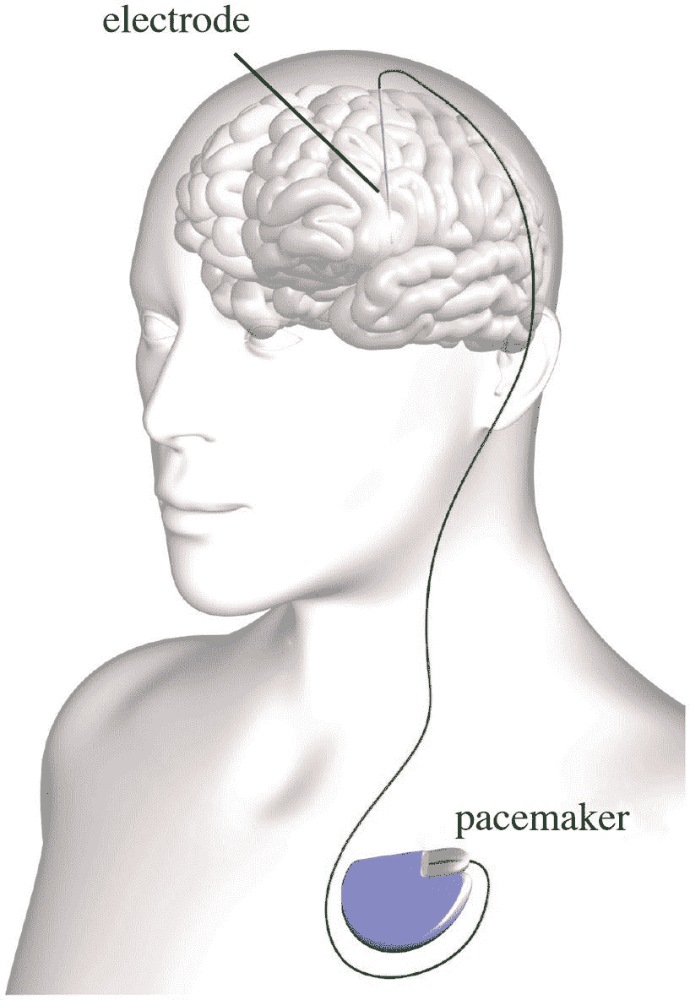

图 1:脑深部刺激。图片来自[https://commons . wikimedia . org/wiki/File:Typical _ deep _ brain _ simulation _ setup . jpg](https://commons.wikimedia.org/wiki/File:Typical_deep_brain_stimulation_setup.jpg)

最近，人们对使用深部脑刺激电极来测量患者大脑中周围神经元的活动越来越感兴趣。如果可以从神经活动中解码症状的严重程度，这可能用于自动调整脉冲响应模式，如图 2 所示。这种想法被称为[闭环](https://pubmed.ncbi.nlm.nih.gov/30607748/) [或自适应深度大脑刺激](https://pubmed.ncbi.nlm.nih.gov/30607748/)。

能够在不植入额外传感器的情况下实施自适应深部脑刺激将需要仅从大脑中局部场电位的几个记录通道来可靠地监测患者的症状。这是一个难题，类似于查看计算机中的几个晶体管并试图猜测恶意软件是否正在运行。我们认为这听起来像是一个适合机器学习(ML)的任务。

已经有很多尝试使用 ML 来解码局部神经信号，[一些实际上使用了来自植入深度大脑刺激的人的数据](https://www.ncbi.nlm.nih.gov/pmc/articles/PMC5672124/)。然而，[大多数神经活动的解码使用传统的方法](https://www.eneuro.org/content/7/4/ENEURO.0506-19.2020)，尽管在许多情况下 ML 被证明是更优越的。我们与[昆士兰州大脑研究所](https://qbi.uq.edu.au/)合作，开始将 ML 方法应用于他们的一些预先存在的数据，作为探索最适合适应性深度大脑刺激的技术的第一步。

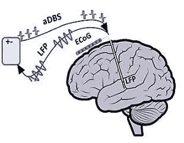

图 2:在自适应深部脑刺激(aDBS)中，将从深部脑刺激电极测量局部场电位(LFP)信号，可能除了皮层脑电图(ECoG)信号之外，还通过一个设备进行处理，该设备通过同一电极返回针对症状定制的脉冲。图片来自[https://doi.org/10.3389/fnhum.2020.00054.s001](https://doi.org/10.3389/fnhum.2020.00054.s001)

# **数据**

数据集由暴露于不同音调哔哔声几分钟的老鼠的神经活动组成。图 3 显示了一个会话示例:红色显示哔哔声，白色垂直线显示神经元的放电。在这个数据集中有五只老鼠，每只老鼠有 20-25 次会话，每次会话包含 1-50 个神经元的活动。这些记录是使用一个类似于深部脑刺激电极的电极进行的。

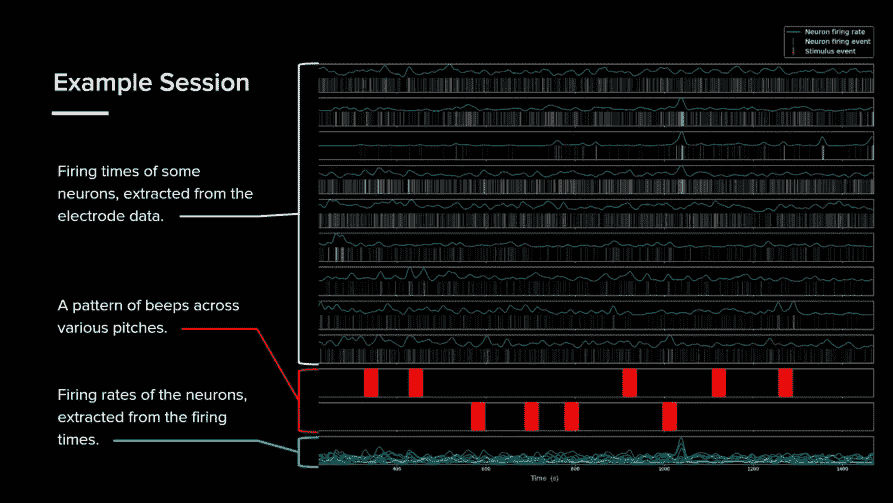

图 3:数据集中的一个会话示例。红色方块是老鼠听到的哔哔声(这里有两种不同的音调)。白色垂直线是神经元放电的时间(这里选取了 9 个不同的神经元)。青色线是我从放电时间中提取的神经元放电率。

我们的重点是从神经活动中解码哔哔声的时间，作为从神经活动中解码症状严重性的第一步。虽然哔哔声来自大鼠基底神经节，而不是人类的海马，并可能引起比帕金森氏症更快和不同的神经反应，但这两种声音都代表了从少数神经元活动中得出的一种推论。

这种数据的主要挑战是其异质性和微小的规模。整个数据集在 114 个会话中只有 15 兆字节。除此之外，每一次会议之间都有很大的差异，每只老鼠都记录了 20 种不同的蜂鸣音，不同数量和类型的神经元，不同的老鼠在一些会议中被限制对一些蜂鸣音模式做出反应，而对其他的则没有。

这些问题不太可能随着更现实的临床数据而消失。获取堆积如山的人体深部脑刺激数据是不可行的，每个患者都会有不同的神经元记录，并表现出不同的反应。因此，我们开发的处理小规模和高度异质性大鼠数据的任何技术也应该适用于人类数据。

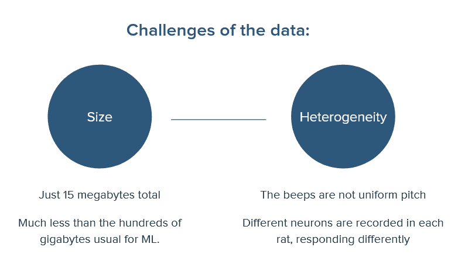

# 无监督学习

首先，我尝试了无监督学习，用[托普利兹逆协方差聚类(TICC)](https://arxiv.org/abs/1706.03161) 。这是一种专门为多通道时间序列数据开发的无监督聚类技术。它包括学习每个聚类的相关网络，包含该聚类的相邻时间上的数据信道之间的特征相关。每个聚类的相关网络在时间上滑动，每个时间点被放入响应最强的相关网络的聚类中，如图 4 所示。

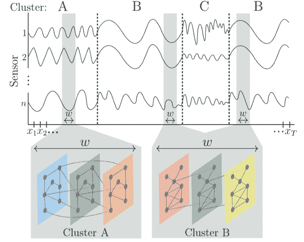

图 4:基于 Toeplitz 逆协方差的聚类包括学习每个聚类的神经通道和相邻时间之间的相关网络。图片来自 https://arxiv.org/abs/1706.03161

由于大鼠和疗程间数据的异质性，我将 TICC 独立应用于每个疗程。如图 5 所示，TICC 在少数神经元对蜂鸣声有明显反应的时段表现良好。即使在这些阶段，神经元通常只对一种哔哔声有明显的反应，而对另一种则没有。如图 6 所示，在没有明显神经反应的一两次会议中，无监督的集群也与一些蜂鸣声匹配。然而，在大约 85–90%的会话中，集群没有与蜂鸣声对齐。如果哔哔声导致了任何一致的神经活动模式，那么与老鼠脑子里的其他想法相比，这可能是微不足道的。我认为模型需要知道寻找什么，因此需要监督学习。

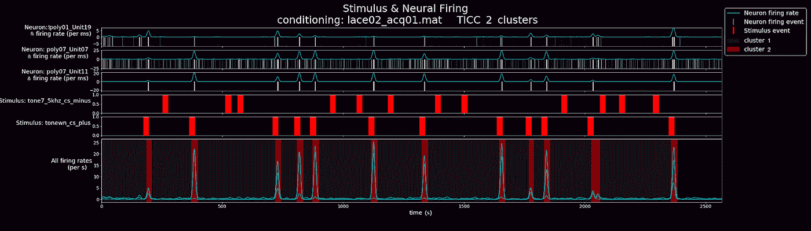

图 5: TICC 在少数几个时段表现良好，神经元对其中一个蜂鸣音有明显的反应。

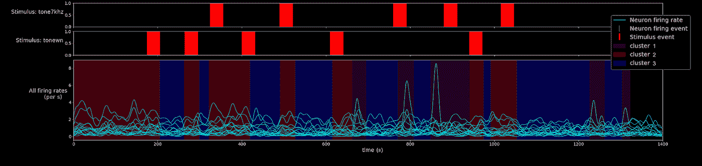

图 6: TICC 还揭示了神经信号和一些蜂鸣声之间的对应关系，在一个或两个会话中没有明显的神经响应(17 个神经通道的触发时间未显示)。

# 监督学习

为了尝试监督学习，我不得不面对异质性和小数据集的问题。由于这些问题，直接将监督学习应用于整个会话产生了差的结果。为了克服它们，我决定只查看小的时间窗口或“片段”,并预测是否会出现哔哔声。以这种方式克服异质性和数据集规模的代价是，每个神经元的反应在短短 40 秒的片段中被有效地视为独立、相同和本地化的。图 7 显示了其中的一些片段。它们要么与哔哔声的开始时间一致，要么与任何哔哔声相隔一段时间。用肉眼对片段进行分类似乎是一项几乎不可能完成的任务:人类不可能比偶然表现得更好。如果有一些微妙的模式，我们希望 ML 能够发现它们。

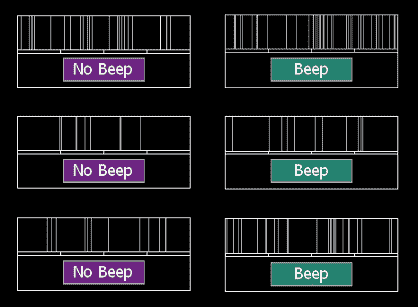

图 7:每个会话中的神经通道被切割成 40 秒的片段。这些片段要么与哔哔声的开始重合(右)，要么不重合(左)。人类在用眼睛辨别这一点上比运气好不了多少。

我首先用在峰间间期系列数据上训练的机器学习模型复制了[神经活动分类的一些方法(Lazarevich 等人，2018)。其中包括创建一个神经元放电时间之间的时间间隔列表，称为棘波间隔(ISIs)，并使用](https://arxiv.org/abs/1810.03855) [tsfresh](https://tsfresh.readthedocs.io/en/latest/) 统计包自动生成数百个关于训练集的相关统计数据，用作机器学习模型的特征。tsfresh 生成的统计数据包括傅立叶分量、小波变换系数和自相关。我不会在这里解释用于学习这些统计数据的模型，但是它们分为两个主要类别:全局方法和模式包方法，如图 8 所示。

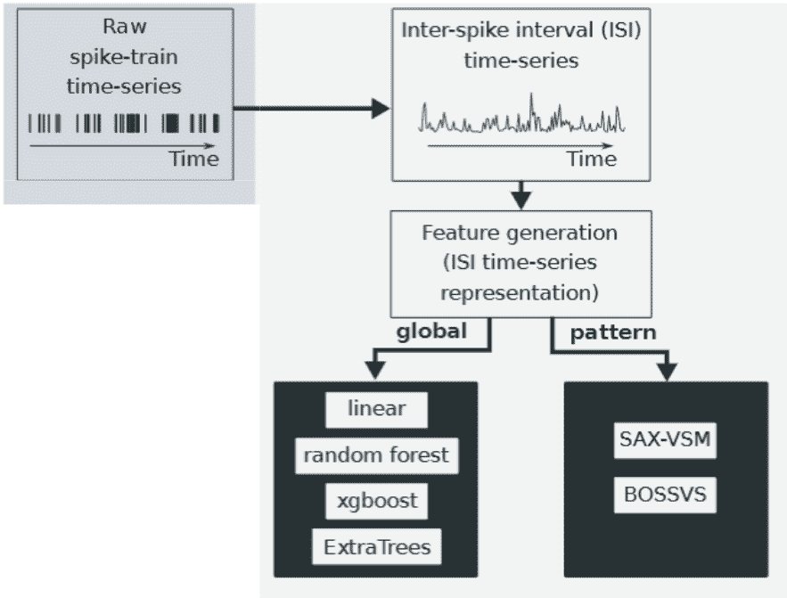

图 8:基于 ISI 统计的[神经活动分类方法，使用在峰间间期系列数据上训练的机器学习模型(2018)](https://arxiv.org/abs/1810.03855) 。我还尝试了各种关于 ISIs 和 ISI 统计的神经网络(NN)方法。所有器件的精度都低于 XGBoost。

总的来说，我发现基于模式包的方法表现不佳，在不同随机采样片段的平衡数据集上进行训练和测试时，准确率不超过 52%，而 XGBoost(梯度增强库)等全局方法表现更好，准确率高达 61%。这证实了 [Lazarevich 等人](https://arxiv.org/abs/1810.03855)发现的一般趋势。，其中基于模式袋的方法很难在区分清醒和睡眠神经活动方面达到 58%以上的准确率，而 XGBoost 也表现得最好，准确率超过 70%。与他们的结果相比，我们的结果精度较低，这表明了我们的问题的难度，以及我们数据集的挑战。

为了改进这些结果，我决定尝试以更直接的方式将数据输入到模型中。为了做到这一点，我将每个触发时间片段转换成一个直方图。我发现最好的结果是 400 个直方图仓，每 0.1 秒一个。我再次尝试了许多在这些直方图上学习的 ML 模型，包括密集神经网络(NNs)、1D 卷积神经网络、局部连接神经网络、残差神经网络、长短期记忆神经网络和 XGBoost。我再次发现了 XGBoost 的最佳结果，它在随机采样的片段直方图上实现了 72%的准确率，或者如果给定片段来自哪个大鼠和神经元的额外信息，则达到了 74%。这与基于 ISI 统计的方法的 61%的准确率相比是一个很大的飞跃，比人类能够实现的要好得多，甚至与 [Lazarevich 等人(2018)](https://arxiv.org/abs/1810.03855) 的清醒/睡眠分类准确率相当。考虑到他们基于统计的方法在我们的数据上表现如此之差，看看我们基于直方图的方法在他们的数据上表现如何会很有趣。

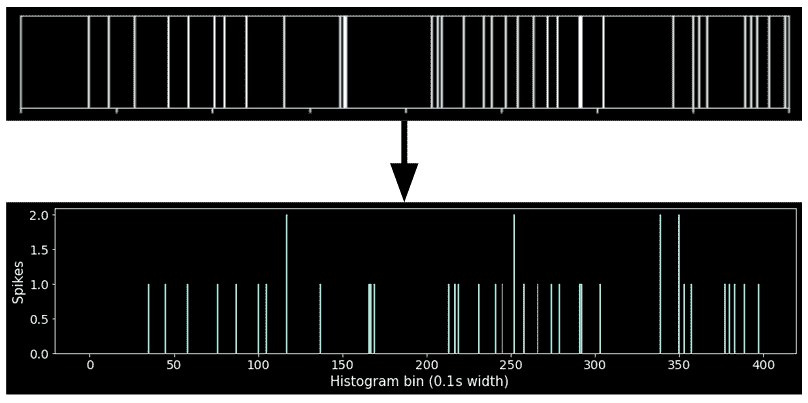

图 9:使用直方图来表示片段中的神经触发时间是一个相当 1:1 的转换，可以达到 74%的准确度。

当然，对随机抽样的神经活动片段进行分类，与提取整个会话中的哔哔声时间相比，还有很长的路要走。首先，模型应该根据早期会话的片段进行训练，并在后期会话中进行测试，而不是根据随机时间的片段进行训练和测试。然而，在这个实验中，老鼠只在后来的训练中被训练(条件反射)来对哔哔声做出反应。在早期阶段训练我们的模型意味着它只看到无条件的老鼠，然后被要求做出预测，即使老鼠的大脑对他们所学的做出反应。当我们只在像这样的无条件大鼠上训练模型时，片段的准确性从 74%下降到 68%，但考虑到数据集的变化，这仍然是一个非常令人印象深刻的结果。

# 预测蜂鸣声次数

直接尝试在整个会话中运行未经训练的片段直方图 XGBoost 模型来预测哔哔声发生的时间会产生很差的结果(参见图 10)。每半秒钟，模型就会被输入一个神经通道中接下来 40 秒钟的活动直方图。然后，这些预测在神经通道之间进行平均，并使用高斯窗口在时间上进行平均。如果模型预测的音调的平均概率大于某个阈值(例如 52%)，则预测音调已经出现。在这些滑动预测中表现不佳的原因可能是因为该模型仅在片段开始时开始的蜂鸣音上进行训练，所以当在整个会话中滑动时，它并不健壮。

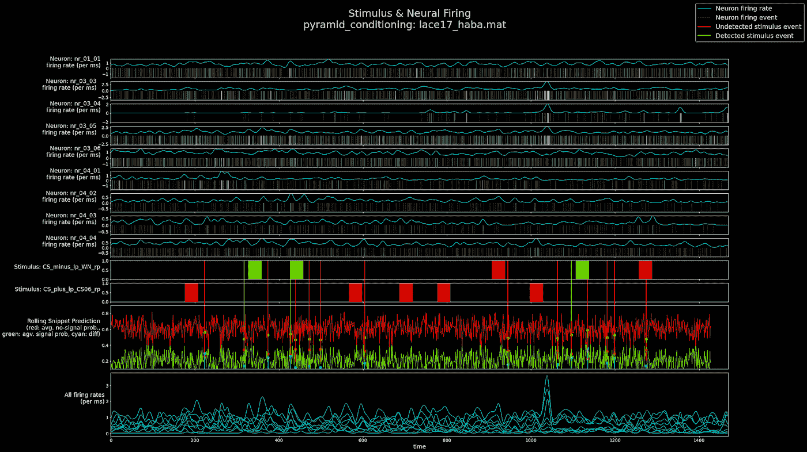

图 10:使用在片段直方图上训练的 68%准确的 XGBoost 模型来预测哔哔声发生的时间不会产生好的结果。该模型仅在片段开始时准确开始的哔哔声上进行训练，因此当在整个会话中滑动时，它并不健壮。

通过查看每个片段中的哪些时间对模型最重要，使用[有条理的附加解释](https://arxiv.org/abs/1705.07874)来说明鲁棒性的缺乏。平均而言，每个片段的前十分之一秒的神经活动对模型决策的影响比任何其他时间都大 10 倍，如图 11 所示。该模型发现，它不需要过多地关注更深层次的神经活动模式，因为前十分之一秒已经告诉了它很多它需要知道的关于哔哔声是否刚刚发生的信息。当模型被要求在整个会话中进行滑动预测时，这种狭窄的焦点正是让模型失望的原因，因为在滑动预测窗口开始的那微小的 0.1 秒期间，神经活动有许多机会看起来相似，从而导致许多错误的预测。

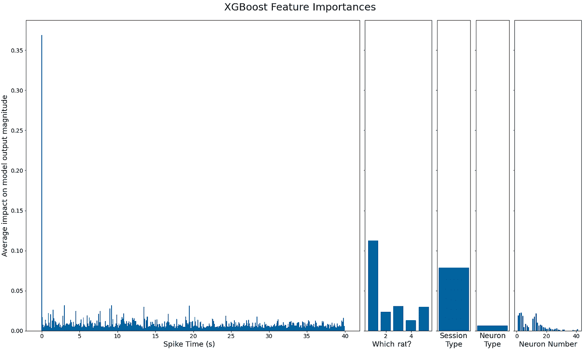

图 11:该模型对片段前十分之一秒的神经活动比对其他任何事情更感兴趣。这可能是导致它缺乏健壮性的原因。

为了使模型在整个会话中更加健壮，我将 40 个样本分布中的每个训练片段从 2 秒前偏移到 2 秒后。这导致片段的准确性较低，但在预测整个会话的蜂鸣时间方面性能更好，如图 12 所示。在某些会话中，当 TICC 不能生成有用的聚类，并且人眼看不到明显的响应模式时，我们的模型的预测甚至是完美的，如图 13 所示。另一方面，似乎有一些时段，神经元真的对一个或多个蜂鸣音没有反应，因此模型很难建立。

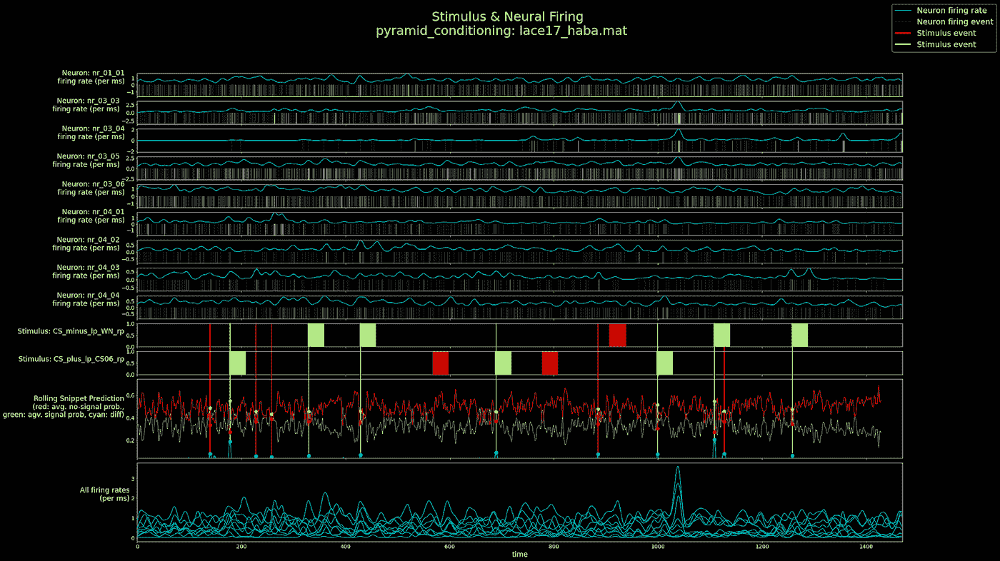

图 12:在时间分布上稍微偏移的片段上训练 XGBoost 模型使得它在预测片段时不太准确，但是在预测整个会话中的蜂鸣时间时更加健壮(与图 10 相比)。

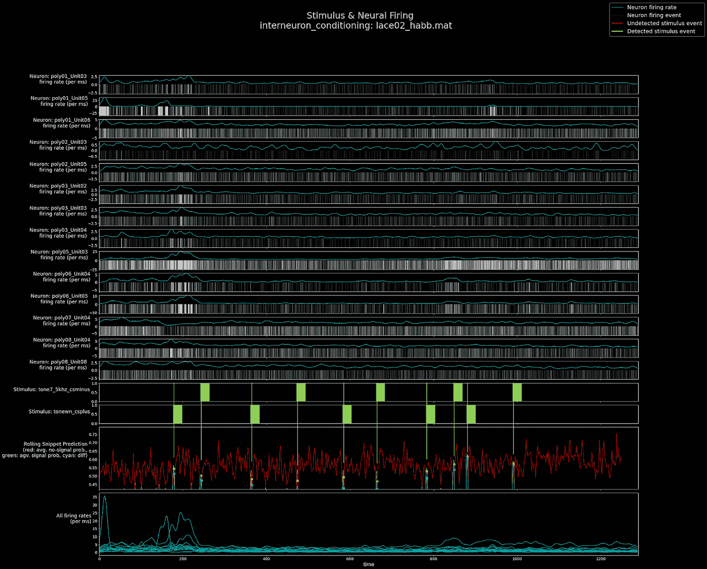

图 13:偏移片段 XGBoost 模型的最佳执行会话是完美的，即使 TICC 和人眼看不到与哔哔声相对应的明显模式。

为了量化我们的模型，我们在整个会话测试集上运行它，选择高斯时间平均窗口和蜂鸣声预测阈值，在每个会话的前半部分最大化真阳性，最小化假阳性，然后在每个会话的后半部分评估指标。该模型在每次会话中平均拾取了 47%的蜂鸣声，如果该模型预测到蜂鸣声，则有 41%的机会真的出现蜂鸣声。当然，在某些时段，这是 100%和 100%,如图 13 所示，而在其他时段，这更接近 0%和 0%,这再次说明了不同神经元在不同时间对不同大鼠的不同蜂鸣声的反应有多么不同。

# 结论

虽然最终结果肯定低于临床级别，但我们已经展示了许多对哔哔声时间的准确预测，即使对人类或其他 ML 模型没有明显的反应。我的主要发现是:

*   对于神经数据，Toeplitz 逆协方差聚类是一种非常有效的无监督方法。在未来的工作中，它应该应用于允许跨会话学习的数据集。
*   作为克服我们数据的异质性和微小规模的一种手段，我们使用片段直方图的方法优于其他已发表的神经解码方法对我们数据的基于统计的方法。
*   通过在大脑信号的基础上输入额外的信息，可以提高模型的准确性。
*   像 XGBoost 这样的梯度推进模型在这种小数据的情况下始终优于所有其他模型。自定义神经网络仍可能凭借大量数据胜出。
*   用[匀称的附加解释](https://arxiv.org/abs/1705.07874)分析特征的重要性对于了解模型在看什么以及如何使它们更健壮非常有用。
*   向模型提供经过处理的数据可以使其更具概括性和健壮性，这通常比测试准确性更重要。

随着我们越来越接近深度大脑刺激数据，这些见解应该仍然适用，深度大脑刺激数据将共享类似的问题。我们克服数据的小规模和异构性的方法应该特别有用，例如制作片段并操纵它们以打破模型的隧道视野。在大脑信号上添加额外的信息也可以改善自适应深度大脑刺激的结果。

最后，为了改进我们的工作并弥补从检测蜂鸣音到实施自适应深度大脑刺激之间的差距，我们应该:

1.  转向更真实的数据，例如从具有扩展症状样活动的大脑记录的原始局部场电位。
2.  研究更广泛的技术，如迁移学习和强化学习，这些技术可能对实时自适应深度大脑刺激有用。

最重要的是，我们希望我们的研究最终有助于改善人们的生活。

# 承认

我们要感谢 Pankaj Sah 的实验室，特别是昆士兰脑研究所的 Alan Woodruff 博士和 Francois Windels 博士提供的数据和讨论的发现。我们还要感谢 Maciej Trzaskowski，以及 [Max Kelsen](https://maxkelsen.com/) 的所有人，感谢他们在这个项目中的支持和监督。