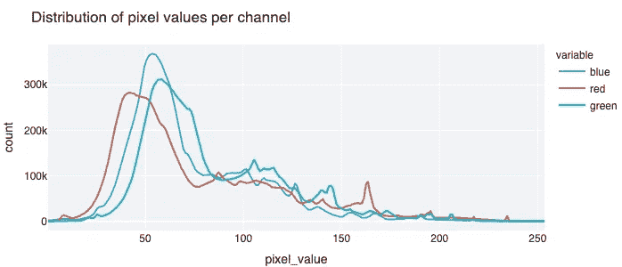
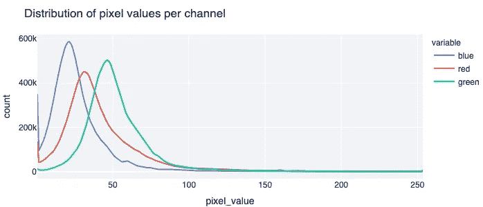
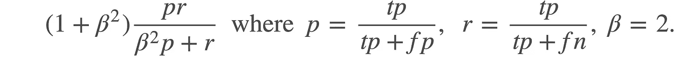
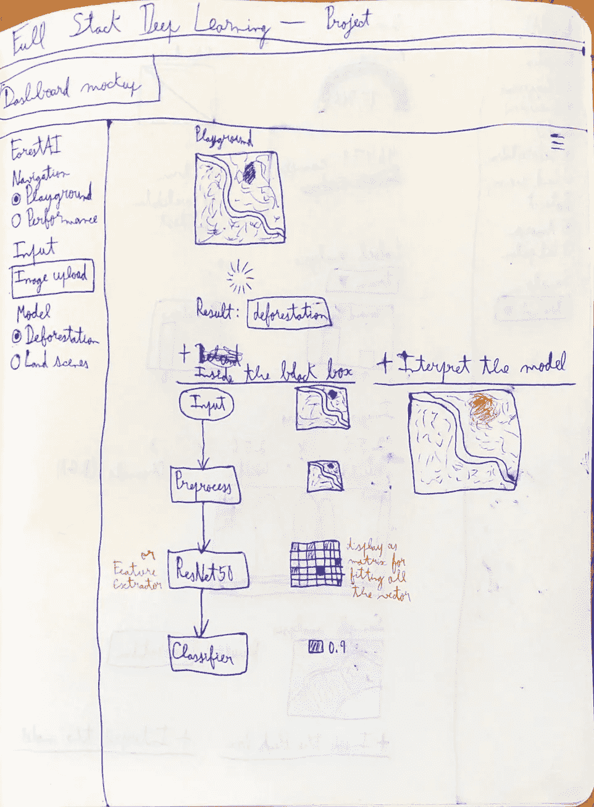
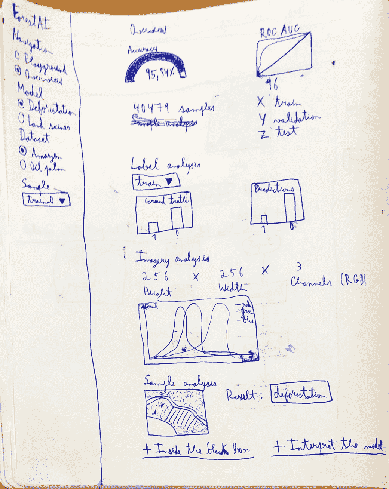
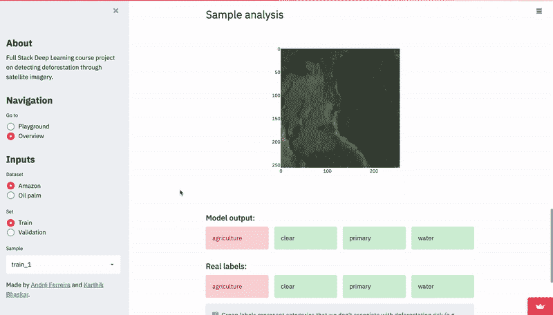
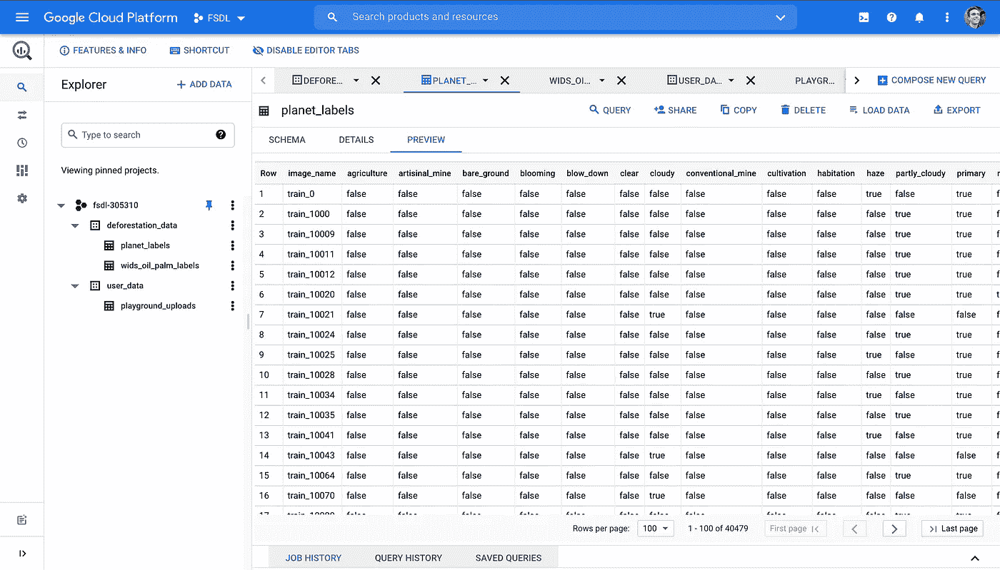
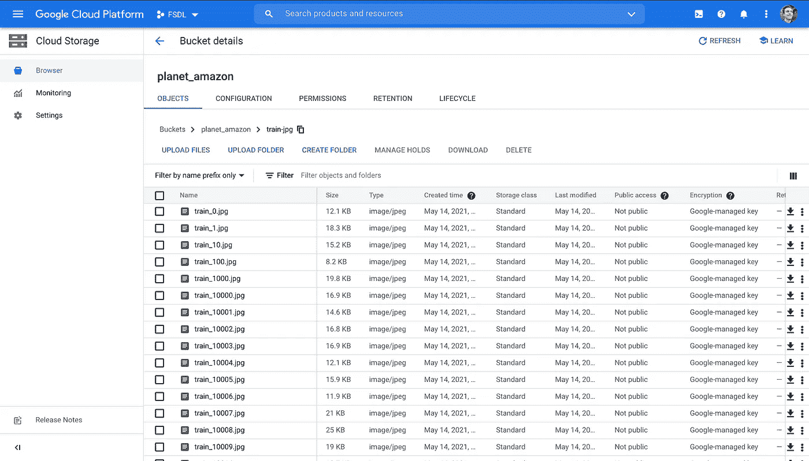
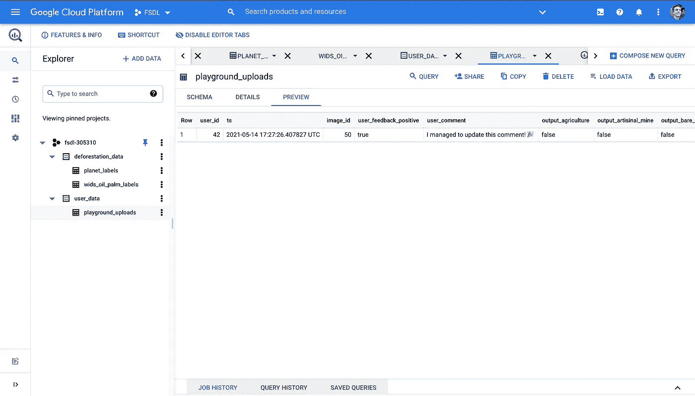

# 从卫星图像检测森林砍伐

> 原文：<https://towardsdatascience.com/detecting-deforestation-from-satellite-images-7aa6dfbd9f61?source=collection_archive---------7----------------------->

## 全栈深度学习项目

Janusz Maniak 在 [Unsplash](https://unsplash.com?utm_source=medium&utm_medium=referral) 上拍摄的照片

# TL；速度三角形定位法(dead reckoning)

使用来自亚马逊雨林的高分辨率卫星图像和一个良好的 ol'ResNet [1],我们在检测与森林砍伐相关的陆地场景方面获得了超过 95%的有希望的结果，当应用于世界其他地区时，也获得了有趣的结果。我们还展示了一个真实的森林砍伐检测工具的概念验证，包括一个由 Streamlit [2]和 Google Cloud [3]上的数据基础设施组成的仪表板。在本文中，您可以跟随这些见解和整个项目的旅程。

# 为什么

这次我将从为什么开始😉(这可能是对 Simon Sinek [4]的一个伟大 TED 演讲的老掉牙的引用，也是对所有数据科学爱好者和我妈妈的一个暗示，她们读过我以前的文章[5])。

我们正面临气候变化，这一危机已经影响到我们的生活，除非迅速果断地采取行动，否则可能会让我们所有人陷入大麻烦，对此你可能不会感到惊讶。此外，这在很大程度上是由人类活动引起的，伴随着温室气体的释放，这意味着我们对此负有责任，但也意味着我们有可能解决它。如果你对此仍持怀疑态度，有许多资源可供你参考，但我建议你阅读《明日气候变化指南》和比尔·盖茨的新书《如何避免气候灾难》。

气候变化的原因之一是森林砍伐。当砍伐树木和植物时，我们也在砍伐自然碳汇，也就是说，即使在我们给她带来了所有的垃圾之后，大自然似乎仍想帮助我们的少数部分之一。除了减少吸收二氧化碳的树木，我们还破坏了当地的生态系统，对野生动物、食物来源和水资源储备造成潜在的复杂影响，并可能用更多的污染因素，如牛或化石燃料动力设施，填充现在空置的区域。尽管有这些不利因素，我们仍然面临着世界上一些地方森林砍伐的增加，包括巴西，那里 2020 年的森林砍伐率是过去十年中最高的[8]。

当面对这些担忧时，我们可能会陷入绝望

内德，没必要太紧张。

或者否认。

一刻也不能停下来。

然而，尽管我们必须意识到这个问题的严重性，但我们也应该是顽固的乐观主义者[9]，相信我们能够克服这种逆境，并为此采取实际行动。

我们搞定了。

幸运的是，有几项技术创新可以帮助我们减少碳足迹。虽然我们首先想到的可能是可再生能源技术，但我认为卫星也有很大用处。虽然卫星本身不能减排，但它们可以告知我们进展情况，并指导我们的行动计划。经常获得公正的、全球性的见解对于确定优先事项和推进具有坚实基础的政策可能至关重要。在这个意义上，它们的重要性正在得到认可，因为我们看到越来越多更好的遥感卫星被 Planet [10]、Satellite Vu [11]和 Satellogic [12]等发射到太空，以及更多的组织出于可持续发展的目的使用它们，如 Climate TRACE [13]、TransitionZero [14]和 Carbon Mapper [15]。

卫星图像本身并不实用，因为我们不能真的雇佣一些人在整个地球上运行一种闭路电视监控。但是我们可以通过机器学习管道自动提取洞察力。在这方面，我们也很幸运，因为在过去几年里，计算机视觉已经取得了很大的进步，而且，随着我们收集的所有卫星数据，它也开始变得越来越成为一个诱人的机器学习领域。

如果所有这些还不够激励的话，这是我和 Karthik Bhaskar 为全栈深度学习-2021 年春季在线课程开展的一个小组项目。因此，我们也有好奇心以某种完整的方式从头到尾从事机器学习项目。

# 什么

## 这个计划

项目建议书，有初步计划。

为了开始这个项目，我们在 idea[16]中建立了一个项目管理工作区，在这里我们可以管理我们的任务，并拥有一个集中的知识库，其中包含我们所有的笔记和我们项目的相关链接(这在撰写一篇关于它的文章时会派上用场😁).你实际上可以检查那些页面[17]，因为我们把一切都公开了。

通过这个平台，我们开始讨论我们的动机、我们想要实现的目标以及可能的项目想法。正如您在上一节中看到的，砍伐森林的主题对我们来说非常有趣，因为我们为这项任务找到了高质量的数据集(您将在后面看到)，这似乎是一个可行的项目。在一些聊天和视频通话后，我们开始定义我们的 MVP(最小可行项目)，即我们想要实现的基本功能，以及一些额外的目标。

## 最有价值球员

对于 MVP，我们决定了以下项目:

*   **模型**经过训练，在检测森林砍伐方面具有可接受的性能。(什么是“可接受的性能”是通过与基线比较来确定的)
*   **仪表板**显示我们数据集上的预测。
*   GitHub **包**。
*   **超参数调谐**。(即使用优化工具来改进我们的模型)
*   **数据存储**。(即，为我们的项目需求设置强大的数据存储解决方案)

我们觉得这些最低目标已经满足了我们以端到端的方式从事机器学习项目的愿望，涵盖了编码、数据工程、建模和部署的许多重要方面。

## 奖金

至于奖金，就像在时间和可用性允许的情况下最好拥有的东西一样，我们定义如下:

*   **域外** / **分布转移分析** —研究我们的模型在不同于其训练数据的数据上的性能。
*   **数据飞轮** —建立一个系统，定期收集新数据以改进模型，这可以在用户的帮助下完成。
*   仪表板中的**可解释性**—允许用户更好地理解模型如何导出每个输出。
*   **测试**我们的包。
*   性能**比 MVP 车型**更高的车型。

虽然我们对所有这些额外的里程碑都很感兴趣，但我们对进行一些域外性能分析特别感兴趣，考虑到它可以对我们的模型进行很好的验证，以及多个与森林砍伐相关的数据集的可用性和数据飞轮[18]。最近，这一点已经被谈论了很多，包括 Andrej Karpathy 和他的项目 vacation [19]，它似乎是人工智能的一种发展方向，作为一种自动化，它可以在机器学习的后期阶段提供帮助，因为进一步改进模型变得越来越难，而在初始阶段，我们可能没有足够的数据来训练足够好的模型。

# 怎么

## 数据集

为了训练一个可以从太空中检测森林砍伐的模型，我们需要一些带标签的数据，由卫星图像和标签组成，这些数据应该与森林砍伐的存在与否有关。正如我们所讨论的，虽然卫星图像的数量在不断增加，但标记的数据仍然相对较少。如果我们只搜索看起来与我们的目标完全一样的数据集，例如每个图像都有一个单一的二进制`deforestation`标签，我们可能会发现这很难。所以首先，为了拓宽我们可能的解决方案，我们需要定义什么是森林砍伐，至少从上面的视觉信号来看。话虽如此，我们还是决定搜索那些标注了伐木或近期人类在自然生态系统中的潜在开发活动(如农业、采矿和城市扩张)的数据集。

根据设定的标准，我们的搜索引导我们找到了这三个数据集:

*   **从太空了解亚马逊**【20】—追踪亚马逊雨林中人类足迹的多标签数据集；我们通常称之为**亚马逊数据集**。
*   **WiDS data thon 2019**【21】—婆罗洲油棕榈种植园检测的二进制数据集；我们通常称之为**油棕数据集**。
*   **检测森林砍伐**【22】—用于检测亚马逊雨林中咖啡种植园的二进制数据集；我们通常称之为**咖啡数据集**。

我们主要关注的是亚马逊数据集，但在下一节中您会发现原因。

## EDA 和数据处理

像数据科学中的通常情况一样，在深入研究建模之前，我们从探索性数据分析(EDA)开始，它可以指导我们定义问题、潜在的解决方案，以及在训练模型之前我们需要的预处理步骤。让我们在这里分析三个潜在的数据集，以及我们决定对哪一个数据集做什么。

鉴于其规模和质量，亚马逊数据集立即引起了我们的注意。如果不算 Kaggle 不共享标签的测试集，这里有超过 40k 个样本，有 17 个独立的标签，从农业到采矿，城市基础设施，自然景观和天气。大小和上下文相关的标签使该数据集成为模型训练的良好候选。

它包含了 2016 年 1 月至 2017 年 2 月期间收集的亚马逊雨林各地的样本，包括巴西、秘鲁、乌拉圭、哥伦比亚、委内瑞拉、圭亚那、玻利维亚和厄瓜多尔。所有图像都来自行星卫星，空间分辨率为 3 米(每个像素代表地面上 3 米)。这些信息之所以相关，不仅仅是因为它让我们感觉到数据集中在空间和时间上的多样性，还因为如果我们想要将基于它训练的模型与域外数据(可能在不同的时间和/或地点和/或卫星上)进行比较，它可能证明是有用的。

这些图像以两种格式给出:典型的 RGB 图像和 TIFF 文件，具有额外的近红外波段。虽然 TIFF 文件可能有用，但考虑到额外的波段，我们决定坚持使用 RGB 图像，因为它们简单(所有图像都已经过预处理，像素值在 0 到 255 之间)，并且在处理来自其他数据集和用户的其他图像时具有灵活性。无论哪种方式，该数据集的另一个简化功能是所有图像都具有相同的 256 x 256 大小。

亚马逊数据集中像素值的近似分布。

由于其他数据集不太可能采用相同的标注方法，并且我们对突出森林砍伐事件和风险感兴趣，我们将相关标签映射为与森林砍伐相关，如下所示。

亚马逊数据集的所有标签以及与森林砍伐相关的地图。

把`habitation`当成毁林标签可能不值得。有这个标签的样本似乎大多是一些时间以前就存在的城市或村庄，因此它们可能与检测当前的森林砍伐无关。

亚马逊数据集中的标签分布。记住每个标签都是独立的，除了天气标签。

大部分与森林砍伐相关的标签(除了`agriculture`、`road`、`cultivation`之外)似乎都很少见(即< 1k 样本)。但是将它们结合在一起，我们仍然可以获得相当数量的阳性样本，从而产生 15719 个具有森林砍伐信号的样本，代表大约 38.83%的标记数据→稍微平衡的数据集🙂

油棕榈数据集对我们来说很奇怪。它与亚马逊有很多相似之处，包括使用相同的卫星，相同的图像格式和分辨率，以及类似的探测森林砍伐的目的。但它也有一些显著的差异，主要是因为它的焦点更窄，只有一个标签用于检测油棕种植园，而且它位于世界的另一个地方，所有图像都来自东南亚的婆罗洲岛，而不是南美洲的亚马逊雨林。它目前也只有大约 2k 的标记图像，远低于亚马逊数据集的 40k，主要是因为标签和图像文件之间存在不匹配的问题[23]。

油棕榈数据集中像素值的近似分布。请注意，与亚马逊数据集相比，图中的峰值向左移动，像素值降低。

尽管存在问题，但成像的相似性和数据分布的差异使油棕榈数据集成为域外测试集的一个好选择。此外，数据集的标签`has_oilpalm`在 1089:1089 的样本上完全平衡。

虽然咖啡数据集有可能成为至少一个像油棕榈数据集一样的域外数据集，也使用相同的卫星并代表种植园检测的二元任务，但它有太多的问题在我们的项目中不实用。作者降低了图像分辨率并将其转换为灰度，这是与其他数据集不兼容的限制，我们可能需要牺牲很多模型性能来标准化所有图像以适应这些限制。因此，我们丢弃了这个咖啡数据集。

因此，概括一下，我们使用亚马逊数据集作为主要数据集，在那里我们训练我们的模型，油棕榈数据集作为额外的测试集，使用域外数据。

## 建模

正如在整个全栈深度学习课程中所建议的那样，拥有基线非常重要，这样才能知道在开发我们的模型时会有什么预期以及要比较什么。在我们的例子中，很容易找到基线，因为我们在 Kaggle 比赛中使用的数据集中训练我们的模型，也就是说，我们有几个提交来进行比较。了解这一点后，首先要确保我们计算的性能指标与竞争中使用的相同，这样我们才能充分比较我们的解决方案和排行榜。亚马逊数据集中使用的指标是 **F2 得分**，这是一个结合了精确度和召回率的指标，尽管召回率的权重更高。这意味着，为了让我们的模型得分高，一个主要的标准是它有很少的假阴性。考虑到我们对检测森林砍伐的兴趣、假阳性的低风险，以及有森林砍伐的样本比没有森林砍伐的样本更少的事实，这个指标在这里似乎也有意义。

F2 分数，其中较高的权重被给予回忆，即具有很少的假阴性。

为了实际开发这个模型，当我们在一个小组中工作时，我们从两种不同的方法开始。我们中的一个人尝试在 TensorFlow [24]上训练模型，另一个人在 FastAI [25]上训练模型。对于 TensorFlow 方法，我们尝试了更强大的管道，首先用笔记本测试模型对小批量的过度拟合(正如课程中所建议的，这似乎是一个好主意，可以确认模型对给定数据的预期效果)，通过权重和偏差进行模型跟踪，选择使用在其他遥感数据集上预先训练的模型[26]，基于验证性能的早期停止和自动学习率衰减，以及嵌套在整洁的训练脚本中的其他功能。然而，事实证明 FastAI 让我们获得了更好的结果，即使没有其他方向的所有花哨功能。因此，我们专注于使用 **FastAI** 模型。

有时候更简单的解决方案是最好的解决方案。

那么我们为 FastAI 模型做了什么呢？它只是采取了这些简单的步骤:

1.  设置 FastAI 数据加载器，批量大小为 256，图像大小调整为 128 x 128，以及一些简单的数据扩充，包括图像翻转、亮度、缩放和旋转。
2.  将准确度和 F2 分数设置为指标。
3.  定义一个 ResNet50 模型。
4.  搜索最佳初始学习率。
5.  以固定 4 个时期的最佳学习速率开始训练模型，然后以衰减的学习速率再训练 6 个时期。

训练我们 FastAI 模型的核心部分。你可以在[的 Colab](https://colab.research.google.com/github/karthikraja95/fsdl_deforestation_detection/blob/master/fsdl_deforestation_detection/experimental/FSDL_Final_Model.ipynb)【28】中看到剩余的代码并亲自尝试。

正如你所看到的，大多数建模步骤都由 FastAI 负责，这使得我们的代码很短，开发过程也很快(我想知道它们的名字是从哪里来的🤔).这确实有它的缺点，因为它锁住了其他不太抽象的框架所提供的一些灵活性和定制性。但是现在可以了。

还要注意我们是如何选择 **ResNet50** 模型的。虽然这种架构来自 2015 年，在现代快节奏的研究世界中已经可以被视为是旧的，但它的效率和广泛的社区支持使它非常实用，至少作为计算机视觉任务的初始迭代。最近的模型，如 ViT [27]和**insert what model is state of the art today**在大型数据集上表现出更好的性能，但它们非常大的尺寸可能使它们无法用于较小的数据集和/或个人硬件设置，此外，有时还没有公开的模型权重和/或代码。

正如你在[我们的笔记本](https://colab.research.google.com/github/karthikraja95/fsdl_deforestation_detection/blob/master/fsdl_deforestation_detection/experimental/FSDL_Final_Model.ipynb)【28】中看到的，我们的模型在**验证**集上取得了 92.7% 的 **F2 分和 95.6%** 的**准确率。这些结果本身看起来不错，当我们看到 Kaggle 上的排行榜冠军获得 93.3%的 F2 分数时，我们也很高兴。它仍然比我们的高，并且在一个稍微不同的集合上，因为它是在 Kaggle 的测试集上计算的(我们没有提交)。但尽管如此，这种表现似乎足够好，让我们从建模继续前进。**

我还想指出的是，当在油棕榈数据集上运行推断并作为二元毁林任务计算分数时(使用我们之前讨论的毁林映射)，我们得到了 66.8%的准确性和 86.7%的 F2 分数。我们确实预计性能会比训练模型的数据集差，但这仍然显示了一些有趣的见解。首先，该模型必须有很少的假阴性，才能以较低的准确性获得如此高的 F2 分数，这意味着它可能仍然可以指出毁林事件。另一方面，这些结果也告诉我们，该模型有很多假阳性。这可能是由几个因素造成的，包括数据集之间的区域差异，以及可能略有不同的图像预处理。我们也已经看到了这个油棕榈数据集的图像往往比亚马逊数据集中的像素值低，这可能会欺骗我们的模型认为样本是阳性的。我们可以尝试几个选项来提高我们的模型在该数据集上的性能，例如标准化两个数据集上的像素分布，或者在训练中包括来自该数据集的一些样本，但我们现在将保持原样。

## 仪表盘

我们希望在项目结束时有一个仪表板，这样我们就可以有一个结合所有部分的交互式演示，并作为我们端到端项目中的一个简单部署步骤。考虑到它的易用性和我们对学习它的兴趣，我们决定使用 Streamlit 来开发仪表板。但是在深入编码之前，我们需要看完整个画面，想想我们希望我们的仪表板是什么样子的。对于其核心功能，我们希望包括:

*   **用户输入** —用户在他们的图像上运行我们的模型的选项。
*   **聚合性能** —显示我们的模型在亚马逊数据集上的全局结果。
*   **样本探索** —显示每个样本的模型结果。
*   **域外性能** —显示油棕榈数据集的模型结果。
*   (奖金)**数据飞轮**——收集可以帮助我们改进模型的用户数据。

当我们开发一个仪表板时，我们希望它是直观的和视觉上吸引人的，我们也应该预先考虑 UI 本身。所以，我们想到了两页纸，并草拟了草稿:

*   **游乐场** —这是专门为用户制作的初始页面，用户可以在他们的图像上尝试模型；我们也可以使用这个页面来存储用户上传的图片和他们的反馈。
*   **概述** —用于查看我们的模型性能和数据集数据特征的页面。

仪表板的操场(左)和概览(右)页面的草稿。这体现了 AUC 指标，而不是 F2 分数，然后当我们优先考虑该指标时，F2 分数被替换。

请注意，我们遵循 Streamlit 应用程序的典型设计准则，因为页面内容包含所有结果和图表，而用户输入在侧边栏中设置。

这些草案与最终的仪表板在一些细节上有所不同，但我想强调的是，与草案所建议的相反，我们只是使用了一个模型，这个模型被训练来预测亚马逊数据集的 17 个类别。这里是[最终仪表板](https://share.streamlit.io/andrecnf/fsdl_deforestation_detection/fsdl_deforestation_detection/dashboard/streamlit_app.py) [29]:

最终仪表板上的操场页面。

最终仪表板上的概览页面。

这些看起来和草稿相似，对吗？😃我还想指出一些额外的功能:

*   几个信息卡，引导用户通过仪表板，使它更直观。
*   如果输出与森林砍伐无关，则显示为绿色，否则显示为红色。
*   实现了一个简单的数据飞轮，因为我们可以保存用户给我们的图像，以及模型的输出和用户的反馈。我们还给用户一个按钮来自动删除我们在交互中存储的所有数据。
*   缓存和过滤数据子集用于提高应用程序的性能。

[仪表板](https://share.streamlit.io/andrecnf/fsdl_deforestation_detection/fsdl_deforestation_detection/dashboard/streamlit_app.py)已经完全部署好，随时可供每个人探索，因为我们依靠 Streamlit 共享服务【30】来轻松发布它。

## 数据存储

对于仪表板的部署，我们希望它对于任何尝试使用它的人来说都尽可能实用。务实意味着我们应该避免强迫每个人下载完整的数据集到他们的电脑上来尝试。随着我们转向 Streamlit 共享方向，务实也意味着我们不会只是试图将所有数据集放在我们的 GitHub 存储库中。最实际的解决方案是将我们的数据存储在云中，仪表板通过连接到我们的数据库，只在需要的时候访问它需要的东西。因为我们想从用户那里收集数据，我们无论如何都需要一个集中的数据库，所以还不如把所有东西都包含在我们的数据基础设施中。

考虑到我们的项目，我们的**数据需求**是:

*   存储**标签表**，即将标签关联到每个图像的数据帧。
*   存储我们数据集中的所有**图像**。
*   存储**用户的数据**，其中包括他们的图像、模型在其上的输出、用户的反馈以及额外的数据，如时间戳和唯一标识符。

我们发现谷歌云满足了所有这些要求，因为我们可以按照以下方式组织我们的数据:

*   将标签表存储在 **BigQuery** 表中。

存储在 BigQuery 表中的 Amazon 数据集的标签。

*   将图片存储在**谷歌云存储桶**中。

亚马逊数据集的图像存储在谷歌云存储桶中。

*   将用户的表格数据存储在 **BigQuery** 中，将他们的图片存储在**bucket**中。

存储在 BigQuery 表中的用户数据。图像存储在一个单独的桶中，但是它们通过 image_id 列链接到这个表。

除了拥有存储数据所需的工具，Google Cloud 还很好地集成了 Python，这使得读写数据变得很容易。

从 Python 加载数据和上传数据到 Google Cloud 的例子。

虽然该数据基础设施由我们管理，但它可以在用户上传和删除数据时自行更新，如仪表板上的前一部分所示。因此，我们需要确保仪表板具有连接到我们的数据库的凭证，而不会公开泄露它们。幸运的是，通过 Streamlit 的秘密管理[31]，这很容易做到。

# 决赛成绩

期末专题提交的视频。

在经历了我们所做的一切之后，让我们回到我们开始要做的事情，看看我们成功实现了什么。

从 MVP 来看:

*   **经过训练的模型**在检测森林砍伐方面具有可接受的性能
    ☑️训练的模型在与森林砍伐相关的分类任务上具有 95.6%的准确性和 92.7%的 F2 分数，其性能可与 Kaggle challenge 中的排行榜冠军相媲美。
*   **仪表板**为了显示我们数据集上的预测
    ☑️开发了一个带有 Streamlit 的仪表板，它不仅显示数据和模型结果的概览，还允许用户输入。
*   GitHub **包**
*   **超参数调整**
    ☑️对学习率进行了一次短暂的调整。
*   数据存储☑️建立了一个谷歌云工作区来处理我们所有的数据需求。

所以所有的基本条件都满足了🙂

奖金呢？

*   **域外** / **分布偏移分析
    ☑️** 分析了我们的模型在油棕数据集上的表现。
*   **数据飞轮** ☑️设置了一个数据库和 UI，允许收集用户的输入，这些输入可以用来进一步改进模型。
*   仪表板中的可解释性
    ❌无法在我们的 FastAI 模型上运行 SHAP [33]，一个流行的可解释性库。
*   我们的包
    的**测试**❌没有集成任何定制测试，无论是代码、模型还是数据。
*   性能**比 MVP 车型**有所提升的车型
    ❌没有对该车型进行更多的迭代；然而，它在亚马逊数据集上已经有了令人印象深刻的表现。

我们还完成了两项奖金！🎉

为适度的成功而欢呼！

但在前往庆祝派对之前，我们应该对发生的事情和接下来可能采取的措施进行更多的反思。

# 经验教训

## 牛逼赢了

*   即使在今天，ResNet 的巨大成果也一直让我惊讶，用一个简单的 ResNet 模型获得巨大成果是多么容易；至少对于不太复杂的任务，诀窍似乎越来越依赖于数据质量而不是模型质量。
*   **Streamlit** “简单而有用——第一次接触这款工具时，它非常容易学习，而且事实证明，从理想化仪表板到创建甚至部署它，这是一个快速的过程。
*   **Google Cloud** 的完整性——至少在数据存储方面，Google Cloud 似乎真的为大多数用例提供了解决方案，并且具有良好的 Python 集成。

## 洞察力失败

*   **FastAI** ，它的局限性，以及**探索未知领域的危险**——这是另一个我个人以前没有用过的框架，尽管我的队友 Karthik 用过；与大多数其他工具相反，这个工具给我们带来了一些困难，特别是它的低灵活性、混乱的文档和相对较低的社区支持(例如，无法找到让它与 SHAP 一起工作的方法)。
*   与 **TensorFlow** 的**过于雄心勃勃的**冒险——我们仍然花了相当长的时间试图在 TensorFlow 中开发一个强大的模型训练管道，只是看到 FastAI 让我们获得了更好的结果，快得多；下次可能需要更好地重新考虑建模优先级及其时间线。
*   Streamlit 过于简化的脚本运行——和 FastAI 一样，Streamlit 的简单可能是一个缺点；因为 Streamlit 在每次仪表板中有变化时都会重新运行整个脚本，比如用户输入，所以很难让它像期望的那样快，也很难防止它崩溃；对于复杂的应用程序，我们需要注意缓存和性能技巧。
*   **未维护的数据集** —我们在油棕榈数据集中遇到了一些明显不正确或过时的文件问题，但从未得到作者的回应。
*   **疾病**、**摔坏的笔记本电脑**等来自地狱的故事——人生无常，墨菲定律邪恶；尽管我们设法实现了大部分我们想要做的事情，并且仍然相信我们的项目计划思维，我们应该考虑更详细地讨论最坏的情况，准备 b 计划，并且可能重新调整我们对完成某些任务所需时间的估计。

# 未来的工作

这个项目有几个方面可以改进。我们认为，主要的是这些:

*   **包括可解释性分析**与 SHAP——增加可解释性可以帮助理解模型的决策，这反过来可以帮助我们调试它，获得对它的信任，并带来更愉快的体验。
*   **改进我们的模型**，可能会有更多的数据和超参数调整—我们仍然没有获得排行榜的最佳性能，来自域外数据集的指标也不是很好。
*   **实施适当的模型跟踪**，例如通过权重&偏差【34】——随着新模型被训练，记录实验和比较它们变得更加重要。
*   **添加代码、模型和数据测试**——这在一个更长期、更成熟的项目中感觉至关重要，以确保在进一步的开发和使用中一切都按预期运行；全栈深度学习课程在这方面有很棒的讲座[35]。
*   **让仪表盘更快**更有性能——有时候仪表盘仍然感觉很慢，我们不得不做出一些牺牲来确保它的实用性和不崩溃；我们可以深入调查。

# 参考

[1]何等，[深度残差学习用于图像识别](https://arxiv.org/abs/1512.03385v1) (2015)

[2] [流线型](https://streamlit.io/)

[3] [谷歌云](https://cloud.google.com/)

[4]西蒙·西内克，[伟大的领导者如何激励行动](https://www.ted.com/talks/simon_sinek_how_great_leaders_inspire_action) (2009)，TED 演讲

[5] André Ferreira，[解读多元时间序列上的递归神经网络](/interpreting-recurrent-neural-networks-on-multivariate-time-series-ebec0edb8f5a) (2019)，走向数据科学

[6]奥利维尔·科拉迪，[气候变化——实用指南](https://www.tmrow.com/climatechange/) (2020)，明日博客

[7]比尔·盖茨，[如何避免气候灾难](https://www.penguinrandomhouse.com/books/633968/how-to-avoid-a-climate-disaster-by-bill-gates/) (2021)，阿尔弗雷德·a·克诺夫

[8] Celso H. L. Silva Junior 等人，[2020 年巴西亚马逊森林砍伐率是十年来最大的](https://www.nature.com/articles/s41559-020-01368-x) (2020)，自然

[9]克里斯蒂安娜·菲格雷斯，(2020)气候顽固乐观主义案例，TED 演讲

[行星](https://www.planet.com/)

[11] [卫星 Vu](https://www.satellitevu.com/)

[12] [卫星逻辑](https://satellogic.com/)

[13] [气候痕迹](https://www.climatetrace.org/)

[14] [跃迁零点](https://www.transitionzero.org/)

[15] [碳测绘仪](https://carbonmapper.org/)

[16] [观念](https://www.notion.so/)

[17] [安德烈·费雷拉和卡蒂克·巴斯卡尔的观念工作空间](https://www.notion.so/Homepage-2ff744c443814f459d80a6e5819226a5) (2021)

[18] Josh Tobin 等人，[讲座 5:人工智能项目](https://fullstackdeeplearning.com/spring2021/lecture-5/) (2021)，全栈深度学习—2021 年春季

[19]安德烈·卡帕西， [PyTorch at Tesla](https://youtu.be/oBklltKXtDE) (2019)，PyTorch DevCon 2019

[20] [星球:从太空了解亚马逊](https://www.kaggle.com/c/planet-understanding-the-amazon-from-space/) (2017)，卡格尔

[21][WiDS data thon 2019](https://www.kaggle.com/c/widsdatathon2019)(2019)，Kaggle

[22] [朝向检测森林砍伐](https://www.kaggle.com/c/dsc6232-rwanda-summer2020-hw2/) (2020)，卡格尔

[23] CP_Padubidri，[数据集—不匹配](https://www.kaggle.com/c/widsdatathon2019/discussion/202685#) (2021)，Kaggle

[24] [张量流](https://www.tensorflow.org/)

[法斯泰](https://docs.fast.ai/)

[26] [张量流枢纽遥感](https://tfhub.dev/google/collections/remote_sensing/1)

[27] Alexey Dosovitskiy 等人，[一幅图像抵得上 16x16 个字:用于图像识别的变形金刚](https://arxiv.org/abs/2010.11929) (2021)，

[28]卡希克·巴斯卡尔，[FSDL _ 最终 _ 模型笔记本](https://colab.research.google.com/github/karthikraja95/fsdl_deforestation_detection/blob/master/fsdl_deforestation_detection/experimental/FSDL_Final_Model.ipynb) (2021)，Colab

[29]安德烈·费雷拉，[项目仪表板](https://share.streamlit.io/andrecnf/fsdl_deforestation_detection/fsdl_deforestation_detection/dashboard/streamlit_app.py) (2021)，Streamlit

[30] Adrien Treuille，[介绍 Streamlit 共享](https://blog.streamlit.io/introducing-streamlit-sharing/) (2020)，Streamlit 博客

[31]詹姆斯·汤普森，[为你的 Streamlit 应用程序添加秘密](https://blog.streamlit.io/secrets-in-sharing-apps/) (2021)，Streamlit 博客

[32] André Ferreira 和 Karthik Bhaskar，[项目存储库](https://github.com/karthikraja95/fsdl_deforestation_detection) (2021)，GitHub

[33] Scott Lundberg 等人，[解释模型预测的统一方法](https://proceedings.neurips.cc/paper/2017/hash/8a20a8621978632d76c43dfd28b67767-Abstract.html) (2017)，NIPS 2017

[权重&偏差](https://wandb.ai/)

[35] Josh Tobin 等人，[讲座 10:测试&可解释性](https://fullstackdeeplearning.com/spring2021/lecture-10/) (2021)，全栈深度学习—2021 年春季