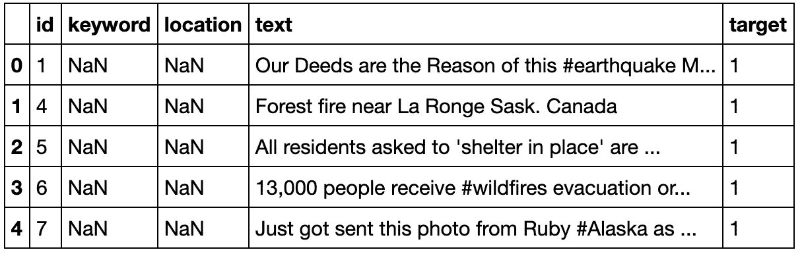
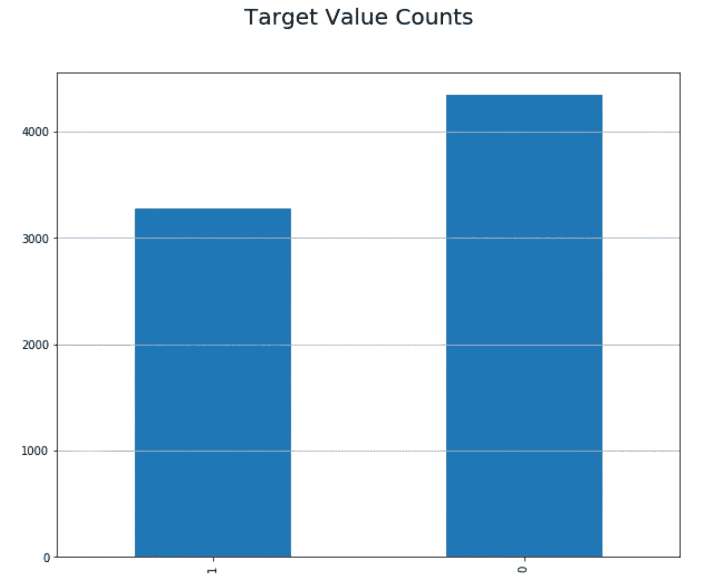
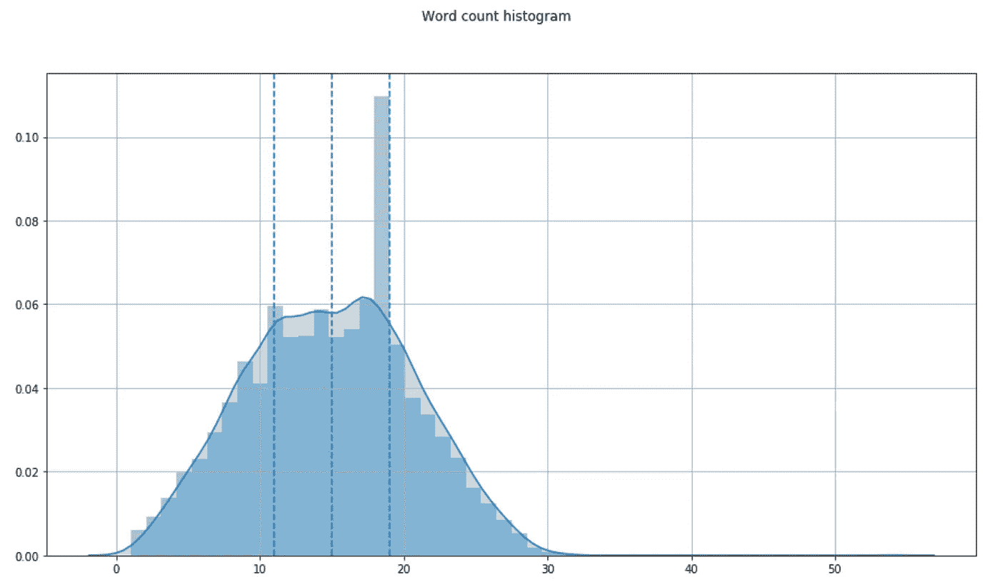
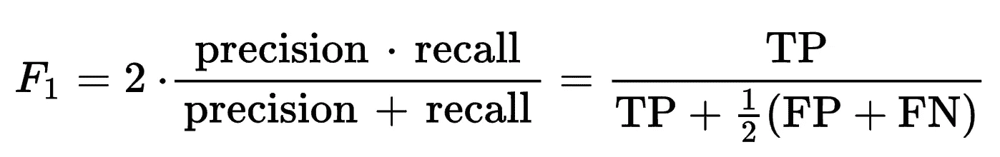
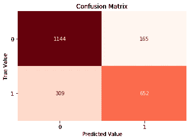
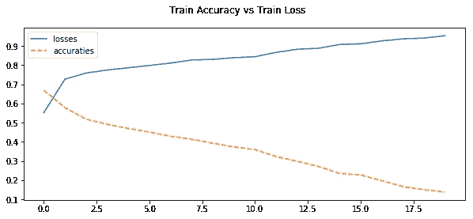
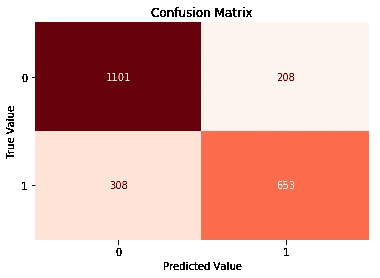

# 从推文中检测灾难(经典的 ML 和 LSTM 方法)

> 原文：<https://towardsdatascience.com/detecting-disaster-from-tweets-classical-ml-and-lstm-approach-4566871af5f7?source=collection_archive---------17----------------------->


克里斯·j·戴维斯在 [Unsplash](https://unsplash.com/s/photos/tweet?utm_source=unsplash&utm_medium=referral&utm_content=creditCopyText) 上的照片

## **使用 **NLP 并比较两种方法的分类**任务。**

在本文中，我将应用两种不同的方法来完成分类任务。我将首先应用使用梯度推进分类器的经典机器学习分类算法。在代码的后面，我将使用 LSTM 技术来训练一个 RNN 模型。因为我们正在处理推文，所以这是一项 NLP 任务，我将分享一些技术，这样你将更加熟悉大多数 NLP 项目中的一些常见步骤。

我将使用来自 Kaggle 挑战赛的数据，该挑战赛名为“**自然语言处理灾难推文**”。你可以在下面链接的“数据”部分找到“ *train.csv* ”文件。

[](https://www.kaggle.com/c/nlp-getting-started/overview) [## 灾难微博的自然语言处理

### 预测哪些推文是关于真正的灾难，哪些不是

www.kaggle.com](https://www.kaggle.com/c/nlp-getting-started/overview) 

数据集有 5 列。列“ *target* ”是标签列，这意味着我将使用其他列，如“ *text* ”、“ *location* ”和“ *keyword* ”来训练一个可以预测列“ *target* 的值的模型。现在，首先让我们了解每一列的含义:

*   `id` -每条推文的唯一标识符
*   `text` -推文的文本
*   `location` -发送推文的位置(可能为空)
*   `keyword` -推文中的特定关键词(可能为空)
*   `target` -仅在 *train.csv* 中，这表示一条推文是否是关于一场真正的灾难(`1`)或者不是(`0`)

对于这个任务，我将使用 Sklearn 和 Keras 等库来训练分类器模型。 **Sklearn** 用于使用梯度增强分类器训练模型，而 **Keras** 用于训练 LSTM 模型。

```
**import** **pandas** **as** **pd**
**import** **numpy** **as** **np**
**import** **matplotlib.pyplot** **as** **plt**
**import** **seaborn** **as** **sns**
**import** **re**

**import** **nltk** 
nltk.download('stopwords')
**from** **nltk.corpus** **import** stopwords
**from** **nltk.tokenize** **import** word_tokenize 
**from** **nltk.stem** **import** SnowballStemmer

**from** **sklearn** **import** model_selection, metrics, preprocessing, ensemble, model_selection, metrics
**from** **sklearn.feature_extraction.text** **import** CountVectorizer

**import** **tensorflow** **as** **tf**
**from** **tensorflow.keras.models** **import** Model
**from** **tensorflow.keras.preprocessing.text** **import** Tokenizer
**from** **tensorflow.keras.preprocessing.sequence** **import** pad_sequences
**from** **tensorflow.keras.layers** **import** Conv1D, Bidirectional, LSTM, Dense, Dropout, Input
**from** **tensorflow.keras.optimizers** **import** Adam
```

# **了解数据:**

对于此任务，我们仅使用' *train.csv* '并将它分解为训练和测试数据集两部分。我将把数据加载到 Pandas Dataframe 中，并查看前几行。

```
*# Rreading train dataset*
file_path = "./train.csv"
raw_data = pd.read_csv(file_path)
print("Data points count: ", raw_data['id'].count())
raw_data.head()
```



首先，我想更熟悉数据集，以了解特性(列)。列"*目标*"是我们的模型将要学习预测的列。由于它只有两个唯一值`0`和`1`，因此这是一个二元分类任务。我想知道标签为`0`与`1`的推文的比例，所以让我们基于列“*目标*”绘制数据。



作者图片

正如你所看到的，标签为`0`的数据点较多，表示推文并非灾难推文，标签为`1`的数据点较少，表示推文与灾难相关。通常，对于有一些倾斜标签的数据，建议使用 F 分数而不是准确性来进行模型评估，我们将在本文的结尾解决这个问题。

接下来，我想知道我们的数据集中每一列的缺失数据点的情况。下面的热图显示“*关键字*”列几乎没有缺失的数据点，我将填充缺失的数据点，并将此列用作一个特征。列*位置*数据缺失严重，数据质量很差。它具有与位置无关的值。所以我决定不使用这个专栏，不再写了。列" *text* "是包含需要处理和清理的实际 tweet 的主列。它没有丢失数据。


作者图片

我也注意到有些推文包含不到 3 个单词，我认为两个单词的句子可能无法很好地传递知识。为了了解句子的字数，我想看一下每个句子的字数直方图。



作者图片

正如我们所见，大多数推文都在 11 到 19 个单词之间，所以我决定删除少于 2 个单词的推文。我相信三个单词的句子足以说明这条推文。删除超过 25-30 个单词的推文可能是个好主意，因为它们可能会减慢训练时间。

# 数据清理和预处理:

在处理 tweets 的 NLP 任务中，常见的数据清理步骤是删除特殊字符、删除停用词、删除 URL、删除数字和进行词干处理。但是，让我们首先更熟悉一些 NLP 数据预处理概念:

**矢量化:**

单词矢量化是一种将单词映射到实数的技术，或者更好地说是实数的向量。我使用过 Sklearn 和 Keras 库中的矢量化工具。

**标记化:**

记号化的任务是将一个短语(可以是任何东西，比如一个句子、一个段落或者仅仅是一个文本)分解成更小的部分，比如一系列单词、一系列字符或者一系列子单词，它们被称为记号。标记化的一个用途是从文本生成标记，然后将标记转换为数字(矢量化)。

**填充:**

神经网络模型要求输入具有相同的形状和大小，这意味着一个接一个输入到模型中的所有 tweets 必须具有完全相同的长度，这就是填充在这里有用的地方。数据集中的每条推文都有不同的字数，我们将为每条推文设置最大字数，如果推文较长，那么如果推文的字数少于最大字数，我们可以用固定值如“0”填充推文的开头或结尾。

**词干:**

词干提取的任务是将单词中多余的字符减少到单词的词根或词根。例如，词干中的“工作”和“已工作”都变成了“工作”。

我使用了雪球斯特梅尔，这是一种词干算法(也称为 Porter2 词干算法)。这是波特斯特梅尔的一个更好的版本，因为在这个词干分析器中修复了一些问题。

**单词嵌入:**

单词嵌入是对文本的学习表示，其中具有相同含义的单词具有相似的表示。每个单词被映射到一个向量，向量值以类似于神经网络的方式被学习。

现在让我们来看看完整的数据清理代码:

```
**def** clean_text(each_text):

    *# remove URL from text*
    each_text_no_url = re.sub(r"http\S+", "", each_text)

    *# remove numbers from text*
    text_no_num = re.sub(r'\d+', '', each_text_no_url)

    *# tokenize each text*
    word_tokens = word_tokenize(text_no_num)

    *# remove sptial character*
    clean_text = []
    **for** word **in** word_tokens:
        clean_text.append("".join([e **for** e **in** word **if** e.isalnum()]))

    *# remove stop words and lower*
    text_with_no_stop_word = [w.lower() **for** w **in** clean_text **if** **not** w **in** stop_words]  

    *# do stemming*
    stemmed_text = [stemmer.stem(w) **for** w **in** text_with_no_stop_word]

    **return** " ".join(" ".join(stemmed_text).split())

raw_data['clean_text'] = raw_data['text'].apply(**lambda** x: clean_text(x) )
raw_data['keyword'] = raw_data['keyword'].fillna("none")
raw_data['clean_keyword'] = raw_data['keyword'].apply(**lambda** x: clean_text(x) )
```

为了能够同时使用" *text* 和" *keyword* "列，有多种方法可以应用，但我应用的一个简单方法是将这两个特性组合成一个新特性，称为" *keyword_text* "

```
*# Combine column 'clean_keyword' and 'clean_text' into one*
raw_data['keyword_text'] = raw_data['clean_keyword'] + " " + raw_data["clean_text"]
```

我已经用 Sklearn 的“ *train_test_split* ”函数做了一个带数据洗牌的训练和测试分割。

```
feature = "keyword_text"
label = "target"

*# split train and test*
X_train, X_test,y_train, y_test = model_selection.train_test_split(raw_data[feature],raw_data[label],test_size=0.3,random_state=0,shuffle=**True**)
```

正如我已经提到的矢量化，我们必须将文本转换为数字，因为机器学习模型只能处理数字，所以我们在这里使用“*反矢量化”*。我们对训练数据进行拟合和转换，并且只对测试数据进行转换。确保测试数据没有出现拟合现象。

```
*# Vectorize text*
vectorizer = CountVectorizer()
X_train_GBC = vectorizer.fit_transform(X_train_GBC)
x_test_GBC = vectorizer.transform(x_test_GBC)
```

# 梯度增强分类器:

梯度推进分类器是一种机器学习算法，它将许多弱学习模型(如决策树)结合在一起，以创建强预测模型。

```
model = ensemble.GradientBoostingClassifier(learning_rate=0.1,                                            
                                            n_estimators=2000,
                                            max_depth=9,
                                            min_samples_split=6,
                                            min_samples_leaf=2,
                                            max_features=8,
                                            subsample=0.9)
model.fit(X_train_GBC, y_train)
```

评估我们模型性能的一个很好的指标是 F-score。在计算 F 分数之前，让我们先熟悉一下**精度**和**召回**。

**精度:**在我们正确标注阳性的数据点中，有多少我们正确标注阳性。

**回忆:**在我们正确标记为阳性的数据点中，有多少实际上是阳性的。



**F-score:** 是查全率和查准率的调和平均值。

```
*# Evaluate the model*
predicted_prob = model.predict_proba(x_test_GBC)[:,1]
predicted = model.predict(x_test_GBC)

accuracy = metrics.accuracy_score(predicted, y_test)
print("Test accuracy: ", accuracy)
print(metrics.classification_report(y_test, predicted, target_names=["0", "1"]))
print("Test F-scoare: ", metrics.f1_score(y_test, predicted))Test accuracy:  0.7986784140969163
              precision    recall  f1-score   support

           0       0.79      0.88      0.83      1309
           1       0.81      0.69      0.74       961

    accuracy                           0.80      2270
   macro avg       0.80      0.78      0.79      2270
weighted avg       0.80      0.80      0.80      2270

Test F-scoare:  0.7439775910364146
```



作者图片

混淆矩阵是显示分类模型与两个类别相比的性能的表格。正如我们在图中看到的，我们的模型在检测目标值“0”时比检测目标值“1”时具有更好的性能。

# LSTM:

LSTM 代表长期短期记忆网络是一种 RNN(递归神经网络),能够学习长期依赖关系，它们可以长时间记住信息，因为设计了内部记忆系统。

我已经在上面谈到了单词嵌入，现在是时候把它用于我们的 LSTM 方法了。我用的是斯坦福的手套嵌入，你可以从这里的[下载。在我们读取手套嵌入文件后，我们使用 Keras 创建一个嵌入层。](http://nlp.stanford.edu/data/glove.6B.zip)

```
*# Read word embeddings*
embeddings_index = {}
**with** open(path_to_glove_file) **as** f:
    **for** line **in** f:
        word, coefs = line.split(maxsplit=1)
        coefs = np.fromstring(coefs, "f", sep=" ")
        embeddings_index[word] = coefs

print("Found **%s** word vectors." % len(embeddings_index))*# Define embedding layer in Keras*
embedding_matrix = np.zeros((vocab_size, embedding_dim))
**for** word, i **in** word_index.items():
    embedding_vector = embeddings_index.get(word)
    **if** embedding_vector **is** **not** **None**:
        embedding_matrix[i] = embedding_vector

embedding_layer = tf.keras.layers.Embedding(vocab_size,embedding_dim,weights[embedding_matrix],input_length=sequence_len,trainable=**False**)
```

对于 LSTM 模型，我从一个嵌入层开始，为每个输入序列生成一个嵌入向量。然后，我使用了一个卷积模型来减少特征的数量，然后是一个双向 LSTM 层。最后一层是致密层。因为这是一个二元分类，我们使用*s 形*作为激活函数。

```
*# Define model architecture*
sequence_input = Input(shape=(sequence_len, ), dtype='int32')
embedding_sequences = embedding_layer(sequence_input)

x = Conv1D(128, 5, activation='relu')(embedding_sequences)
x = Bidirectional(LSTM(128, dropout=0.5, recurrent_dropout=0.2))(x)
x = Dense(512, activation='relu')(x)
x = Dropout(0.5)(x)
x = Dense(512, activation='relu')(x)
outputs = Dense(1, activation='sigmoid')(x)
model = Model(sequence_input, outputs)
model.summary()
```

对于模型优化，我使用了 Adam 优化，用 *binary_crossentropy* 作为损失函数。

```
*# Optimize the model*
model.compile(optimizer=Adam(learning_rate=learning_rate), loss='binary_crossentropy', metrics=['accuracy'])
```

模型训练完成后，我想看看训练准确性和损失的学习曲线。该图显示了随着每个时期模型精度的增加和损失的减少。



作者图片

现在我已经训练了模型，所以是时候评估它的模型性能了。我将得到模型的准确性和测试数据的 F 值。因为预测值是介于 0 和 1 之间的浮点数，所以我用 0.5 作为阈值来区分“0”和“1”。

```
*#Evaluate the model*
predicted = model.predict(X_test, verbose=1, batch_size=10000)

y_predicted = [1 **if** each > 0.5 **else** 0 **for** each **in** predicted]

score, test_accuracy = model.evaluate(X_test, y_test, batch_size=10000)

print("Test Accuracy: ", test_accuracy)
print(metrics.classification_report(list(y_test), y_predicted)) Test Accuracy:  0.7726872
              precision    recall  f1-score   support

           0       0.78      0.84      0.81      1309
           1       0.76      0.68      0.72       961

    accuracy                           0.77      2270
   macro avg       0.77      0.76      0.76      2270
weighted avg       0.77      0.77      0.77      2270
```

正如我们在混淆矩阵中看到的，RNN 方法的表现与梯度推进分类器方法非常相似。该模型在检测“0”方面比检测“1”做得更好。



作者图片

# 结论:

如您所见，两种方法的输出非常接近。梯度推进分类器的训练速度比 LSTM 模型快得多。

有许多方法可以提高模型的性能，如修改输入数据、应用不同的训练方法或使用超参数搜索算法，如 **GridSearch** 或 **RandomizedSearch** 来找到超参数的最佳值。

您可以在这里找到完整的代码:

参考:

[](https://keras.io/examples/nlp/pretrained_word_embeddings/) [## Keras 文档:使用预先训练的单词嵌入

### 作者:fchollet 创建日期:2020/05/05 最近修改时间:2020/05/05 描述:新闻组上的文本分类 20…

keras.io](https://keras.io/examples/nlp/pretrained_word_embeddings/)