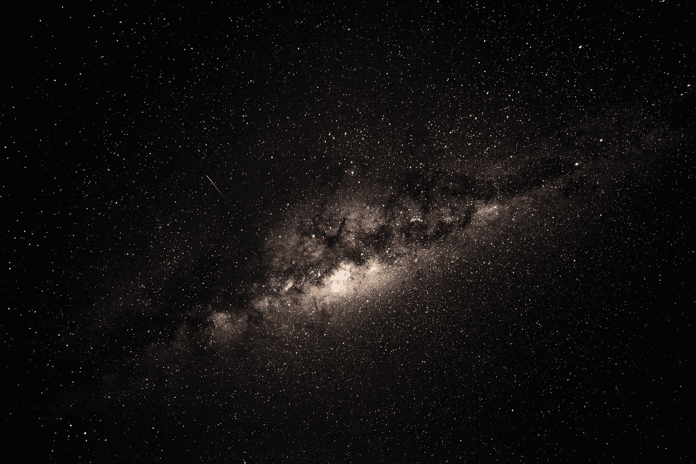
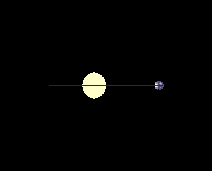
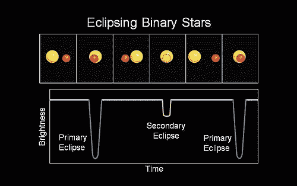
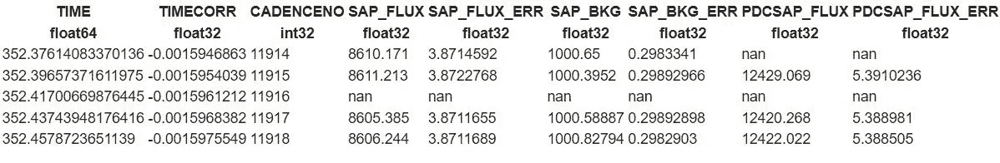
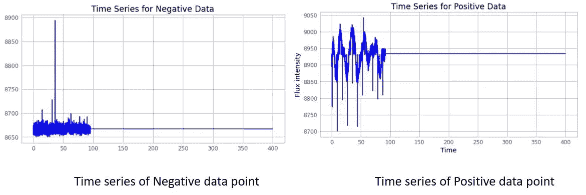
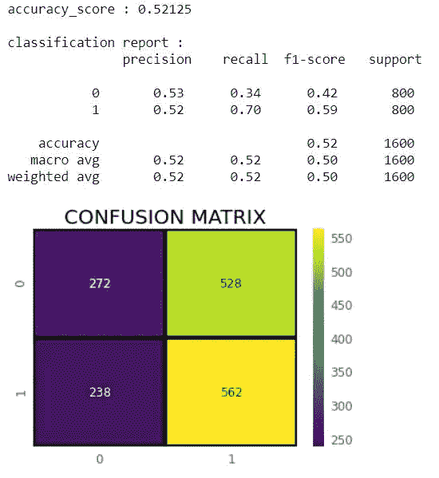
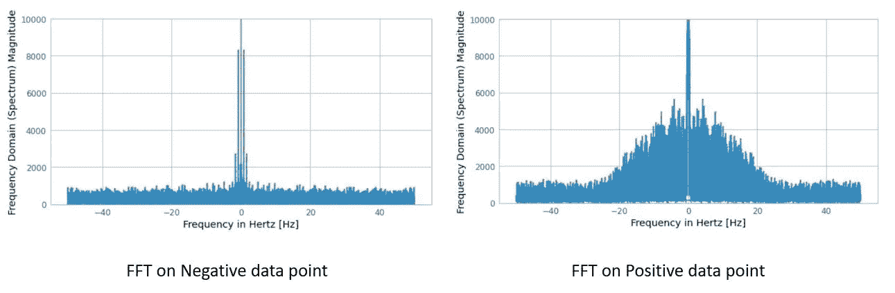
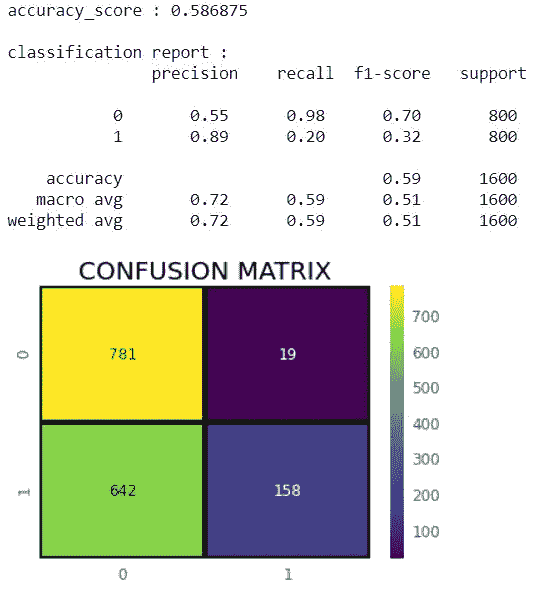
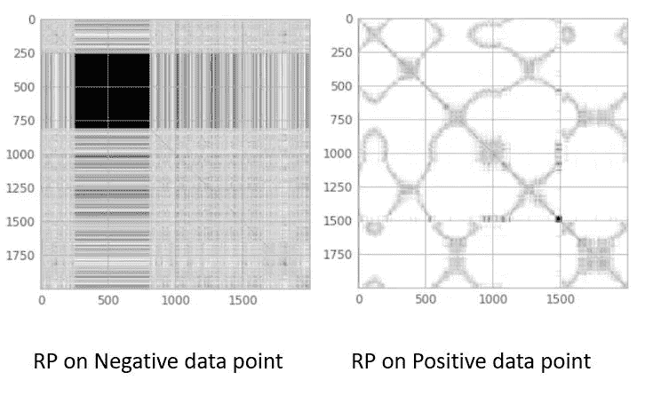
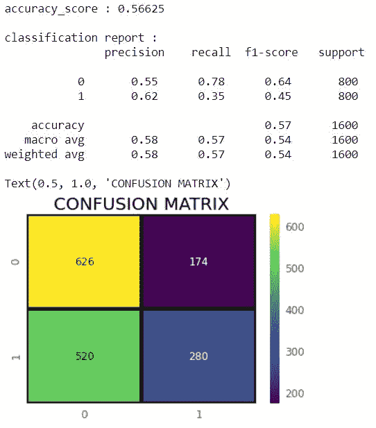

# 从开普勒任务的光变曲线探测系外行星

> 原文：<https://towardsdatascience.com/detecting-exoplanets-from-light-curves-of-kepler-mission-a1f2a3f667fb?source=collection_archive---------24----------------------->

## 分析 FFT 和递归图在多大程度上影响系外行星分类的准确性

图 1:[布雷特·里奇](https://unsplash.com/@brett_ritchie_photography?utm_source=unsplash&utm_medium=referral&utm_content=creditCopyText)在 [Unsplash](https://unsplash.com/s/photos/planets?utm_source=unsplash&utm_medium=referral&utm_content=creditCopyText) 拍摄的照片

**什么是系外行星，它们是如何被探测到的？**

在开始系外行星探测之前，我想重点谈谈为什么寻找系外行星很重要。真的值得搜索吗？太阳系外是否也可能存在生命，这是一个有史以来意义深远的问题。如果一颗富含生命的行星被发现，那么它将永远改变人类。除此之外，这个问题还将回答关于我们存在的最根本的问题。这就是系外行星探测发挥作用的地方。

行星是由气体、尘埃等组成的物体。绕着一颗恒星运行。太阳系以外所有围绕恒星旋转的行星都被称为系外行星。由于恒星发出耀眼的光，仅用望远镜很难探测到系外行星。为了回答这个问题，科学家们设计了一种方法来探测这些不同的行星。他们不是通过望远镜直接观察这些行星，这并不总是可行的，而是寻找这些行星对它们所围绕的恒星的影响。

找到这些行星的一种方法是寻找不稳定的恒星。行星围绕其旋转的恒星往往会摆动。这是由于旋转行星的质量。用这种技术已经发现了许多行星。但问题是，只有像 Jupyter 这样的大质量行星才能对其恒星产生引力影响，从而导致恒星抖动。像地球这样较小的行星对恒星的影响较小，因此不稳定的运动很难被探测到。那如何探测更小的系外行星呢？

图 2:由于系外行星的引力，恒星摇摆不定(图片来源:[https://en.wikipedia.org/wiki/File:Dopspec-inline.gif](https://en.wikipedia.org/wiki/File:Dopspec-inline.gif)

开普勒使用另一种叫做“凌日法”的技术探测到了较小的行星。凌日是指一颗行星从它的恒星和观测者面前经过。由于这次凌日，到达观察者的光的强度有一个小的下降。从而使它不太亮。围绕恒星旋转的行星会显示出周期性的光强下降。这可以在下图中看到，

图 3:凌日导致的光强变化(来源:[https://en . Wikipedia . org/wiki/Transit _(天文学)](https://en.wikipedia.org/wiki/Transit_(astronomy)))

日全食表示由于系外行星的阻挡，从恒星到达观察者的光线强度下降。因此，通过研究连续凌日之间的时间间隔，人们可以对它是行星还是某个天体进行分类。在这项研究中，我使用了类似技术的输出结果来将一个天体分为系外行星和非系外行星。

**从天文数据中提取光变曲线**

时间序列数据是从[开普勒](https://archive.stsci.edu/kepler/data_search/search.php)网站下载的。此数据具有. FITS 扩展名。灵活的图像传输系统也称为 FITS，是一种交换天文数据的标准格式，独立于硬件平台和软件环境。在 python 中，ASTROPY 库用于读取天文数据。阳性和阴性样本都被下载用于训练目的。下载的数据包含具有多个值的多维数组。下表显示了各种值，

图 4:天文数据。适合文件(来源:作者图片)

在所有这些列中，SAP_FLUX 用于训练 ML 模型。阳性和阴性数据的时间对 SAP_FLUX 的可视化如下所示，

图 5:正负数据点的时间序列(来源:图片由作者提供)

很明显，积极的数据有特定的模式。这是由于系外行星围绕恒星的凌日运动。然而，对于负数据，看不到重复的模式。此外，在某些情况下，负数据集中存在随机时间序列。这个时间序列数据是使用 SVM 训练的。可以看出，简单模型的准确率在 52%左右。与准确性一起，分类报告和混淆矩阵被提出用于评估目的。剩下的文章讨论了 FFT 和 RP 作为时间序列数据的预处理技术对分类精度的影响。

图 6:时间序列 ML 模型的分类报告和混淆矩阵(来源:图片由作者提供)

**快速傅立叶变换和递归图模型**

快速傅立叶变换将数据从时域转换到频域。Scipy 具有将时间序列通量数据转换到频域的内置功能。FFT 后的数据可以显示如下:

图 7:应用于时间序列数据的 FFT(来源:作者提供的图片)

在对时间序列数据应用 FFT 之后，转换后的数据用于训练 SVM 模型。应用 FFT 后的结果如下所示，

图 FFT ML 模型的分类报告和混淆矩阵(来源:图片由作者提供)

可以看出，对于相同数量的数据点和相同的模型，精确度从 52%增加到几乎 59%。FFT 后，使用递归图评估结果。

重现图是从代表每个时间点之间距离的时间序列中获得的图像。这项技术可以用来提高系外行星分类的准确性。Python 有一个名为 pyts 的库，其中包含作为内置函数的 RecurrencePlot。时间序列作为函数的输入。它生成一个图像作为输出。输入数据的递归图图像可以被可视化如下:

图 9:应用于时间序列数据的递归图。(来源:图片由作者提供)

从上面的图像可以看出，对于正数据点，也就是系外行星为真的数据点，在图像中形成了特定的模式。相反，在非系外行星的情况下，找不到特定的模式。图像具有随机噪声。

将时间序列数据转换为 RP 后，这些图像用于训练 VGG16 模型。应用 RP 后的分类报告如下所示:

图 10:递归图模型的分类报告和混淆矩阵(来源:作者提供的图片)

如上所述，FFT 比其他技术性能更好。但为什么选择 FFT 进行这项研究。原因是，在开普勒任务中，系外行星是使用凌日方法探测到的，正如本文开头所解释的。系外行星将显示到达观察者的光强度的周期性下降。如果数据代表系外行星，则周期性时间序列数据被转换到频域，这使得模式对于正类更加明显，并且由于随机噪声，对负类几乎没有影响。因此，具有 FFT 预处理的 ML 模型比其他技术执行得更好。

**结论**

1.  以上结果表明，直接使用时间序列数据训练数据时的准确率为 52%。
2.  当 FFT 应用于时间序列数据时，准确率提高到 59%。因此，通过使用相同的输入数据和相同的模型，准确度提高了 7%。这是因为在训练模型之前对数据应用了预处理技术(FFT)。
3.  FFT 的性能也优于 RP 预处理技术。

注意:由于硬件限制，用于训练的数据较少，因此精度在 50%的范围内。如果使用更多的数据，模型会达到更高的精度。尽管如此，FFT 方法比直接使用时间序列数据进行系外行星分类表现更好。

这个问题的完整代码可以在 [Github](https://github.com/Atharva-Vidwans/Exo-Planet_Classification) 上找到。

**参考文献**

1.  Asif Amin，R. M .、Talha Khan，a .、Raisa，Z. T .、Chisty，n .、SamihaKhan，s .、Khaja，M. S .和 Rahman，R. M. (2018)。利用自适应神经模糊系统探测开普勒光变曲线中的系外行星系统，2018 智能系统国际会议(IS)，第 66-72 页。
2.  [https://www . science direct . com/science/article/pii/s 2213133719300319](https://www.sciencedirect.com/science/article/pii/S2213133719300319)
3.  https://spaceplace.nasa.gov/all-about-exoplanets/en/
4.  【https://exoplanets.nasa.gov/search-for-life/why-we-search/ 

**联系人**

想了解更多与量子计算和机器学习相关的故事，请关注我的[媒体](https://atharvavidwans.medium.com/)。还有，看看我的 [Github](https://github.com/Atharva-Vidwans) 和 [Linkedin](https://www.linkedin.com/in/atharva-vidwans-62739b169/) 。