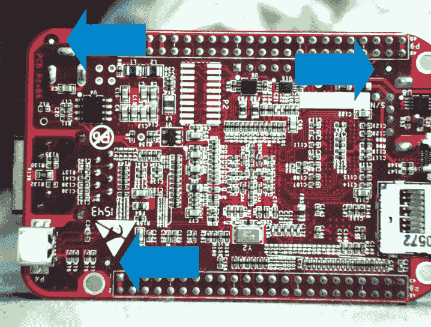
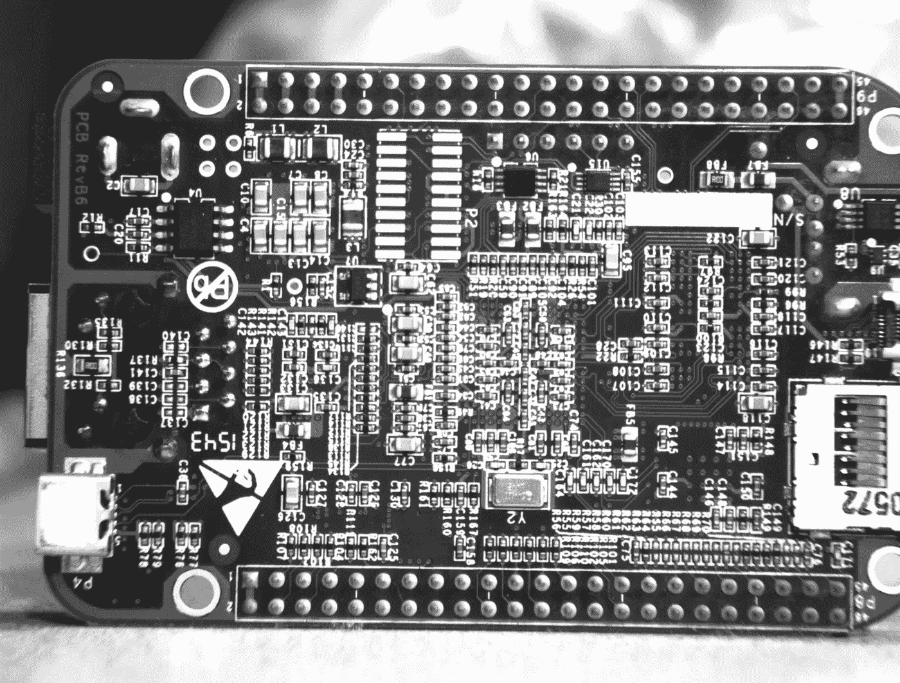
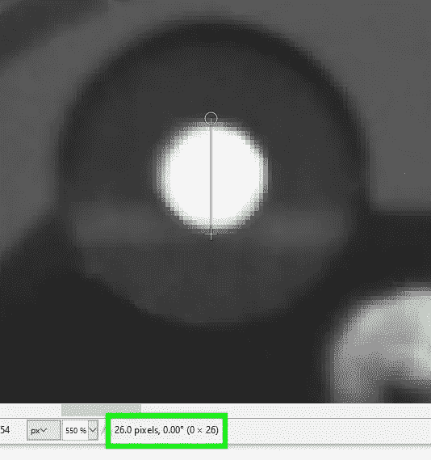
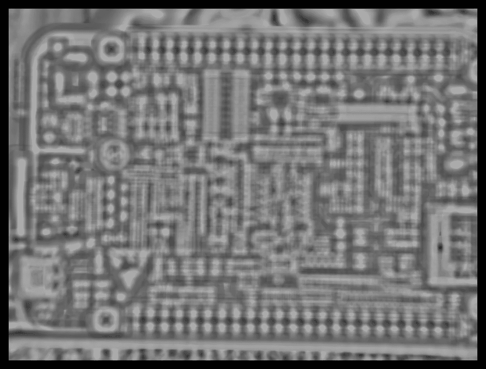
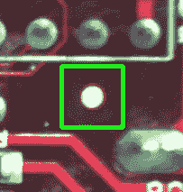
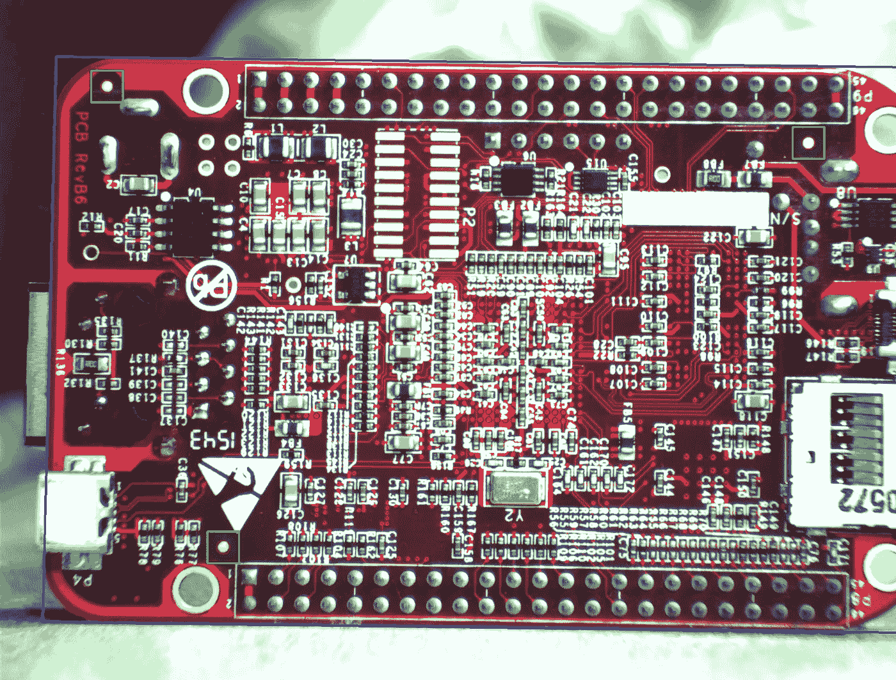

# 利用图案匹配从 PCB 检测基准标记

> 原文：<https://towardsdatascience.com/detecting-fiducial-markers-from-a-pcb-with-pattern-matching-4ed7f3bfb644?source=collection_archive---------15----------------------->

## 位置，位置，位置。

这可能很容易忘记，但无论我们的电子设备内部发生了什么，都不是魔法。想到有些产品如此复杂，以至于没有一个人能够理解每个部分是如何精确地相互作用的，我感到很惊讶，然而制造过程是存在的，从工厂运出的东西就是这样工作的。任何涉及集成电路的东西都属于这一类。

如果你仔细观察印刷电路板(PCB)，你可能会注意到没有与任何其他结构电连接的金色小圆盘。这些是基准标记(或*基准*):它们的目的是让视觉系统尽可能容易地找到它们，在图像中定位 PCB。

PCB 的基准标记。图片由作者提供。

在本文中，我们将通过 OpenCV 的[*match template()*](https://docs.opencv.org/2.4/modules/imgproc/doc/object_detection.html?highlight=matchtemplate#cv2.matchTemplate)*函数来完成定位基准标记的步骤。[你可以在这个库](https://github.com/sebastiengilbert73/pattern_matching_tutorial)里找到代码和图片。*

> *为什么多氯联苯需要基准标记？*

*在 PCB 组装过程中，[自动化系统会将分立元件](https://en.wikipedia.org/wiki/Pick-and-place_machine)(芯片、电容器、连接器等)放置在 PCB 上各自的位置，然后焊接到焊盘上。基准标记的检测允许在 PCB 上精确放置组件。放置后，自动检测系统将检查所有物品是否都在应该在的位置，并且放置在公差范围内。同样，基准标记将提供将 PCB 图中的物理点(以毫米为单位)转换为图像点(以像素为单位)所需的参考点。*

# *预处理*

*我们从将图像转换为灰度开始，因为我们依赖于基准标记的独特形状，而不是它们的特定颜色。这是用 OpenCV 的 [*cvtColor()*](https://docs.opencv.org/2.4/modules/imgproc/doc/miscellaneous_transformations.html?highlight=cvtcolor#cv2.cvtColor) 函数完成的。*

**

*图像已转换为灰度。图片由作者提供。*

*该 PCB 上的基准标记由两个直径分别为 26 和 68 像素的同心圆盘组成。*

**

*手动测量内盘直径。图片由作者提供。*

*OpenCV 的 *matchTemplate()* 函数需要目标对象的模板图像。在这种情况下，它将是一个基准标记的图像。我们可以在我们的图像中裁剪三个基准标记中的一个，并将其用作我们的模板，但是这种方法容易遗漏与任意选择的模板图像具有微小外观差异的真正的基准标记。相反，我们将创建一个理想基准标记的合成图像:*

*创建合成基准标记图像。作者代码。*

**

*合成基准标记。图片由作者提供。*

*基准标记图像被标准化为零均值和单位标准偏差，因为我们希望 *matchTemplate()* 的结果在搜索图像的均匀值区域中接近零，并且阳性匹配的强度值接近 1。*

# *模式匹配*

*我们现在拥有了调用 *matchTemplate()* 所需的所有要素:*

*模式匹配。作者代码。*

*值得注意的是，我们用零填充得到的匹配图像，以使图像具有与原始图像相同的尺寸。这是必要的，因为， *matchTemplate()* 基于卷积，输出图像具有维度(Wₒᵣᵢ-Wₚₐₜₜₑᵣₙ+1，Hₒᵣᵢ-Hₚₐₜₜₑᵣₙ+1).在我们的例子中，具有维度(69，69)的模式图像， *matchTemplate()* 的输出具有比原始图像窄 68 像素和短 68 像素的维度。为了补偿这种影响，我们在图像外围零填充了 34 个像素。我们还重新调整了匹配图像的灰度等级，从[-1，1]到[0，255]以便于可视化。*

**

*零填充和重缩放的匹配图像。图片由作者提供。*

*我们感兴趣的是匹配图像强度的峰值，由上面图像中的亮点表示。决定哪些亮点是我们正在寻找的基准标记是一个设置正确阈值的问题。*

*我们不是手动设置阈值，而是利用这样一个事实，即我们知道在这个匹配图像中应该有三个基准标记，因此应用正确的阈值应该会产生正好有三个斑点的二值图像。为了做到这一点，我们将逐渐降低阈值，从 255 开始，并在结果阈值图像中计数斑点。当我们到达三个点时，我们停下来。*

*通过降低阈值来寻找最佳阈值，直到找到预期数量的对象。作者代码。*

**

*找到的三个基准标记之一的位置。图片由作者提供。*

# *变换矩阵的计算*

*PCB 平面上的参考点(以毫米为单位)与其在图像中的相应位置(以像素为单位)之间的三个对应关系是计算单应性所需的最少[，即允许我们将毫米坐标转换为像素坐标的变换矩阵。利用这个变换矩阵，我们可以用 PCB 边缘来标注图像。](/coordinates-of-a-flat-scene-b37487df63ca)*

**

*图像注释，显示三个找到的基准标记和 PCB 边缘。图片由作者提供。*

*上面带注释的图像证实了三个基准标记被正确找到，并且计算出的变换矩阵是准确的。假设我们在 PCB 上有给定元件的物理坐标，现在可以裁剪图像中需要检测的任何区域。*

*在制造环境中，待检查的物体在传送带上移动是很常见的。我们不能假设被检查的物体将总是精确地位于相对于摄像机的相同位置。即使从一个对象到下一个对象存在平移和旋转，根据基准标记的检测计算的变换矩阵也允许我们检索 PCB 上感兴趣的给定区域。*

*我们刚刚做的是自动化检查流程的第一部分。这可能不是最困难的部分，但肯定是最关键的部分:如果对象定位失败，其他任何事情都没有意义。*

*下次你看 PCB 时——提醒自己这不是一个神奇的人工制品，而是一个工程奇迹——试着找出便于组装和自动检测的基准标记。*

*如果你有一个应用程序需要基准标记的位置，让我知道。我很高兴听到这件事。*

*[1]在计算机视觉中，斑点是一组相连的像素。*