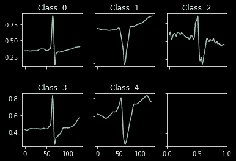
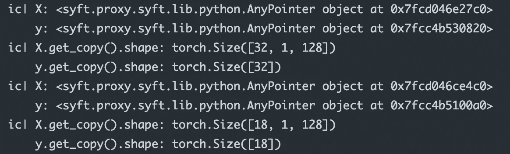
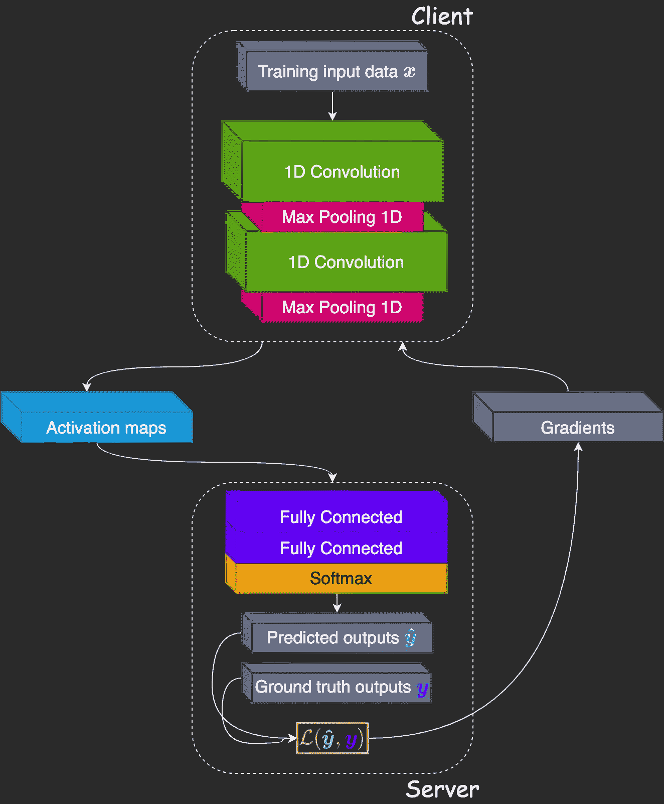
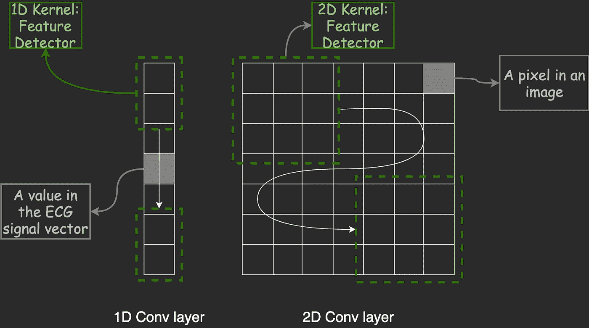
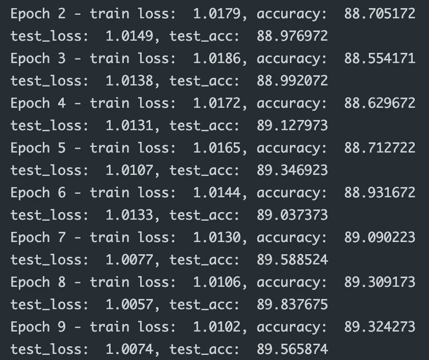
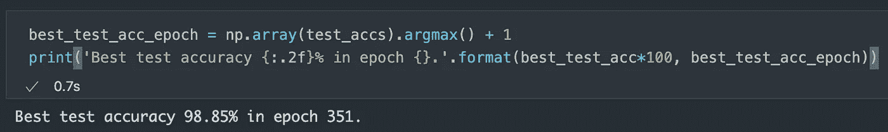
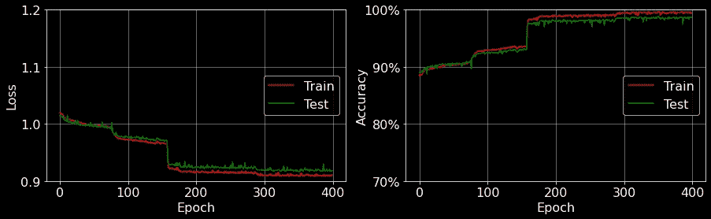

# 使用 1D 有线电视新闻网在你看不到的数据上检测心脏异常

> 原文：<https://towardsdatascience.com/detecting-heart-abnormalities-using-1d-cnn-on-data-you-cannot-see-with-pysyft-735481a952d8?source=collection_archive---------9----------------------->

## 使用分裂神经网络和 PySyft 保护敏感训练数据隐私

# **TL；博士:**

我们能否应用分裂学习架构来训练 1D CNN 心跳数据模型，并在保护数据隐私的同时准确检测心脏异常？

## 嗯，那还是太长了，而且字数便宜，给我看看代码就行了！

[这里](https://github.com/khoaguin/priv-sec-ai-blog/blob/master/ecg-split-1DCNN-PySyft/ecg-split-1DCNN.ipynb)你去吧。尽情享受吧！

# 介绍

[机器学习(ML)](https://en.wikipedia.org/wiki/Machine_learning) 是人工智能的一个子领域，算法被训练从海量数据集中发现模式。然后，这些模式被用于对新数据进行决策和预测。ML 今天面临的一个问题是数据共享:数据科学家需要从数据所有者那里收集大量数据，以便训练他们的算法。这通常并不理想，尤其是对于医疗保健或金融等行业的敏感数据。分裂学习是隐私保护机器学习(PPML)中试图解决这一数据隐私问题的方法之一。

分裂学习是指将深度神经网络(DNN)切割成两个或更多部分的过程。在最简单的场景中，即只有一个数据所有者(客户端)和一个数据科学家(服务器)，DNN 被分成两部分。DNN 的第一部分在数据驻留的客户机上使用，第二部分在服务器端使用。客户端的模型将从数据集中学习一组特征(也称为“激活图”)，然后将这些激活图发送到服务器以继续训练过程。然后，在向后传递期间，服务器计算损失函数和直到分离层的损失梯度，然后将这些梯度发送回客户端，以便他可以继续向后传递。这样，服务器/数据科学家永远不会看到输入的训练数据，但仍然可以训练网络。你可以从这个[教程](https://blog.openmined.org/split-neural-networks-on-pysyft/)中学到更多关于拆分学习的基础知识。

在这篇博文中，我们将通过使用 OpenMined 的框架 [PySyft 来训练分裂神经网络的过程:这是一个 Python 库，用于计算你不拥有也看不到的数据](https://github.com/OpenMined/PySyft)。在 OpenMined 的免费课程“[私人计算基础](https://courses.openmined.org/courses/foundations-of-private-computation)”中，已经有一个教程，介绍如何使用 PySyft 的 Duet 和两个 Jupyter 笔记本来训练分裂的 DNN:一个代表客户端，另一个代表服务器。然而，如果你正在开发一种新的分割学习方法，使用两个笔记本是相当麻烦的，因为你必须来回切换。幸运的是，PySyft 的另一个特性叫做 VirtualMachine，它允许我们只在一个 jupyter 笔记本或 python 文件中开发一个分割 DNN。今天我们将学习如何使用它，以及 PySyft 的其他特性，如 RemoteDataset 和 RemoteDataLoader，来加载自定义远程数据集。最重要的是，我们将基于[1]的工作，发现如何训练一个分裂 1D CNN 神经网络来检测从不离开客户端机器的输入数据上的心脏异常。

# 让我们开始吧

首先，我们需要导入必要的包并定义必要文件的路径。我用了`torch 1.8.1+cu102`和`syft 0.5.0.`

用于导入包的代码(图片由作者提供)

为数据导入设置训练和测试文件名(图片由作者提供)

## 定义客户端和服务器

使用 PySyft 的 VirtualMachine，我们可以在这个场景中定义抽象参与者，如下面的代码所示。

定义服务器和客户端虚拟机(图片由作者提供)

## 客户端:加载和浏览数据集

首先，让我们假设是客户端(数据所有者)并发现数据集。我们将使用[麻省理工学院-BIH 心律失常](https://physionet.org/content/mitdb/1.0.0/)，这是一个用于 ECG 信号分类或心律失常诊断的流行数据集[2]。您可以在这里找到原始数据集[，但是，我们在这里](https://physionet.org/content/mitdb/1.0.0/)使用来自[的处理数据。下面是从`train_ecg.hdf5`和`test_ecg.hdf5`加载数据集所需的代码。](https://github.com/SharifAbuadbba/split-learning-1D/blob/master/preprocess/ecg_preprocess.ipynb)

用于加载 ECG 数据集的类(图片由作者提供)

后处理数据集由总共 26 490 个心跳样本组成，每个样本是长度为 128 的时间序列向量。有 5 种不同类型的心跳作为分类目标:正常搏动(0 类)、左束支传导阻滞(1 类)、右束支传导阻滞(2 类)、房性早搏(3 类)、室性早搏(4 类)。我们可以在下面的图 1 中看到每个类的例子。

图 1:心电图数据集中的一些例子(图片由作者提供)

然后，客户端加载数据集，保存到`.pt`文件中，并使用下面的代码将它们发送到服务器。

客户端创建数据集并保存到`.pt`文件中(图片由作者提供)

如果使用`duet`，他可以用这个语法向服务器发送字符串路径(注意，这次我们没有使用`duet`)

如果使用 duet(按作者排序的图像),用于向数据集发送字符串路径的代码

## 服务器:创建远程数据集和远程数据加载器

现在，在从客户端收到数据集的`.pt`路径后，服务器在远程端创建 RemoteDataset 和 RemoteDataLoader。

服务器创建远程数据集和远程数据加载器(图片由作者提供)

让我们遍历远程数据加载器，看看里面有什么。注意，我在调试时使用了来自[冰淇淋](https://github.com/gruns/icecream)包的`ic`来打印变量；这很方便。

查看远程数据加载器中的训练数据(图片由作者提供)

使用上面的代码，我们将得到`X`和`y`作为指向相应火炬张量的指针，但不是真正的张量本身，如下图所示。

图 2:循环访问远程数据加载器时的输出(图片由作者提供)

服务器可以通过使用`X.get()`或`X.get_copy()`请求访问张量，但是这需要被客户端接受。这里，为了方便起见，我们假设客户机接受来自服务器的所有请求。然而，我们将在后面的训练循环中看到，客户机永远不会请求访问训练输入数据。此外，由于我们只加载了 50 个示例，并且批次大小为 32，因此只有两个批次，一个有 32 个样本，另一个有 18 个样本。

类似地，服务器为测试数据集创建远程数据集和数据加载器。

服务器为测试数据创建远程数据集和远程数据加载器(图片由作者提供)

## 服务器:定义分割神经网络架构以在 ECG 数据集上进行训练

下图 3 显示了用于在心电图数据集上进行训练的 1D CNN 神经网络的架构。客户端的模型包含两个 1D 卷积层(我们将在后面了解更多)，带有[泄漏 Relu](https://en.wikipedia.org/wiki/Rectifier_(neural_networks)#Leaky_ReLU) 激活函数。每个 conv 层之后是一个 [1D 最大池](https://peltarion.com/knowledge-center/documentation/modeling-view/build-an-ai-model/blocks/global-max-pooling-1d)操作。服务器的模型包含两个完全连接的层，后面是 softmax 激活功能。使用的损失函数是[交叉熵损失](https://ml-cheatsheet.readthedocs.io/en/latest/loss_functions.html#cross-entropy)。

图 3:分裂学习 1DCNN 模型架构(图片由作者提供)

图 4: 1D 卷积层 vs 2D 卷积层(图片由作者提供)

让我们了解一下 1D 卷积层。它只是一种沿一维滑动权重核的方法。图 4 显示了 1D 卷积与 2D 卷积运算的关系。1D 卷积适用于 1D 数据，例如 ECG 信号中的时间序列。如果你想了解更多关于 1D、2D 和 3D 卷积的知识，[这篇博文](/understanding-1d-and-3d-convolution-neural-network-keras-9d8f76e29610)提供了非常清晰的解释。

现在我们可以继续，用下面的代码在客户端定义神经网络模型。这是一个继承自`syft.Module`的类。注意，在第 3 行，我们将`torch_ref`作为构造函数的参数，稍后我们将把`remote_torch`传递给它。所有的层都是使用这个`torch_ref`模块构建的。

在客户端定义分裂神经网络部分的代码(图片由作者提供)

服务器模型也继承自`syft.Module`；它的构造函数仍然得到`torch_ref`作为参数，但是，这些层是用普通的`torch.nn`模块定义的，因为它们是在本地训练的。

在服务器端定义分裂神经网络部分的代码(图片由作者提供)

然后，服务器将客户端的模型发送到远程客户端(下面代码中的第 2 行)。

创建模型并发送客户的模型(图片由作者提供)

## 服务器和客户端:训练和测试循环

在训练和测试循环之前，我们需要定义一些超参数:

设置超参数和随机种子(图片来自作者)

最后，让乐趣开始。下面是训练和测试循环的代码:

我们的分裂 1D CNN 模型的训练和测试循环

在正向传递中，我们首先获得指向批处理数据的指针(第 12 行)。在将所有梯度初始化为 0 之后(第 15、16 行)，客户端的模型从训练输入数据中提取激活图(第 18 行)。然后，服务器请求访问这些激活图(第 20 行)，并继续向前传递(第 22 行)。服务器还要求访问地面实况输出数据(第 24 行)以计算损失(第 26 行)。

在反向传递中，服务器开始反向传播，直到分离层(第 30 行)，然后将梯度发送到客户端(第 32 行)。在接收时，客户继续反向传播并计算他的梯度(第 34 行)。最后，当计算了损失函数相对于权重的所有梯度时，客户端和服务器都可以更新参数。

在每个时期的测试循环中，我们只需要进行正向传递并计算测试损耗。

图 5:训练和测试循环的结果(图片由作者提供)

最后，在 400 个周期结束后，我们可以打印出最佳测试精度，并绘制训练/测试损耗和精度，如图 6 和 7 所示。正如我们所看到的，分裂学习 1D CNN 方法可以在 351 个时期后在测试数据集上达到 98.85%的准确率。一点也不差。

图 6:打印出最佳测试精度(图片由作者提供)

图 7:培训/测试损失和准确性(图片由作者提供)

# 缺点和未来方向

虽然分裂学习方法取得了有希望的结果，但是还有几个问题需要解决。首先，服务器仍然需要访问地面实况输出数据来计算损失。为了解决这个问题，我们可以使用 U 型分裂学习配置[3]。其次，从客户端发送到服务器的激活映射仍然会泄露关于输入训练数据的信息。文献[1]的作者已经试验了差分隐私来解决这个问题，然而，它极大地阻碍了算法的准确性。第三，使用 PySyft 训练分裂网络所需的时间非常长，在英特尔至强 CPU 2.60GHz 和 6 核上几乎需要 14 个小时。用 GPU 在本地训练同一个网络只需要几分钟。目前，PySyft 还不支持在 GPU 上训练。解决这些问题将是今后工作的重点。

# 结论

在这篇博文中，我们介绍了在心电图数据集上训练分裂 1D CNN 模型的过程。采用分裂学习架构，该算法可以预测高达 98.85%的心脏异常，同时保持患者心跳数据的私密性。感谢你的阅读，希望你找到有用的东西。在其他关于安全和私人人工智能的博客文章中再见。

# 参考

[1] [Sharif Abuadbba](https://arxiv.org/search/cs?searchtype=author&query=Abuadbba%2C+S) 等，[我们能在 1D CNN 模型上使用分裂学习进行隐私保护训练吗？](https://arxiv.org/abs/2003.12365) (2020)，ACM 亚洲计算机与通信安全会议(ACM ASIACCS 2020)

[2]穆迪 GB，马克 RG。麻省理工学院-BIH 心律失常数据库的影响(2001)，电气和电子工程师学会医学和生物工程 20(3):45–50(2001 年 5 月-6 月)

[3] [Praneeth Vepakomma](https://arxiv.org/search/cs?searchtype=author&query=Vepakomma%2C+P) 等，[分裂学习促进健康:不共享原始患者数据的分布式深度学习](https://arxiv.org/abs/1812.00564) (2018)