# 检测函数图中的拐点/肘点

> 原文：<https://towardsdatascience.com/detecting-knee-elbow-points-in-a-graph-d13fc517a63c?source=collection_archive---------3----------------------->

## 利用 Python 包“kneed”中实现的“Kneedle”算法


Lucaxx Freire 在[Unsplash](https://unsplash.com/s/photos/knee?utm_source=unsplash&utm_medium=referral&utm_content=creditCopyText)【1】上拍摄的照片

# 理论

在处理数据时，了解数据点的“增加某些可调参数的相对成本不再值得相应的性能优势”有时很重要(Satop、Albrecht、Irwin 和 Raghavan，2011 年，[2]，第 1 页)。算法“Kneedle”根据连续函数曲率的数学定义，在离散数据集中检测那些显示最佳平衡固有折衷的有益数据点，称为“膝”(具有负凹度的曲线)，有时称为“肘”(具有正凹度的曲线)。在这篇文章中，我想总结“Kneedle”所经历的步骤，展示这种算法的好处，并展示 Python 包“kneed”的应用。

Satop、Albrecht、Irwin 和 Raghavan (2011 年[2])发表了“Kneedle”算法，使用曲率的概念作为函数与直线差异的数学度量。Satop 等人(2011 年，[2]，第 2 页)得出结论，“因此，最大曲率捕捉了操作员用于识别膝盖的平稳效应”。

  

对于**连续函数**，曲率描述如下:

<https://en.wikipedia.org/wiki/Curvature#Graph_of_a_function>  

例如，让我们创建 N = 10，000 个随机标准正态分布数据点，并将它们显示在直方图中:

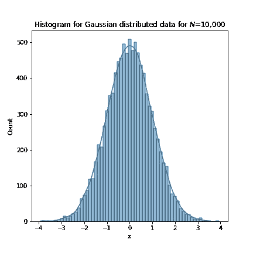

随机标准正态分布数据绘制成直方图，采用核密度估计(图片由作者提供)

现在，我们可以按升序对值进行排序，以获得一个累积分布函数(CDF ),它在 x 轴上显示每个 x 值，在 y 轴上显示其出现的概率:

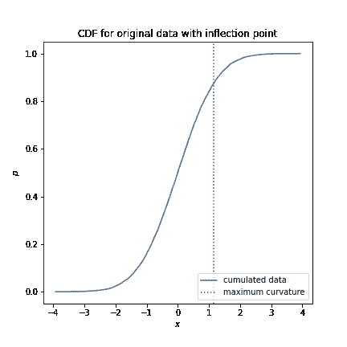

排序后的数据显示为 CDF，最大曲率表示为 x = 1.16(图片由作者提供，灵感来自 Satop 等人 2011 年的图 1 [2])

satop et al .(2011，[2]，第 2 页)指出“曲率对于连续函数是定义良好的”，但对于**离散数据**没有明确的曲率定义。在这种情况下，曲率可以拟合为连续函数，但当数据有噪声时，这种拟合会变得更加困难。这就是“Kneedle”算法发挥作用的地方。

让我们更深入地看看这个算法是如何工作的。为此，我使用了 Satop et al(2011，[2])发表的会议论文中图 2 的原始离散数据。它是由 Python 包“kneed”提供的:

```
import kneed
kneed.DataGenerator.figure2()
```

这是绘制的原始数据:

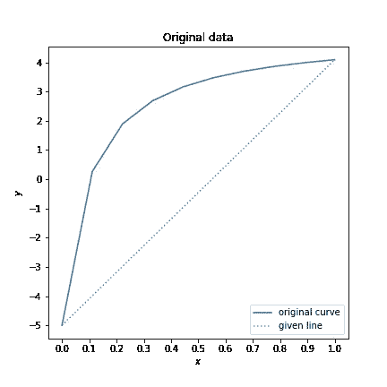

原始数据(图片由作者提供)

让我们完成“Kneedle”算法的步骤:

**1。平滑**

使用样条来“平滑”原始数据的形状。

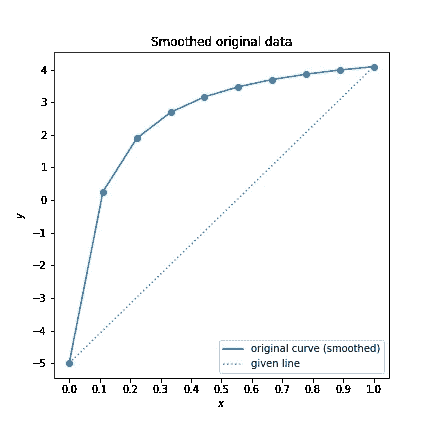

平滑数据(作者提供的图片)

**2。归一化到单位正方形**

x 和 y 值的范围将被标准化为 0 到 1(见轴)。

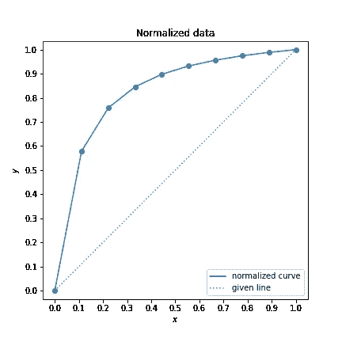

标准化数据(图片由作者提供)

**3** 。**计算差异曲线变化**

计算垂直距离(从数据点到从第一个到最后一个数据点的对角线的欧几里德距离)…

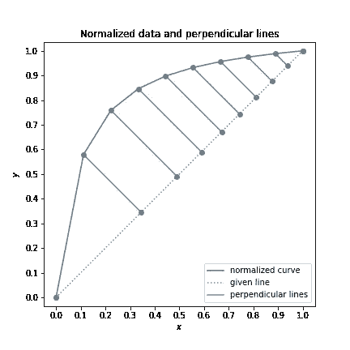

指示垂直距离的垂直线(作者图片，受 Satop 等人 2011 年[2]图 2a 的启发)

…并将它们逆时针旋转 45 度。这些旋转垂直线的大小表示差值。

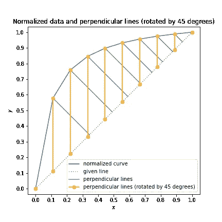

旋转 45 度的垂直线代表差值(图片由作者提供，灵感来自 Satop 等人 2011 年的图 2b[2])

**4** 。**计算差异曲线的局部最大值**

在归一化曲线中的差异曲线的局部最大值处寻找“膝”点(对于检测肘点，图形将被反转)。

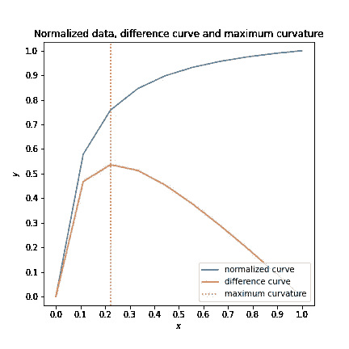

x = 0.22 时的最大曲率(图片由作者提供，灵感来自 Satop 等人 2011 年的图 2c[2])

**5。计算差异曲线中每个局部最大值的阈值**

对于差异曲线中的每个局部最大值，都有一个唯一的阈值，该阈值基于 x 值和灵敏度参数之间的平均差异(请参见 Satop 等人，2011 [2]，第 4 页，进一步了解如何详细计算该阈值)。该灵敏度参数测量在声明“拐点”之前在原始未修改数据中预期会看到多少“平坦”点，并且可以调整:较小的灵敏度值检测拐点更快，而较大的灵敏度值更保守。

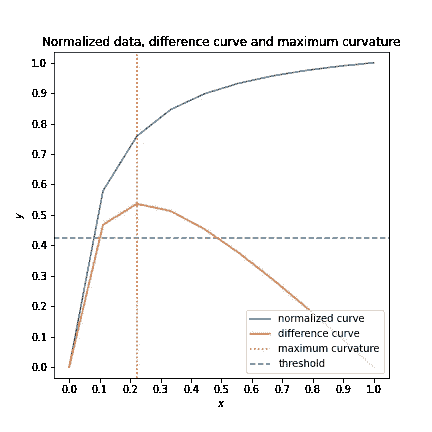

y = 0.43 时指示的阈值，敏感度为 1(图片由作者提供，灵感来自 Satop 等人 2011 年的图 2c[2])

**6。将每个差值与阈值进行比较**

如果差值在达到局部最大值之前下降到阈值以下，则该算法宣布出现“拐点”。相反，阈值被重置为零。

## 有节的

现在让我们更深入地了解一下 Kevin Arvai 编写的 Python 包“kneed ”,它使用了“Kneedle”算法:

<https://pypi.org/project/kneed/>  

这样，我们可以直接绘制包括“拐点”在内的归一化差异曲线:

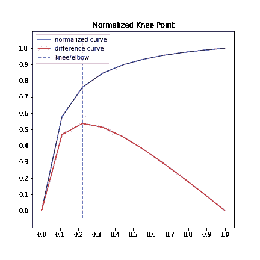

Satop 等人 2011 年[2]的图 2 标有“kneed”(图片由作者提供)

  

我们可以使用函数 *KneedLocator()* 在我们的数据中查找膝盖/肘部:

```
# calculate and show knee/elbow
kneedle = kneed.KneeLocator(…)
knee_point = kneedle.knee #elbow_point = kneedle.elbow
print('Knee: ', knee_point) #print('Elbow: ', elbow_point)
kneedle.plot_knee()
```

这些是 *KneedLocator()* 最重要的参数:

*   **曲线**:膝盖的*凹*，肘部的*【凸】*——基于函数的负/正凹度
*   **方向**:*递增*为正斜率，“递减”为函数的负斜率
*   **在线**:检测到膝盖/肘部作为第一个元素(*假*)，或者如果收到点，必要时纠正“旧”膝盖/肘部值(*真*)
*   **S** :膝/肘检测灵敏度(S=0 或更大)；Satop 等人[2]指出，当灵敏度为 0 时,**离线设置中的“kneedle”具有完美的信息，而在**在线设置中，总的来说，灵敏度为 1** 显示出最佳的整体性能，但它可能与接收到的数据点不同。**

# 应用程序

## 使聚集

使用“kneedle”算法检测肘部对于聚类算法来说非常方便:

***a)K-表示***

使用*肘方法*，您可以计算*组内平方和*作为组内方差的度量，并检测要形成的组数的最佳值( *k* ):

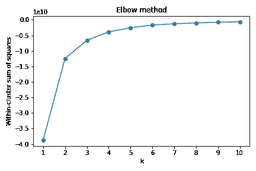

肘法(图片由作者提供)

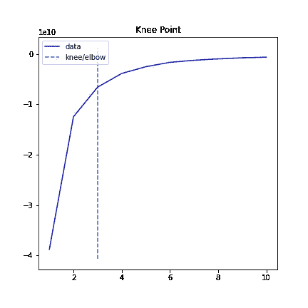

肘部检测肘部方法与“kneed”(图片由作者提供)

***b) DBSCAN***

当计算每个数据点的距离度量(通常是欧几里德距离)并按升序对它们进行排序时，它们可以绘制在*k-距离图*中，以找到用于定义聚类的阈值:

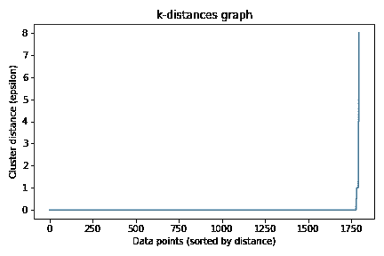

k 距离图(图片由作者提供)

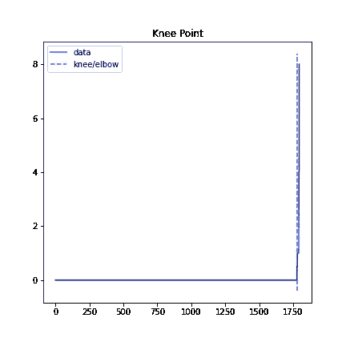

带有“kneed”的 k 距离图中的膝盖检测(图片由作者提供)

## 分类

即使对于分类，当查看*真阳性率*以及*假阳性率*时，“Kneedle”也变得非常有用。两者的权衡都表现在*接收器工作特性* *曲线*中。 *ROC 曲线*中的“拐点”可以很好地衡量阈值，因为 *TPR* 的增加速度减慢，而 *FPR* 在这一点开始加速增加；

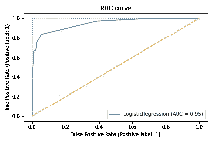

*接收机工作*特性*曲线*(图片由作者提供)

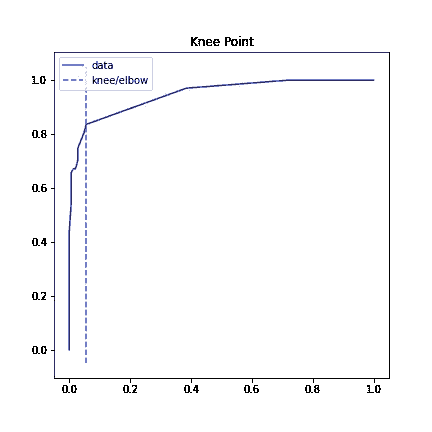

带“kneed”的*接收器操作*特性*曲线*的膝部检测(图片由作者提供)

# 结束语

“kneed”还在 Streamlit 上提供了一个名为“ikneed”的交互式 API，在这里可以分别测试“膝盖”和“肘部”的(小)数据集。在这里，您还可以随意调整参数(请参见链接以直接查看它们的影响):

[https://share.streamlit.io/arvkevi/ikneed/main/ikneed.py](https://share.streamlit.io/arvkevi/ikneed/main/ikneed.py)

<https://github.com/arvkevi/ikneed>  

在我看来，“kneed”是目前用于膝盖检测的最强大的 Python 包，因为它提供了许多有用的功能。尽管如此，还有其他类似的 Python 包用于查找曲线的拐点，例如“kneebow”:

<https://pypi.org/project/kneebow/>  

# **参考文献**

[1]照片由 [Lucaxx Freire](https://unsplash.com/@lucaxxfreire?utm_source=unsplash&utm_medium=referral&utm_content=creditCopyText) 在 [Unsplash](https://unsplash.com/s/photos/knee?utm_source=unsplash&utm_medium=referral&utm_content=creditCopyText) 上拍摄

[2] V. Satop，J. Albrecht，D. Irwin 和 B. Raghavan，[“大海捞针:检测系统行为中的拐点”](https://ieeexplore.ieee.org/document/5961514) *(2011)，第 31 届分布式计算系统国际会议研讨会*，2011，第 166–171 页，doi: 10.1109/ICDCSW.2011.20。