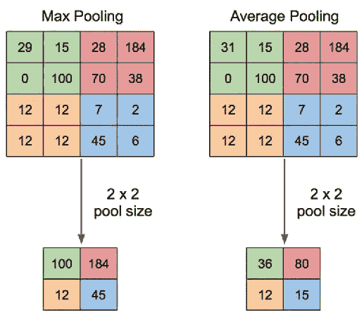

# 初学者用深度学习检测疟疾

> 原文：<https://towardsdatascience.com/detecting-malaria-with-deep-learning-for-beginners-d49139d34d6?source=collection_archive---------24----------------------->

## 图像分类和卷积神经网络(CNN)初学者指南


图片由[卡西·乔希](https://unsplash.com/@cassi_josh)拍摄

在这个项目中，我们将仔细检查由美国国家卫生研究院提供的数据集，该数据集包含来自 150 名患者的 27，558 个不同的细胞图像，这些患者被称为恶性疟原虫的寄生虫感染，并与来自 50 名健康患者的细胞图像混合，这些图像可通过链接[此处](https://www.kaggle.com/iarunava/cell-images-for-detecting-malaria)下载。我们的任务是建立一个机器学习/深度学习算法，能够对检测到的细胞是否被寄生虫感染进行分类。

在这个项目中，我们将应用深度学习算法，特别是卷积神经网络(CNN)算法，该算法能够通过简单地将算法训练到给定的图像作为训练来分类来自某个细胞的图像是否被感染。由于这是一个数据超过 330 MB 的重载项目，我会建议在 Jupyter 笔记本中应用这一点。

首先，我们需要导入必要的启动库:

```
import pandas as pd
import numpy as np
import os
import cv2
import random
```

如果这是您第一次进行影像分类项目，您可能一直在使用 panda.read_csv()导入 csv 格式的数据集，但是，由于我们所有的数据都是 png 格式，我们可能需要使用 os 和 cv2 库以不同的方式导入它们。

OS 是一个强大的 Python 库，允许你与操作系统交互，无论它们是 Windows、Mac OS 还是 Linux，例如，重命名或删除文件，从给定路径列出某个文件夹中的所有对象，等等。从笔记本到个人电脑。另一方面，cv2 是一个 OpenCV 库，专门用于解决各种计算机视觉问题，如读取图像和将图像加载到笔记本中。

首先，我们需要设置一个变量来设置我们的路径，因为我们稍后会继续使用它:

```
root = '../Malaria/cell_images/'
in = '/Parasitized/'
un = '/Uninfected/'
```

从上面的路径看，名为“疟疾”的文件夹是我的细胞图像文件文件夹的存储位置，也是寄生和未感染细胞图像的存储位置。这样，我们将能够更容易地操纵这些路径。

现在让我们用 os.listdir("path ")函数列出被感染和未被感染文件夹中的所有图像，如下所示:

```
Parasitized = os.listdir(root+in)
Uninfected = os.listdir(root+un)
```

# 使用 OpenCV 和 Matplotlib 显示图像

与 csv 文件不同，在 CSV 文件中，我们只能使用名为 head 的 pandas 函数来列出多个数据，例如，df.head(10)来显示 10 行数据，对于图像，我们需要使用 for 循环和 matplotlib 库来显示数据。因此，首先让我们导入 matplotlib 并绘制每个寄生和未感染细胞的图像，如下所示:

```
import matplotlib.pyplot as plt
```

然后绘制图像:

```
plt.figure(figsize = (12,24))
for i in range(4):
    plt.subplot(1, 4, i+1)
    img = cv2.imread(root+in+ Parasitized[i])
    plt.imshow(img)
    plt.title('PARASITIZED : 1')
    plt.tight_layout()
plt.show()plt.figure(figsize = (12,24))
for i in range(4):
    plt.subplot(2, 4, i+1)
    img = cv2.imread(root+un+ Uninfected[i+1])
    plt.imshow(img)
    plt.title('UNINFECTED : 0')
    plt.tight_layout()
plt.show()
```

因此，为了绘制图像，我们需要 matplotlib 中的 figure 函数，然后我们需要从 figsize 函数中确定每个图形的大小，如上所示，其中第一个数字是宽度，后者是高度。然后在 for 循环中，我们将使用 I 作为变量来迭代 range()中指示的次数。在这种情况下，我们将只显示 4 幅图像，这就是为什么我们在其中放了 4 幅图像。随后，我们将使用来自库中的 subplot 函数来指示多少行、多少列以及某些迭代的绘图数，这就是为什么我们使用 i+1 然后继续对右侧的列进行每次迭代的原因。

由于我们已经创建了子情节，但是子情节仍然是空的，因此，我们需要通过使用 cv2.imread()函数并在其中包含路径和 I 变量来使用 OpenCV 库导入图像，这样它将一直循环到下一张图片，直到提供最大范围。最后，我们将使用 plt.imshow()函数将 cv2 库导入的图像插入到空的子绘图中，我们将得到以下输出:


# 将图像和标签分配到变量中

接下来，我们希望将所有图像(无论是寄生细胞图像还是未感染细胞图像)以及它们的标签插入到一个变量中，其中 1 表示寄生细胞，0 表示未感染细胞。因此，首先，我们需要为图像和标签创建一个空变量。但在此之前，我们需要导入 Keras 的 img_to_array()函数。

```
from tensorflow.keras.preprocessing.image import img_to_array
```

假设存储图像的变量称为数据，存储标签的变量称为标签，那么我们可以执行以下代码:

```
data = []
labels = []for img in Parasitized:
    try:
        img_read = plt.imread(root+in+ img)
        img_resize = cv2.resize(img_read, (100, 100))
        img_array = img_to_array(img_resize)
        data.append(img_array)
        labels.append(1)
    except:
        None

for img in Uninfected:
    try:
        img_read = plt.imread(root+un+ img)
        img_resize = cv2.resize(img_read, (100, 100))
        img_array = img_to_array(img_resize)
        data.append(img_array)
        labels.append(0)
    except:
        None
```

在将变量数据和标签分配给空数组之后，我们需要使用 for 循环插入每个图像。这里有些不同，for 循环也包含 try 和 except。因此，基本上，try 用于在 for 循环中照常运行代码，另一方面，except 用于代码遇到错误或崩溃时，这样代码就可以在这种情况下继续循环。

与上面的图像显示代码类似，我们可以再次使用 plt.imread("path ")函数读取图像，但这一次，我们不需要显示任何子情节。你可能想知道为什么我们这次使用 plt.imread()而不是 cv2.imread()。嗯，两者功能相同，其实还有很多其他的读图库，比如枕头库的 image.open()或者 Scikit-Image 库的 io.imread()。然而，OpenCV 按照 BGR 或者蓝、绿、红的顺序读取图像，这就是为什么上面显示的图像是蓝色的，而实际的图片是粉红色的。因此，我们需要使用以下代码将其转换回 RGB 顺序:

```
cv2.cvtColor(img, cv2.COLOR_BGR2RGB)
```

另一方面，Matplotlib、Scikit-Image 和 Pillow image 读取功能会自动以 RGB 顺序读取图像，因此，我们不再需要来回转换图像，如下图所示的细胞图像实际颜色:

```
plt.imshow(data[0])
plt.show()
```


然后，我们可以使用 OpenCV 的 cv2.resize()函数来调整图像的大小，将加载的图像设置为特定的高度和宽度，如上所示，宽度为 100，高度为 100。接下来，因为我们的图像是抽象格式的，我们以后不能训练、测试或插入它们到变量中，因此，我们需要使用 keras 的 img_to_array()函数将它们转换成数组格式。这样，我们将能够通过使用。append()函数，用于在不改变原始状态的情况下，将对象插入到数组的最末尾。

所以在我们的循环中，我们在每个循环中不断追加一个新的图像，直到整个图像填满了变量的空括号。

# 预处理数据

与我们可以立即拆分数据的机器学习项目不同，在深度学习中，特别是对于神经网络，以便减少方差，防止偏差，并减少过度拟合。在 Python 中，有很多种混洗数据的方法，比如使用 Sklearn，如下所示:

```
from sklearn.utils import shuffle
```

或者使用随机，如下所示:

```
from random import shuffle
```

但是在这个项目中，我们将使用 Numpy 的随机函数。因此，我们需要将我们的数组转换为 Numpy 的数组函数，然后对图像数据进行混洗，如下所示:

```
image_data = np.array(data)
labels = np.array(labels)idx = np.arange(image_data.shape[0])
np.random.shuffle(idx)
image_data = image_data[idx]
labels = labels[idx]
```

首先，我们将数据和标签变量转换成 Numpy 格式。然后，我们可以在使用 np.random.shuffle()函数对数据进行洗牌之前，先使用 np.arange()对数据进行适当的排序。最后，我们将混洗后的数据赋回其原始变量，以确保混洗后的数据得到保存。

# 为培训、测试和验证拆分数据

在数据被打乱之后，是时候通过导入必要的库将它们分成训练、测试和验证标签和数据了，如下所示:

```
from tensorflow.keras.utils import to_categorical
from sklearn.model_selection import train_test_split
```

然后，我们设置一个函数，将数据转换为 32 位数据，以节省 PC 内存:

```
def prep_dataset(X,y):

    X_prep = X.astype('float32')/255
    y_prep = to_categorical(np.array(y))
    return (X_prep, y_prep)
```

然后，通过使用 Sklearn 库，我们可以将数据分为训练、测试和验证:

```
X_tr, X_ts, Y_tr, Y_ts = train_test_split(image_data,labels, test_size=0.15, shuffle=True,stratify=labels,random_state=42)
X_ts, X_val, Y_ts, Y_val = train_test_split(X_ts,Y_ts, test_size=0.5, stratify=Y_ts,random_state=42)X_tr, Y_tr = prep_dataset(X_tr,Y_tr)
X_val, Y_val = prep_dataset(X_val,Y_val)
X_ts, _ = prep_dataset(X_ts,Y_ts)
```

由于存在验证数据，因此，我们需要执行两次拆分。在分裂函数中，我们需要分配数据和标签中的前两个参数，然后，我们告诉它们被分成的百分比数，而随机状态是为了确保它们产生的数据总是处于一致的顺序。

# **建立卷积神经网络模型**

在建立 CNN 模型之前，让我们从理论上对它有一点深入的了解。CNN 主要应用于图像分类，由于其高性能和高精度，自 1998 年发明以来一直流行至今。那么它是如何工作的呢？


图解卷积神经网络。来源:[维基共享资源](https://commons.wikimedia.org/wiki/File:Typical_cnn.png)

正如我们从上面的插图中看到的，CNN 通过提取图像的一部分并通过几个层进行处理来分类图像，从而对图像进行分类。从这几层中，它们可以分为三种类型的层，即卷积层、池层和全连接层。

# 卷积层

第一层，卷积层，是 CNN 中最重要的部分之一，它的名字由此而来。其目的是利用核从输入图像中提取特征。该内核将通过使用点积来持续扫描输入图像，以创建一个新的分析图层，称为专题地图/激活地图。该机制如下所示:


卷积层机制。来源: [ErUM 数据协作会议](https://indico.physik.uni-muenchen.de/event/60/contributions/381/attachments/190/279/DL-b-erum.pdf)

**2 * 1+4 * 2+9 * 3+2 *(-4)+1 * 7+4 * 4+1 * 2+1 *(-5)+2 * 1 = 51**

并继续下去，直到所有的特征地图的细胞完全填满。

# 汇集层

在我们创建了特征地图，我们将应用池层，以减少其大小，以减少过度拟合。这一步有几个操作，但是最流行的技术是**最大汇集**，其中特征图的扫描区域将只取最大值，如下图所示:



最大池和平均池机制。来源:[研究之门](https://www.researchgate.net/figure/Illustration-of-Max-Pooling-and-Average-Pooling-Figure-2-above-shows-an-example-of-max_fig2_333593451)

卷积和池化步骤可以重复进行，直到最终确定理想的大小，然后我们可以继续到分类部分，在这里它被称为全连接层。

# 全连接层

在这一阶段，变换后的特征图将被展平成列向量，该列向量将在几个时期的每次迭代中经历前馈神经网络和反向传播过程。最终，CNN 模型将通过使用 Softmax 分类来区分主导和低级特征，以对图像进行分类。

在 Python 中，我们需要从 Keras 库中导入 CNN 函数:

```
from tensorflow.keras import models, layers
from tensorflow.keras.callbacks import EarlyStopping
```

然后，我们将建立自己的 CNN 模型，下面有 4 个卷积层和池层:

```
model = models.Sequential()#Input + Conv 1 + ReLU + Max Pooling
model.add(layers.Conv2D(32,(5,5),activation='relu',padding='same',input_shape=X_tr.shape[1:]))model.add(layers.MaxPool2D(strides=4))
model.add(layers.BatchNormalization())# Conv 2 + ReLU + Max Pooling
model.add(layers.Conv2D(64,(5,5),padding='same',activation='relu'))model.add(layers.MaxPool2D(strides=2))
model.add(layers.BatchNormalization())# Conv 3 + ReLU + Max Pooling
model.add(layers.Conv2D(128,(3,3),padding='same',activation='relu'))model.add(layers.MaxPool2D(strides=2))
model.add(layers.BatchNormalization())# Conv 4 + ReLU + Max Pooling
model.add(layers.Conv2D(256,(3,3),dilation_rate=(2,2),padding='same',activation='relu'))
model.add(layers.Conv2D(256,(3,3),activation='relu'))
model.add(layers.MaxPool2D(strides=2))
model.add(layers.BatchNormalization())# Fully Connected + ReLU
model.add(layers.Flatten())model.add(layers.Dense(300, activation='relu'))
model.add(layers.Dense(100, activation='relu'))#Output
model.add(layers.Dense(2, activation='softmax'))model.summary()
```

# Keras 中的卷积层

好的，在这段代码中你可能会混淆的第一件事可能是 models.sequential()。在使用 Keras 构建深度学习模型时，有两种选择，一种是顺序模型，另一种是功能模型。两者之间的区别是顺序只允许以单向格式逐层建立模型，另一方面，功能模型允许各层连接回以前的层，连接到多个层，甚至连接到你想要建立的任何一层更复杂的模型。因为我们正在构建一个简单的 CNN 模型，所以我们将使用序列模型。

我们之前了解到，CNN 由卷积层组成，后来通过使用池化层进行了简化，因此，我们需要使用 Keras 的函数:model.add()添加层，然后在圆括号中添加我们的首选层。由于我们的图像是 2D 形式，我们只需要 2D 卷积层，再次使用 Keras 函数卷积层:层。Conv2D()。正如您在每一层中所看到的，第一层中有一个数字 32，第二层中有 64，依此类推，从上一层中乘以 2。这就是所谓的过滤器。它试图捕捉图像的模式，因此，随着滤波器大小的增加，我们可以捕捉图像中更多的模式，我们需要从较小的数量开始，以捕捉图像中的噪声像素，尽管这不是必须的，但这被认为是最佳方法。

接下来,( 5，5)和(3，3)矩阵是我们上面讨论的用于创建特征图的核。然后这里有两个有趣的部分:ReLu 的激活和填充。那些是什么？先讨论一下 ReLu。它是整流线性单元的缩写，被视为神经网络中的一个神经元，建议用于更简单的模型，通过输出正输入(0 或 1)来提高训练过程的效率。还有另外两个神经元，分别是 Sigmoid 和 Softmax，其中 Softmax 通常用于输出层，也用于这个项目的输出层。Sigmoid 常用于分类项目，然而，由于我们刚刚开始深度学习，所以我们使用 ReLu 激活。

下一个问题是填充。正如我们所知，卷积层不断减小图像的大小，因此，如果我们在新特征图的所有四个边上添加填充，我们将保持相同的大小。所以基本上，我们在处理过的图像周围添加新的值为 0 的单元格，以保持图像的大小。填充有两个选项:相同或零。接下来是 input_shape，它只是我们的输入图像，只在第一层使用，用于输入我们的训练数据。

# Keras 中的池层

让我们继续到池层，在这里我们可以通过使用 Keras 的层来应用。MaxPool2D()函数。这里有一种独特的东西叫做步幅。它基本上是内核将传递的步数。因此，如果我们用 5x5 内核计算 4 个步长，内核将计算图像的最左边部分，然后向右跳过 4 个单元来执行下一次计算。

你可能会注意到，每个卷积层和池层都以批量归一化结束。这是为什么呢？因为在每一层中，都有不同的分布，并且因为它需要适应每一层而减慢训练过程，这有时被称为内部协变量移位。但是，如果我们强制所有层都有相似的分布，我们可以跳过这一步，提高训练速度。这就是为什么我们在每一层中应用批量归一化，通过如下所示的 4 个步骤来归一化每一层中的输入:


# 在喀拉斯完全连接

现在已经到了 CNN 的最后阶段，也就是全连接阶段。我们快到了。但在进入这个阶段之前，因为我们将在完全连接阶段使用“密集”层，我们需要通过使用 Keras 的层将处理后的数据展平为一维。Flatten()函数，以便将垂直和水平方向的数据合并到一列中。


将 3D 数据平铺到 1D。来源:[维基媒体](https://commons.wikimedia.org/wiki/File:Convolutional_Neural_Network_NeuralNetworkFeatureLayers.gif)

在我们展平数据后，现在我们需要使用密集函数将它们完全连接起来:图层。Dense()然后指定我们想要用作输出的神经元的数量，考虑到当前的神经元是 1024 个单元。所以我们先生产 300 个，然后 100 个神经元单位，并使用 ReLu 对其进行优化。

最后，我们到达输出阶段，这也是通过使用稠密函数来完成的，但是，由于我们的分类只有 2 个概率，即感染疟疾或未感染疟疾，因此，我们将我们的输出单位设置为 2。再者，在分类任务中，我们更有可能在输出层使用 Softmax 激活，而不是 ReLu，因为 ReLu 将所有负类设置为零。

总之，我们建立的模型如下:


然后，我们将把我们的训练和验证数据放入模型中:

```
model.compile(optimizer='adam',
             loss='categorical_crossentropy',
             metrics=['accuracy'])es = EarlyStopping(monitor='val_accuracy',mode='max',patience=3,verbose=1)history= model.fit(X_tr,Y_tr,
                 epochs=20,
                 batch_size=50,
                 validation_data=(X_val,Y_val),
                 callbacks=[es])
```

由于数据量很大，这个过程需要一些时间。如下图所示，我平均每个时期运行 9 分钟。


# 估价

我们可以通过绘制评估图来评估我们的模型性能，但在此之前，我们需要导入 seaborn 库:

```
import seaborn as sns
```

然后将精度和损耗绘制如下:

```
fig, ax=plt.subplots(2,1,figsize=(12,10))
fig.suptitle('Train evaluation')sns.lineplot(ax= ax[0],x=np.arange(0,len(history.history['accuracy'])),y=history.history['accuracy'])
sns.lineplot(ax= ax[0],x=np.arange(0,len(history.history['accuracy'])),y=history.history['val_accuracy'])ax[0].legend(['Train','Validation'])
ax[0].set_title('Accuracy')sns.lineplot(ax= ax[1],x=np.arange(0,len(history.history['loss'])),y=history.history['loss'])
sns.lineplot(ax= ax[1],x=np.arange(0,len(history.history['loss'])),y=history.history['val_loss'])ax[1].legend(['Train','Validation'])
ax[1].set_title('Loss')plt.show()
```

这将为我们提供以下输出:


看起来性能平均在 90%以上，这是非常好的，正如 CNN 模型所预期的。但是，为了让我们更具体地了解数据性能，让我们使用 Sklearn 构建一个混淆矩阵，并预测输出:

```
from sklearn.metrics import confusion_matrix, accuracy_scoreY_pred = model.predict(X_ts)Y_pred = np.argmax(Y_pred, axis=1)conf_mat = confusion_matrix(Y_ts,Y_pred)
sns.set_style(style='white')
plt.figure(figsize=(12,8))
heatmap = sns.heatmap(conf_mat,vmin=np.min(conf_mat.all()), vmax=np.max(conf_mat), annot=True,fmt='d', annot_kws={"fontsize":20},cmap='Spectral')
heatmap.set_title('Confusion Matrix Heatmap\n¿Is the cell infected?', fontdict={'fontsize':15}, pad=12)
heatmap.set_xlabel('Predicted',fontdict={'fontsize':14})
heatmap.set_ylabel('Actual',fontdict={'fontsize':14})
heatmap.set_xticklabels(['NO','YES'], fontdict={'fontsize':12})
heatmap.set_yticklabels(['NO','YES'], fontdict={'fontsize':12})
plt.show()print('-Acuracy achieved: {:.2f}%\n-Accuracy by model was: {:.2f}%\n-Accuracy by validation was: {:.2f}%'.
      format(accuracy_score(Y_ts,Y_pred)*100,(history.history['accuracy'][-1])*100,(history.history['val_accuracy'][-1])*100))
```

这将使我们的精确度为:


# 误差样本

让我们看看错误样本是什么样的:

```
index=0
index_errors= []for label, predict in zip(Y_ts,Y_pred):
    if label != predict:
        index_errors.append(index)
    index +=1plt.figure(figsize=(20,8))for i,img_index in zip(range(1,17),random.sample(index_errors,k=16)):
    plt.subplot(2,8,i)
    plt.imshow(np.reshape(255*X_ts[img_index], (100,100,3)))
    plt.title('Actual: '+str(Y_ts[img_index])+' Predict: '+str(Y_pred[img_index]))
plt.show()
```

这将为我们提供以下输出:


尽管细胞未被感染，但错误的预测图像似乎在细胞上包含几个紫色斑块，因此，可以理解的是，模型实际上将它们预测为感染的细胞。

我想说 CNN 是一个非常强大的图像分类模型，不需要做很多预处理工作，因为它包含在卷积和池层中。

我希望深度学习，特别是通过使用卷积神经网络进行图像分类，现在通过这篇文章变得更有意义。感谢您的阅读。