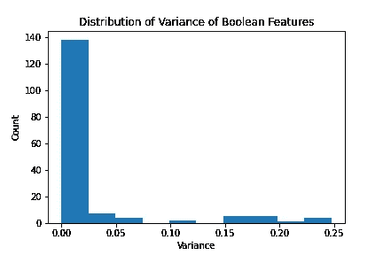
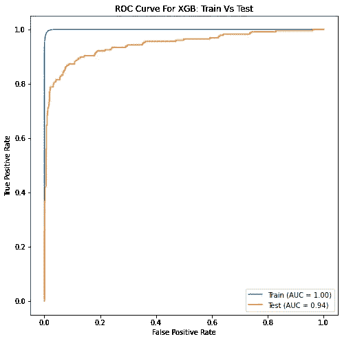
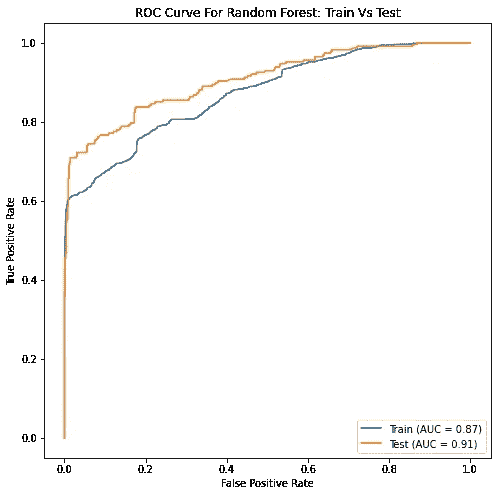
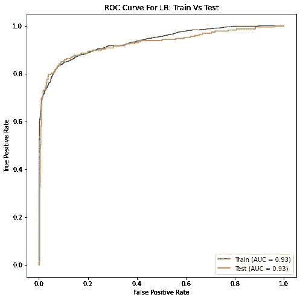
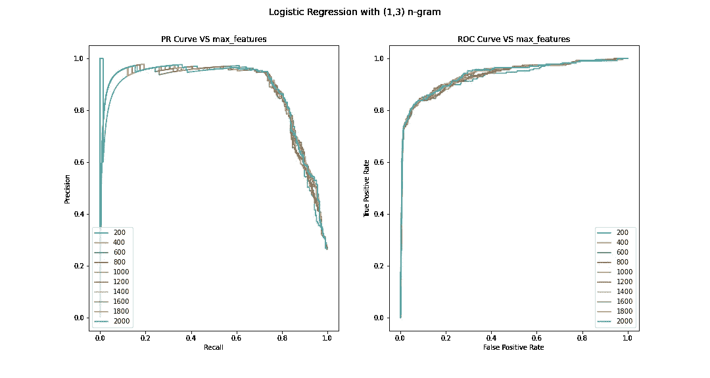
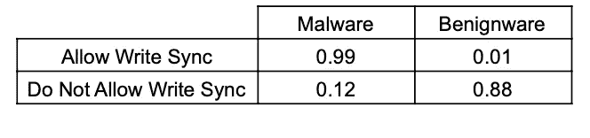

# 检测 Android 应用中的恶意软件

> 原文：<https://towardsdatascience.com/detecting-malware-in-android-apps-a011d84b931b?source=collection_archive---------26----------------------->

## 检查 Android 应用商店中的恶意内容


丹尼·米勒在 [Unsplash](https://unsplash.com?utm_source=medium&utm_medium=referral) 上的照片

***TL；DR*** *:坏人滥用权限和过时软件感染你的设备。*

# 背景:Epic Games 公司诉苹果公司。

在写这篇文章的时候，*苹果公司*和 *Epic Games，Inc.* 正处于[法律纠纷](https://cand.uscourts.gov/cases-e-filing/cases-of-interest/epic-games-inc-v-apple-inc/)的阵痛中。Epic Games 声称苹果的应用商店是垄断的，不应该对应用内购买有控制权。苹果反诉 Epic，指控其违约。这一裁决的结果可能会从根本上改变苹果公司运营其应用商店的方式，以及应用开发商如何利用他们的内容赚钱。

这场诉讼有一个方面引起了我的兴趣:苹果公司主张维持其目前完全控制 App Store 的模式。

这种观点认为，苹果对 App Store 的严格控制保证了一个安全的环境，在这个环境中，每一个应用程序都要接受恶意软件审查，并符合苹果的标准。因此，用户可以免受恶意软件的攻击，可以专注于重要的事情:找到你喜欢的应用程序。这里经常使用围墙花园的比喻，因为只要你呆在围墙的范围内，你就可以采摘和享用花园里的任何水果。

这让我不禁要问:与苹果相比，第三方商店的安全状况如何？我们能否创建一个简单的数据驱动模型来检查应用程序中的恶意软件，而不管谁控制着商店？

*完全披露:整个项目是在苹果 MacBook 上完成的，我不会在法律案件中偏袒任何一方。*

# 目标

在这篇文章中，我的目标是展示数据驱动的方法如何标记恶意的智能手机应用程序，并为实现这一目标的每个步骤提供解释。我也将看看我的研究结果与其他相关课题的研究相比如何。

被调查的操作系统是安卓系统，它占据了全球移动操作系统市场 72%的份额。鉴于它的广泛流行，它更容易被恶意行为者滥用。

# 给我们看看代码

可以在以下位置找到与此项目相关的存储库:

[](https://github.com/NadimKawwa/AndroidMalware) [## NadimKawwa/Android 恶意软件

### 这个库的目标是检测 Android 应用程序上的恶意软件。TL；博士:坏人滥用权限和过时…

github.com](https://github.com/NadimKawwa/AndroidMalware) 

# 获取数据

数据来自 Kaggle 用户 [Saurabh Shahane](https://www.kaggle.com/saurabhshahane) ，可一键下载:

[](https://www.kaggle.com/saurabhshahane/android-malware-dataset) [## Android 恶意软件数据集

### 良性和恶意 Android 样本的元信息数据集

www.kaggle.com](https://www.kaggle.com/saurabhshahane/android-malware-dataset) 

该数据集最初由亚历杭德罗的*马丁在论文“ *ADROIT: Android 恶意软件检测使用元信息”*中使用；卡列哈，亚历杭德罗；埃克托尔·梅嫩德斯；胡安·塔皮阿多；大卫·卡马乔*。

数据集中的每一行都代表了在 [Aptoide 应用商店网站](https://en.aptoide.com/)上可用的应用的元信息，以及来自应用的 Android 清单的信息。此外，本文还将作为模型性能的基准。

请注意，我假设数据集中的信息尽可能真实准确。对这一基本假设的任何改变都可能完全改变本文的发现。此外，我强烈推荐阅读这篇论文，因为它解释了数据是如何聚集和标记的。

# 构建特征空间

在这一节中，我给出了如何将不同的数据类型转换成可操作的特性的一般描述。

## 目标变量和成功指标

很简单，目标变量取两个值之一:良性或恶意软件。这些数据大约 70%是良性的，30%是恶意软件。相比之下，据苹果首席执行官蒂姆·库克称，苹果应用商店中只有 1-2%是恶意软件。

这篇论文的作者获得了 94%的 AUC。我将看看我能否用我的方法复制类似的结果。

此外，我还将使用 F1 分数来检查模型性能。事实上，ROC 是所有可能阈值的平均值，而 F1 分数适用于 ROC 曲线上的任意点。

使用 F1 分数也提出了核心的商业问题:我们会为了更多的回忆而牺牲精确度吗？错过一个恶意软件应用程序的成本比禁止善意的开发者使用市场(误报)高得多吗？

换句话说，对于像 Aptoide 这样的商店来说，如果他们禁止一个善意的开发者，他们会损失多少潜在收入？另一方面，遗漏恶意软件会造成多大的声誉损害、用户伤害和收入损失？

此外，并不是所有的恶意软件都是一样的。事实上，它可能是广告软件、间谍软件、勒索软件或其他种类的软件。

这些问题与核心业务基准相关，超出了本文的范围。

## 数字特征

在 166 个数字特征中，160 个是二元的，6 个是连续的。我们手上有太多的特征，这可能会妨碍模型的预测性能。因此，查看每个要素的方差并移除方差较小的要素非常有用。



对于连续变量，我们必须考虑异常值。这与应用程序获得的评级数量特别相关，因为绝大多数应用程序从未获得过一次评级。

为了剔除异常值，我使用了[图基的方法](https://www.stat.cmu.edu/~cshalizi/statcomp/13/labs/05/lab-05.pdf):异常值是来自四分位数的超过四分位数间距 1.5 倍的值，或者低于*Q1 1.5 iqr*，或者高于 *Q3 + 1.5IQR* 。

## 文本特征

谈到 NLP，我通常会提出以下问题:

*   略读文字能明白一个专栏是讲什么的吗？
*   它是否使用拉丁字母，是否都是同一种语言？
*   需要哪些预处理函数？
*   最紧凑最有代表性的文字改造方式是什么？

事实证明，许多条目都有汉字描述(也有一些土耳其语、韩语等……)。如果有一天我想生产或解释这个模型，我必须理解并向利益相关者解释它的选择。然而，我无法解释我不理解的东西，因此决定从文本中删除非拉丁字符。

以下是一个应用程序描述的示例:

```
Tap Tap Gems is a very addictive puzzle game.  Tap two or more gems with the same colour to remove them from the board.  You must think which gems should be removed next.  To pass each level you must score certain amount of points.   The more gems removed the more points you score.  Game features 120 levels and 7 different gems.
```

另一个例子显示，即使使用严格的拉丁字符，人们可能仍然不知道发生了什么(我猜这是越南语？).

```
Game bi dn gian Vit bao gm 15+ cc mini quen thuc vi ngi Vit ta t xa n nay nh: Xm, Phm, Tin ln min Nam, Ling, Poker, X t, Mu binh, Bi co, X dzach v Tin ln min Nam m l.  t lu Tin Ln Min Nam m L - Game bi dn gian Vit  c cc game th yu qu bi  ha cc p, giao din c chm sc rt k. Cc chc nng trong game hn hn cc game cng loi khc nh
```

预处理后，使用 TF-IDF 矢量化对文本数据进行转换。为了优化预测，使用网格搜索交叉验证来调整 TF-IDF 参数。

# 型号选择

起初我想选择 XGBoost，因为它的 AUC 最高。所以我开始做一个普通的数据科学工作流程，在数据管理之后:

*   实例化 TF-IDF 矢量器
*   实例化管道以避免泄漏
*   使用 GridSearchCV 研究参数如何影响模型预测

AUC 为 0.94，我很高兴，因为它符合作者的发现。然而，当比较训练/测试 AUC 时，下图表明我过度拟合:



相比之下，随机森林(RF)显示拟合不足:



逻辑回归没有过度拟合，但可能严重拟合不足。



XGBoost 应该是这里的明显赢家，但是，我决定继续使用普通的逻辑回归。它具有相当简单的可解释性，省去了我使用诸如 [SHAP](https://christophm.github.io/interpretable-ml-book/shap.html) 、[特征置换](https://christophm.github.io/interpretable-ml-book/feature-importance.html)或[时间](https://christophm.github.io/interpretable-ml-book/lime.html)等方法的麻烦。

# 语料库规模对预测的影响

由于这个任务涉及到 NLP，所以我想从文本数据中挖掘尽可能多的信息。处理稀疏数据时，逻辑回归往往会受到影响，而处理文本时，稀疏数据是典型的。

下面我们有两个图，一个是 ROC 曲线，一个是精准召回曲线。多条曲线显示了当我们添加更多的功能时，模型的性能只是略有提高。

**剧透警告**:文本数据无关紧要，下一节将说明 Android 清单中的数字特征是分类的最重要因素。



# 结果的解释

可以假设黑盒模型并不十分流行。因此，我开始理解分类器如何衡量其决策，并深入研究这些特征。

## 恶意软件的指标

就恶意软件的强有力指标而言，前 5 位是:

1.  Android . permit . read _ SYNC _ SETTINGS
2.  Android . permission . write _ SYNC _ SETTINGS
3.  Android . permission . manage _ ACCOUNTS
4.  com . Android . launcher . permission . uninstall _ SHORTCUT
5.  Android . permission . receive _ BOOT _ COMPLETED

以允许[写同步设置](https://developer.android.com/reference/kotlin/android/Manifest.permission#write_sync_settings)为例，这意味着什么？当一个设备同步时(*同步*)，它会将你手机上的数据与该服务的服务器同步。

下表是来自训练数据的快照，它表明给未安装的应用程序这些权限是一个需要谨慎的强有力的例子。



此外， [MANAGE_ACCOUNTS](http://androidpermissions.com/permission/android.permission.MANAGE_ACCOUNTS) ，允许应用程序添加/删除帐户并删除其密码。

此外, [RECEIVE_BOOT_COMPLETED](https://developer.android.com/reference/android/Manifest.permission#RECEIVE_BOOT_COMPLETED) 是一个明显的妥协迹象。android 文档很好地总结了这一点:

> 虽然拥有此权限没有任何安全隐患，但它会增加系统启动的时间，并允许应用程序在用户不知情的情况下自行运行，从而对用户体验产生负面影响。

最后，不再支持 [UNINSTALL_SHORTCUT](https://developer.android.com/reference/kotlin/android/Manifest.permission#uninstall_shortcut) 权限。这可能与恶意软件有关，因为旧软件往往有更多突出的漏洞。

## 针对恶意软件的指标

针对恶意软件的指标，主要特征并不明显:

1.  android.permission .蓝牙
2.  android.permission.READ_LOGS
3.  。//Min_SDK
4.  Android . permission . read _ EXTERNAL _ STORAGE
5.  "铃声"

我不太清楚为什么连接配对的蓝牙和读取低级系统日志文件的权限是针对恶意软件的。也许它不像允许设备向附近的蓝牙设备做广告的其他权限那样糟糕(参见 [BLUETOOTH_ADVERTISE](https://developer.android.com/reference/android/Manifest.permission#BLUETOOTH_ADVERTISE) )。

此外，我也不明白为什么在应用程序描述中有“铃声”会给你开绿灯下载它。

然而，我可以理解设置一个更高的 SDK 版本( [Min_SDK](https://developer.android.com/guide/topics/manifest/uses-sdk-element) )如何保护你的设备免受感染。该特性与 [READ_EXTERNAL_STORAGE](https://developer.android.com/reference/android/Manifest.permission#READ_EXTERNAL_STORAGE) 非常一致。后者从 API 级别 19 开始实施，并提示用户自己启用/禁用权限。

不幸的是，参考文件没有代码或模型权重的解释。因此，我无法严格地将我的发现与作者的进行比较。

# 结论

处理 Aptoide 商店的数据表明，第三方商店中有大量的恶意软件。因此，如果苹果的商业行为保证了用户的安全，那么它们看起来是合理的。

然而，可以利用数据科学来创建一个快速而准确的分类系统，而苹果公司没有必要进行这种限制。与现有文献相比，逻辑回归模型易于建立并提供足够的性能。

像这样的项目有可能提高应用商店的安全性，并让人们更深入地了解漏洞是如何被利用的。该方法可以扩展到其他商店和操作系统。

# 在你走之前

如果您有兴趣了解更多关于网络安全和数据科学之间的交集，请查看另一个项目:

[](/cyber-security-threat-identification-2affad0989c) [## 网络安全威胁识别

### 如何区分软件弱点和漏洞的优先级

towardsdatascience.com](/cyber-security-threat-identification-2affad0989c)