# 使用 Yolo-V4 检测面罩开/关或佩戴不当

> 原文：<https://towardsdatascience.com/detecting-mask-on-off-or-incorrectly-worn-using-yolo-v4-c27911e4eadd?source=collection_archive---------26----------------------->

## 利用计算机视觉解决当前现实世界的问题。

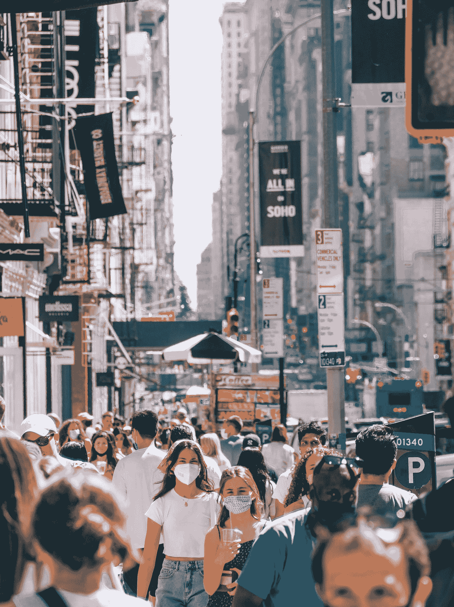

Yoav Aziz 在 [Unsplash](https://unsplash.com?utm_source=medium&utm_medium=referral) 上拍摄的照片

至少对我们大多数人来说，过去的两年是超现实的。这些天来，你环顾四周，无论你在世界的哪个角落，都有可能看到有人戴着面具。

特别是，如果你来自对戴口罩有严格要求的城市或国家，你可能会看到大多数人戴口罩，很少有人会戴错，有些人甚至根本不戴。我想看看机器视觉算法是否能完成完全相同的工作，而不是用一个权威单位来管理这个地区。

【https://github.com/kmt112/probable-lamp】Github 回购:

**数据集引用:**

原始掩模数据集:[https://www.kaggle.com/andrewmvd/face-mask-detection](https://www.kaggle.com/andrewmvd/face-mask-detection)

附加屏蔽数据集:[https://github.com/cabani/MaskedFace-Net](https://github.com/cabani/MaskedFace-Net)

# 问题陈述

首先，由于机器视觉算法必须能够在实时设置中进行预测，我们需要一种能够在相对较低的 FPS 环境中工作的算法。其次，该模型必须反应迅速，因为人们通常相对较快地超过摄像机视野。因为它必须准确地预测所有三个类别(戴上面具、摘下面具和面具佩戴不正确)。基于 mAP (mean 平均精度)来评价模型会更好。

# Yolo-v4

根据上面的问题陈述，这使得 yolov4 成为理想的算法。Yolov4 在实时检测(FPS: > 45)方面始终具有较高的平均精度，此外，yolov4 是一个单级对象检测器，因此计算量较轻。有关 YoloV4 性能的更多信息，请参考[https://blog . robo flow . com/PP-yolo-beats-yolov 4-object-detection/](https://blog.roboflow.com/pp-yolo-beats-yolov4-object-detection/)。

# 资料组

最初使用的数据集来自 T4 大学。该数据集由 800 多张带标签的照片组成。照片数据集也包括团体照片和个人照片。然而，初步的探索性数据分析表明，不同阶层之间存在巨大的阶层不平衡。对于戴错口罩的数据集。因此，有必要增加面罩佩戴不当的等级。

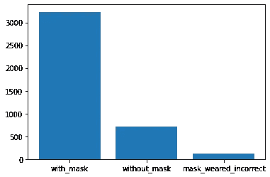

图一。阶层失衡(图片由作者提供)

## 改进数据集

巨大的阶级不平衡会导致你的模型在代表性不足的阶级中表现不佳，这就是为什么在训练中不同阶级的平等代表性是重要的。由于 yolo v4 模型只接受适当标签格式的照片，因此需要将 XML 文件格式转换为 TXT 文件格式。此外，还对图像进行了归一化处理，使其对图像分辨率的变化更加鲁棒。

**添加新数据。戴口罩的人和不戴口罩的人很容易区分。然而，确定口罩是否佩戴不当要困难得多。因此，更重要的是包括更多关于不正确佩戴的口罩的数据。虽然在互联网上可以找到许多可用的数据集。我使用了数据集 [MaskedFace-Net [1，2]](https://github.com/cabani/MaskedFace-Net) 中的数据集。**

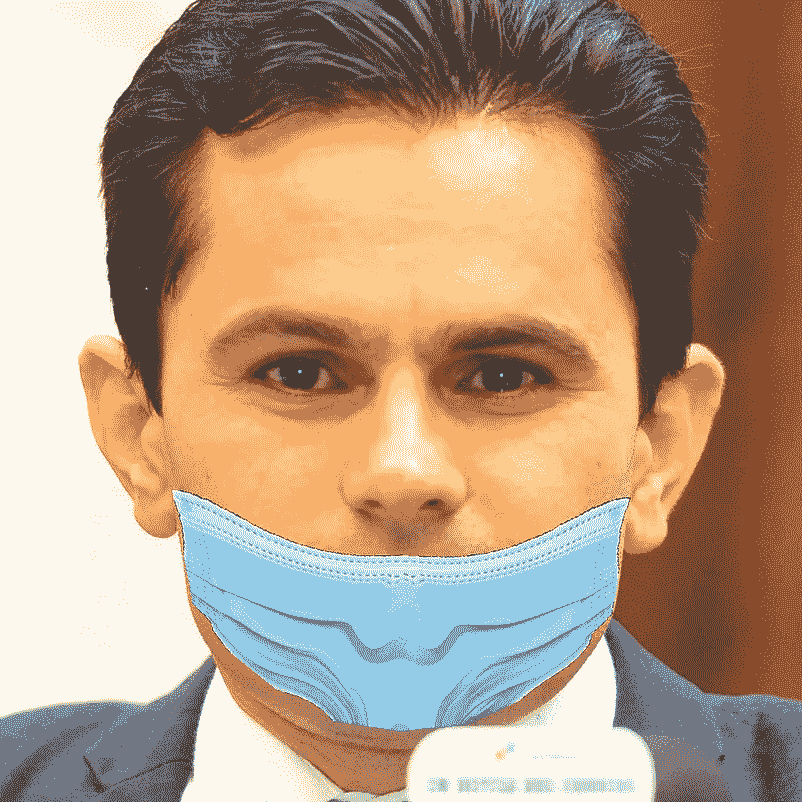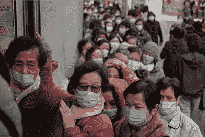

图二。来自屏蔽网络数据集的样本数据(左)，来自 kaggle 的屏蔽和未正确佩戴的样本图像(右)

**标记新数据**。不幸的是，没有办法自动化这个过程，因为我希望数据是干净的，我必须物理标记数据和边界框。使用[这个](https://github.com/Cartucho/OpenLabeling) python 程序手动标记边界框和类。

# 数据建模

我们将利用 COCO 数据集的预训练权重进行迁移学习。这仅在第一次迭代中使用，此后我们将使用您在每个间隔保存的预训练权重。由于 yolo V4 是用 C 和 Cuda 编写的，为了调优超参数，必须在配置文件中完成。我已经上传了一个可以使用的配置文件，我将简要说明我为改进地图所做的更改。

*   `width/height` :将分辨率大小改为 416，增加 yolov4 的宽度和高度提高了分辨率。
*   `batches` :当批次被细分时，这决定了将被并行处理的图像的数量。
*   `saturation = 1.5, Hue = 1.5` :改变饱和度和色调
*   `mosaic = 1` :马赛克数据增强将 4 幅训练图像以一定的比例组合成一幅(而不是 cutmix 中的两幅)。这可以防止过度依赖任何关键功能。
*   `blur = 1` :50%的时间会随机应用模糊。
*   `jitter = 0.3`:随机改变图像的大小和长宽比。

图像增强可以从现有的训练数据中创建新的训练样本，因此减少了收集更多数据的需要。这也使得模型对于图像中的扰动更加鲁棒。

# 结果

为了显示不平衡数据和正确表示的数据之间的差异，我为这两种数据训练了模型。首先，跨地图比较模型。

**平均精度平均值**

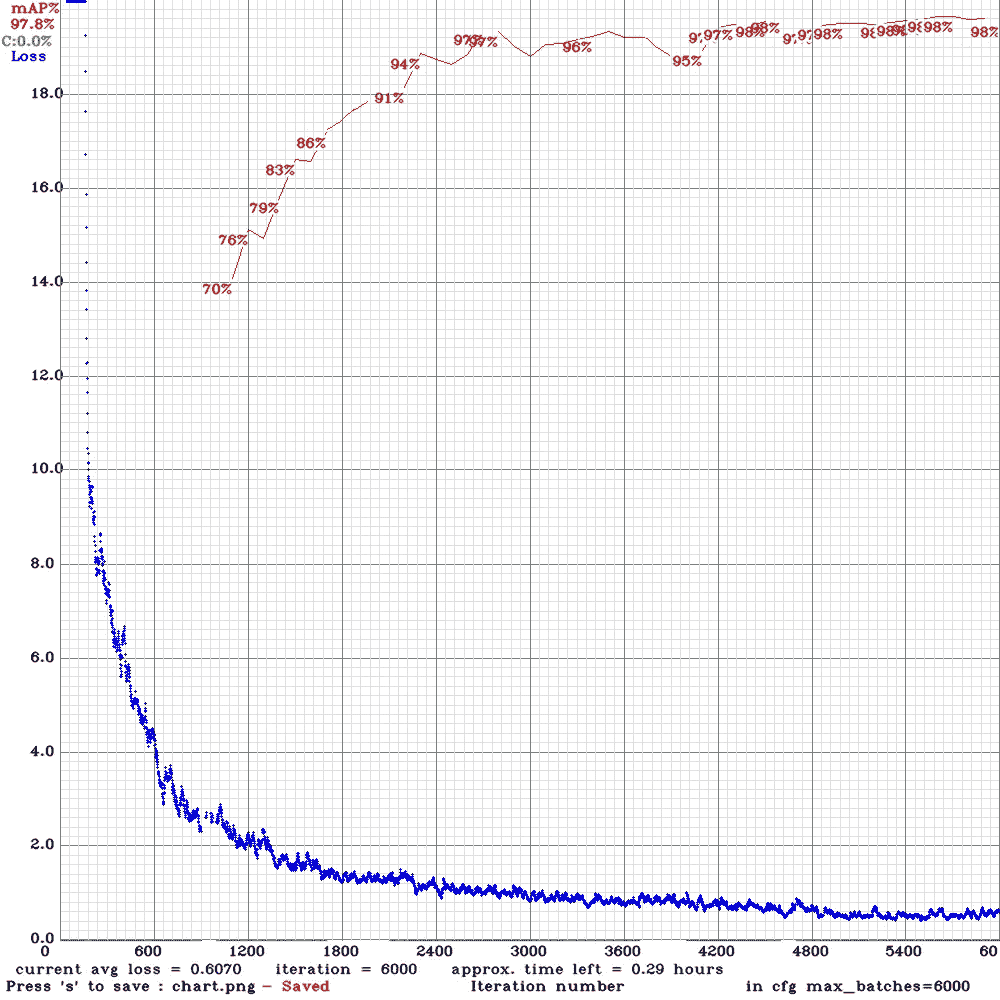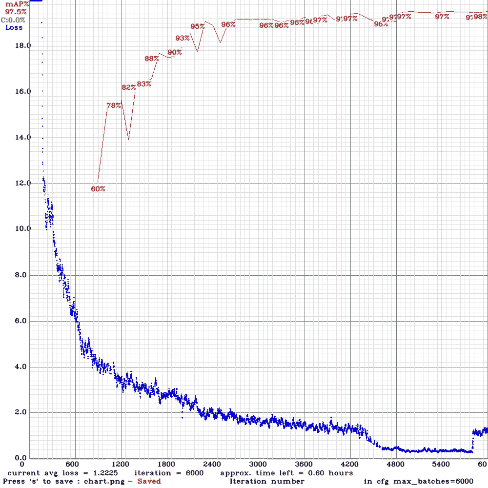

图 3。不平衡数据训练(左)，平衡数据训练(右)，作者图片

两个数据集之间模型性能没有太大差异。事实上，具有更平衡数据的模型在初始迭代中表现稍差。

**IOU 阈值与映射图**

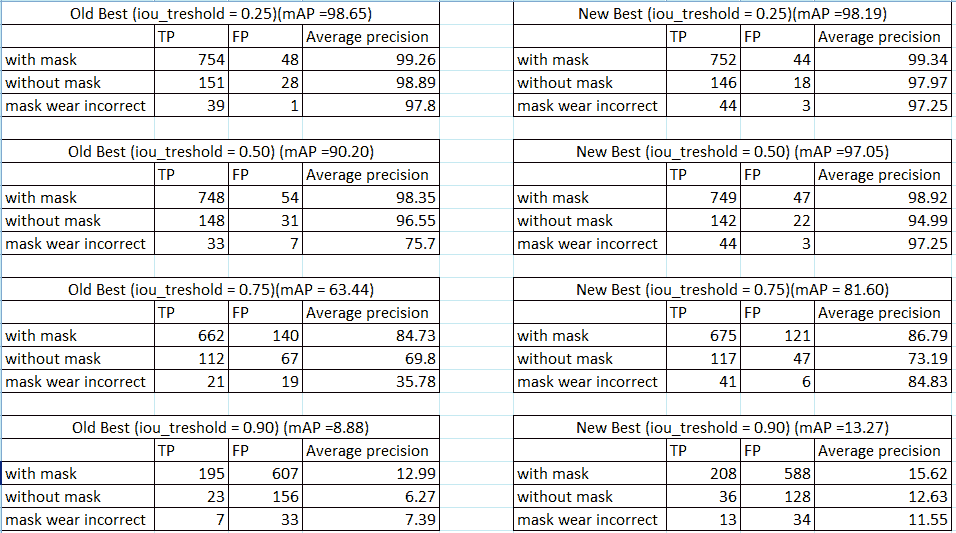

图 4。IOU 阈值与图的关系，图由作者提供

并集上的交集和映射的一个重要区别。也许在这一点上，有必要解释一下 IOU 和 mAP 是什么，以及它们之间的关系。一般来说，mAP 和 IoU 是反向相关的。这是因为 IoU 可以被认为是包围盒的紧密度。

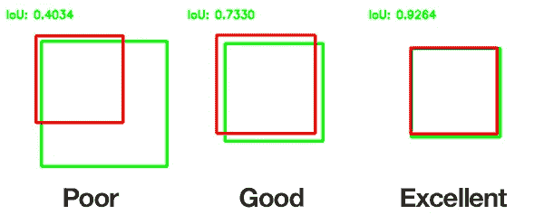

图 5。欠条插图，图片来自[https://www.mdpi.com/2073-8994/13/2/262/htm](https://www.mdpi.com/2073-8994/13/2/262/htm)

如果你设置了一个很高的 IoU 阈值，你的模型将不得不定义一个非常精确的边界框。这可以从图 5 中看出，当 IoU 设置为 0.9 时，mAP 显著下降。

**结果可视化**

这里有一些例子来说明当不同的类达到平衡时模型的表现。

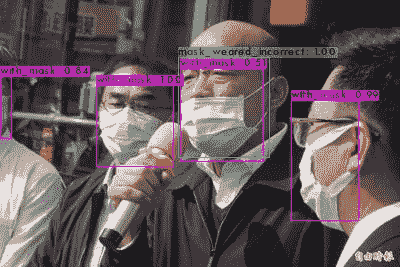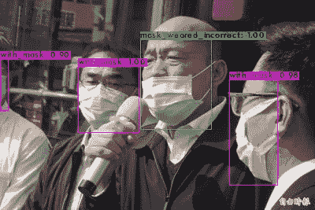

图 6。旧型号(左)和新型号(右)，作者图片

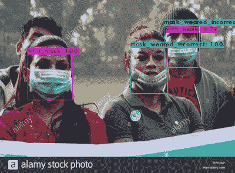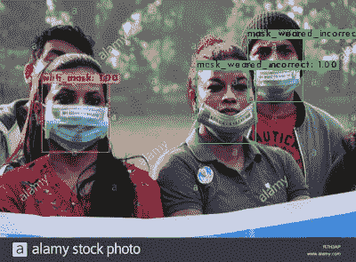

图 7。旧型号(左)和新型号(右)，作者图片

当更多面具佩戴不正确的照片被添加到训练模型中时，该模型在检测面具是否佩戴正确方面表现得明显更好。当比较新旧模型时，这一点在图 5 中也很明显。

**快速部署时间**

该模型在处理单个帧中的大量类时也没有困难。

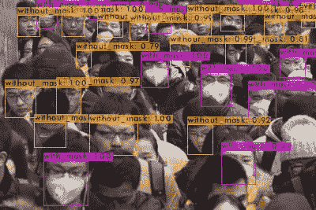

图 8。许多人的预测，图片来自 Kaggle

# 结论

总的来说，Yolo-V4 的表现比预期的要好，不仅结果很好，而且部署和验证也很快。虽然我最初的计划是在现实生活中部署这一点，但我当地的公共交通提供商抢先一步，在公交和火车站部署了一个 CV 解决方案。

展望未来，我在 yolo-v4 上遇到的一个问题是我不熟悉配置文件、C 和 Cuda 编程语言。由于对 python 和 pytorch 更加熟悉，我认为 yolo-v5 可以让我更好地理解并调整参数来改进我的模型。

也就是说，本教程大量引用了原版 darknet github repo[https://github.com/pjreddie/darknet](https://github.com/pjreddie/darknet)的内容。

## 参考

1.  Adnane Cabani、Karim Hammoudi、Halim Benhabiles 和 Mahmoud Melkemi，“新冠肺炎背景下正确/不正确遮盖面部图像的数据集”，《智能健康》，ISSN 2352–6483，Elsevier，2020 年，[DOI:10.1016/j . smhl . 2020 . 100144](https://doi.org/10.1016/j.smhl.2020.100144)
2.  Karim Hammoudi、Adnane Cabani、Halim Benhabiles 和 Mahmoud Melkemi，“通过自拍验证防护面罩的正确佩戴:设计一个移动应用程序“CheckYourMask”以限制新冠肺炎病毒的传播”，CMES——工程与科学中的计算机建模，第 124 卷，第 3 期，第 1049-1059 页，2020 年，[DOI:10.32604/cmes . 2020 . 1663](https://www.techscience.com/CMES/v124n3/39927)