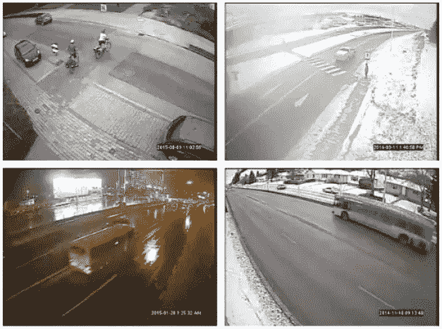
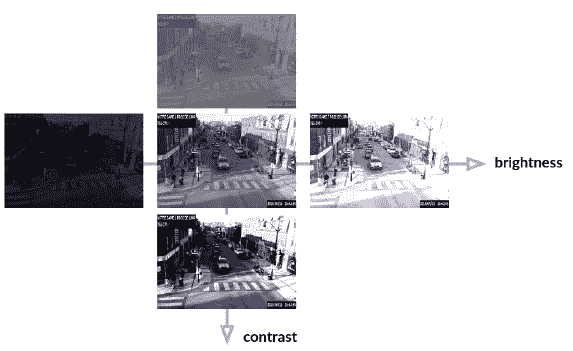

# 用 YOLOv5 检测城市场景中的物体

> 原文：<https://towardsdatascience.com/detecting-objects-in-urban-scenes-using-yolov5-568bd0a63c7?source=collection_archive---------12----------------------->

## [理解大数据](https://towardsdatascience.com/tagged/making-sense-of-big-data)

作为我在 [MILA](https://mila.quebec/en/mila/) (魁北克的人工智能研究所)攻读机器学习硕士学位的一部分，在蒙特利尔市*工作期间，* I 开发了一个人工智能城市物体检测解决方案，用于来自平移-倾斜-缩放(PTZ)交通摄像机的视频馈送。该原型可以检测五种不同类别的对象，即车辆、行人、公共汽车、骑自行车的人和建筑对象。这是一个检测一帧的例子，拍摄于蒙特利尔市中心的 De La Montagne 街和 René-Levesque 大道的交叉口。

显示所有五个对象类别的对象检测示例-按作者分类的图像

为了显示该模型如何推广到另一个城市环境，这里有一个离线检测(即，非实时)的例子，其中为这个[测试 youtube 视频](https://youtu.be/ufK2XRGUjuc)的每一帧产生一个推理。

来自 youtube 视频的[测试城市场景的离线检测示例——视频作者](https://youtu.be/ufK2XRGUjuc)

感谢蒙特利尔市的开放数据政策和开源软件政策，我很高兴地宣布我的项目正在变成开源项目！本周，我们发布了[代码](https://github.com/VilledeMontreal/urban-detection)、[训练模型](https://github.com/VilledeMontreal/urban-detection/releases)以及所有带注释的图片([数据集](https://donnees.montreal.ca/ville-de-montreal/images-annotees-cameras-circulation))。

我还写了一份详细的技术报告，等待 MILA 的审查和批准，我也将能够分享(敬请期待！).与此同时，我写这篇博客的目的是简要概述这个项目及其成果，让人们了解这个新开放的数据集。

**重要提示**:在继续之前，我想澄清一下这个项目的动机，让那些可能对这项技术的使用有疑虑的人放心。T2 城市交通管理中心(CGMU)是蒙特利尔市智能交通系统的心脏和大脑。CGMU 运营商在整个地区安装了 500 多个交通摄像头(见[地图](https://ville.montreal.qc.ca/circulation/)),可以监控道路网络上的交通状况，并在出现问题时(如事故或车辆故障)进行处理。为了帮助他们更快地检测事故，蒙特利尔市希望建立一个自动道路异常检测系统。我们现在发布的这个对象检测解决方案构成了一个重要的构建模块，将有助于实现这一长期目标。

**同样重要的是**:在整个项目中，尊重公民隐私是非常重要的，尤其是现在我们正在发布注释。值得注意的是，这些注释与已经通过[城市开放数据网站](https://donnees.montreal.ca/ville-de-montreal/cameras-observation-routiere)公开发布的图像相关联。此外，虽然安装用于获取这些图像的摄像机是为了协助 CGMU 操作员执行日常交通管理任务，但它们也被调整为限制收集的信息。例如，相机分辨率被设置为既不能识别人脸也不能识别车牌，并且图像只以 5 分钟的间隔保存和发布。[蒙特利尔的《数字数据宪章》](https://laburbain.montreal.ca/sites/villeintelligente.montreal.ca/files/25817-charte_donnees_numeriques_ang.pdf)是一份很好的参考资料，有助于了解该市如何管理和规范数字数据的生命周期。

既然我们已经弄清楚了这一点，让我们开始吧！

# 关键特征

以下是最终目标检测模型的一些关键特征。他们:

*   我们在单个 GPU 上使用近 19k 幅图像进行了训练(来自蒙特利尔市的 7007 幅训练图像+来自 [MIO-TCD 数据集](http://podoce.dinf.usherbrooke.ca/challenge/dataset/)的 11877 幅图像)
*   包括较小和较大的神经网络体系结构，它们可以分别在 CPU 上以 167 ms 的延迟和在 GPU 上以 16.6 ms 的延迟运行。
*   兼容不同的相机品牌和型号、图像分辨率以及不同的变焦和方向设置。
*   对视觉伪像(例如失焦、镜头上的雨滴或灰尘、阳光眩光等)以及不同的天气和天气条件具有鲁棒性。

# 资料组

蒙特利尔市数据集由 10，000 幅分辨率为 350x288、352x240 和 704x480 的图像组成，带有 Pascal VOC 格式的车辆、公共汽车、行人、骑自行车者和建筑物体的相关物体检测注释。所有注释都是使用 [CVAT](https://github.com/openvinotoolkit/cvat) (计算机视觉注释工具)生成的。然后，数据集被分成四部分，如下所示:

*   70%的图像用于训练，
*   10%用于验证，
*   10%用于域内测试
*   10%用于域外测试

训练集用于学习模型权重和偏差，而验证集在训练期间用于监控性能并确定模型何时开始过度拟合。它还用于评估超参数的不同配置。测试集在项目结束时用于报告绩效。

训练集、验证集和域内测试集都使用相同的摄像机子群体(即交叉点)，而域外测试分割使用在训练期间不可见的保留摄像机群体。

下表显示了每个集合中包含的每个类的实例数量。我们可以看到，阶层分布不均衡，车辆远远多于骑自行车的人和公交车。

每个数据分割中不同类别的影像和对象总数-蒙特利尔市数据集-按作者分类的影像

为了帮助提供更多代表性不足的类别的训练示例，使用了额外的数据集，即 [MIOvision 交通摄像机数据集](http://podoce.dinf.usherbrooke.ca/challenge/dataset/) (MIO-TCD)。因为它包含了视角非常相似、分辨率非常相似的图像，所以非常符合我们的需求。它还包含冬季月份的图像，考虑到蒙特利尔市数据集只包含夏季月份的图像，这是一个有趣的补充。从总共 11877 幅附加图像中选择了包含骑自行车的人、行人和公共汽车的所有图像。因此，我们能够将 2260 名骑自行车的人和 8319 辆公共汽车添加到训练示例中。但是，MIO-TCD 不包含任何带标签的构造对象。

来自 [MIO 的样本图片-TCD 数据集](http://podoce.dinf.usherbrooke.ca/challenge/dataset/) —作者图片

# 模型

YOLOv5 是一个对象检测模型，于 2020 年 5 月发布，作为 github 上的 Pytorch 实现，并被选为该项目的基础。在评估我们的选项时，YOLOv5 是可用的最快和最准确的对象检测模型之一。此外，它受益于一个非常大的用户社区，这意味着它正在积极开发中，每周都有改进。为了稳定起见，commit[**bb 8872**](https://github.com/ultralytics/yolov5/tree/bb8872ea5f2afb7b6b2c81034b1d399d61d5157a)(2020 年 9 月 8 日发布)被分叉用于项目具体开发。YOLOv5 包括 4 种不同的网络架构大小:小型(S)、中型(M)、大型(L)和 X-大型(X)。

[单发多箱探测器](https://arxiv.org/pdf/1512.02325.pdf) (SSD)被选为基准型号，与 YOLOv5 进行比较。在 2015 年创建时，SSD 是最快的型号之一，这使得它非常适合实时应用程序。它不再被认为是最先进的，但由于其简单性，仍然经常被用作基线模型。

# 迁移学习

在非常大的数据集上预先训练模型以学习有意义的表示，并随后在感兴趣的任务上对其进行微调，通常有利于性能。这种策略被用于 YOLOv5(在 MS COCO 对象检测数据集上预先训练)和 SSD(在 ImageNet 图像分类数据集上预先训练)。

# 增加

YOLOv5 和 SSD 都在训练时使用数据扩充来获得不容易过度拟合的解决方案。从一个时期到另一个时期，各种增强被采样并应用于相同的输入图像，这导致数据集大小和输入图像可变性的人为增加。光度和几何放大的一些例子如下所示:

光度扩展示例-作者提供的图片

光度扩展的其他示例-图片由作者提供

几何增强的例子——作者图片

马赛克增强是一种新的图像增强方法，在 YOLOv4 中引入，并在 YOLOv5 中保留。镶嵌增强包括混合 4 个不同的训练图像，这具有允许检测正常背景之外的对象的效果，因此提高了泛化能力。另一个好处是，它减少了使用大的小批量的需要。

# **计算资源**

所有实验和训练都是使用谷歌 Colab Pro 实例(包括英伟达特斯拉 P100 或 V100)进行的，预期超参数搜索是使用谷歌云平台(GCP)上的 GPU 实例进行的。这里是有用的[教程](https://grondin-js.medium.com/)为训练我们的模型设置 GCP。

# 结果

乍一看，与基准 SSD 模型相比，YOLOv5 的检测性能(以[平均精度(mAP)](https://jonathan-hui.medium.com/map-mean-average-precision-for-object-detection-45c121a31173) 表示)远远优于基准 SSD 模型。当仅在蒙特利尔市数据集上训练时，具有 26.7 M 参数的 SSD 实现了 0.466 的 mAP，而 yolov 5‘M’模型在大致相同的模型大小下实现了 0.663 的 mAP。事实上，所有四种 YOLOv5 变体在推理和训练过程中都更快。

模型大小对训练时间、性能和延迟的影响。输入图像尺寸:320x320。仅在蒙特利尔市数据集上训练，300 个时期-图片由作者提供

除了模型架构大小之外，另一个被发现会显著影响性能和延迟的配置设置是输入图像大小。基准 SSD 使用 300x300 的输入图像大小，而 320x320、512x512 和 704x704 的大小在 YOLOv5 'X '型号上进行了测试。蒙特利尔市*数据集*的最大图像分辨率为 704x480，因此在输入图像尺寸为 704x704 的情况下，不会丢失任何像素信息。这可能会对小物体的检测性能产生很大影响，例如行人和建筑圆锥体，因为它们往往非常狭窄。下表显示，随着图像输入大小的增加，检测性能会提高，但 GPU 延迟和训练时间会增加。

输入图像大小对训练时间、性能和延迟的影响。批量大小 1 和 32 分别用于 CPU 和 GPU 推断。数据集:蒙特利尔市，经过 300 个纪元的训练-图片由作者提供

在固定架构和输入图像大小的情况下，增加 MIO-TCD 数据集可以提高 YOLOv5 模型的性能，但不能提高 SDD 的性能。下表显示了每个类别的增量收益。所有的职业都有进步，除了建筑类的表现有所下降。这并不奇怪，因为在 MIO-TCD 数据集中没有构造对象。组合两个数据集的一个缺点是训练时间的增加，考虑到训练样本的数量增加了一倍以上，这并不奇怪。

添加 MIO-TCD 数据集对成绩和训练时间的影响。经过 300 个纪元的训练—作者提供的图片

使用 [Orion](https://github.com/Epistimio/orion) 进行了严格的超参数搜索，Orion 是一种用于黑盒函数优化的异步框架，已经集成为蒙特利尔市刚刚发布的代码的一部分。这方面的更多细节将在报告中提供。一个有趣的发现是，通过超参数搜索获得的性能提升与使用原始 YOLOv5 存储库中的基线超参数获得的性能提升相比微不足道。这意味着使用基线超参数已经可以预期非常好的性能，并且节省了他们自己的探索过程。

在测试集上评估了最佳的最终模型。下表显示了域内(训练期间看到的交叉点)和域外(新交叉点)测试图像的最终性能。

在域内和域外测试集上的最终模型性能—图片由作者提供

正如预期的那样，在看不见的交叉路口，性能会下降，但对人眼来说，检测质量仍然很好，如下图所示的小模型。

YOLOv5 Small，输入图像大小为 512x512:四个域外测试集图像—图像由作者提供

# 结论

由于未来的目标是检测道路网络上的事件和其他异常，蒙特利尔市在不久的将来可以遵循的自然下一步是将一个预先训练的 YOLOv5 架构纳入多对象跟踪神经解决方案。为了帮助生成训练该解决方案所需的多对象跟踪数据集，可以使用我们提出的最佳模型作为预注释图像的手段，并最小化人类注释者的负担。