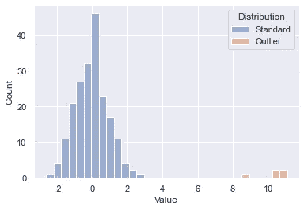
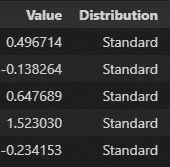
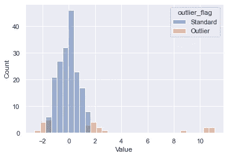

# 使用 Python 检测异常值

> 原文：<https://towardsdatascience.com/detecting-outliers-using-python-66b25fc66e67?source=collection_archive---------11----------------------->

## 使用隔离森林进行自动异常检测


鲁珀特·布里顿在 [Unsplash](https://unsplash.com?utm_source=medium&utm_medium=referral) 上的照片

# 什么是离群点检测？

在构建任何类型的机器学习模型之前探索数据时，检测异常值可能很重要。异常值的一些原因包括数据收集问题、测量错误和数据输入错误。检测异常值是分析数据点中潜在错误的一个步骤，这些错误可能需要在模型训练之前消除。这有助于防止机器学习模型学习不正确的关系并潜在地降低准确性。

在本文中，我们将模拟一个来自两个分布的数据集，看看我们能否检测出异常值。

# 数据生成

为了测试异常值检测模型，生成了来自两个样本的虚拟数据集。从一个分布中随机抽取 200 个点，从一个单独的移位分布中随机抽取 5 个点，这样我们就有了下面的起点。你会看到蓝色的 200 个初始点和橙色的异常值。我们知道哪一个是哪一个，因为这是生成的数据，但在未知的数据集上，目标是在没有内部知识的情况下从本质上发现异常值。让我们看看一些现成的 scikit-learn 算法能做得有多好。



初始数据集

# 隔离森林

检测异常值的一种方法是使用 scikit-learn 的[隔离森林](https://scikit-learn.org/stable/modules/generated/sklearn.ensemble.IsolationForest.html)模型。这使我们能够构建一个类似于随机森林的模型，但旨在检测离群值。

数据生成后的 pandas 数据框架起点如下——一列为数值，另一列为我们可用于准确性评分的基本事实:



初始数据帧—前 5 行

# 拟合模型

第一步是拟合我们的模型，注意拟合方法只接受 X，因为这是一个无监督的机器学习模型。

# 预测异常值

使用 predict 方法，我们可以预测一个值是否是异常值(1 不是异常值，接近-1 就是异常值)。

# 查看结果

为了查看结果，我们将绘制并计算精确度。在原始数据集上绘制新的预测列会产生以下结果。我们可以看到离群值被恰当地提取出来；然而，我们的标准分布也有一些尾部。我们可以进一步修改污染参数，将其调整到我们的数据集，但这是一个很好的开箱即用的过程。



在这个例子中，还可以简单地计算准确度、精确度和召回率。该模型有 90%的准确性，因为初始数据集中的一些数据点被错误地标记为异常值。

```
Output: Accuracy 90%, Precision 20%, Recall 100%
```

# 解释规则

我们可以使用决策树分类器来解释这里发生的一些事情。

```
|--- Value <= 1.57
|   |--- Value <= -1.50
|   |   |--- class: Outlier
|   |--- Value >  -1.50
|   |   |--- class: Standard
|--- Value >  1.57
|   |--- class: Outlier
```

基本规则是将-1.5 和 1.57 作为确定“正常”的范围，其他一切都是异常值。

# 椭圆形信封

隔离林不是检测异常值的唯一方法。另一个适合高斯分布数据的是[椭圆包络](https://scikit-learn.org/stable/modules/generated/sklearn.covariance.EllipticEnvelope.html#sklearn.covariance.EllipticEnvelope)。

代码本质上是相同的，我们只是换出了正在使用的模型。由于我们的数据是从随机样本中抽取的，这导致了一个稍微更好的拟合。

```
Output: Accuracy 92%, Precision 24%, Recall 100%
```

可以对我们的数据运行不同的异常值检测模型来自动检测异常值。这可能是分析可能对我们的建模工作产生负面影响的潜在数据问题的第一步。

*所有的例子和文件都可以在* [*Github*](https://github.com/bstuddard/python-examples/tree/master/outlier-detection/isolation-forest) *上找到。*

*原发布于*[*https://data stud . dev*](https://datastud.dev/posts/python-outlier-detection)*。*