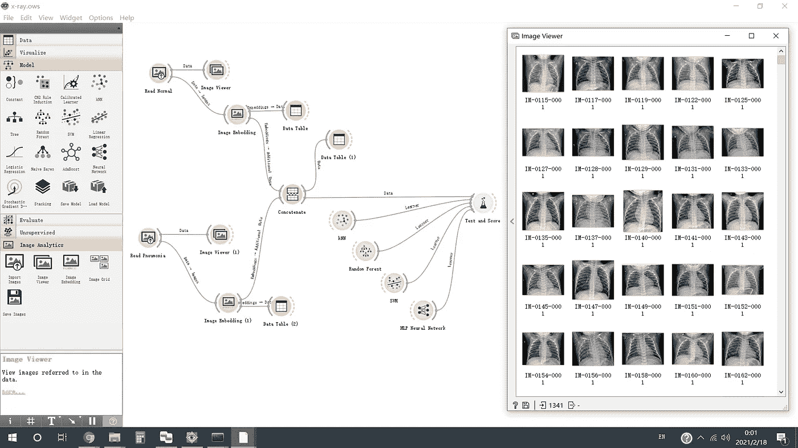
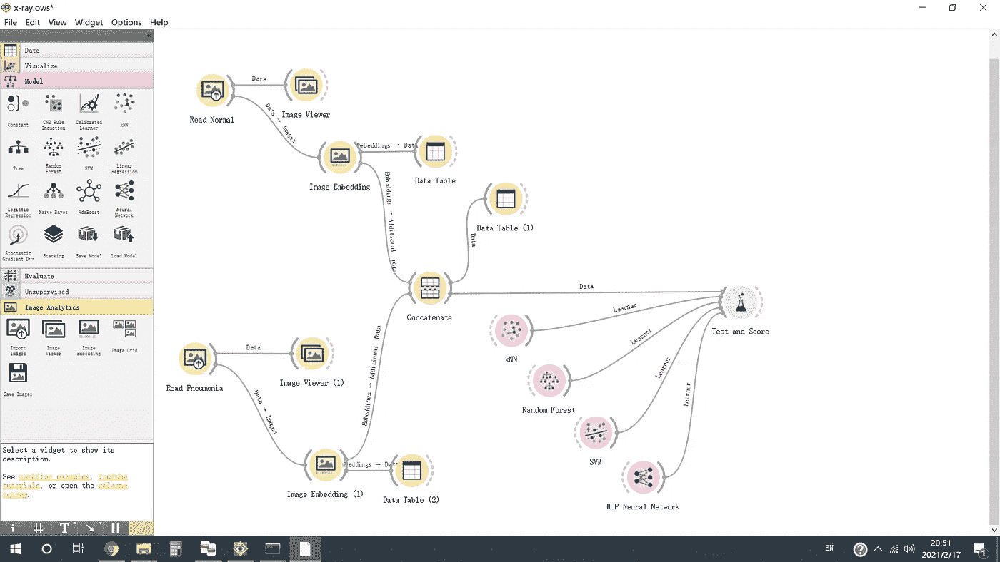
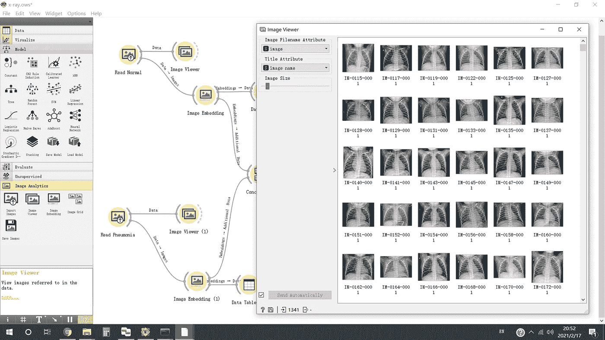
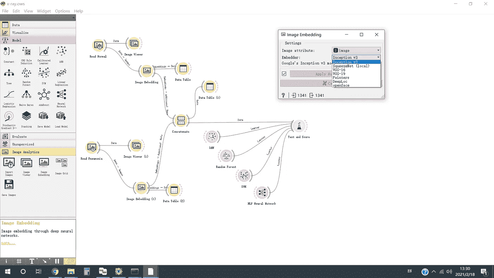
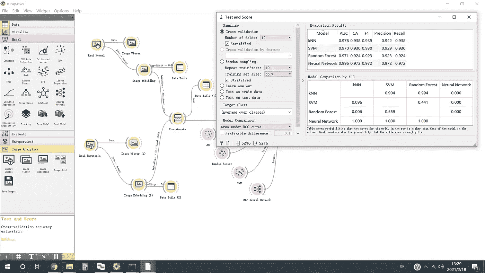

# 在 Orange 机器学习/深度学习平台下检测胸部 x 光图像中的肺炎

> 原文：<https://towardsdatascience.com/detecting-pneumonia-in-chest-x-ray-images-under-orange-machine-learning-deep-learning-platform-dd7b6ca6bd4c?source=collection_archive---------32----------------------->

[Orange](https://orangedatamining.com/) 是一个面向数据科学和机器学习项目的可视化编程环境。在 Orange 下，用户可以拖放类似乐高的组件来构建一个完整的解决方案，包括他/她的项目的数据操作/可视化和模型构建/训练/验证。这篇文章阐述了开发和比较不同的二进制分类模型对正常胸部 x 光图像和肺炎胸部 x 光图像橙色的过程。

**图一。橙色屏幕截图—小部件(左)、工作流程(中)、图像查看器(右)。**

以下是关于数据、模型和结果的简介:

*   1341 张正常胸片和 3875 张肺炎胸片；
*   66%用于培训，34%用于验证；
*   用于特征提取的 Inception v3 和用于特征分类的多层感知器一起实现 AUC 为 0.996，F1 得分为 0.972；

这篇文章的灵感来自于[使用橙色的图像分类——通过胸部 x 光](https://www.youtube.com/watch?v=rbhfQp_lp1I&t=7s)预测肺炎。视频和这篇帖子的区别在于，视频的重点是预测过程，而这里的重点是展示不同模型的开发和比较过程。

这篇文章的其余部分组织如下:介绍数据集，开发特征提取和特征分类的机制，并介绍不同模型的性能结果。

# 胸部 X 射线图像数据集

 [## 胸部 x 光图像(肺炎)

### 5，863 张图片，2 个类别

www.kaggle.com](https://www.kaggle.com/paultimothymooney/chest-xray-pneumonia) 

数据集分为 3 个文件夹(train/val/test ),并包含每个图像类别(正常/肺炎 jpeg)的子文件夹。表 1 显示了所有文件夹下的图像数量。这篇文章只使用火车文件夹进行研究。

**表 1。图像文件夹。**

# 肺炎图像分类的工作流程

**图二。完整的工作流程。**

**图 2** 显示了构建、训练和比较我们的模型的工作流程。

1.  **读取正常胸片图像并提取其特征** —【图 2/左上】*读取正常*使用*导入图像控件*从*训练/正常*中读取正常胸片图像；"*图像嵌入小工具*"将图像转换成其特征(其机制将在后面讨论)；“*图像查看器控件*”和“*数据表控件*”分别用于检查图像和特征。
2.  **读取肺炎胸片图像并提取其特征** —【图 2/左下】*读取肺炎*使用*导入图像控件*从*列车/肺炎*读取肺炎胸片图像；"*图像嵌入小工具*"将图像转换成其特征(其机制将在后面讨论)；“*图像查看器微件*”和“*数据表微件*”分别用于检查图像和特征。
3.  **合并正常胸片图像和肺炎胸片图像的特征列表** —【图 2/中心】*连接小工具*合并特征列表，并指定图像来源为标签。
4.  **训练和比较四个特征分类器** —【图 2/右】四个特征分类器，kNN、随机森林、SVM、MLP 神经网络，分别从各自的 widgets 导入。*测试和范围小部件*显示最终结果。

**图 3** 显示了由*图像查看器小工具导出的一些正常的胸部 x 光图像。*”

**图三。“图像查看器小部件”显示一些胸部 x 光图像。**

**图 4** 展示了深度学习模型(如 *VGG16* 、 *VGG19* 、 *Inception V3* 、 *SqueezeNet* 等)。)由"*图像嵌入小工具支持。**《盗梦空间》v3* 被选为研究对象。注意:这里的过程是一个预先训练好的深度卷积神经网络进行特征提取和传统的分类器或多层感知器进行特征分类的结合。请查阅参考资料，了解更多详情。

**图四。“图像嵌入小部件”支持几种深度学习模型。**

# 性能赋值

**图 5** 显示了 kNN、随机森林、SVM 和 MLP 神经网络四种分类模型下的性能指标。

**图 5。“测试和范围小部件”显示验证结果。**

# 结论

作为一名程序员，我习惯于一行一行地编码，并在试错的基础上开发/比较特定问题的不同模型，我很欣赏 Orange 为图像分类提供了如此优雅的解决方案。首先，Orange 提供了一种快速原型化基本想法的简单方法，这是深入了解新问题的必要步骤。第二，Orange 为未来的基准测试和改进提供了一个基线，例如应用高级模型、迁移学习、数据扩充等。第三。可能最重要的是，Orange 展示了为数据科学和机器学习设计可视化编程环境的哲学和原则，例如，使用预先训练的模型来获得嵌入，提供简单的机制来可视化原始数据和表示等。相比之下，在 Orange 中缺乏最新的高级深度学习图像分类模型似乎是解决问题的一个小挫折。

感谢阅读。如果你有任何意见，请随时给我留言。

# **参考文献**

*   橙色图像分析[ [链接](https://www.youtube.com/watch?v=Iu8g2Twjn9U&list=PLmNPvQr9Tf-aRstY69vGAPO_c5RaceBhN&index=2)
*   可视化编程环境中支持深度学习的不同方法[ [链接](https://medium.com/datadriveninvestor/different-approaches-to-support-deep-learning-in-a-visual-programming-environment-c5c487ba4c7b)
*   在图像聚类中使用 Keras 的预训练模型进行特征提取[ [链接](https://franky07724-57962.medium.com/using-keras-pre-trained-models-for-feature-extraction-in-image-clustering-a142c6cdf5b1)
*   Keras 中预先训练的模型[ [链接](https://keras.io/api/applications/) ]
*   PyTorch [ [链接](https://pytorch.org/vision/0.8/models.html) ]中的预训练模型