# 使用 TinyML 和 TensorFlow 在 Arduino 上检测口袋妖怪

> 原文：<https://towardsdatascience.com/detecting-pokemon-on-an-arduino-using-tinyml-and-tensorflow-c204119771d7?source=collection_archive---------19----------------------->

## 用颜色来预测这是皮卡丘还是妙蛙种子

机器学习(ML)模型的部署环境正在发生变化。最近几年，我们从本地培训模型并在独立脚本上运行它们，发展到在大规模和专门的设置中部署它们。然而，该行业并不仅仅关注大规模生产的 ML，还关注其小型、便携式和可访问的对应产品——因为机器学习已经在嵌入式系统中找到了一席之地。

改进机器学习不仅仅是让算法变得更智能、更大。随着该领域的发展，它们的速度、尺寸和计算效率也有所提高。这一进步导致了 **TinyML** ，这是机器学习的子领域，涉及像**微处理器**这样的功率受限设备中的模型。

这篇文章解释了如何在一个 **Arduino NANO 33 BLE Sense** 微处理器上创建一个 TensorFlow 模型来检测神奇宝贝皮卡丘和妙蛙种子。我们将在这里看到的内容包括数据收集程序(在 Arduino 上完成)、简要的数据分析、模型训练、如何将所述模型转换为 Arduino 的**tensor flow Lite for micro controllers**库理解的格式，以及如何在设备上部署它。

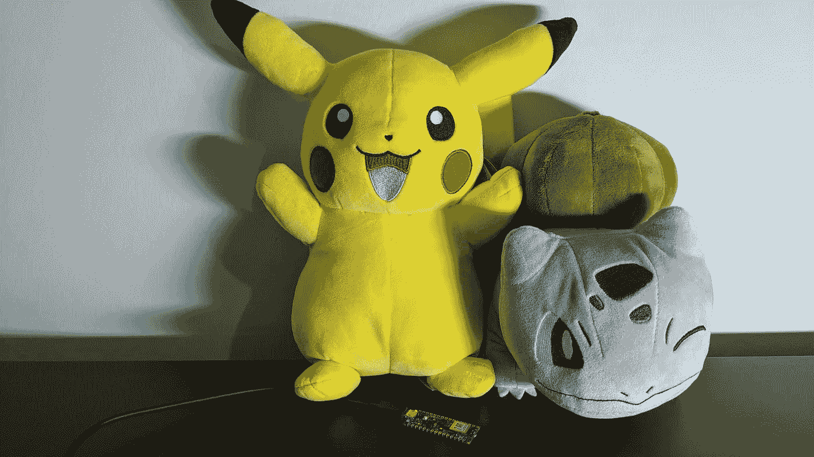

图 1:皮卡丘、妙蛙种子和阿杜伊诺。被我。

# 用于微控制器的 Arduino Nano 33 BLE 传感和 TensorFlow Lite

Arduino Nano 33 BLE 传感器是一个配备了各种传感器的微处理器。其中，我们将使用其 [APDS 9960](https://docs.broadcom.com/doc/AV02-4191EN) 传感器来测量光的颜色、光的强度，并检测接近度。光色探测器测量物体的**R**(ed)**G**(reen)**B**(lue)颜色强度；光检测器测量环境光的强度；近程探测器测量传感器附近是否有物体。

这款微处理器是少数支持**微控制器 TensorFlow Lite**的微处理器之一，TensorFlow C++库用于在微控制器上执行 tensor flow 模型。它是一个轻量级的库——它的核心运行时重约 16 KB，不需要操作系统支持或任何 C 或 C++库([source](https://www.tensorflow.org/lite/microcontrollers))——适合小型嵌入式设备。然而，它的大小是该库的一个限制，因为它缺少作为更大的 TensorFlow 库的一部分的许多操作符，例如用于 Python 的 TensorFlow。所以，我怀疑它能否运行大型 GAN 或变压器。

欲了解更多信息，请参考以下链接[微控制器 TensorFlow Lite】。](https://www.tensorflow.org/lite/microcontrollers)

# 检测草图

我们的**草图** (Arduino 对程序的术语)是一个皮卡丘和妙蛙种子检测器，采用了 TensorFlow (Python)中训练的逻辑回归模型。要触发预测，用户必须将口袋妖怪放在颜色传感器附近，以生成一组 RGB 值，模型将使用这些值来预测该对象是皮卡丘还是妙蛙种子。如果预测是皮卡丘，Arduino LED 变成黄色，或者如果是妙蛙种子，变成绿色。不管结果如何，它也会打印标签。

老实说，我可以把这个项目称为“黄色或绿色探测器”或“香蕉或梨探测器”，因为它测量的是颜色，而不是实际的物体。尽管如此，使用口袋妖怪是我最喜欢的用例，“检测黄色和绿色”不像“检测皮卡丘和妙蛙种子”那样吸引人

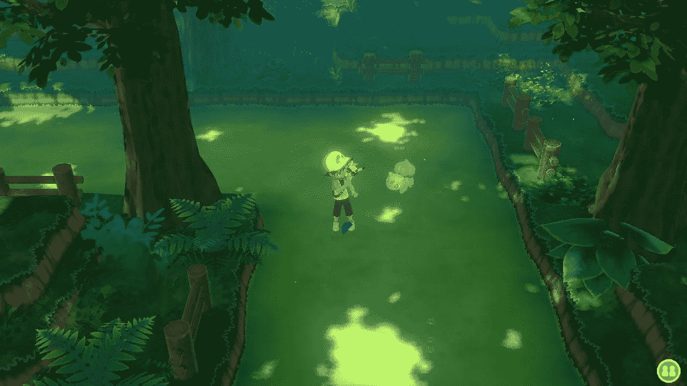

皮卡丘和妙蛙种子。我从我的游戏中截取的截图。任天堂的。

# 我的设置

对于这个项目，我使用的是 Arduino Nano 33 BLE Sense 和 Arduino 的桌面 IDE，你可以在 https://www.arduino.cc/en/software 的[找到。安装并打开后:](https://www.arduino.cc/en/software)

1.  进入工具->电路板->电路板管理器搜索“纳米 BLE”安装电路板相关的代码。
2.  进入工具->管理库，搜索“Arduino _ apds 9960”——传感器的库——并安装它。

更多信息请参见[https://blog . arduino . cc/2019/10/15/get-started-with-machine-learning-on-arduino/](https://blog.arduino.cc/2019/10/15/get-started-with-machine-learning-on-arduino/)。

开始吧！

# 数据收集

没有数据就没有机器学习。因此，第一步涉及收集训练数据。为了收集它，我写了一个草图，它读取 RGB 强度颜色并将其值作为七个元素的元组打印到 serial，其中前三个是传感器读取的 RGB 值**，接下来的三个是 RGB **比率**——通过将颜色值除以所有值的总和获得——最后一个是类**标签** —皮卡丘或妙蛙种子——我在脚本中指定的字符串。(我收集了两种格式的颜色读数，因为我想使用原始值分析数据，并用比率进行训练。)然后，使用串行监视器(相当于标准输出，或者可以看到草图打印内容的地方)，扫描您的对象并将打印值复制粘贴到 CSV 文件中。我创建了两个 CSV，一个用于皮卡丘(类标签为 0 ),另一个用于妙蛙种子(类标签为 1)。图 3 是我的串口监视器的截图；请注意带有列名和七个值的标题行。**

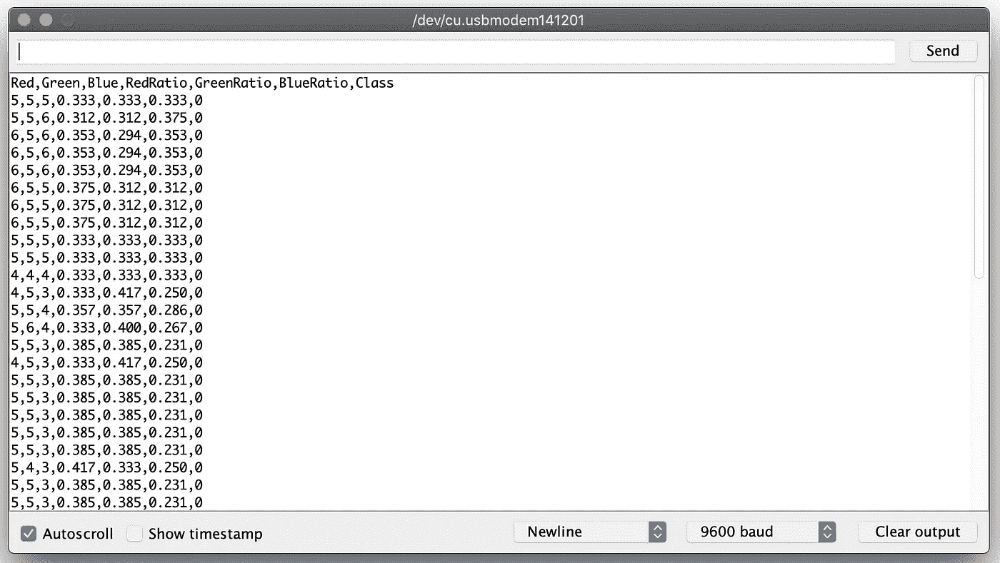

图 3。数据打印到串行。

下面是收集数据的代码，从[这里的](https://create.arduino.cc/editor/TensorFlowExamples/ca761558-13ed-4190-baee-89ced06147c3/preview)获得，并根据我的项目需要进行修改。让我们过一遍。

```
/*
  Object color sampler
  --------------------
  Samples the color of objects and outputs CSV logfile to serial console
  Hardware: Arduino Nano 33 BLE Sense board.
  Usage: Place object of interest to the color sensor
  This example code is in the public domain.Taken and modified from
  [https://create.arduino.cc/editor/TensorFlowExamples/ca761558-13ed-4190-baee-89ced06147c3/preview](https://create.arduino.cc/editor/TensorFlowExamples/ca761558-13ed-4190-baee-89ced06147c3/preview)
*/#include <Arduino_APDS9960.h>void setup()
{Serial.begin(9600);// Check if the Serial port is ready
    while (!Serial)
    {
    };// Check if the color sensor is ready
    if (!APDS.begin())
    {
        Serial.println("Error initializing APDS9960 sensor.");
    }// Print the header
    Serial.println("Red,Green,Blue,RedRatio,GreenRatio,BlueRatio,Class");
}void loop()
{
    // a is the ambient light intensity
    int r, g, b, a, p;
    float sum;// Check if both color and proximity data sample is available.
    while (!APDS.colorAvailable() || !APDS.proximityAvailable())
    {
    }// Read the color and proximity sensor.
    APDS.readColor(r, g, b, a);
    sum = r + g + b;
    p = APDS.readProximity();// if object is close and well enough illumated
    if (p == 0 && a > 10 && sum > 0)
    {float redRatio = r / sum;
        float greenRatio = g / sum;
        float blueRatio = b / sum;// Print the data in CSV format; the second argument is the number's precision.
        Serial.print(r);
        Serial.print(',');
        Serial.print(g);
        Serial.print(',');
        Serial.print(b);
        Serial.print(',');
        Serial.print(redRatio, 3);
        Serial.print(',');
        Serial.print(greenRatio, 3);
        Serial.print(',');
        Serial.print(blueRatio, 3);
        Serial.print(',');
        // This number is the class. Remember to change it!
        Serial.print('0');
        Serial.println();
    }
}
```

草图从`setup()`功能开始。这里，我们设置串行输出，检查颜色传感器是否[就绪](https://www.arduino.cc/en/Reference/ArduinoAPDS9960begin)，并打印 CSV 文件的文件头。第二个函数，`loop()`，是程序的主例程；除非你结束它，否则它会永远运行下去。它的第一条语句定义了 RBG 颜色强度变量、环境光强度和邻近度。然后，我们用`APDS.readColor(r, g, b, a)`读取颜色(和光强度)，接着对颜色值求和，用`APDS.readProximity()`读取接近度。该函数返回一个从 0 到 255 的值，其中 0 表示最近，255 表示最远([源](https://www.arduino.cc/en/Reference/ArduinoAPDS9960readProximity))。

读取值后，我们需要一个 if 语句，如果对象在传感器附近(p == 0)，如果场景光照充足(a > 10)，如果存在颜色(sum > 0)，则执行该语句。如果为真，它将计算颜色比率，并以 CSV 格式打印到串行。

现在我们有了数据集(图 4)。

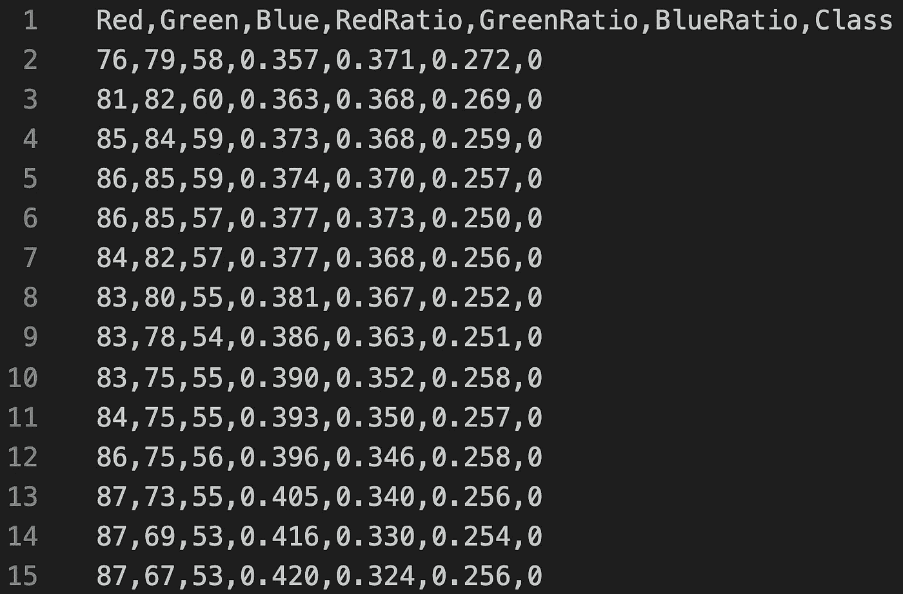

图 4。数据集的示例。

# 分析数据

我喜欢数据——包括探索数据和分析数据。在收集颜色数据时，我想知道如果我将原始颜色元组升级并转换为 RGB 颜色，会得到什么颜色。如前所述，传感器输出的 RGB 强度不是被扫描物体的真实 RGB 颜色。例如，扫描皮卡丘不会产生一串(255，255，0)-黄色的 RGB 颜色-而是一个类似(98，97，63)的元组，即“有很多红色、绿色，蓝色较少。”尽管如此，我还是很好奇，想看看这些元组在 RGB 尺度下是什么样子。(注意:RGB 颜色是一个[加法系统](https://en.wikipedia.org/wiki/RGB_color_model)，其中红色、绿色和蓝色光相加在一起，并表示为一个三元组，其中每个值都在 0 到 255 的范围内。)

下面是分析代码:

```
import cv2
import pandas as pd
import numpy as np
import matplotlib.pyplot as pltfrom sklearn.preprocessing import MinMaxScaler
from mpl_toolkits.mplot3d import Axes3D# For sampling the dataset
LENGTH = 2000# Read data
pikachu = pd.read_csv('data/pikachu_complete.csv')
bulbasaur = pd.read_csv('data/bulbasaur_complete.csv')# Get a sample of length LENGTH
pikachu = pikachu.sample(n=LENGTH, random_state=1)
bulbasaur = bulbasaur.sample(n=LENGTH, random_state=1)# Index the wanted columns
pikachu_vals = pikachu[['Red', 'Green', 'Blue']]
bulbasaur_vals = bulbasaur[['Red', 'Green', 'Blue']]# Upscale the values to the RGB scale.
pikachu_scaler = MinMaxScaler(feature_range=(0, 255))
bulbasaur_scaler = MinMaxScaler(feature_range=(0, 255))# Create new DataFrame with the scaled values.
pikachu_vals_scaled = pd.DataFrame(pikachu_scaler.fit_transform(
    pikachu_vals), columns=pikachu_vals.columns)
bulbasaur_vals_scaled = pd.DataFrame(bulbasaur_scaler.fit_transform(
    bulbasaur_vals), columns=bulbasaur_vals.columns)def draw_colors_rectangle(df):
    """
    This function draws the colors.
    """
    # The first two values of np.zeros(...) represent the length of the plot
    # the 3 is because of RGB
    plot_length = 150
    plot = np.zeros((plot_length, LENGTH, 3), dtype="uint8")# This loop draws in a rectangle the DataFrame's colors tuple.
    # I'm using sort to sort the colors based on its red color.
    # The reverse is for drawing them from darkest to lightest.
    for idx, val in enumerate(sorted(df.to_numpy(), key=lambda x: (x[0]),
                                     reverse=True)):
        cv2.rectangle(plot, (int(idx), 0), (int(idx+1), plot_length),
                      color=list(val), thickness=-1)plt.axis("off")
    plt.imshow(plot)
    plt.show()def draw_3d_plot(colors):
    r, g, b = zip(*colors)
    r = np.array(r) / 255.0
    g = np.array(b) / 255.0
    b = np.array(b) / 255.0x = np.array(colors)fig = plt.figure()
    ax = Axes3D(fig)ax.scatter(r, g, b, c=x/256.0)
    ax.set_title("Pixel 3D plot")
    ax.set_xlabel('R')
    ax.set_ylabel('G')
    ax.set_zlabel('B')
    fig.set_size_inches(14, 8)
    plt.show()draw_colors_rectangle(pikachu_vals_scaled)
draw_colors_rectangle(bulbasaur_vals_scaled)
draw_3d_plot(pikachu_vals_scaled.to_numpy())
draw_3d_plot(bulbasaur_vals_scaled.to_numpy())
```

首先，我加载了所需的库—[**scikit—learn**](https://scikit-learn.org/stable/)， [**Matplotlib**](https://matplotlib.org/stable/index.html) ，**[**OpenCV**](https://pypi.org/project/opencv-python/)，和**[**Pandas**](https://pandas.pydata.org/)**—**然后是数据集和索引想要的列。然后，我使用 scikit-learn 的 [MinMaxScale](https://scikit-learn.org/stable/modules/generated/sklearn.preprocessing.MinMaxScaler.html) 将值提升到 RGB 比例，例如`pikachu_scaler = MinMaxScaler(feature_range=(0, 255))`，并创建了`draw_colors()`函数。这个函数有一个参数 RGB 数据帧——并使用`[cv2.Rectangle()](https://docs.opencv.org/master/d6/d6e/group__imgproc__draw.html#ga07d2f74cadcf8e305e810ce8eed13bc9)`创建一个矩形，其中每个条目都是一种颜色。创建矩形的循环迭代经过排序和反转的数据帧，从最暗(255)到最亮(0)绘制颜色。图 5 和图 6 显示了颜色。****

********

****图 5。皮卡丘的数据集放大了 RGB 颜色。****

********

****图 6。妙蛙种子的数据集放大了 RGB 颜色。****

****我的小颜色实验并没有像我想象的那样成功。第一张图片展示了皮卡丘升级的传感器读取的颜色，它没有黄色。另一方面，妙蛙种子的颜色似乎有各种各样的绿色调。在第二次尝试将颜色可视化时，我将它们绘制在一个 3D 散点图中(图 7 和图 8)。****

****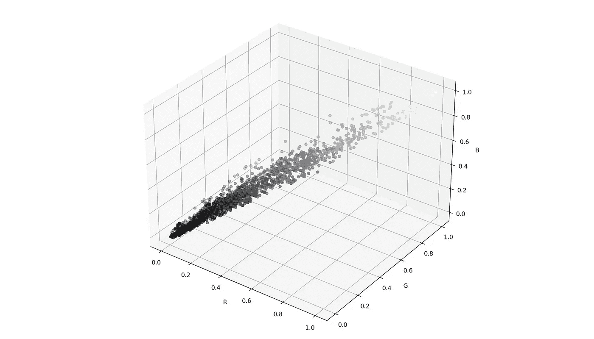****

****图 7。皮卡丘的数据集在 3D 中放大了 RGB 颜色。****

****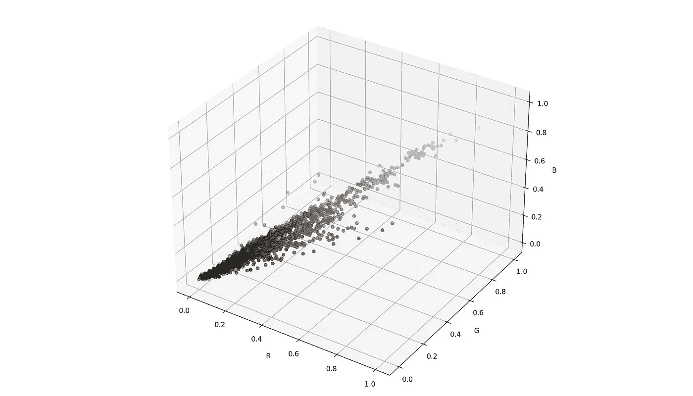****

****图 8。妙蛙种子的数据集在 3D 中放大了 RGB 颜色。****

****除了绘制颜色，这些可视化显示它们的范围和关系。皮卡丘的原色是黄色，一种由红色和绿色获得的颜色。这就是为什么图表显示了这些音调之间的线性关系。然而，第二张图有更纯的绿色和更多的蓝色，因为这些是妙蛙种子的颜色。****

# ****训练模型****

****我的皮卡丘和妙蛙种子分类器是用 Python 中的 TensorFlow 训练的逻辑回归模型。网络有一个单元的层，输入形状为 3(因为我们有三个特征)，它用 Adam 优化器训练，学习率为 0.01，并使用二进制交叉熵损失函数。由于激活是 sigmoid，所以它的输出是一个 0 到 1 之间的数其中 0 是皮卡丘，1 是妙蛙种子；在逻辑回归模型中，我们通常将阈值设置为 0.50，这意味着其下的任何值都是 0 类，大于或等于的值是 1 类。我使用 10 个时期、0.1 的验证分割和回调来拟合模型，以查看 TensorBoard 中的进度。以下是培训代码:****

```
**import datetime
import osimport pandas as pd
import tensorflow as tf
from sklearn.metrics import classification_report
from sklearn.model_selection import train_test_splitLENGTH = 2000
ts = datetime.datetime.now().strftime("%Y%m%d-%H%M%S")# TensorBoard directory
log_dir = "/tmp/tensorboard/{}".format(ts)
tensorboard_callback = tf.keras.callbacks.TensorBoard(
    log_dir=log_dir, histogram_freq=1)# Select a subset of the data
pikachu = pd.read_csv('data/pikachu_df.csv').sample(n=LENGTH, random_state=1)
bulbasaur = pd.read_csv(
    'data/bulbasaur_df.csv').sample(n=LENGTH, random_state=1)# Create the DataFrame
X = pd.concat([pikachu, bulbasaur])
y = X.pop('Class')# Use 30% of data for testing
X_train, X_test, y_train, y_test = train_test_split(
    X, y, test_size=0.3, random_state=0)model = tf.keras.Sequential(
    tf.keras.layers.Dense(units=1,
                          input_shape=[3],
                          activation='sigmoid')
)model.compile(
    optimizer=tf.optimizers.Adam(learning_rate=0.01),
    loss=tf.keras.losses.BinaryCrossentropy(),
    metrics="accuracy"
)model.fit(X_train, y_train,
          epochs=10,
          validation_split=0.1,
          callbacks=[tensorboard_callback],
          )# Predict and assess
y_pred = model.predict(X_test)
preds = [1 if x > 0.50 else 0 for x in y_pred]
print(classification_report(y_test, preds))**
```

****至于其训练性能，该模型在训练期间实现了 0.97 和 0.43 的准确度和损失，在验证数据上实现了 0.96 和 0.42。图 9 和图 10 给出了张量板图。要访问 TensorBoard，从终端执行`tensorboard --logdir /tmp/tensorboard`；确保您使用的是第 13 行中的父目录。****

****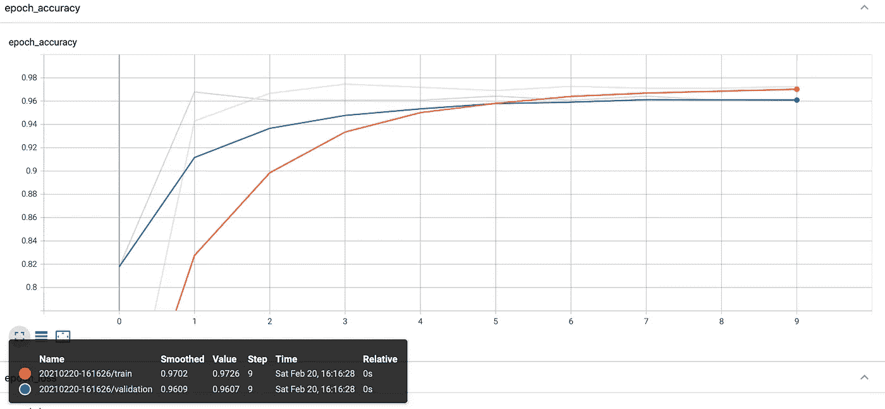****

****图 9:训练和验证数据的历元精度。****

****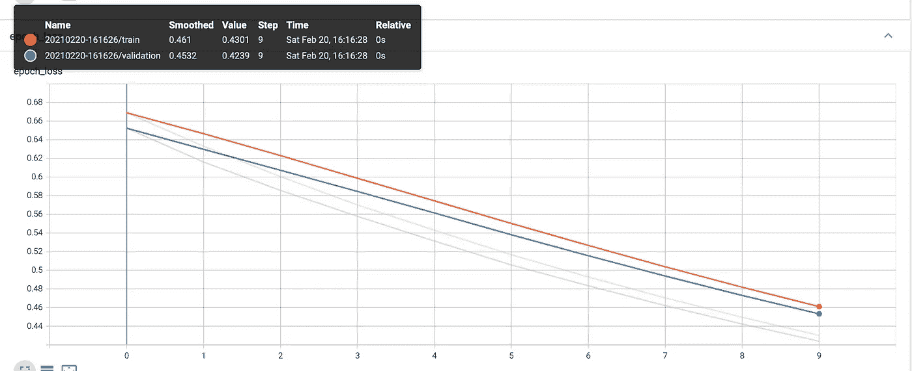****

****图 10:训练和验证数据的纪元丢失。****

****训练之后，我使用测试数据集进行预测。然后，我将结果转换为 0 或 1，这取决于可能性是小于还是大于 0.50 的阈值。最后，我使用 scikit-learn 的[分类报告](https://scikit-learn.org/stable/modules/generated/sklearn.metrics.classification_report.html)来评估模型的性能。图 11 显示了这些数字。****

****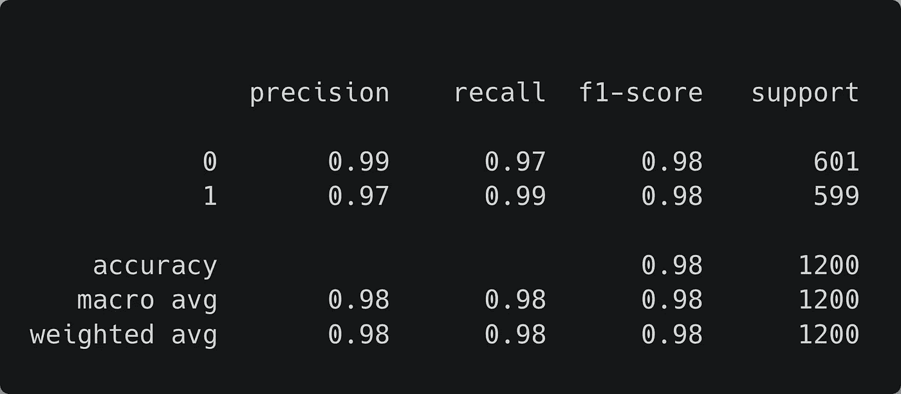****

****图 11:测试数据集的分类报告。****

****由于到处都是 0.97+的值，我们可以假设模型按预期工作。****

# ****转换模型****

****我们不能在 Arduino 上使用这个模型。首先，我们必须将其转换为 TensorFlow Lite 模型，然后在 C++头文件中将其编码为字节数组。就像这样(将下面几行添加到培训脚本中):****

```
**# Convert the model
converter = tf.lite.TFLiteConverter.from_keras_model(model)
tflite_model = converter.convert()# Save the model to disk
model_path = "model/pika_bulba{}.tflite".format(ts)
open(model_path, "wb").write(tflite_model)print("Model is {} bytes".format(os.path.getsize(model_path)))**
```

****这些行将模型转换为 TensorFlow Lite 模型，并将其保存到磁盘。导出后，我们检查模型的大小(以字节为单位)以确保它很小——我的是 984 字节。然后，从终端运行`xxd -i model_path > model.h`将模型编码为一个名为 *model.h* 的 C++头文件中的字节数组。这个文件是我们将加载到 Arduino 程序中的模型。****

****它应该是这样的(为了简单起见，我删除了大部分值):****

```
**unsigned char model[] = {
  0x1c, 0x00, 0x00, 0x00, 0x54, 0x46, 0x4c, 0x33, 0x14, 0x00, 0x20, 0x00,
  0x04, 0x00, 0x08, 0x00, 0x0c, 0x00, 0x10, 0x00, 0x14, 0x00, 0x00, 0x00,
  0x18, 0x00, 0x1c, 0x00, 0x14, 0x00, 0x00, 0x00, 0x03, 0x00, 0x00, 0x00,
  ...
};
unsigned int model_pika_bulba20210108_190240_tflite_len = 984;**
```

# ****Arduino 的分类器草图****

****现在是我们期待已久的教程部分:编写 Arduino 的分类器草图。作为数据收集草图，我使用了一个官方示例作为基础，并根据我的情况进行了修改。为了更好地解释它，我将把代码分成三部分:includes 语句和变量初始化，以及 setup 和 loop 函数。****

****在 Arduino 的 IDE 中，进入文件->新建开始一个新的草图。创建一个新文件，将其命名为 *classifier.ino* ，并添加:****

```
**/*
  Object classifier by color
  --------------------------Uses RGB color sensor input to Neural Network to classify objects
  Outputs object class to serial using unicode emojisNote: The direct use of C/C++ pointers, namespaces, and dynamic memory is generally
        discouraged in Arduino examples, and in the future the TensorFlowLite library
        might change to make the sketch simpler.Hardware: Arduino Nano 33 BLE Sense board.Created by Don Coleman, Sandeep Mistry
  Adapted by Dominic PajakThis example code is in the public domain.Example inspired by
  [https://create.arduino.cc/editor/TensorFlowExamples/8508c70f-5155-4e3b-b982-c5f6bd36ea5c/preview](https://create.arduino.cc/editor/TensorFlowExamples/8508c70f-5155-4e3b-b982-c5f6bd36ea5c/preview).
  I've modified it to suit my use case.
*/#include <TensorFlowLite.h>#include "tensorflow/lite/micro/all_ops_resolver.h"
#include "tensorflow/lite/micro/micro_error_reporter.h"
#include "tensorflow/lite/micro/micro_interpreter.h"
#include "tensorflow/lite/schema/schema_generated.h"
#include "tensorflow/lite/version.h"
#include "Arduino_APDS9960.h"
#include "model.h"// Set up logging
tflite::MicroErrorReporter tflErrorReporter;// Add all the TensorFlow Lite Micro operations
tflite::AllOpsResolver tflOpsResolver;const tflite::Model *tflModel = nullptr;
tflite::MicroInterpreter *tflInterpreter = nullptr;
TfLiteTensor *tflInputTensor = nullptr;
TfLiteTensor *tflOutputTensor = nullptr;// Create a static memory buffer for TFLM, the size may need to
// be adjusted based on the model you are using.
constexpr int tensorArenaSize = 8 * 1024;
byte tensorArena[tensorArenaSize];**
```

****这段代码包含加载库和初始化几个变量的 include 语句。第一个是`[tflErrorReporter](https://www.tensorflow.org/lite/microcontrollers/get_started#4_set_up_logging)`，它是一个日志记录器，传递给解释器来写日志。接下来是`tflOpsResolver`，一个`[AllOpsResolver](https://www.tensorflow.org/lite/microcontrollers/get_started#6_instantiate_operations_resolver)`的实例，一个加载所有 TensorFlow Lite 微库操作的类。然后我们有[模型](https://www.tensorflow.org/lite/microcontrollers/get_started#5_load_a_model)、[解释器](https://www.tensorflow.org/lite/microcontrollers/get_started#8_instantiate_interpreter)(负责预测)、保存模型输入和输出的张量，以及用于输入、输出和中间传感器的[内存分配](https://www.tensorflow.org/lite/microcontrollers/get_started#7_allocate_memory)。****

****在继续之前，创建一个名为 *model.h* 的新文件，并复制/粘贴我们在上一节中创建的编码模型。****

****接下来是`setup()`函数(将这部分代码添加到`byte tensorArena[tensorArenaSize]`行之后)。****

```
**void setup()
{
    Serial.begin(9600);
    while (!Serial)
    {
    };Serial.println("Pokemon classification using RGB color sensor");
    Serial.println("--------------------------------------------");
    Serial.println("Arduino Nano 33 BLE Sense running TensorFlow Lite Micro");
    Serial.println("");if (!APDS.begin())
    {
        Serial.println("Error initializing APDS9960 sensor.");
    }// Initialize the led's.
    pinMode(LEDR, OUTPUT);
    pinMode(LEDG, OUTPUT);// Ensure it is off by default
    // On the Arduino NANO 33 BLE Sense, HIGH is off.
    digitalWrite(LEDR, HIGH);
    digitalWrite(LEDG, HIGH);// get the TFL representation of the model byte array
    tflModel = tflite::GetModel(model);
    if (tflModel->version() != TFLITE_SCHEMA_VERSION)
    {
        Serial.println("Model schema mismatch!");
        while (1)
            ;
    }// Create an interpreter to run the model
    tflInterpreter = new tflite::MicroInterpreter(tflModel, tflOpsResolver, tensorArena, tensorArenaSize, &tflErrorReporter);// Allocate memory for the model's input and output tensors
    tflInterpreter->AllocateTensors();// Get pointers for the model's input and output tensors
    tflInputTensor = tflInterpreter->input(0);
    tflOutputTensor = tflInterpreter->output(0);
}**
```

****它首先设置串行，打印一些行，然后等待传感器准备就绪。接下来，它初始化红色和绿色 led 并关闭它们。然后，它加载模型，初始化解释器(注意参数是前面声明的变量)，分配内存，并获得指向模型输入和输出的指针。现在来了`loop()`函数(写在`setup()`之后):****

```
**void loop()
{
    // a is the ambient light intensity.
    int r, g, b, a, p;
    float sum;// Check if both color and proximity data sample is available.
    while (!APDS.colorAvailable() || !APDS.proximityAvailable())
    {
    }// Read the color and proximity sensor.
    APDS.readColor(r, g, b, a);
    p = APDS.readProximity();
    sum = r + g + b;// Check if there's an object close and well illuminated enough.
    if (p == 0 && a > 10 && sum > 0)
    {// Normalize the values.
        float redRatio = r / sum;
        float greenRatio = g / sum;
        float blueRatio = b / sum;// Input sensor data to the loaded model.
        tflInputTensor->data.f[0] = redRatio;
        tflInputTensor->data.f[1] = greenRatio;
        tflInputTensor->data.f[2] = blueRatio;// Invoke the inference.
        // This is a great guide explaining the process
        // [https://www.tensorflow.org/lite/guide/inference](https://www.tensorflow.org/lite/guide/inference)
        TfLiteStatus invokeStatus = tflInterpreter->Invoke();
        if (invokeStatus != kTfLiteOk)
        {
            Serial.println("Invoke failed!");
            while (1)
                ;
            return;
        }// 0.50 is my threshold
        if (tflOutputTensor->data.f[0] < 0.50)
        {
            Serial.print("Pikachu: ");
            // Turn on the red and green LEDs to get yellow.
            digitalWrite(LEDR, LOW);
            digitalWrite(LEDG, LOW);
        }
        else
        {
            Serial.print("Bulbasaur: ");
            // Turn on the green LED.
            digitalWrite(LEDG, LOW);
        }Serial.print(float(tflOutputTensor->data.f[0]), 5);
        Serial.println();// Wait until the sensor does not detect the object.
        while (!APDS.proximityAvailable() || (APDS.readProximity() == 0))
        {
        }// Turn off the LEDs.
        digitalWrite(LEDR, HIGH);
        digitalWrite(LEDG, HIGH);
    }
}**
```

****`loop()`函数的第一行与颜色取样器草图中的相同；它声明颜色、光强度、接近度和总和变量，并检查是否有可用的颜色和接近度数据。如果是这样，我们读取颜色值，并检查对象是否在附近，场景是否光照充足。在`if`中，我们将这些值标准化，并将它们作为模型在`tfInputTensor`变量中的输入。然后，我们使用解释器*调用推理*(相当于 Python 的 TensorFlow 的 predict)。与其他 ML 库不同，调用解释器不会返回预测向量；相反，它返回预测的状态(成功还是失败)。****

****为了得到预测值，我们必须使用 setup 函数中声明的输出张量(解释器*通过引用*将预测传递给这个张量)。在读取预测时，我们检查该值是否低于 0.50 阈值。如果为真，那么预测值就是皮卡丘，所以我们打印“皮卡丘”并打开红色和绿色 LED——红色+绿色=黄色，Arduino 只有一个红色、绿色和蓝色 LED。否则，我们打印“妙蛙种子”并打开绿色 LED。最后，我们打印预测，等到传感器检测不到物体，并重置 led。****

****就是这样！快乐推断:)****

****以下是一些例子(注意 Arduino 的 LED 颜色):****

****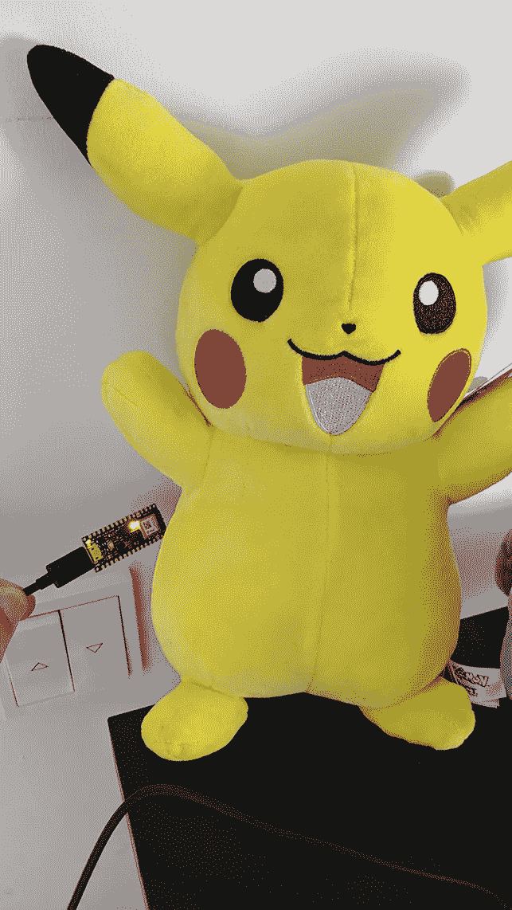****

****图 12:检测到皮卡丘！****

****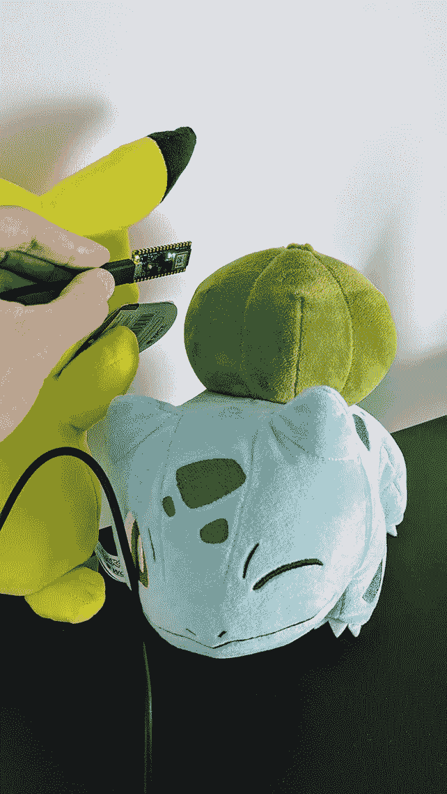****

****图 13:检测到白头翁！****

# ****总结和结论****

****TinyML 是机器学习领域，涉及适用于低功耗和嵌入式设备的模型。在本文中，我展示了一个如何使用其中一个的示例，一个 Arduino Nano 33 BLE Sense，以及用于微控制器的 TensorFlow Lite 库，来创建一个将我的口袋妖怪 plushies 分类为皮卡丘或妙蛙种子的程序。在本教程中，我解释了如何使用 Arduino 收集数据，展示了探索数据集颜色的数据分析，在 TensorFlow 中训练了一个逻辑回归模型，将所述模型导出到 TensorFlow Lite，并编写了一个草图，将模型加载到 Arduino，以便我们可以根据它进行预测。****

****有关 Arduino 和 tensor flow Lite for micro controllers 库的更多信息，请访问以下链接:****

*   ****[在 Arduino 上开始机器学习](https://blog.arduino.cc/2019/10/15/get-started-with-machine-learning-on-arduino/)****
*   ****皮特·沃顿和丹尼尔·斯图纳亚克的书****
*   ****[面向微控制器的 TensorFlow Lite】](https://www.tensorflow.org/lite/microcontrollers)****
*   ****[微控制器入门](https://www.tensorflow.org/lite/microcontrollers/get_started)****
*   ****[TensorFlow Lite 推断](https://www.tensorflow.org/lite/guide/inference)****

****您可以在以下位置找到完整的代码(包括我的数据集和模型):****

****[](https://github.com/juandes/pokemon-classifier-tinyml) [## juandes/pokemon-分类器-tinyml

### 这个库包含我的实验“使用 TinyML 在 Arduino 上检测口袋妖怪”中使用的代码和资源

github.com](https://github.com/juandes/pokemon-classifier-tinyml) 

感谢阅读！****