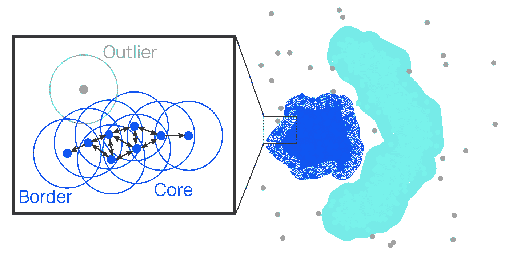
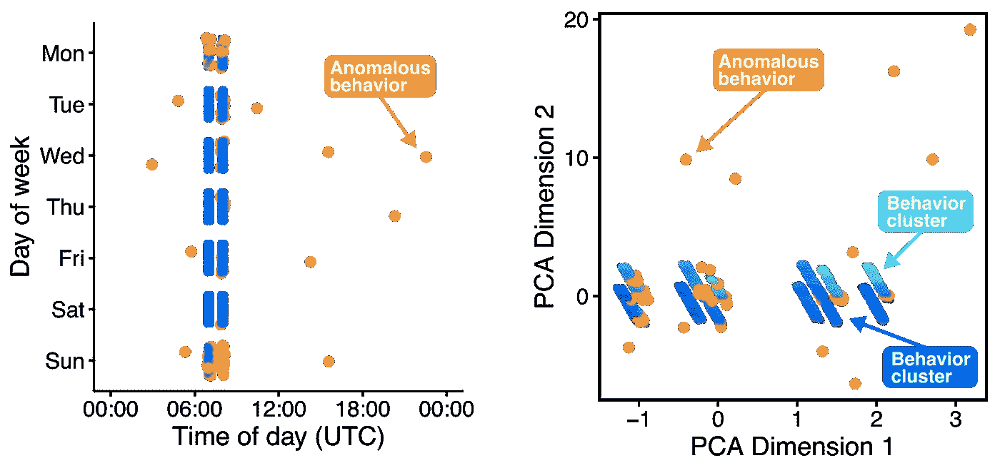
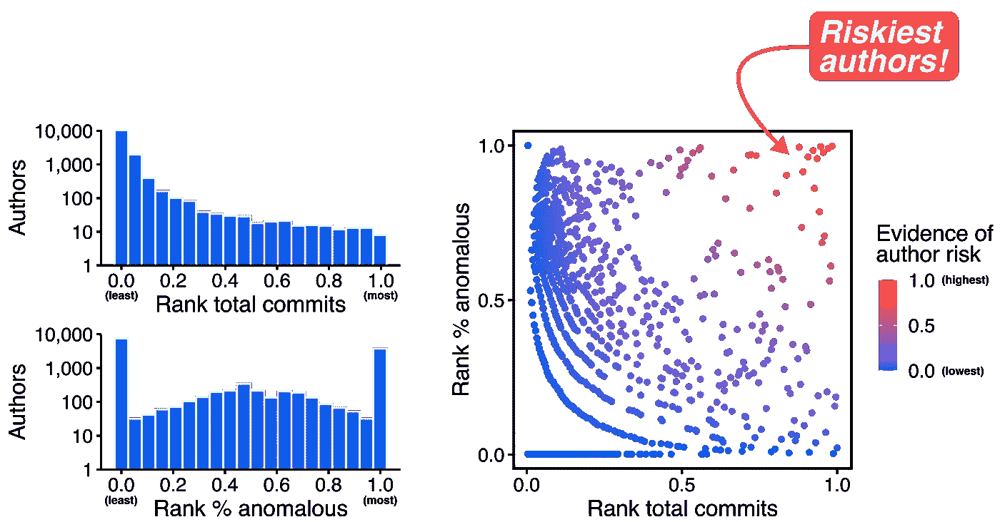

# 检测 GitHub 中潜在的不良行为者

> 原文：<https://towardsdatascience.com/detecting-potential-bad-actors-in-github-40914376fc31?source=collection_archive---------28----------------------->

## [行业笔记](https://towardsdatascience.com/tagged/notes-from-industry)

## 使用无监督机器学习在开源软件作者中发现异常行为

来源: [Unsplash](https://unsplash.com/photos/WDbuusPOnkM)

庞大的开源软件生态系统包含数百万个软件包和数千万贡献作者。这既是开源软件的优势，也是它的弱点:它的众包性质意味着软件包会不断更新和创新(免费！)，同时使它们容易被某些人插入一些有害的代码。因此，为了真正检测开源软件生态系统中的风险，我们应该像关心代码本身一样关心它的社会组成部分——成千上万软件作者的行为和互动。

作为网络安全初创公司 [Phylum](https://phylum.io/) 的一名数据科学家，我正在接受这个挑战，在原本良性的干草堆中寻找众所周知的恶意针头:我们能否使用机器学习来检测开源软件作者的异常行为？Phylum 的使命是保护代码世界，从开源软件供应链安全开始，通过构建应用机器学习、深度分析和静态代码分析的技术来保护系统免受远远超过已知软件漏洞的影响，如软件作者的潜在社会风险。这就是我来的原因:我在这里探索大量的数据，发现风险的模式，并建立可以自动检测大规模风险的模型。

那么，我们为什么要关心代码作者的行为，例如，谁在什么时候贡献了代码？更具体地说，当某人的行为显得“不寻常”时，我们为什么要在意呢？嗯，不良行为者可能会损害正常软件作者的 GitHub 或 GitLab 帐户，将恶意代码插入到软件包中。通过这种方式，他们可以在一个正直的软件公民借来的面具下，迅速将有害代码匿名混入包中，降低被发现的几率。这个问题进一步延伸到*包维护者*的安全模型，因为他们是供应链攻击的重要目标。

在本帖中，我们概述了通过分析对版本控制系统(如 GitHub 或 GitLab)的提交来标记潜在异常和/或恶意行为的能力。

# 使用数据来理解作者的行为

GitHub 数据允许我们了解作者的代码贡献活动。例如，在图 1 中，我们可以看到这位作者有一个非常规律的行为模式:他们倾向于在每天 07:00 或 08:00 UTC 推送代码，这种行为模式随着时间的推移保持稳定，除了 2017 年末和 2018 年初的一些提交。

像这样的见解是建立对作者“常规”行为的基线理解的关键。尽管 GitHub 提供了 UTC 时区的所有提交时间戳，并且作者缺乏具体的地理位置数据，但我们可以使用提交行为数据来了解作者的正常工作日。以我为例:由于我在西海岸工作，我的大部分工作提交活动可能发生在世界协调时 15:00-24:00(当地时间上午 8 点到下午 5 点)，任何课外项目提交都发生在晚上，比如世界协调时 00:00-05:00(当地时间下午 5 点到 10 点)。因此，我们可以根据我写代码的时间推断出我的活动时间——甚至可能是我的时区。

通过了解什么是正常行为，我们可以更好地标记不寻常的提交，并可能是受损帐户的工作。例如，如果我的帐户在太平洋标准时间凌晨 3 点提交了一个我以前从未参与过的新项目，它应该会抛出一个大红旗！类似地，仅仅观察下图中作者的行为，我们可能会本能地质疑在通常的 07:00/08:00 窗口之外的几个提交。

当然，单独的异常活动可能不会带来安全风险。(或许，我是在异地度假的时候推代码的吧！)但是，如果我们能够将这种行为分析的证据与 Phylum 的其他分析结合起来，我们就可以更有把握地标记潜在的安全问题。例如，如果我们发现一个有很多突发异常行为的作者也推送了带有潜在恶意元素的代码，我们就更确定这是一个不良行为者的作品，而不是单独使用任何一条信息。

***图 1****——我们可以从一个作者的 Github 数据中提取的行为数据的例子。每个面板比较 Github 提交数据的不同维度。显示的每个点都是作者对项目的提交。*

# 教机器发现不寻常的作者行为

虽然我们当然可以手动检查每个作者的行为，手动标记可疑的提交，但我们在 Phylum 致力于使用自动和严格的方法来发现安全问题。所以取而代之，我们用机器学习！这允许我们扫描数百万作者的行为，并自动标记可疑的提交行为。

为了找到不寻常的作者行为，我们使用[DBS can](https://en.wikipedia.org/wiki/DBSCAN)——一种经典的无监督学习方法——将数据聚类为“正常”和“不寻常”的作者行为。如图 2 所示，这种方法使用数据点的密度来确定聚类的位置:彼此相距一定距离的点被认为是邻居，并且是同一聚类的一部分；没有任何邻居的点被视为异常值。(顺便说一句，作为一名以社交网络为中心的博士，我非常喜欢这种聚类算法，因为它本质上构建了一个数据点网络，在我们的数据人群中找到派系和孤独者。)

与使用的其他聚类方法相比，DBSCAN 在发现数据中的异常值方面特别有优势。首先，它需要提前设置更少的参数。其他聚类方法(例如 K-means)要求我们提前设置聚类数，这一选择会极大地影响模型的性能。相反，对于 DBSCAN，我们只需要告诉算法数据点需要与标记的“邻居”有多近，以及需要多少个邻居才能被认为是聚类的一部分。(我们也可以使用[尖端方法](https://iopscience.iop.org/article/10.1088/1755-1315/31/1/012012)自动设置这些参数。)其次，DBSCAN 自然地将我们的孤立数据点标记为离群值，因为它们没有被分配到一个集群。其他算法需要在聚类后进一步按摩以检测异常值:例如，K-means 会首先将所有点分配给一个聚类，然后让我们计算每个点与其分配的聚类中心的距离，并确定将每个点分类为异常值的阈值距离。

**图 2** —机器学习聚类算法 DBSCAN 的可视化解释。彼此在一定距离内的点被认为是邻居。具有足够多邻居的点被认为是一个聚类的核心。几乎没有邻居的点标记了一个聚类的边缘。没有邻居的点是异常值。(图改编自 DBSCAN 上的[维基百科词条](https://en.wikipedia.org/wiki/DBSCAN)。)

# 自动检测异常行为

回到我们之前的例子作者:这种无监督的机器学习方法可以发现不寻常的行为吗？

我们为机器学习清理和准备我们的数据，缩放数据并将某些数据点(例如，一周中的某一天)转化为模型可以理解的定量测量。我们还使用一种允许我们使用定量(例如，一天中的时间、一周中的日期)和定性(例如，GitHub 项目 ID)数据的方法，为我们的模型提供更多可供学习的信息！

幸运的是，我们可以使用提交的确切日期(和时间)来为每个作者创建一种“滚动”的正常感觉。我们通常希望将行为作为一个时间序列来分析:人们可能会因为合理的原因而移动位置(以及时区)并改变他们的行为。因此，在我们的模型中使用提交日期/时间可以确保我们将同一时间段的数据相互比较，从而允许模型在识别行为的突然变化的同时考虑行为的逐渐、自然的变化。

在我们的示例作者上运行我们的模型，我们看到它成功地挑选出异常行为！请看图 3，我们看到模型标记了那些不符合通常的 07:00/08:00 模式的提交。然而，我们看到该模型还发现了一些其他不寻常的提交，主要是在周末。

因此，我们看到这个模型已经超越了仅仅观察数据和发现行为的能力，否则很难发现这些行为。

**图 3** — ( *左*)显示了作者在一周中的每一天和一天中的每一个时间的提交，模型认为不寻常的提交用橙色标记。(右图)使用 PCA 将作者的提交数据(具有许多特征)投影到二维空间中，使我们可以轻松地显示数据簇(蓝色阴影)和异常值(橙色)。

# 大规模检测高风险作者

该模型已经显示了它在学习一个作者的行为方面的用途，但是如果我们同时在数千或数百万作者中运行它会怎么样呢？Phylum 构建的平台支持这种类型的分析，以及更多。我们使用这篇文章中概述的工作为每个作者创建 ML 模型，让我们能够了解他们特定的行为模式。现代分布式系统真的令人难以置信！

Phylum 正在不断改进我们的作者风险分析，以允许用户管理使用互联网上随机陌生人编写的代码所带来的风险。这里记录的工作提供了有价值的证据，作为对 Phylum 的作者风险评分的输入。这与其他分析、启发和模型相结合，以持续保护 Phylum 的用户。

为了创建作者风险的证据，我们采用我们的 ML 模型的发现，并使用一个简单的逻辑:一个*有风险的作者*有相对高的提交数量和相对高的异常行为百分比。为什么？嗯，一个很少提交的作者为机器学习模型提供了很少的证据——毕竟，很难从几十个提交中建立一个行为模式。另一方面，一个提交数千次的作者会创建一个清晰的行为模式。因此，具有强烈行为模式和高异常提交率的用户给了我们很大的信心，认为他们的帐户有异常。

使用这种逻辑，我们通过将作者在(a)提交数量和(b)被我们的 ML 模型标记为异常的提交的百分比中的相对排名相乘来构建我们的证据。具有高证据分数的作者在(a)和(b)中都会很高。

如图 4 所示，我们的方法将一些突出的作者标记为高风险。这些作者通常会提交成百上千个提交，但也有大量不符合他们通常行为模式的不规则提交。例如，一些用户可能对许多不同的项目进行大量的一次性提交，这种模式并不能完全建立信心。

结合其他证据，这些证据为*作者风险评分*提供了输入，有助于 Phylum 用户避免使用受到可疑和/或恶意作者显著影响的包或版本。

**图 4** —我们的作者风险评分结合了提交的相对数量和 ML 模型认为不寻常的提交的相对百分比。最后，一些作者因为潜在的风险而脱颖而出。

# 走向

我们将继续迭代和改进这个模型，首先也是最重要的，通过继续寻找新的数据并将其集成到我们的模型中。例如，我们能解释项目/提交的语言来发现不寻常的行为吗？我通常是一个 Python 和 R 的家伙，所以如果你突然看到我提交一个大的 C++ commit，我希望你能仔细看看！

我们正在努力将这个 ML 模型与我们的密码泄露数据集结合起来，使我们能够询问用户的行为是否在他们的一个在线帐户被泄露后不久突然变得异常。

总的来说，在 Phylum 平台中，我们整合了像这样的严格分析的输出，以创建可以组合的证据，来充分捕捉开源软件生态系统中的风险程度。请留意更多详细介绍我作为数据科学家的工作的帖子！