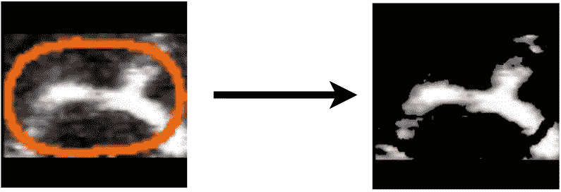

# 利用深度学习检测阿尔茨海默病的前兆

> 原文：<https://towardsdatascience.com/detecting-precursors-of-alzheimers-by-utilizing-deep-learning-a6de0ee0e2d2?source=collection_archive---------37----------------------->

## 使用 3D CNNs 帮助研究人员寻找治疗老年痴呆症的方法

# 痴呆症

我们都会忘记一些事情。在某个时候，我们走进一个房间，却忘了我们为什么去那里。对大多数人来说，这种情况不会每天都发生，但对有些人来说却是这样。对于大约 4400 万人来说，忘记了他们在哪里，他们和谁在一起，他们刚刚说的是生活的事实。阿尔茨海默氏症是一种进行性疾病，是脑细胞死亡的结果。症状包括认知思维减少、记忆力减退、睡眠障碍和言语丧失。十分之一的人一生中会得老年痴呆症，但更糟糕的是，这种疾病无法治愈。目前可用的治疗只能温和地减轻症状，这对我来说不是很好。


鸣谢:[罗比娜·维尔梅耶尔](https://unsplash.com/@averey?utm_source=unsplash&utm_medium=referral&utm_content=creditCopyText)上 [Unsplash](https://unsplash.com/s/photos/alzheimers-disease?utm_source=unsplash&utm_medium=referral&utm_content=creditCopyText)

为什么我们没有解药？这是因为科学家们仍在试图找出到底是什么原因造成的。我决定进行一次小小的研究冒险，以了解更多关于老年痴呆症的病因。我偶然发现了一篇论文,该论文指出老年痴呆症可能与大脑缺乏血液流动有关。阿尔茨海默氏症患者一直生活在一种类似的感觉中，当你站起来太快时，会感到头晕。 ***太可怕了*** 。有趣的是，这种与阿尔茨海默氏症的联系多年前就已为人所知。

那么，为什么科学家没有针对血液流动呢？嗯，这是因为科学家们对血流不足如何影响记忆没有准确的理解。一些研究认为，这可能是由于白细胞粘附在毛细血管上，从而限制了血液流动。我深入兔子洞，发现了一个名为 [StallCatchers](https://stallcatchers.com/main) 的组织，该组织收集老鼠大脑中血液流动的视频，并将它们分为停滞或流动。他们致力于对数千个视频进行分类，这些视频被发送给科学家，科学家使用分类视频来了解更多关于停滞的信息，并试图找出治疗疾病的方法。这些视频来自康乃尔大学的研究人员，他们使用[双光子激发显微镜](https://en.wikipedia.org/wiki/Two-photon_excitation_microscopy)拍摄小鼠活体脑组织的视频。作为一名人工智能爱好者，我认为必须有一种更好的方法来使用人工智能对这些视频进行分类。令我惊讶的是，我发现 Mathworks，一家对数据科学很感兴趣的公司，正在举办一场开发视频分类器的比赛，以帮助捕捉摊位的人。很自然，我报名了，然后我们就在这里了。

# 模型概述和方法

## 方法 1

我最初的想法是使用一个**卷积神经网络(CNN)** 对每张图像进行分类，然后取视频中所有帧的平均值，输出基于平均值的类。在完成这个项目后，我对我得到的测试准确度并不完全满意(~50%)。你可以在这里查看我的文章，它解释了我的第一个思维过程和模型:[使用人工智能对阿尔茨海默氏症的视频进行分类(第一次尝试)](http://Using AI to Classify Videos for Alzheimer’s(First Attempt))

## 方法 2

我的下一个想法是用一个 **CNN+LSTM** (长短期记忆)对整个视频进行分类。我使用了一个时间分布的 CNN，它允许将另一个维度(帧)添加到数据中(-1，48，48，1) 🡪 (-1，26，48，48，1)。然后有一个 LSTM 把 CNN 的输出作为输入。在我的第一种方法中，它只是帧分类，而 CNN+LSTM 将它变成了视频分类，因为我正在对由 26 帧组成的视频进行分类。添加的 LSTM 用于分析时间序列数据(每个视频中的每个帧如何随时间变化)。然而，我在这里的准确率也很低(52%)，并且模型不能有效地训练。

## 方法 3(最终方法)

由于在 CNN 和 CNN+LSTM 模型中缺乏成功，我最终创建了第三个模型:一个 **3D 卷积神经网络(3DCNN)** 。3DCNN 与典型的 2D CNN 的不同之处在于，它多了一个维度作为输入。在我的场景中，这个维度是每个视频中的 26 帧。这允许该模型对全部视频进行分类。

# **在我进入代码之前，这里有一个非常简短的 3DCNNs 概述:**

## **2DCNN:**

为了理解 3DCNN，从什么是 2DCNN 开始更容易。


CNN 结构的基本概述。信用: [Aphex34](https://commons.wikimedia.org/w/index.php?title=User:Aphex34&action=edit&redlink=1) ，via [wiki](https://commons.wikimedia.org/wiki/File:Typical_cnn.png) (CC BY-SA 4.0)

2D 卷积神经网络通常用于分类图像。计算机以数组的形式读取图像，CNN 通过多层传递这个数组。

这些层包括:**卷积层**、**汇聚层**和**全连接层**。

卷积层和汇集层具有不同大小的内核，这些内核通过图像阵列，将单个新值输出到较小的矩阵中。卷积层将权重和偏差应用于像素值，而池层可以例如采用内核范围中的最高值。可以把这些图层想象成一个手电筒，从图像上掠过，输出最重要(或最亮)的值。

完全连接的层类似于神经网络，因为它们具有应用权重和偏差的节点，最终给出输出类别预测。

**注:如果你想更深入地了解一个 2DCNN 作品是如何运作的，可以看看我上一篇文章的开头:* [*用 AI 实时翻译手语*](/using-ai-to-translate-sign-language-in-real-time-96fe8c8223ed) ***

## **3DCNN:**

好了，现在我们知道了什么是 *2D* CNN，让我们深入了解什么是 *3D* CNN。

如前所述，3DCNN 与 2DCNN 非常相似，只是增加了一个维度。这个增加的维度导致每一层都略有变化。

**卷积层/池:**2D CNN 中的卷积和池层由经过图像的 2D 核组成。这意味着如果内核是(2，2)内核看起来会像这样:


信用:自我

现在有了 3D 卷积层或池层，就有了一个 3D 内核来传递视频。这意味着(2，2)内核可以变成(2，2，2)内核，如下所示:


信用:自我

每个框架都堆叠在彼此之上，允许内核同时在两个框架上滑动。这使得模型也可以考虑时态数据。这种情况下的时间数据是每帧图像的变化。

对于卷积层，内核对每个像素应用数学运算，对于池层(最大池)，内核取最高(最亮)的像素值。

然后，这些层的输出进入密集层或典型的神经网络，用于对提取的特征进行分类。

现在我们知道了 3DCNN 是如何工作的，让我们继续数据预处理！

# 数据预处理

我会说这个项目最乏味的部分是数据组织，它涉及帧提取、裁剪和颜色去除，以确保模型只在感兴趣的区域进行训练。


每帧数据准备的最终目标

## 帧提取和限制

第一个目标是从每个视频中提取帧，因为模型的输入是一系列“堆叠”的帧。然而，我们需要为每个视频提取相同数量的帧，因为一些视频有 30 帧，而其他的有 60 帧。需要一个标准的帧计数，因为稍后当我们为训练而调整数据时，各个帧将被分组在一起以形成它们的原始视频，如果帧计数有任何变化，将会导致帧混淆。我把帧数定为 26(最短视频的帧数)。然而，由于许多视频有 50+帧，我发现拍摄前 26 帧有时会错过视频中最重要的部分。为了最大限度地提取每个视频中最重要的部分，我决定选取中间的帧。


信用:自我

您可以计算它，并通过如下方式设置开始帧:

```
framecount = int(cap.get(cv2.CAP_PROP_FRAME_COUNT))dist = framecount-26
startframe = dist/2cap.set(cv2.CAP_PROP_POS_FRAMES, startframe)
```

首先，它获取帧数，然后从中减去 26，再除以 2，并将该数字(在 50 帧的示例中为 12)设置为开始帧。


从第一帧开始(左)与从中间帧开始(右)

## ROI 裁剪

下一个目标是将每一帧裁剪到感兴趣的区域。为了获得最佳效果，图像应该代表图像中最重要的部分，或者模型可以识别的两个类别的不同之处。在这些图像中，可以看到显示感兴趣区域(ROI)的红色圆圈。最合理的做法是只关注图片的这一部分，而忽略其他部分。这也使得模型更容易分类，因为它只处理重要的区域。还必须添加填充，以便每个裁剪后的图像大小完全相同。

这两个步骤看起来像这样:

```
th = cv2.inRange(img, (7, 13, 104), (98, 143, 255))                 
points = np.where(th>0)
p2 = zip(points[0], points[1])
p2 = [p for p in p2]
rect = cv2.boundingRect(np.float32(p2))
cv2.rectangle(img, (rect[1], rect[0]), (rect[1]+rect[3], rect[0]+rect[2]), 0)height = (rect[0]+rect[2]) - rect[0]
width = (rect[1]+rect[3]) - rect[1]
y = rect[0]
x = rect[1]
roi = img[y:y+height, x:x+width]desired_size = 48
im = roi
old_size = im.shape[:2]
ratio = float(desired_size)/max(old_size)
new_size = tuple([int(x*ratio) for x in old_size])
im = cv2.resize(im, (new_size[1], new_size[0]))
delta_w = desired_size - new_size[1]
delta_h = desired_size - new_size[0]
top, bottom = delta_h//2, delta_h-(delta_h//2)
left, right = delta_w//2, delta_w-(delta_w//2)
color = [0, 0, 0]
new_im = cv2.copyMakeBorder(im, top, bottom, left, right, cv2.BORDER_CONSTANT, value=color)
```

首先，我使用阈值处理(一种限制图片中出现的颜色的技术)来识别红色圆圈的位置，并在它周围画一个矩形。然后我压缩了圆圈周围的点，并画了一个矩形来连接这些点。

接下来，我把画出的矩形裁剪成矩形。这很简单，因为这些点已经在前面的矩形图中给出了。这会在红色圆圈(ROI)周围输出一个裁剪后的图像。

最后，为了得到大小为(48，48)的图片，我在需要的地方添加了填充。


## 脱色

下一个目标是移除图像中的红色圆圈。在这个项目的第一次和第二次迭代中，我犯了在前一步停止数据预处理的错误。然而，我意识到，通过在每一帧上留下红色圆圈，模型有很大的机会分类错误。当帧通过卷积层和池层时，模型可能会丢失血流(白线)并只对红圈进行分类。然后，该模型将尝试对红圈的形状、大小等进行分类。并最终得到较差的精度。这可能会发生，尤其是在池层，因为最大池采取最亮/最高对比度的像素，在一些帧可能会结束为圆。因此，我选择用黑色(0，0，0)替换所有红色像素，这将允许模型对血流进行分类。

下面的代码是我选择这样做的:

```
image = Image.open('*filepath*'+str(i)+'.jpg')
image_data = image.load()
height,width = image.sizefor loop1 in range(height):
    for loop2 in range(width):
        r,g,b = image_data[loop1,loop2]
        if(r > -1 and r < 256 and g > -1 and g < 160 and b > -1 and b<100):
        image_data[loop1,loop2] = 0,0,0image.save('*filepath*'+str(i)+'.jpg')
```

这里它打开图像，扫描图像中的每个像素。如果每个像素的 rgb 值都在一个范围内(红色圆圈的范围)，它会用黑色替换该像素。if 语句中的范围还考虑了图像中可以看到的一些白噪声。最终的输出是一个没有红色圆圈的图像。



## 把所有的放在一起

现在我们将这三个部分结合在一起，使处理更加有效。

现在该训练了！

# 模型

我用的 3DCNN 模型如下:

## 卷积层

模型的第一部分是三个卷积层。每层有 4 个部分: **conv3D** 、**激活**、**汇集、批量正常化**和**退出**。


信用:自我

**Conv3D:**

第一层是卷积层。这是 3D 内核滑过图像堆栈的层。内核就像一个手电筒，它观察一个特定的区域，对内核范围内的每个像素进行数学运算，并将新值输出到一个更小的矩阵中。这个较小的矩阵有助于降低模型的复杂性，并突出显示图像中最重要的部分。在这个特定模型中，第一个模型中有 8 个内核，第二个和第三个模型中有 16 个内核。每个内核的过滤器大小为(3，3，3)。我选择使用少量的内核来减少数据集过度拟合的机会。此外，我选择只有 3 个卷积层，因为我认为没有必要增加更多的层。添加更多的层会进一步缩小图像的重要部分，我觉得没有必要，特别是因为输入图像已经非常清晰。

**激活:**

使用的激活函数是漏 ReLU 函数，与 ReLU 略有不同。使用泄漏 ReLU 的好处是它可以防止“死亡”的神经元。偶尔，在训练过程中，神经元可以输出小于 0 的值。如果使用 ReLU 激活功能，神经元可能会变得不活跃，并且不能恢复活跃。然而，如果使用泄漏的 ReLU 函数，它将最终允许神经元恢复活动。


信用:自我

其原因是漏 ReLU 允许稍微负数，而 ReLU 在 0 停止。

**统筹:**

池层通过减小矩阵大小进一步降低了模型的复杂性。池层类似于卷积层，因为它也有一个在图像堆栈上滑动的 3D 内核。在这种情况下，使用了 max pooling，它取内核范围内的最高像素值。Max pooling 识别最亮和具有最大对比度的像素(例如边缘)，这对于识别血液如何移动很重要。过滤器大小设置为(2，2，2)。

**批量归一化:**

批量标准化减少了隐藏层值的移动。这使得训练更容易，因为它稳定了重量，提高了准确性。它还会重新调整数据的中心和比例，从而减少下一层输入数据的变化。这提高了整体训练速度和准确性。

**辍学:**

丢弃层从模型中丢弃随机节点。这使得模型更加通用，因为它不太依赖任何节点。这种泛化有助于减少数据的过度拟合，从而允许模型对其他数据集做出准确的预测。

## 完全连接的层


信用:自我

模型的第二部分由**致密层**组成。在这些密集层旁边，还有**激活**、**批量正常化**和**退出**。

**密集:**

密集层类似于典型的神经网络，因为它有几个节点，这些节点将数学运算应用于输入数据。神经元相互连接，相互传递数据。在这种情况下，有 16 和 32 个神经元。

**激活，批量正常化，退出:**

所有层都与前面提到的类似。

## 思维过程

你可以注意到，我选择了相对较小的内核数和密集层数。这样做的原因是，如果我添加更多的参数(更密集和内核)，模型往往会过度拟合。最可能的原因是，我正在训练的数据集有 550 个视频，这是一个相对较小的数据集。因此，由于过度拟合，我减少了参数的数量，从而简化了网络。

# 结果

## 培养

经过 140 个历元的训练，模型达到了 80%的训练和验证准确率，相当不错！


但是，您可以注意到，在大约第 130 个历元之后，精确度降低，损耗增加。这促使我利用 Keras 中的早期停止来阻止模型在损失开始增加时进一步训练。这使得模型能够获得最高的精度。我使用的代码如下:

```
es_callback = keras.callbacks.EarlyStopping(monitor='val_loss', patience=15)history = model.fit(xtrain, ytrain, batch_size=10, epochs=250, verbose=1, validation_split=0.3, callbacks = [es_callback])
```

## 测试

在测试数据集上评估该模型时，准确率达到了 69%。这比我以前的模型 52%的测试精度有了很大的提高。


# 学习和后续步骤

我从这个项目中学到了很多，但我最大的收获是数据为王。没有高质量的数据，即使你有一个强大的模型，你的准确性也可能很差。通常获得高质量的数据是项目中最困难的部分。

仍然有方法来改进我的模型，更具体地说是测试精度。过度拟合是一个主要问题，它阻碍了这个项目的准确性，所以应用不同的方法，如 L1，L2 正则化，可能有助于改善我目前所做的。

## 感谢阅读，我希望你有一个伟大的一天！

*联系我:*

*领英:*[*https://www.linkedin.com/in/vikram-menon-986a67193*](https://www.linkedin.com/in/vikram-menon-986a67193)

*电子邮件:vikrammenon03@gmail.com*

> S 特别感谢劳拉·k·纳尔逊博士对这个模型的提示和建议