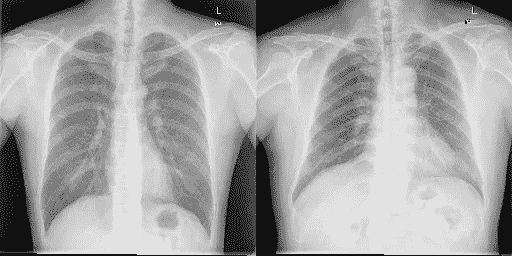
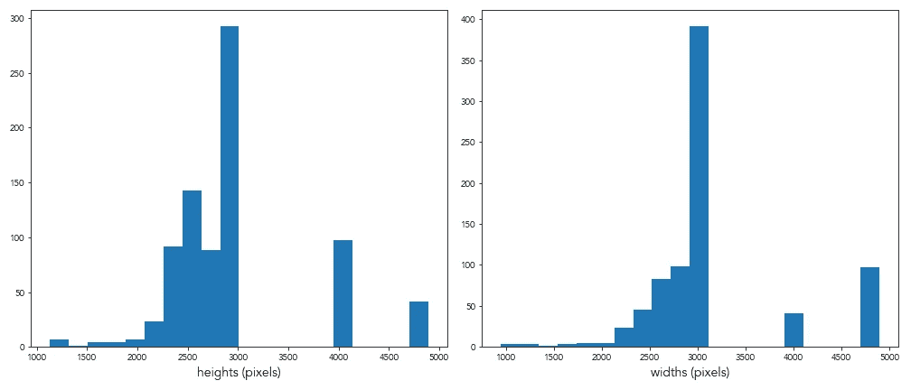
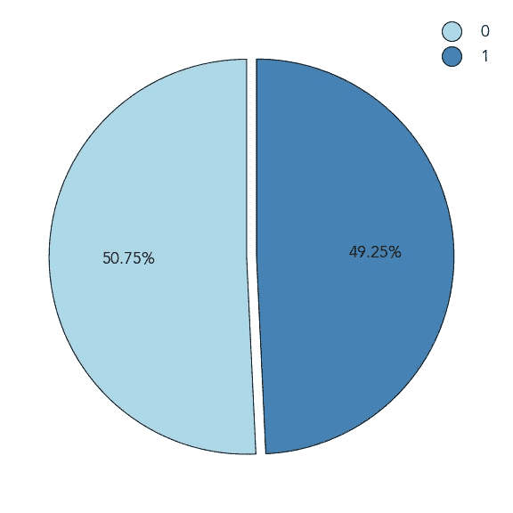
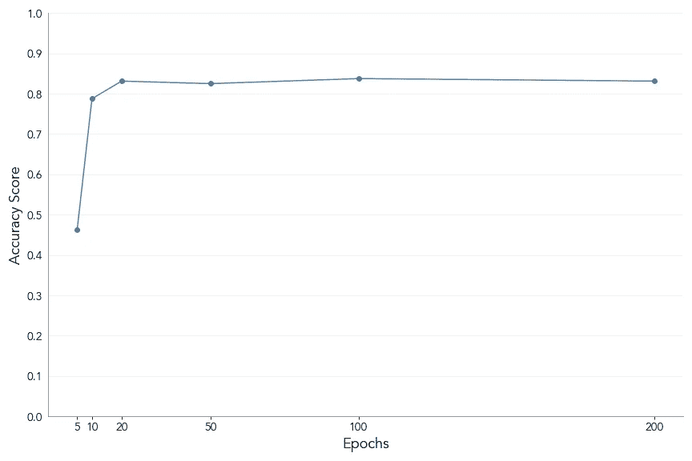
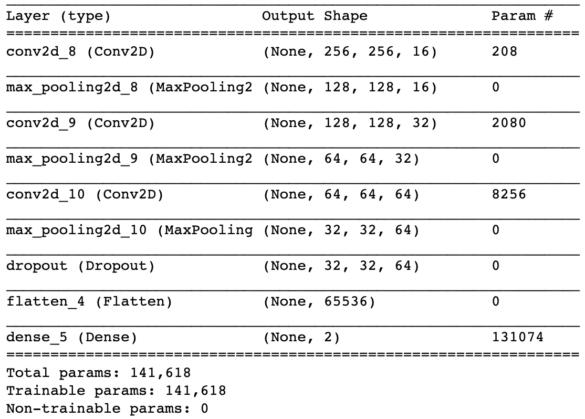

# 在胸部 x 光检查中检测肺部异常

> 原文：<https://towardsdatascience.com/detecting-pulmonary-abnormalities-in-chest-x-rays-47f3bf2a8499?source=collection_archive---------22----------------------->

## 用于图像识别的卷积神经网络


[疾控中心](https://unsplash.com/@cdc?utm_source=medium&utm_medium=referral)在 [Unsplash](https://unsplash.com?utm_source=medium&utm_medium=referral) 拍摄的照片

应用数据科学和人工智能已经并将继续为许多不同的领域和行业做出贡献，其中一个例子是医疗保健和医学研究。

如今，能够进行 X 射线扫描的技术很容易以相对较低的成本获得。然而，从所述扫描中做出诊断所需的合格的放射学专家并不多，尤其是在发展中国家。

在这一领域实施人工智能解决方案可能会推动发展向前迈出关键的一步。

这个项目背后的动机是探索建立卷积神经网络(CNN)模型的可能性，以检测胸部 X 射线扫描图像中的肺部异常，希望使诊断过程更快，更便宜，减少对人类专家干预的依赖。

完成项目的阶段如下:

1.  探索和预处理训练数据
2.  构建、评估和调整 CNN 模型
3.  讨论该方法的成功之处、局限性和潜在的未来改进

# 第一部分:训练数据的预处理和探索性分析

本项目的训练数据集将包括 800 幅胸部 x 光图像:其中 662 幅由中国深圳市第三人民医院提供，其余 138 幅来自美国蒙哥马利县卫生与公众服务部。

数据集中的每幅图像都已经过放射科医师的检查，并且提供了一个标签来指示患者是否表现出由结核病表现引起的肺部异常。

该数据集最初由美国国家医学图书馆发布，旨在为计算机辅助肺部疾病诊断领域的研究提供足够的公共训练数据。本项目中使用的数据由用户 [K Scott Mader](https://www.kaggle.com/kmader) 通过 [Kaggle](https://www.kaggle.com/kmader/pulmonary-chest-xray-abnormalities) 获得。所有相关的引用都可以在本文末尾的*参考文献*部分找到。



图 1:训练图像的两个例子，一个显示异常(左)，一个不显示异常(右)

## 编码图像

在图像数据可以被分析或传递到机器学习模型之前，它必须首先被转换成某种数字格式。为此，我们可以使用 [OpenCV](https://opencv-python-tutroals.readthedocs.io/en/latest/py_tutorials/py_tutorials.html) Python 包对图像进行编码。

这个包的`imread`方法将为每幅图像创建一个 numPy 数组，数组中的每一项代表一个像素的编码灰度，有三个单独的层用于蓝色、绿色和红色。

每个阵列的尺寸将等于图像的高度(像素)、宽度(像素)和颜色层的数量(三个)。

虽然 X 射线图像不包含从白色到黑色范围以外的颜色，但我们稍后将用于构建 CNN 模型的包( [Keras](https://keras.io/) )要求每个输入变量都是 3D 数组，因此我们无法读取 2D 灰度的图像。

## 正在检索目标标签

训练数据来源中的描述解释了每个图像的基本事实标签(由医学专家确定)作为后缀存储在其文件名中:用 *1* 表示扫描显示异常，用 *0* 表示不显示异常。

为了检索目标标签，我们可以简单地在 filetype 前面添加最后一个字符(*)。png* )到一个列表中，这个列表将作为目标变量。

我们可以使用如下定义的嵌套 for 循环为两个目录中的每个目录中的每个图像创建编码特征变量的数组和目标标签的列表:

```
def encode_images():

    X = []
    y = [] directories = ['xray_images/ChinaSet_AllFiles/ChinaSet_AllFiles/CXR_png/', 
                  'xray_images/Montgomery/MontgomerySet/CXR_png/']for directory in directories:
        for filename in os.listdir(directory):
            if filename.endswith('.png'):
                X.append(cv2.imread(directory + filename))
                y.append(int(filename[-5]))

    return np.array(X), np.array(y)
```

## 评估和调整图像大小

CNN 模型要求每个输入条目的形状相同。在我们的数据的上下文中，这将对应于每个图像具有相同的大小，因此每个特征阵列具有相同的维度。

让我们通过在训练数据中绘制图像的高度和宽度分布来检查是否是这种情况:



图 2:图像尺寸的分布

我们可以看到图像大小存在差异。为了解决这个问题，我们可以重写我们的编码函数来实现 For 循环开始处的 [Pillow](https://pillow.readthedocs.io/en/stable/) 包中的`resize`方法。

但是我们应该为输入图像选择多大的尺寸呢？

理论上，保持尽可能高的分辨率可以得到更精确的模型。我们可以从上面的分布中看到，这些图像的分辨率相当高，几乎所有图像的高度和宽度都至少有 1000 像素。

但是，我们也需要考虑计算速度。保持超过 1000 平方像素可能需要很长时间才能使模型适应训练数据，特别是因为我们将在本地运行代码。像往常一样，我们在准确性和速度之间有所取舍。

作为一个折衷点，并且记住选择 2 的指数的图像尺寸通常是一个好的实践，让我们将图像的大小调整为 256 像素的正方形:

```
img = Image.open(directory + filename)
img = img.resize((256, 256))
img.save(directory + filename)
```

## 标准化图像的比例

像素的灰度代码可以从 0(黑色)到 255(白色)。目前，我们的编码特征数组包含高达 255 的值。机器学习模型，特别是那些涉及梯度下降的模型，如神经网络，通常在标准化数据上表现更好。

在进入建模阶段之前，为了说明这一点，让我们将特征数组除以最大值(255)来归一化每个条目，使其范围从 0 到 1:

```
print((np.min(X), np.max(X)))
X = X.astype('float32') / 255
print((np.min(X), np.max(X)))
>>> (0, 255)
>>> (0.0, 1.0)
```

## 分析目标变量

在继续构建模型之前，获得目标变量的一些可见性也是一个好主意。

让我们来看看训练数据中正面分类和负面分类之间的差异:



图 3:目标变量分割

从上面我们可以看到，我们的训练数据在各个类之间是平衡的，超过 49%的图像显示异常。这应该作为以后评估模型准确性的基准。

现在，我们已经将训练数据预处理成适合 CNN 模型的格式，并通过一些探索性分析获得了对它的更好理解，我们可以进入 CNN 建模阶段。

# 第二部分:构建 CNN 模型

## 分割训练数据

为了便于在模型构建和训练后对其进行评估和调整，我们需要将数据分成训练集和测试集。

当使用任何形式的神经网络时，建议将数据分成**三个**独立的集合(训练、验证和测试)，而不是传统的两个集合。

这是因为神经网络模型使用训练集作为输入来馈通模型，计算损失，并在每个时期调整权重和偏差，然后使用单独的验证集来确定新参数是否是对来自前一时期的参数的改进。

由于模型在训练期间已经“看到”了验证数据，使用相同的数据来评估最终模型在技术上可能会导致数据泄漏，因此需要在初始分割时创建第三个测试集。

我们可以通过使用 [scikit-learn](https://scikit-learn.org/stable/) 的`train_test_split`方法来执行这种分割，首先将数据分割成训练集和测试集，然后再将测试集分割成单独的验证集和测试集:

```
train_size = 0.6
val_size = 0.2
test_size = 0.2X_train, X_test, y_train, y_test = train_test_split(X, y, test_size=(val_size + test_size), random_state=42)X_val, X_test, y_val, y_test = train_test_split(X_test, y_test, test_size=(test_size / (val_size + test_size)), random_state=42)print('Training: {}; Validation: {}; Testing: {}'.format((len(X_train), len(y_train)), (len(X_val), len(y_val)), (len(X_test), len(y_test))))
>>> Training: (480, 480); Validation: (160, 160); Testing: (160, 160)
```

## 编码目标变量

不管可能的类的数量是多少，Keras 中的任何神经网络模型都要求目标变量被分类(一次性)编码。在开始构建模型之前，我们需要对三个目标集进行分类转换:

```
y_train = keras.utils.to_categorical(y_train, len(set(y)))
y_val = keras.utils.to_categorical(y_val, len(set(y)))
y_test = keras.utils.to_categorical(y_test, len(set(y)))print(y_train.shape, y_val.shape, y_test.shape)
>>> (480, 2) (160, 2) (160, 2)
```

## 构建基线模型

在 Keras 中构建 CNN 模型的第一步是定义模型架构。与其他神经网络一样，该架构必须包括:

1.  初始输入图层，我们在其中指定输入要素的形状
2.  零个或多个“隐藏”层，试图揭示数据中的模式
3.  最终输出层，它将根据输入对每个实例进行分类

基线模型架构的代码可以写成如下形式:

```
base_model = Sequential()
base_model.add(Conv2D(filters=16, kernel_size=2, padding='same', activation='relu', input_shape=X[0].shape))
base_model.add(MaxPooling2D(pool_size=2))
base_model.add(Flatten())
base_model.add(Dense(len(set(y)), activation='softmax'))
```

关于基线模型有几点需要注意:

1.  我们需要指定想要使用的过滤器的数量以及输入层中方形内核的大小
2.  我们还需要指定填充，以防滤镜溢出图像边缘，为此我们将使用`‘same’`
3.  我们将从 ReLu 激活函数开始，它保持正值不变，并将负值设置为 0。当我们调整模型时，我们可以测试不同的功能
4.  由于我们调整了所有要素输入的大小，因此它们不会发生变化，我们可以使用第一个实例来指定输入形状
5.  添加了最大池图层，通过从每个 2x2 方块中获取最大值来减少数据的维数
6.  在到达输出层之前，我们需要将数据展平到一个 2D 数组中，以便它可以被馈送到一个完全连接的层中
7.  在输出层中，我们需要指定模型应该预测多少个类(等于目标数组中唯一值的数量，在本例中为 2 ),并使用 Softmax 激活函数将输出归一化为概率分布

我们还需要编译模型，这包括定义我们将用来衡量其性能的度量标准。因为我们发现在研究数据时，目标变量在各个类之间是均衡的，所以纯粹的准确性应该是一个合适的度量标准:

```
base_model.compile(loss='categorical_crossentropy', optimizer='rmsprop', metrics=['accuracy'])
```

您可以看到,`compile`方法也用于为模型选择合适的损失函数和优化指标，以便在训练时使用。

一旦我们定义并编译了模型的架构，我们就可以使它适合训练数据:

```
base_model.fit(X_train, y_train, epochs=10, batch_size=32, validation_data=(X_val, y_val), verbose=1, shuffle=True)
```

`fit`方法中的参数本质上是告诉模型适应训练集，并使用验证集作为评估性能的看不见的数据。

批量大小用于将数据分成子集，以便一次一个地通过网络。这具有极大地减少完成每个训练步骤所需的计算能力的优点。

历元数告诉模型应该通过网络推送数据多少次，然后反向传播权重和偏差。我们将很快讨论要使用的最佳历元数，但首先我们将使用 10。

## 评估基线模型

一旦我们在指定数量的时期内拟合了模型，我们就可以在以前看不到的测试集上评估它的真实性能:

```
round(base_model.evaluate(X_test, y_test, verbose=0)[1], 4)
>>> 0.7812
```

我们可以看到基线模型可以准确地对 78%的测试样本进行分类。考虑到大约一半的数据集包含积极标记的实例，我们可以推断简单基线模型已经比我们随机猜测每个图像的类别表现得更好。

这提供了一个很好的起点，但是让我们深入研究一下，看看我们是否可以采取措施来提高模型的性能。

## 选择历元的数量

为了确定拟合模型时使用的最佳时段数，我们可以在`fit`方法中使用不同的时段数从基础模型的多次测试运行中收集准确度分数:

```
epochs = [5, 10, 20, 50, 100, 200]
scores = []for e in epochs:
    test_model = Sequential()
    test_model.add(Conv2D(filters=16, kernel_size=2, padding='same', activation='relu', input_shape=X[0].shape))
    test_model.add(MaxPooling2D(pool_size=2))
    test_model.add(Flatten())
    test_model.add(Dense(len(set(y)), activation='softmax'))
    test_model.compile(loss='categorical_crossentropy', optimizer='rmsprop', metrics=['accuracy'])
    test_model.fit(X_train, y_train, epochs=e, batch_size=32, validation_data=(X_val, y_val), verbose=False, 
                   shuffle=True)
    scores.append(test_model.evaluate(X_test, y_test, verbose=False)[1])
```

并随后绘制结果:



图 4:每个时期的准确度分数

从上面我们可以看到，使用 20 个历元而不是 5 个或 10 个显著提高了模型的性能。然而，随后时代数量的增加，即使有改进，也不会产生太大的改进。

虽然对神经网络模型运行更大数量的时期可以使其变得更加精细，但增加到某个级别以上最终会导致模型对训练数据过度拟合，从而损害测试集的性能。

考虑到性能和计算效率，我们在调整基线模型时使用 20 个时期。

## 实现图像增强

一种常用的使 CNN 模型更健壮并进而提高性能的方法是图像增强。这实质上是指在训练数据内生成新图像，这些新图像是现有图像的翻译，作为一种为杂乱的真实世界数据准备模型的手段，在真实世界数据中，要识别的对象可以以多个角度和大小出现在图像空间内的任何地方。

在 Keras 中执行图像增强相对简单。我们首先需要为每个训练集和验证集创建和调整图像生成器对象:

```
datagen_train = ImageDataGenerator(width_shift_range=0.1, height_shift_range=0.1, horizontal_flip=True)
datagen_val = ImageDataGenerator(width_shift_range=0.1, height_shift_range=0.1, horizontal_flip=True)datagen_train.fit(X_train)
datagen_val.fit(X_val)
```

然后可以将其传递给 CNN 的`fit`方法。为了测试这种技术是否提高了模型的性能，让我们在相同的条件下重新创建基线模型，但是这一次，当我们将数据生成器对象与定型数据相匹配时，要传递数据生成器对象:

```
batch_size = 32aug_base_model.fit(datagen_train.flow(X_train, y_train, batch_size=batch_size), 
                   steps_per_epoch=X_train.shape[0] / batch_size, epochs=20, verbose=1, callbacks=[checkpointer], 
                   validation_data=datagen_val.flow(X_val, y_val, batch_size=batch_size), 
                   validation_steps=X_val.shape[0] / batch_size)
```

请注意，我们需要在函数中指定每个时期要执行的步骤数。这可以被定义为在给定的批量中输入实例的数量。

我们可以使用与之前相同的方法来评估增强基线模型的性能:

```
round(aug_base_model.evaluate(X_test, y_test, verbose=0)[1]
>>> 0.6875
```

以上表明，使用图像增强实际上阻碍了我们的模型的性能，而不是提高它。

为了理解为什么会这样，让我们试着应用一些领域知识。虽然图像增强可以在典型的非结构化图像的环境中提高模型的鲁棒性，例如识别道路图片中的汽车，但同样的规则可能不适用于我们的数据环境。

x 射线扫描是在受控条件下进行的，因此我们可以预期在训练集和测试集中的图像之间存在结构一致性。因此，在训练中包括真实图像的翻译可能只会通过创建不现实的环境来混淆模型。

考虑到这一点，让我们决定在不使用图像增强的情况下进行调整。

## 调整模型

CNN 模型提供了无数的调谐和调整机会，以提高性能。因为这是一个据说应用领先于理论的领域，所以发现模型的最佳条件的最有效的方法就是简单地钻研和试验。

调谐 CNN 是一个反复尝试的过程。由于这个项目的代码可以在最后链接的资源库中找到，我不会在本文中包括所有的调优步骤，但下面是调优过程中调整和测试的各种条件的概述:

1.  实现附加卷积层
2.  在最终输出图层之前添加密集图层
3.  实现丢弃以随机“关闭”每层中的一些节点
4.  尝试不同的激活函数，如 Sigmoid 函数
5.  在卷积层中使用更大的步幅

## 最终产品

经过多轮调整后，产生最高准确度分数(84%)的模型包括:

*   增加滤波器数量的三个卷积层
*   每层中的 ReLu 激活函数
*   每层之后的最大池层大小为 2
*   第三卷积层之后的概率为 0.3 的丢弃层



图 5:最终模型的架构

# 第三部分:探讨方法

## 成功

使用由专家放射科医生预先标记的 X 射线图像数据集，我们能够构建一个简单的 CNN 模型，以正确识别肺部异常 **78%** 的时间。

然后，我们能够通过实施额外的卷积层和 dropout 等功能来调整模型，以提高性能，实现最终的准确度分数 **84%** 。

## 限制

虽然最终的模型可能为进一步的研究提供有用的基础，但 84%的准确率可能被认为不足以应用于现实世界的医疗环境。在这种型号真正投入使用之前，需要达到更高的性能水平。

这种方法最明显的缺点是训练数据集的大小。在机器学习的背景下，800 的样本量被认为是非常小的，我们可以通过使用更大的训练集来提高模型的性能。

然而，这也会带来自身的问题。CNN 是计算复杂的算法，因此将训练数据的大小增加到超过某一点，最终在本地机器上训练将变得不切实际。

这种方法的另一个局限性是数据集只包含一种疾病的基本事实诊断:结核病。如果这种类型的模型被用于现实世界病例的诊断，它将需要能够检测由其他肺部疾病引起的异常。

解决这一问题将再次需要使用扩展的训练数据集，其中包括多种可能疾病的标签，从而将该方法转化为多标签分类问题，而不是二进制问题。

## 在未来版本中开发模型

如上所述，在未来版本中建立改进模型的第一步是收集更大和更多样的训练数据集。

为了克服在本地 CPU 上训练复杂 CNN 的不切实际性，使用基于云的、支持 GPU 的服务器(比如 AWS)的服务也是明智的。

另一个尝试改进模型的途径是使用迁移学习。这将涉及采用预训练的神经网络，并用针对该问题定制的完全连接的层来替换最终输出层。

这在小的训练数据集的环境中特别有用，因为它可以获得在大得多的数据集上训练的模型的好处，并且将相同的模式应用于所讨论的数据。

# 结束语

该项目的目的是探索构建 CNN 模型的可能性，以检测胸部 X 射线扫描图像中的肺部异常，作为通过应用人工智能辅助诊断的一种手段。

这是因为尽管有 x 光机，但缺乏专业的放射科医生，特别是在发展中国家。

从原始图像数据集到最终工作模型的过程包括:

1.  调整图像数据的大小、编码和标准化
2.  构建和评估基线 CNN 模型的架构，以此作为起点
3.  试验和调整模型的许多条件，如历元数、卷积层数和 dropout 的使用，以提高性能

有兴趣更详细地研究代码(包括各种调优阶段)的读者可以在我的 [Github](https://github.com/harryroper96/xray_abnormality_detector) 的资源库中找到它。随时欢迎关于改进模型的反馈、问题和建议。

# 参考

K Scott Mader *肺部胸部 x 光异常*[https://www . ka ggle . com/k Mader/Pulmonary-胸部 x 光异常](https://www.kaggle.com/kmader/pulmonary-chest-xray-abnormalities)

Jaeger S，Candemir S，Antani S，Wáng YX，Lu PX，Thoma G. *用于计算机辅助肺部疾病筛查的两个公共胸部 X 射线数据集*。量子成像医学外科，2014 年；4(6):475–477.2014 年 11 月 20 日

耶格 S、卡拉吉里斯 A、坎迪米尔 S、福利欧 L、西格尔曼 J、卡拉汉 F、薛 Z、帕拉尼亚潘 K、辛格 RK、安塔尼 S、托马斯 G、王 YX、卢 PX、麦克唐纳 CJ。*利用胸片进行自动结核病筛查*。IEEE 跨医学成像。2014 年 2 月；33(2):233–45.多伊岛:10.1109/TMI 2013 . PMID:24101 . 13838383621

坎迪米尔 S，耶格 S，帕拉尼亚潘 K，穆斯科 JP，辛格 RK，薛 Z，卡拉吉里斯 A，安塔尼 S，托马斯 G，麦克唐纳 CJ。*使用非刚性配准的解剖图谱在胸片中进行肺部分割*。IEEE 跨医学成像。2014 年 2 月；33(2):577–90.多伊岛:10.1109/TMI 2013 . 2291 . PMID:24233243223