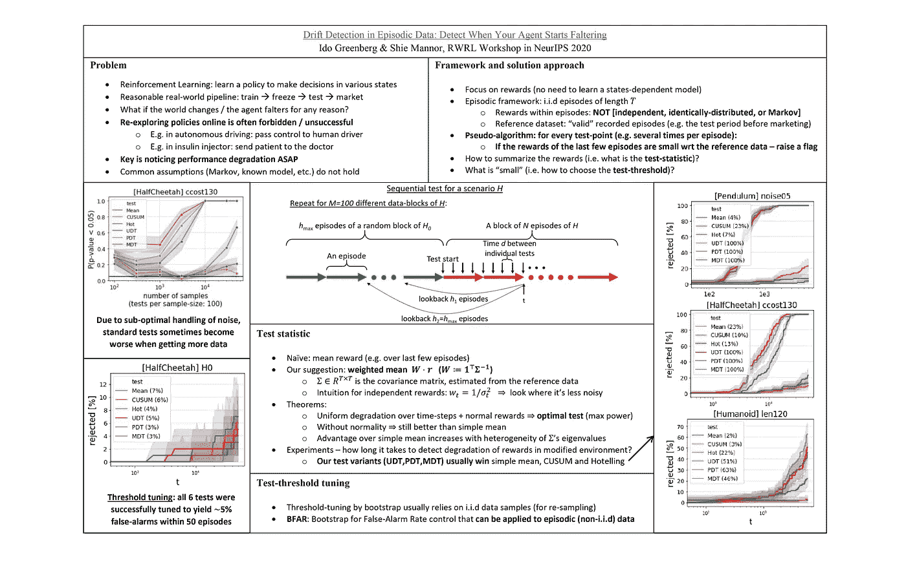
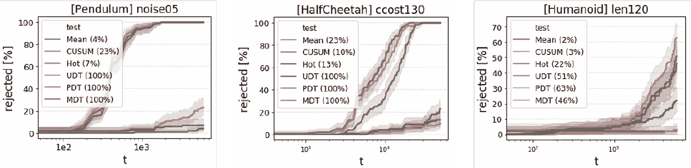

# 检测强化学习中的奖励退化

> 原文：<https://towardsdatascience.com/detecting-rewards-deterioration-in-reinforcement-learning-92338e8740d1?source=collection_archive---------29----------------------->

## 一个检测事件信号退化的最佳测试，例如基于 RL 的代理的回报

作者图片

# RL 中的绩效意识

强化学习是机器学习的一个分支，在这一分支中，一个智能体学习在一定的环境中顺序地做出决策。虽然该领域的大多数研究都集中在代理的训练上，但是在许多应用中(尤其是对风险敏感的应用，如医疗系统和自动驾驶汽车)，训练必须停止，并且在部署代理以在生产中运行之前必须对其进行修复。在这样的框架中，了解代理在任何时间点的性能都是至关重要的。特别是，尽快知道性能是否开始恶化是至关重要的(例如，如果汽车控制器开始不稳定，我们希望在它实际撞上任何东西之前注意到)。

由于我们关注的是代理的后培训阶段，有人可能会认为这个问题与统计监控有关，而不是 RL。然而，有两个因素使得 RL 的上下文特别有趣。首先，在 RL 中，我们有几个特征性的信息来源:奖励、观察和对主体的理解(例如，可以通过状态估计或价值函数来表达)。第二，在 RL 中，所有这些信号通常以情节的方式出现，在情节中，信号不是独立的，也不是同分布的(在我们的框架中也不是马尔可夫的)。

# 报酬恶化的最优检验

在我们的工作中，我们关注代理人的报酬，这使得监控系统完全是外部的，并且独立于代理人。我们假设“有效”奖励的参考数据集是可用的(在实际应用中，这可能是，例如，系统测试的记录)，并且我们顺序地测试，以便注意到奖励相对于参考何时恶化。

这样的测试写起来非常简单:只需取最近几集的平均奖励，并与参考值进行比较。然而，事实证明这是非常次优的:例如，如果一集的某个时间步长具有高度变化的奖励，而另一个时间步长具有非常稳定的奖励，那么显然第二个时间步长对于检测退化会更有帮助。

在我们的工作中，我们使用 Neyman-Pearson 引理来表明，实际上，如果我们假设奖励是正态分布的，那么最佳测试(即具有最佳显著性/功效阈值的测试)将考虑奖励的加权平均值而不是简单平均值，其权重对应于奖励的逆协方差矩阵的行和。我们还表明，在缺乏正态性的情况下，加权均值仍然优于简单均值(即使在所有可能的测试中不一定是最优的)。我们还量化了它相对于简单均值的优势，并表明它随着回报协方差矩阵谱的异质性而增加。

# **调整测试阈值**

所以我们知道退化测试应该考虑哪个统计量，但是什么是阈值，低于这个阈值我们会喊“退化”呢？我们希望在参考数据集上使用自举来确定这个阈值，但是这样做有困难:(1)回报不是同分布的，因此自举中的采样可能破坏信号的分布；(2)测试是以重叠的方式连续进行的，因此简单的假阳性概率不是测试显著性的良好描述符。

我们通过利用情节设置和对完整情节进行采样来处理非 i.i.d 问题。关于顺序框架，我们通过“在顺序测试的 *h* 集期间，虚警概率不得超过 *α* ”的要求来定义测试的重要性，并在 **BFAR** 中相应地设计自举—用于非 i.i.d .信号中虚警率控制的自举。

# 数字结果

为了测试我们的程序，我们在几个环境中训练了一个代理，然后对环境进行了改变，并让回报恶化(没有进一步的训练)。在所有环境和所有统计测试中，在没有环境修改的情况下，错误警报被成功控制——这表明 BFAR 的成功。在存在修改的情况下，我们建议的测试比替代测试更快、更频繁地检测到退化——通常是几个数量级。作为它的竞争对手，我们选择了朴素简单均值(在实践中通常用于 RL)、CUSUM(来自序贯检验)和 Hotelling(来自多元均值漂移检验)。

不同退化测试(UDT、PDT 和 MDT 是我们测试的变体，其他供参考)和不同场景(有动作噪声的钟摆、控制成本增加的 HalfCheetah 和腿尺寸增大的人形机器人)的退化检测概率与时间的关系。我们的测试比现有的测试更快地检测到由环境改变引起的退化(注意时间轴上的对数标度)。

这项工作发表在 NeurIPS 2020 年 RWRL 研讨会上。

 [## 事件数据中的漂移检测:检测您的代理何时开始动摇

### 在动态环境中检测代理性能的退化是具有挑战性的，因为…

arxiv.org](https://arxiv.org/abs/2010.11660)  [## ido 90/drift detectioninepidicdata

### 这份报告包含的代码文件漂移检测中的插曲数据:检测当您的代理开始动摇…

github.com](https://github.com/ido90/DriftDetectionInEpisodicData)