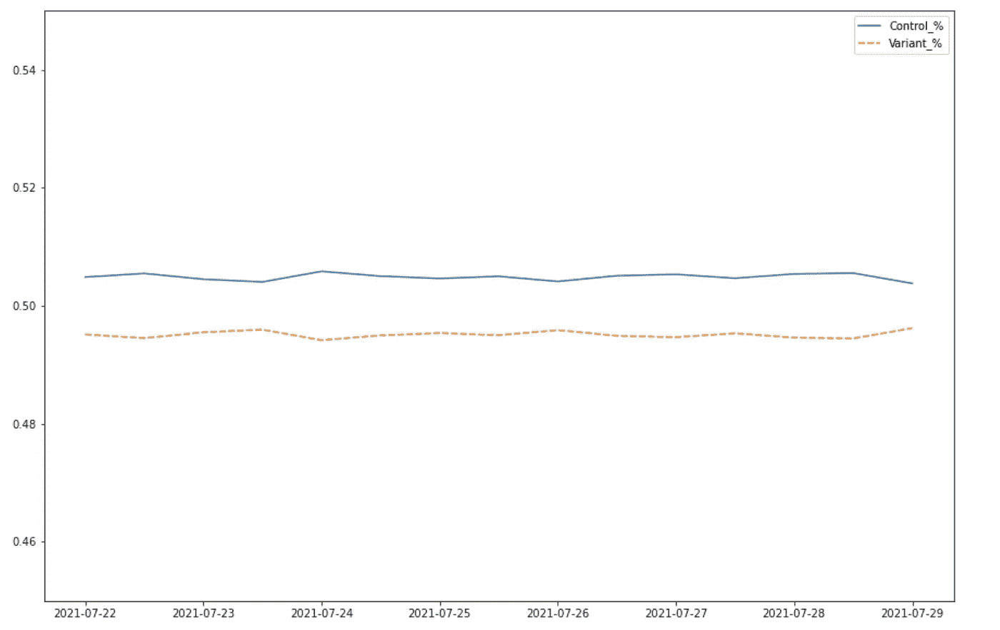
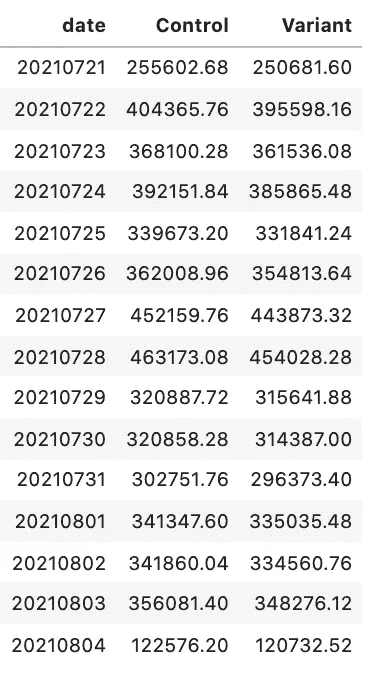
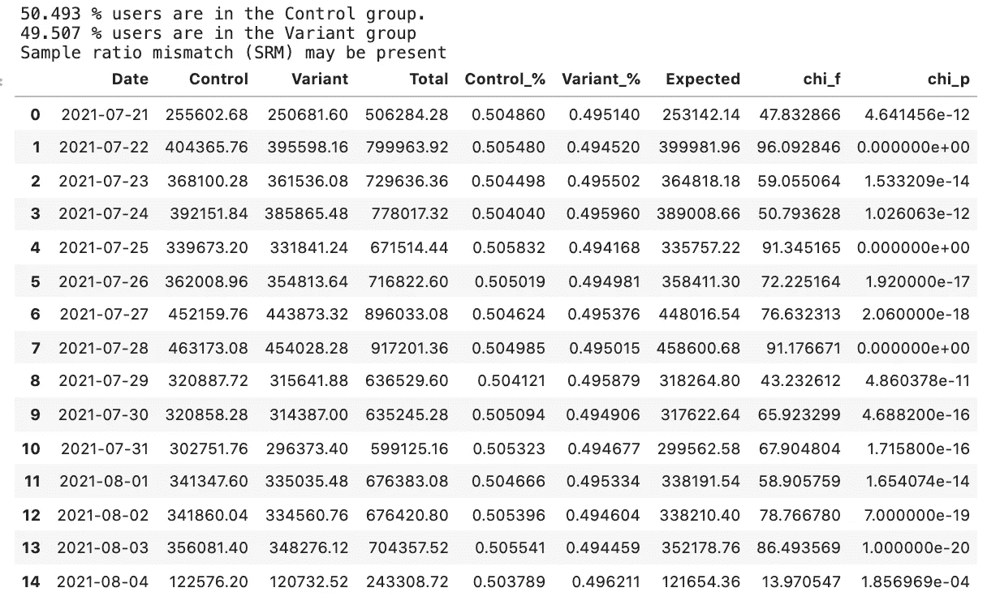
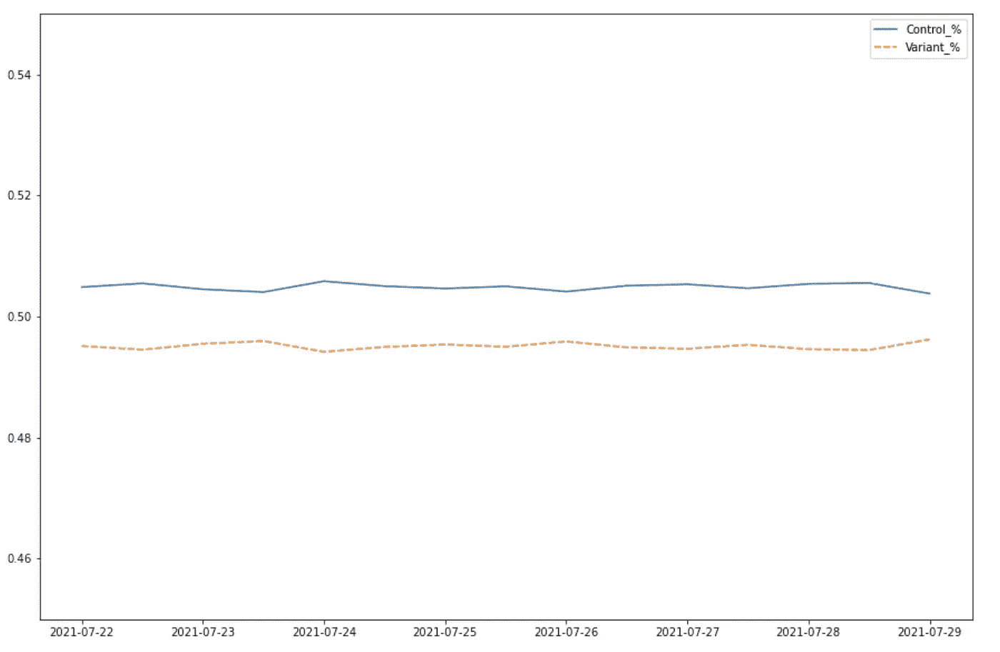

# 检测 A/B 测试中的样本比率不匹配

> 原文：<https://towardsdatascience.com/detecting-sample-ratio-mismatch-in-your-a-b-tests-cf7771de950a?source=collection_archive---------17----------------------->

## 这篇文章帮助你识别你的数字实验中是否有不平衡的群组，并结合了一些基本的 Python 函数来帮助 SRM 检测



作者创建的图像(弗兰克·霍普金斯)

## 介绍

当一个实验被暂停，我们期待调查一个给定测试的统计数据时，我们经常思考我们的发现。我们可能未能检测到总体上具有统计学意义的结果，因此按照年龄、设备、地理位置或平台类型对我们的数据进行分层，以查看我们的实验条件是否对给定的细分市场表现更佳。此外，我们可以在事后测试中调整显著性阈值，以查看我们是否达到了各种α阈值的统计显著性，从而为利益相关者提供给定实验条件下的置信度。这两种额外的分析都是评估你对结果的信心的非常有效的方法，但是如果你收集的数据缺乏基本的完整性，这两种方法可能会失效。因此，在对我们的数据提出因果关系之前，我们必须在实验过程中进行统计测试，以确保我们收集的数据符合我们对实验数据收集方式的预期。

当处理随机样本时(我们经常在数字实验中这样做)，我们可以执行的一个简单且必要的统计评估是**样本比率不匹配(SRM)** 测试。在受控实验的世界中，SRM 意味着两个测试组之间的用户随机分配与指定分配比例下的预期分配(预期样本比率，通常是组之间的平均分配)显著不同。更简单地说，SRM 是预期采样比和观测采样比之间的不匹配。

好消息是，确定 SRM 是否存在于您的实验数据中非常简单。您需要收集的唯一数据点是针对您的控制和实验条件的观察样本量和预期样本量。然后你在一个 [**卡方独立性检验**](https://www.jmp.com/en_ch/statistics-knowledge-portal/chi-square-test/chi-square-test-of-independence.html) 中使用这些值；如果测试的结果在统计上是显著的，那么您知道您观察到的数据中的差异不是虚假的，并且在您的 A/B 测试供应商或您如何实现您的测试平台中可能有潜在的原因。

在本文中，我将分解如何在 Python 中执行 SRM 测试，作为事后测试和整个实验中的单独增量。

## Python 应用程序

执行 SRM 分析的第一步是导入数据。您将需要确保您的数据帧格式正确，适合我编写的 SRM 函数。这将有三列:日期和每个实验条件(对照和变体)中各自的独特用户数。重要的是，您要利用用户而不是会话数据，因为一个用户可能有多个会话，由于您的实验条件发生了变化，这些会话可能会有本质上的不同。然而，用户数量应该与您在 A/B 测试平台中设置的分布成正比。出于分析目的，我们将使用一个简单的 A/B 测试:

```
data_1 = pd.pivot_table(data_1, values='distinct_users_x', index='date',
                    columns='Variant', aggfunc=np.sum)data_1.reset_index(inplace=True)
data_1 = data_1[['date', 'Control', 'Variant']]
data_1
```



我们 SRM 分析的第一步是计算测试中的用户总数:

```
total_users_in_test = sum(data_2['Control']) + sum(data_2['Variant'])
```

然后是每个实验组中用户的各自比例:

```
control = sum(data_2[‘Control’]) / total_users_in_test
variant = sum(data_2[‘Variant’]) / total_users_in_test
print(100*round(control,5),"% users are in the Control group.")
print(100*round(variant,5),"% users are in the Variant group.")50.493 % users are in the Control group.
49.507 % users are in the Variant group
```

然后您需要创建一个 tuple，它包含两个组中观察到的用户总数:

```
observed = [sum(data_2[‘Control’]), sum(data_2[‘Variant’])][5143598.5600000005, 5043244.959999999]
```

和总流量的数值:

```
total_traffic = sum(observed)10186843.52
```

然后，您需要计算每个实验条件下的预期用户数，对于 50/50 A/B 测试，应该是测试中的用户总数除以 2。如果您在测试中有不同的流量分布，则必须修改以下代码:

```
expected = [ total_traffic/2, total_traffic/2 ][5093421.76, 5093421.76]
```

现在，您可以将观察到的和预期的数据输入到独立性的卡方检验中:

```
chi = chisquare(observed, f_exp = expected)print(chi)if chi[1] < 0.01:
 print(“Sample ratio mismatch (SRM) may be present”)
else:
 print(“Sample ratio mismatch (SRM) probably not present”)Power_divergenceResult(statistic=988.6129116627776, pvalue=5.363182731279153e-217)
Sample ratio mismatch (SRM) may be present
```

正如您所看到的，观察到的比率和预期的比率在统计上是不同的，这表明 SRM 可能存在于我们的实验数据中。上面选择了 0.01 的 alpha 阈值，因为我们希望非常确信 SRM 存在于我们的数据中，但是该阈值可以更改为有利于您自己的分析。

到目前为止，我们已经执行了 SRM 测试，并使用统计分析来确定我们的团队是否平衡，以及在临时设置中是否符合我们的预期。虽然这有很好的实用性，但我们也希望能够在递增的时间点识别这一点。大数定律会让我们相信，随着数据量的增加，我们会期望每个组中的用户比例都接近预期的比例，对于 A/B 测试，这个比例是 1(每个组中有 50%)。如果每一组之间存在根本的差异，我们将不会看到这种趋同，并且在每一个实验条件下，用户之间存在一致的差异。

我写了一个 ***srm_pivot*** 函数，它将处理上面的数据框对象，并计算每个时间点的观察数据和预期数据(在本例中是日期)。卡方 **f** 和 **p** 值也在每个时间间隔计算，以确定比率是否随着时间变得更加相似:

下面是上述函数的输出:



作者创建的图像(弗兰克·霍普金斯)

如您所见，两组用户的比例并没有随着时间的推移而趋于一致，这清楚地表明 SRM 存在于数据中。接下来的步骤将是对为什么会出现这种情况进行调查分析。建议采取的步骤如下:

1.  调查用户群
2.  分析时间段
3.  分析 KPI
4.  SRM 的计数频率
5.  执行模拟/模拟实验并计算 SRM
6.  检查 SRM 的严重性(独立地和在实验之间)

还有一些有用的根本原因分析技巧，在一篇由 [**法比詹、维梅尔和德米特列夫**](https://exp-platform.com/Documents/2019_KDDFabijanGupchupFuptaOmhoverVermeerDmitriev.pdf) **写的文章中推荐。**

## 结论

A/B 测试已经成为决定你应该开发的网站版本的黄金标准。我们在数据科学和数字实验方面投入了大量的时间和精力来分析结果，并试图确定我们的实验和性能指标之间的因果关系。然而，很少有人相信我们数据的质量和完整性。如果我们的实验组没有在预期阈值内加权(由我们在 A/B 测试平台中配置的分割决定),我们很难在事后测试中完全忠实于我们计算的任何给定统计数据。SRM 测试使用基本的独立性卡方检验，帮助我们确定我们的组在统计上是否与我们预期的流量分布相似/不同。本文中使用的代码和函数可以/应该与您的所有实验实践一起使用，以确保维护数据完整性。还建议您记录检测 SRM 的测试量，因为您的计数频率可用于 SRM 的根本原因分析。