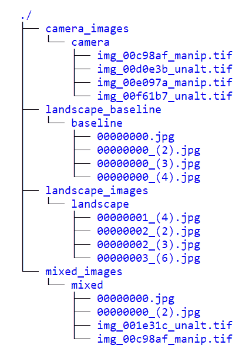
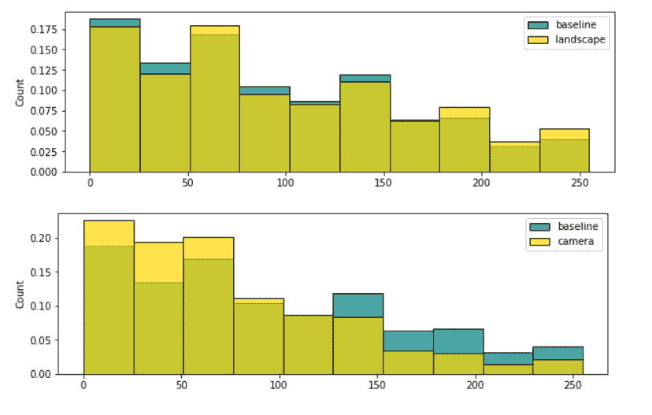
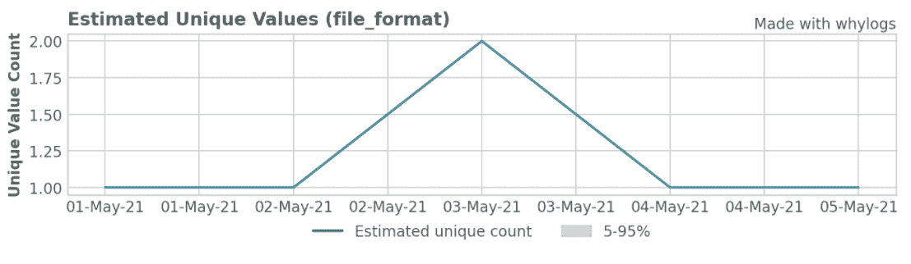
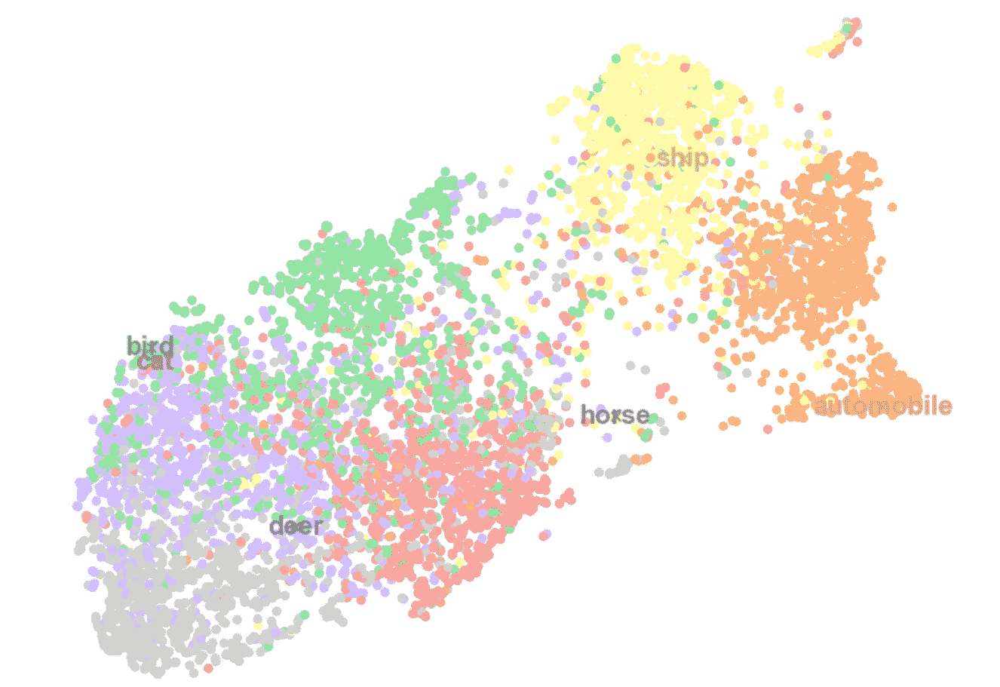
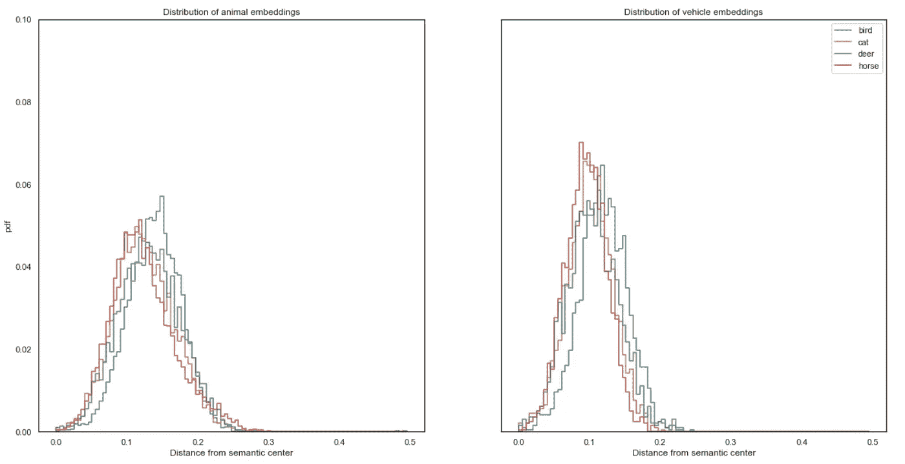
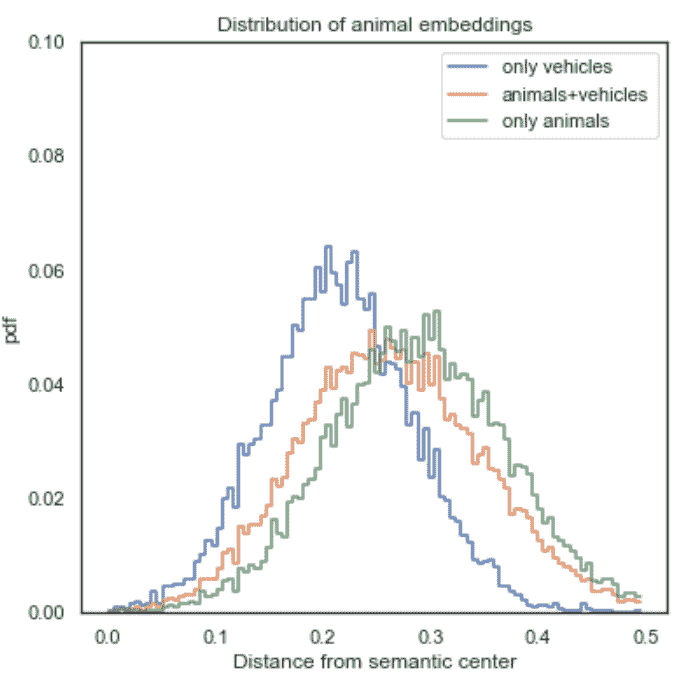

# 检测图像数据中的语义漂移

> 原文：<https://towardsdatascience.com/detecting-semantic-drift-within-image-data-6a59a0e768c6?source=collection_archive---------14----------------------->

## [行业笔记](https://towardsdatascience.com/tagged/notes-from-industry)

## 使用 *whylogs* 监控完整的上下文数据


照片由[瑞安·斯特凡](https://unsplash.com/@ryanstefan?utm_source=medium&utm_medium=referral)在 [Unsplash](https://unsplash.com?utm_source=medium&utm_medium=referral) 上拍摄

你的机器学习模型通过它的训练数据的镜头来看世界。这意味着随着现实世界离你的训练数据越来越远，你的模型变得越来越短视。然而，在操作机器学习应用程序时，升级您的眼镜(重新训练您的模型)并不是我们唯一关心的问题。我们还控制着在生产过程中向我们的模型提供信息的数据管道，因此有责任确保其质量。

数据中的概念漂移可能有不同的来源，可能源于数据管道的不同阶段，甚至在数据收集本身之前。为了采取正确的措施，人们必须能够确定其来源。然而，无论问题的来源是什么，需要采取什么样的纠正措施，这一切都始于一个基本要求:我们需要意识到一个问题首先存在，这本身就是一个挑战。

在本文中，我们将展示 [*whylogs*](https://github.com/whylabs/whylogs) 如何通过启用概念漂移检测来帮助您监控机器学习系统的数据摄取管道，特别是针对图像数据。为此，我们将使用几个演示用例。

对于第一种情况，我们将从两个不同的数据集获取图像:[风景图片](https://www.kaggle.com/arnaud58/landscape-pictures)和 [IEEE 信号处理协会相机型号识别](https://www.kaggle.com/c/sp-society-camera-model-identification)。我们将创建一个语义发生巨大变化的场景，并监控特定的特性，从而发现意外的数据变化。我们还将监控与内容相关的图像元数据，或者与图像创建相关的环境及其上下文。

在第二个场景中，我们将演示如何创建更一般化的语义度量。加上定义自定义转换的能力，我们可以以一致、通用的方式直接从我们的数据集中监控专门的语义信息。在这种情况下，我们将从预训练的 DenseNet 模型中生成图像嵌入，并将它们用作我们的全语义数据。我们将使用不同`CIFAR-10`类的数据集来模拟部署，作为如何在我们的数据和模型中捕获和潜在检测这些变化的示例。

# 目录

1.[元数据和特征](#034c)∘[图像特征](#c37b)t13】∘[图像元数据](#5d90)t16】2。[语义漂移](#3e1a)
∘ [自定义特征——距聚类中心的距离](#809c)
3。[结论](#35ad)

# 元数据和功能

即使我们没有用于预测的实际模型，让我们假设我们的模型输入预计主要由风景图像组成。使用模拟生产阶段，我们可以测试是否有可能通过记录一些基本的映像特征来检测域外映像的存在。这些可以包括元数据信息和属性，如色调、饱和度和亮度。

我们将图像存储在如下文件夹中:



作者图片

`landscape_baseline/baseline`子文件夹包含 1800 张`JPEG`风景图片。我们将使用这些图像作为比较的基线。其余三个文件夹包含生产过程中要监控的图像数据:

*   `landscape_images`拥有 200 张 JPG 风景图片
*   `camera_images`有 200 张 TIFF 图像，没有特定的类别，从相机型号识别数据集中提取。
*   `mixed_images`以 50/50 的比例组合了前两个数据集。

## 图像特征

检测数据变化的一种方法是创建并比较图像属性直方图，如色调、饱和度或亮度(`HSB` ) **)。**我们可以使用 *whylogs* 来自动记录这些属性，然后使用分析信息来绘制直方图。请注意，HSB 色彩空间比`RGB`色彩空间及其相关直方图更有助于理解内容，因为这些属性与图像的视觉解释直接相关。

在这种情况下，我们将创建 3 个不同的数据集:

*   第一个包含关于基线数据集的信息
*   第二个将模拟预期的一批图像:只有风景图像
*   第三种将只包含“看不见的”图像，与风景无关

这个想法是，在生产过程中收到的批次的数据分布应该类似于我们的基线集的分布。如果我们可以检测到两者之间的分布开始偏离，这可能是进一步检查的警报。

让我们首先创建一个会话，这是我们的应用程序与 whylogs 交互的方式:

然后使用`log_local_dataset()`记录每个文件夹的内容

正如您在上面的代码中看到的，我们可以在使用`image_feature_transforms()`登录之前应用图像转换。我们还可以通过`ComposeTransforms()` **混合和匹配功能来创建我们定制的特征转换管道。**在这种情况下，我们将图像大小调整为 50x50 像素，然后获取每个像素的饱和度值。

我们还必须记录`landscape_images`和`camera_images`的图像。由于它与上面的代码完全相同，我们将避免在此重复。唯一的区别在于`dataset_name` **、** `root_dir` 和`*_baseline` 变量。

然后，我们可以定义绘制直方图的函数:

这些函数将通过组合输入列表中每个轮廓的信息来绘制所选要素的直方图。如果定义了基线，基线数据集的直方图也会绘制在背景中以供比较。

让我们画出它们的分布图:



正如我们所看到的，景观集的最终饱和度分布比我们的“漂移”批次更类似于基线集。如果我们知道会发生什么，像第二个这样的情节肯定会引起注意。

## 图像元数据

获取有用信息的第二种方法是监控记录的图像的元数据信息。不是每个文件都会有它们，但是我们可以试着从可用的文件中获益，这些文件将由 [*whylogs*](https://github.com/whylabs/whylogs) 自动记录。我们还可以记录和搜索特定的标签。`EXIF` Tags 是大多数相机和图像软件制造商使用的标准。不幸的是，当你进入更模糊的数据格式时，你会遇到自定义元数据，幸好它们通常是`TIFF`标签。下面是在我的一张个人相机图片中发现的一些`TIFF`标签的例子。

```
╔═══════════════════════════╦══════════════════════╗
║            Tag            ║         Value        ║
╠═══════════════════════════╬══════════════════════╣
║ Manufacturer              ║ CANNON               ║
║ Model                     ║ EOS-600D             ║
║ Orientation               ║ top-left             ║
║ Software                  ║ Ver2.21              ║
║ Date and time             ║ 20200:08:11 16:55:22 ║
║ YCbCr positioning         ║ centered             ║
║ Compression               ║ JPEG compression     ║
║ file_format               ║ jpg                  ║
║ X resolution              ║ 72.00                ║
║ Y resolution              ║ 72.00                ║
║ Resolution unit           ║ Inch                 ║
║ Compressed bits per pixel ║ 4                    ║
║ Exposure bias             ║ 0.0                  ║
║ Max. aperture value       ║ 2.00                 ║
║ Metering mode             ║ Pattern              ║
║ Flash                     ║ Flash did not fire   ║
║ Focal length              ║ 16.1 mm              ║
║ Color space               ║ sRGB                 ║
║ Pixel X dimension         ║ 2240                 ║
║ Pixel Y dimension         ║ 1680                 ║
╚═══════════════════════════╩══════════════════════╝
```

像`Resolution unit`这样的标签以及 X 和 Y 分辨率，让我们看到了潜在的对象缩放问题，如果每个像素的单位大小改变，而相机位置(相对于感兴趣的对象)没有改变，我们可能会遇到比以前遇到的更小或更大的对象，特别是如果在这些方面没有增强步骤的话。而`Compressed bits per pixel` 可能会通知我们像素强度缩放或图像的新上下文，例如可能在基线集中不存在的压缩伪影。

在这个简单的例子中，我们将利用`file_format` 信息。如前所示，风景图像应该是`JPEG`格式，而我们的“噪声”图像都是`TIFF`格式。因此，我们可以监控整个数据集中唯一值的计数，以确保批次之间的一致性。

为了演示，我们将在同一个数据集中记录一系列五个批次。其中四个数据集仅包含景观图像，另一个是景观图像和域外图像的混合:

通过`dataset_timestamp` 给每批分配一个日期，然后用`log_local_dataset()`记录。我们可以通过绘制数据集内每个记录批次的`file_format` 特征的唯一值计数来继续:



作者图片

正如所料，该图反映了每批数据的独特文件格式的数量。尽管这是一个非常简单的案例，但它展示了文件格式数量的变化如何表明存在数据问题。

元数据让我们能够快速发现日期、仪器、图像大小、编码、作者等潜在问题。这反过来使得监控图像管道能够提供快速故障保护。对于监控静态数据集的人来说，这可能并不重要，但是一个保持医疗图像一致性和实验可重复性的大公司会非常感激。

此外，这些可以在回顾期间调试故障时产生有价值的上下文信息。

# 语义漂移

在典型的影像分类任务中，了解类别间分布的变化非常重要。虽然基本事实标签通常不容易获得，但我们可以从迁移学习中受益，以生成特征嵌入，从而获得关于我们数据的一些语义见解。在这个场景中，我们将使用来自`[CIFAR-10](https://www.cs.toronto.edu/~kriz/cifar.html)`数据集的一个子集，即`bird`、`cat`、`deer`和`horse`类，来形成一个“动物”基线。我们将创建一个由来自`ship`和`automobile`类的样本组成的单独的倾斜“车辆”集合。

## 自定义要素-距聚类中心的距离

在这种情况下，我们希望生成并记录能够从语义上表示从记录的图像到每个类的“理想”表示的距离的特征。为此，我们可以利用 *whylogs* 的能力来创建定制函数，以生成特定的图像特征。这样，我们可以记录从图像到两个类的距离，并绘制直方图来评估每一批的距离分布。

首先，我们需要将原始像素值嵌入到一个 N 维向量中。在这个例子中，特征提取器基于`DenseNet-121`架构，生成 1024 维的向量。这些嵌入可以进一步归一化，因此它们之间的标量积将位于归一化的范围内，将每个向量放在超球面的表面中。

> 查看苹果 ML 团队的这篇[帖子](https://machinelearning.apple.com/research/recognizing-people-photos),了解类似的嵌入技术是如何在他们的人脸识别管道中使用的。

因为在训练阶段我们有了每个图像的标签，所以我们可以预先计算每个类的质心坐标。有了聚类的中心，我们可以选择离这些中心最近的图像或物体作为我们的语义中心。这些图像为我们计算和监控嵌入的分布提供了依据。我们可以创建一个自定义函数，通过计算图像之间的点积来记录从每个图像到中心的距离:

这个方法可以用来扩展 *whylogs* 来收集完整的语义度量

和前面的例子一样，我们可以应用自定义转换来记录两个数据集。一个是由在`CIFAR-10`数据集中随机选择的四个动物类(`bird`、`cat`、`deer`、`horse`)组成的集合。语义完整对象的未知图像集由两种车辆类别(`ship`、`automobile`)组成，这将导致我们的数据集中的漂移。



基线(动物)和“未知”语义对象(载体)嵌入的 UMAP 投影。作者图片

在上图中，我们使用`UMAP`地图作为嵌入的可视化，以及每个类别的语义中心在原始维度中的位置，由类别标签的位置给出。请注意，由于我们使用的是普通的`UMAP`嵌入，因此空间顺序不会保留在投影中。尽管如此，它们仍然让我们看到嵌入是如何围绕语义相似的对象聚集的。

我们只使用原始基线中心(鸟、猫、鹿、马)来计算我们的全语义度量，因为我们知道这些是我们原始基线的一部分。在下图中，我们绘制了从基线(左图)的每个语义中心到仅车辆分布(右图)的距离分布。



左图显示了基线中存在的对象距语义中心的距离的分布，而右图仅包括不在基线分布中的对象，因此距离的分布趋向于峰值接近 0。作者图片

然后，我们可以将这些距离组合成一个度量，如上面的自定义函数中所定义的。在下图中，我们显示了来自每个基线语义中心的仅载体嵌入的分布，以及同时嵌入动物和载体(混合集)以及仅动物嵌入的分布，作为一种可视化语义漂移的方式。



“SemanticCenterDistance”中为嵌入定义的自定义函数给出的距离组合分布，仅包括基线(仅动物)和其他。作者图片

为了量化这种漂移，我们将每个分布的 KS 统计量与基线(仅动物)分布进行比较。例如，比较基线和车辆嵌入导致 KS 统计值为 0.25。考虑到我们用于计算上述分布的大量嵌入，我们得到零假设的可能性非常小(p < 0.0001). In this simple experiment it can be shown that we would need approximately 200 embeddings from baseline and shifted distribution of vehicles to significantly reject the null-hypothesis using this embedding model and classes. This number gives us the optimal batch size for detecting such changes in our pipeline for this particular example.

# Conclusion

Real world data can behave a lot differently than you might expect. Distributional drift is one of the most common problems encountered in AI applications and, as such, you should have tools to effectively detect those issues the moment they appear.

In this article we covered some common use cases to demonstrate how *whylogs* 可以帮助您检测图像中的数据漂移问题，从使用默认图像特征和元数据信息到应用自定义转换来生成特定特征。

也就是说，本文中的例子可以进一步扩展。例如，在饱和的情况下，我们可以通过量化直方图偏移来继续我们的分析，比如 KS 统计或其他分布度量。此外，这些指标及其相关阈值可能会包含在您的 CI/CD 管道中——例如——查看这篇[帖子](/dont-let-your-data-fail-you-4666ed7911b3),了解如何在您的 github 操作中包含 *whylogs* 约束检查。

当可用时，其他类型的元数据也可以提供有价值的见解，例如纵横比和分辨率，或者对象检测和分割数据，以进一步理解和给出主题的上下文。或者，在语义分布的情况下，我们可以逐渐增加未知类别的比例，以定义一个可行的阈值 KS 统计，或其他度量，如 KL-divergence 或 Hellinger 距离。此外，这些方法和其他方法可以集成到数据管道的不同阶段，以提供机器学习应用程序的完全可观察性。

> 这里有一种最近的[方法](https://arxiv.org/pdf/2106.03004v1.pdf)，它使用基于变压器的模型来提供一种快速的食品检测方法！它们还提供了一些用于确定此类任务有效性的通用指标。

如果你有兴趣为 *whylogs* 做贡献或者有任何问题，请随时联系@lalmei，或者前往我们的 OS repo【https://github.com/whylabs/whylogs】T2。你也可以在 [https://docs.whylabs.ai](https://docs.whylabs.ai) 查看我们的文档页面，了解更多关于 *whylogs* 的信息。