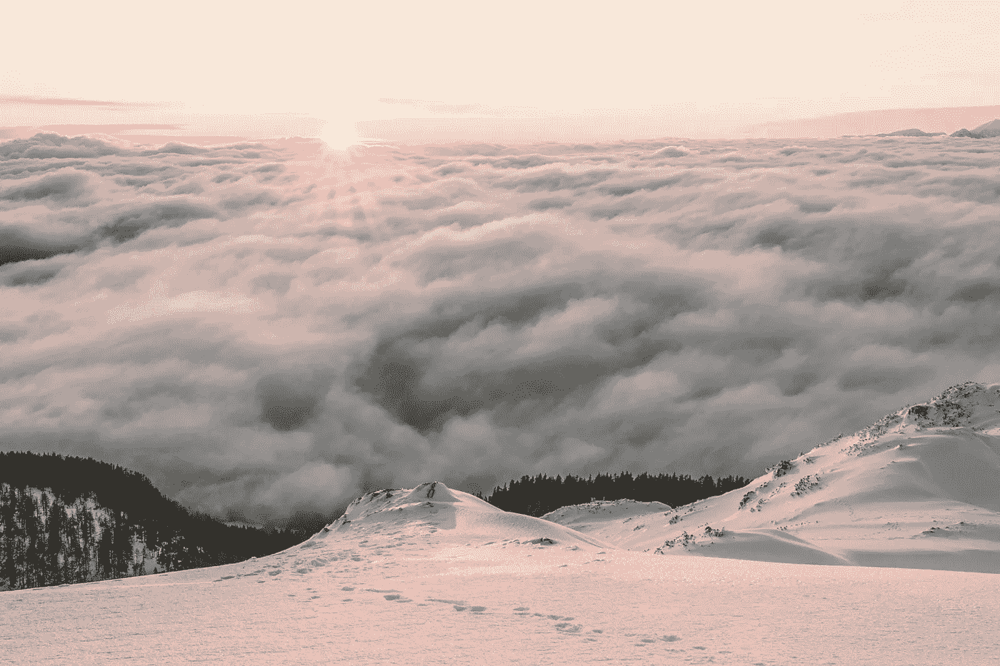
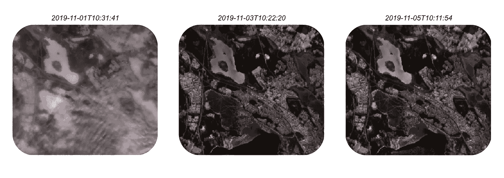
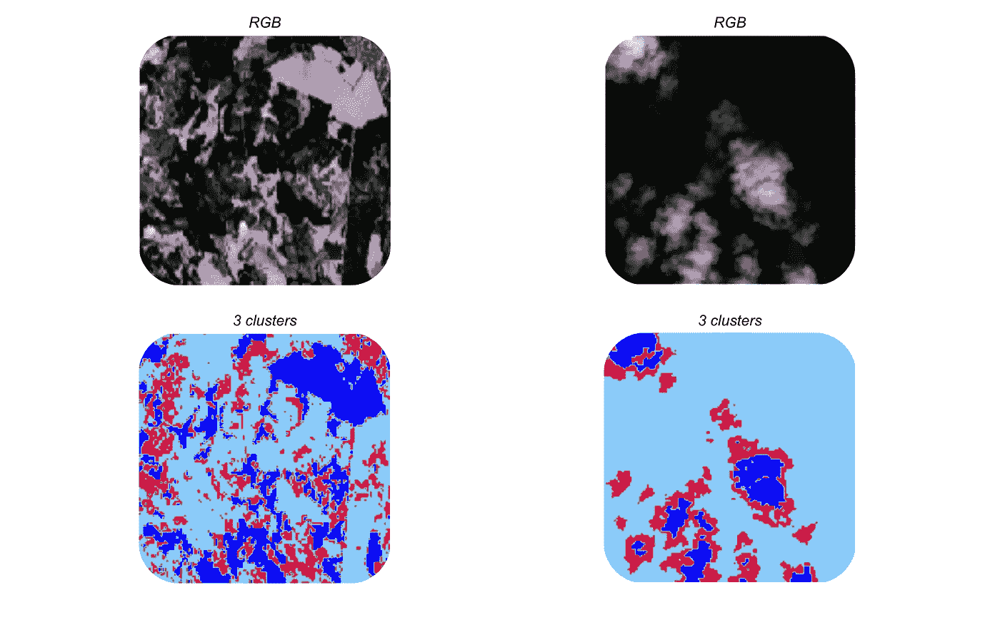
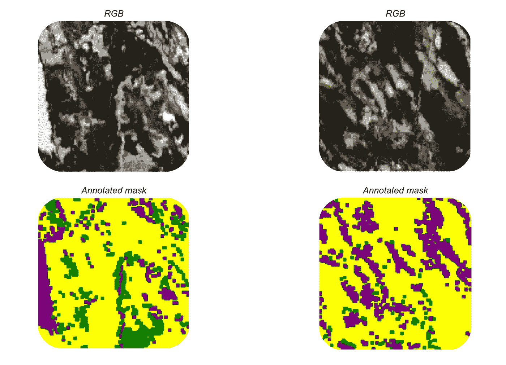
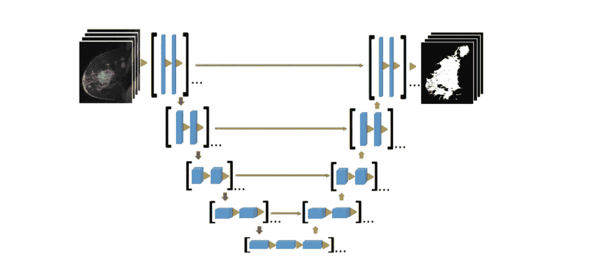
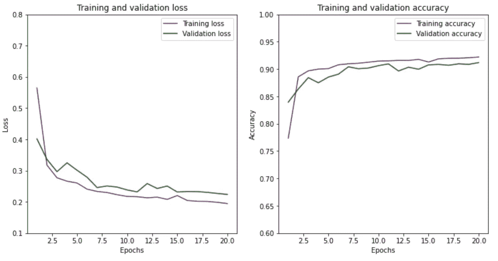
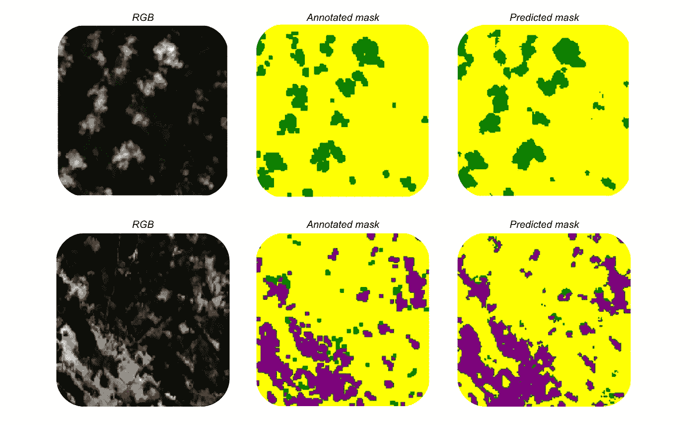

# 在卫星图像中探测雪和云块

> 原文：<https://towardsdatascience.com/detecting-snow-and-cloud-patches-in-satellite-images-496e48262b3c?source=collection_archive---------31----------------------->

## [实践教程](https://towardsdatascience.com/tagged/hands-on-tutorials)

## 在 2020 年哥白尼黑客马拉松期间，看看我们如何解决在真实世界卫星图像中检测雪和云块的问题。

来源:https://www.pexels.com/

2020 年 9 月底，我们参加了[哥白尼黑客马拉松瑞典 2020](https://copernicus-hackathon.confetti.events/) 。在由 Arctic Business 和 Innovatum Startup 组织的黑客马拉松上，所有参赛团队都通过欧洲哥白尼项目利用卫星图像来解决与气候变化、陆地生命和新冠肺炎有关的各种问题。

在这篇博文中，我们将看看我们如何使用深度学习解决在真实世界卫星图像中检测雪和云的问题。

# 雪和云的检测问题

黑客马拉松提出了解决各种问题的挑战，从水资源短缺到自动圈地到新冠肺炎。我们选择了*雪和云的探测*问题。这里的挑战是建立能够检测图像中的雪和云的模型。由于二者具有相似的光谱特性，在卫星图像数据中区分雪和云是一个相当困难的问题。

我们不仅想知道图像中是否有雪和/或云，还想知道这些区域在图像中的位置。由此产生的问题是所谓的*图像分割*问题，其中我们预测属于(这里:雪、云或其他)图像中每个单独像素的类别，而不是图像整体。

# 卫星数据

在我们的挑战中，我们利用了来自[哨兵 2 号卫星](https://sentinel.esa.int/web/sentinel/missions/sentinel-2)的瑞典卫星图像数据。数据通过[开放数据立方体](https://www.opendatacube.org/)平台提供。在数据中，我们可以访问各种哨兵-2 波段。我们自然有红色、绿色和蓝色(RGB)波段，但也有像红外线、水蒸气地图等东西。使用 RGB 波段，我们可以展示瑞典北部地区不同时间的几幅图像。

来自卫星数据的示例图像。(图片由作者提供)

通过在不同时间从不同地区收集大量这样的图像，我们构建了自己的数据集，用于训练和评估解决手头任务的模型。

# k 均值聚类

由于没有直接可用的图像分割的注释数据，我们的第一种方法是使用 K-means 聚类来聚类图像数据，因为这是一种无监督的方法。对于三个期望的类(雪、云和其他),我们在三个集群中尝试了这种方法。让我们看一些例子来了解结果。

K 均值聚类的结果示例。(图片由作者提供)

通过分析聚类结果，我们可以看到 K-means 算法成功地将雪和云与其他所有东西分开。然而，该算法**无法区分雪和云**。正如我们所看到的，雪和云的斑块合并成两个集群，而不是分离成单独的一个。

无监督聚类方法显然不足以解决这个问题。因此，我们将改为在监督设置中训练图像分割模型，以尝试解决我们的问题。

# 图象分割法

虽然直接进入图像分割模型的构建令人兴奋，但我们将首先看看我们如何为卫星图像数据集创建注释，以便我们可以训练和评估我们的模型。

## 释文

没有直接可用的带注释的图像遮罩(pixelwise 类属性)。幸运的是，Sentinel-2 数据提供了两个有用的波段，即*降雪概率*和*云概率*波段。顾名思义，这些波段由每个图像像素包含雪和云的概率组成，由它们自己的模型产生。

将这些波段的值与两个概率的阈值相结合(以及一些平滑技巧)，我们能够生成我们自己的注释掩码，用于监督学习。下面我们可以看到一些例子。紫色区域是雪，绿色区域是云，黄色区域是其他的。

*卫星数据的示例注释掩码。紫色区域是雪，绿色区域是云，黄色区域是其他的。(图片由作者提供)*

使用其他模型的结果作为您自己模型的注释当然不是首选的方法。然而，在这种情况下，这是进行监督学习的唯一选择，而不必我们自己注释图像。它还提供了一个机会来改善 Sentinel-2 自己的模型的结果，并为我们提供了一个模型，该模型可用于雪和云概率带不可用的其他图像数据。

## 模型

对于大多数图像分析问题，深度学习是必由之路。我们解决这个图像分割问题的方法没有什么不同。具体来说，我们在模型中使用了深度神经网络 U-Net 结构。U-Net 模型通常用于图像分割任务，实际上是为生物医学图像分割而开发的。

U-Net 网络架构有两个主要部分——下采样器和上采样器——分别由下图中的左右部分表示。缩减采样堆栈将逐步缩减图像采样，如下所示:

> 128 x128→64x 64→32x 32→16x 16→8 x8→4x 4

并通过这种方式找到模型其余部分可以使用的输入的良好表示。这个下采样部分因此作为模型的特征提取器工作。为了增强我们的模型，我们使用了预训练的下采样堆栈，因此能够通过迁移学习从我们自己的数据集之外的其他图像中整合有用的信息。

U-Net 网络架构。来源:https://csaybar.github.io/blog/

U-Net 模型的上采样器部分将再次对图像进行上采样，如下所示:

> 4x4 → 8x8 → 16x16 → 32x32 → 64x64

在最后的卷积层将图像恢复到 128×128 大小之前。

上图中的那些绿色箭头是怎么回事？它们象征着所谓的跳过连接，这意味着模型例如将来自下采样器的 16x16 表示直接发送到上采样器的 16x16 → 32x32 层，以及来自先前 8x8 → 16x16 层的输出。跳跃连接减少了训练期间消失梯度的影响，并由此加速和简化了模型训练。

## 结果

有了数据集和模型，我们只剩下模型训练和评估了。在将整个数据集分成训练集、验证集和测试集之后，我们在训练集上对模型进行了 20 个时期的训练，并得到了以下学习曲线:

从训练和验证模型中学习曲线。(图片由作者提供)

除了由于一个相当小的数据集导致的曲线中的“尖峰”,所有曲线看起来都像我们希望的那样，并且我们能够达到良好的准确度分数。对测试集的最终预测显示了 91%的准确度，即，给定我们之前构建的注释遮罩，我们的模型预测了测试集中所有图像中所有像素的 91%的正确类别归属(雪、云或其他)。

最后，让我们看看我们的模型在测试图像上做出的一些预测。

*测试集上模型预测的例子。紫色区域是雪，绿色区域是云，黄色区域是其他的。(图片由作者提供)*

除了 91%的高准确率之外，我们还可以在这里看到该模型工作得非常好！不像我们上面做的聚类，我们的图像分割模型也是**能够检测和区分雪和云。**有趣的是，至少在这两个例子中，预测的掩码似乎比带注释的略好。也许我们能够改进现有的 Sentinel-2 模型来探测雪和云。

# 结论

总之，在哥白尼项目中，我们解决了从 Sentinel-2 卫星的卫星图像中检测雪和云块的挑战。在意识到无监督聚类方法不足以解决这个图像分割问题后，我们注释并训练了我们自己的 U-Net 神经网络模型，并取得了非常好的结果。

为了进一步改善结果，我们可以:

*   使用更大的卫星图像数据集
*   提供更好的、可能是人为的注释
*   寻找其他预先训练好的模型，以纳入我们自己的模型

总的来说，这是一个成功而有趣的项目！

# 进一步阅读

在这篇由瑞典 AI 撰写的文章中，你可以读到更多关于我们使用雪和云检测模型来绘制地图和预测路况的想法。