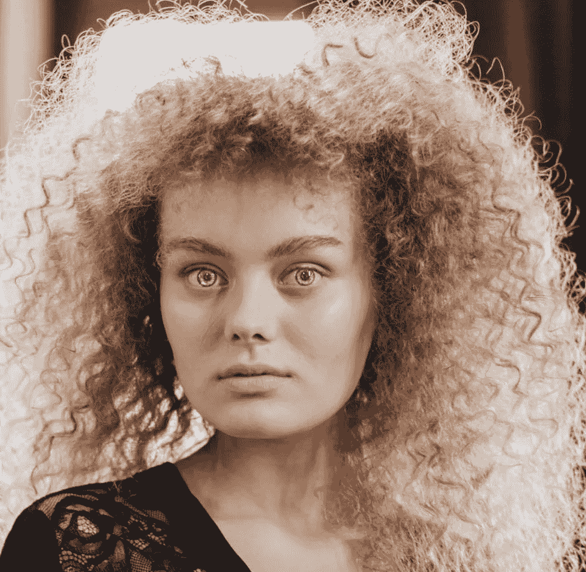
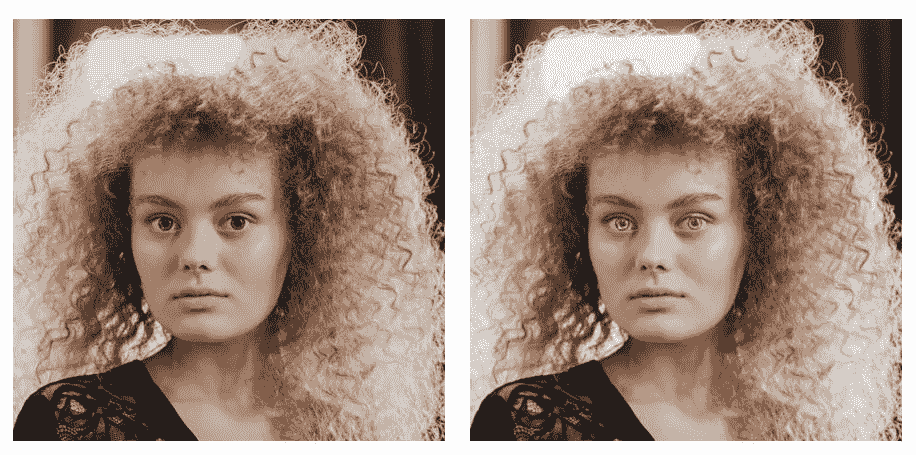

# 使用 OpenCV 和 Dlib 检测虹膜并改变其颜色

> 原文：<https://towardsdatascience.com/detecting-the-iris-and-changing-its-color-using-opencv-and-dlib-30a6aad122dd?source=collection_archive---------11----------------------->

费利佩·库尼亚的眼睛和科托姆布罗的照片，[https://www.pexels.com/@cottonbro](https://www.pexels.com/@cottonbro)

在这个简短的教程中，我们将讨论如何在图像上定位某人的虹膜，并创建一个遮罩，这样我们就可以改变它的颜色。

精确定位虹膜边界的问题并不简单。我们想要创建一个非常精确的蒙版，这样最终的效果看起来更真实。为了努力取得成功，我们需要执行以下步骤:

1.  执行面部标志检测。
2.  使用相应的标志为双眼创建蒙版。
3.  为图像的适当颜色通道设定阈值。这一步取决于主体的虹膜色调。例如，如果您试图检测一个蓝眼睛的人的虹膜，您应该使用图像的红色或绿色通道来增加与白色背景的对比度。
4.  找到二值化虹膜图像的质心。
5.  找到二值化虹膜图像的轮廓。
6.  找出所有虹膜轮廓的最小封闭圆。
7.  比较步骤 4 中获得的质心与所有轮廓的最小封闭圆的质心之间的距离。
8.  选择质心到质心距离最小的圆。
9.  使用步骤 8 中获得的圆创建一个蒙版和一个反向蒙版。
10.  将颜色转换应用于整个图像，并将此图像乘以虹膜蒙版。
11.  将原始图像乘以反向蒙版。
12.  将步骤 10 和 11 的结果图像相加。

请检查以下实施情况:

而结果呢！

右:原始图像/左:处理后的图像

谢谢你看我的文章！我很想听听大家对改进这段代码的意见。我想尝试的是通过分析主体虹膜的 BGR 通道强度来自动进行阈值处理。这也可以让算法自动确定合适的颜色通道，以找到虹膜的边界。