# 使用无监督学习技术检测巴伦西亚最受欢迎的旅游景点

> 原文：<https://towardsdatascience.com/detecting-the-most-popular-tourist-attractions-in-valencia-using-unsupervised-learning-techniques-de0b12fb1ca?source=collection_archive---------13----------------------->

## DSCAN 算法用于发现巴伦西亚(西班牙)最受欢迎的拍照地点。

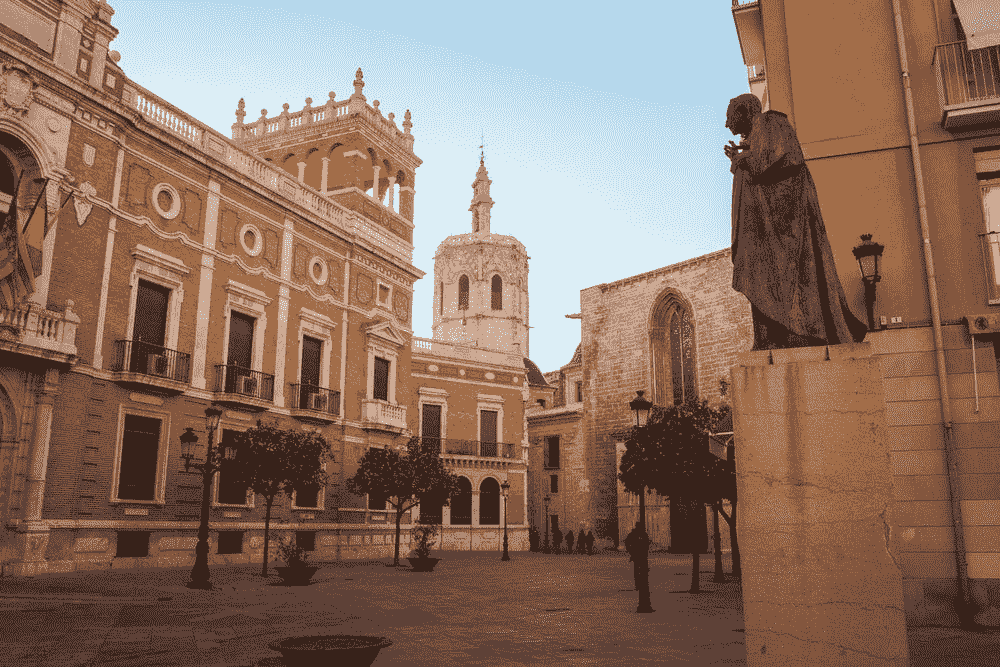

Jonny James 在 Unsplash 上拍摄的照片

瓦伦西亚是西班牙最国际化、最具活力的城市之一。巴伦西亚位于地中海海岸，是西班牙第三大城市和大都会区。在 2000 多年的历史中，这座城市是许多不同文化的发源地。罗马人、西哥特人和穆斯林占领了巴伦西亚，留下了丰富的艺术收藏品和独特的建筑遗产。目前，巴伦西亚是一个受游客欢迎的地方，每年接待大约 200 万游客。

在本文中，我们将使用 [**Flickr**](https://www.flickr.com/) 提供的照片的地理信息来分析**巴伦西亚**最相关的景点。为此，我们将使用算法 **DBSCAN** ，这是一种**无监督学习技术**，它根据密度提供数据聚类。

# 开源代码库

这个项目的代码可以从 GitHub 上的 Jupyter 笔记本中获得。

 [## GitHub-amandaiglesiasmoreno/DBS can _ photos _ Valencia

### 此时您不能执行该操作。您已使用另一个标签页或窗口登录。您已在另一个选项卡中注销，或者…

github.com](https://github.com/amandaiglesiasmoreno/dbscan_photos_valencia) 

# **Flickr API**

Flickr 是最受欢迎的照片分享网站之一。要使用 **Flickr API** ，你需要一个 **Flickr API** **key** 和一个 **Flicker 用户 ID** 。一旦您有了用户 ID 和 API 密钥，您就可以使用 **flickrapi 库**来搜索图像。

项目的第一部分包括导入所有需要的库以及创建一个 **FlickrAPI** 对象。

# 使用`flickr.photos.search`功能获取照片

下一步包括使用 **Flickr API** 获取感兴趣的照片。`flickr.photos.search`函数根据给定的参数返回 Flickr 存储库的照片列表。为了简化分析，我们将只从存储库中下载 2019 年在巴伦西亚拍摄的**照片。我们可以使用参数(1) `min_upload_date`和(2) `max_upload_date`来指定**利息日期(2019)** 。另外，我们将只下载平台上的**公开照片** ( `media='photos'`和`privacy_filter=1`)，不包括视频和私人照片。最后，我们提供 Valencia** 的**边界框来保证只检索这个特定区域的照片。**

# 定义区域的边界框

如上面的代码所示，我们需要向`flickr.photos.search`函数(参数`bbox`)提供 Valencia 的**边界框，以仅检索在该区域拍摄的照片。要获得该区域的坐标，我们可以使用[**OpenStreetMap**](https://www.openstreetmap.org/)数据库。在地图上手动绘制感兴趣区域后，位于左上角的文本框中会出现**边界框坐标**(左下角经度，左下角纬度，右上角经度，右上角纬度)，如下图所示。然后，我们需要将这些坐标作为字符串提供给`bbox`参数，其中的值用逗号分隔。**

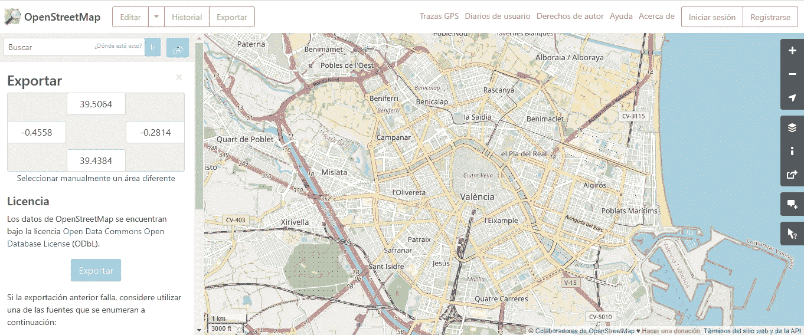

用 OpenStreetMap 获取瓦伦西亚的边界框

# 将搜索函数的输出(XML 元素)转换成 Pandas 数据帧

当您调用函数时,`flickr.photos.search`函数发回一个解析过的 **XML 元素**。该元素包含关于符合搜索标准的照片的多个**细节。`rsp`标签在属性`stat`中指示调用是否成功执行。`photos`标签提供了搜索结果的摘要。在这种情况下，有 17997 张图片符合组织在 72 页中的搜索标准。在`photos`标签中，有一个`photo`标签列表，每个标签包含一张特定照片的信息。在本例中，**感兴趣的属性只有四个:(1)id，(2)纬度，(3)经度，(4)照片的 URL**；然而，正如您在下面看到的，搜索功能提供的描述照片的属性数量要多得多。**

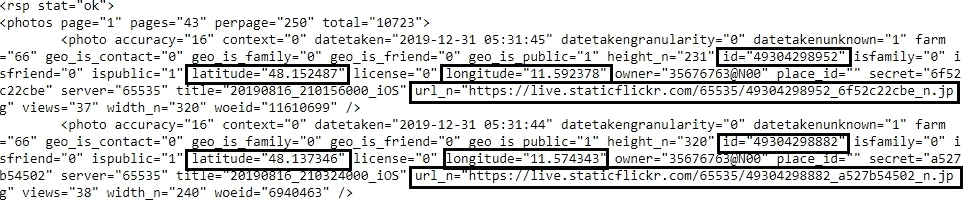

搜索功能的输出

如上面的代码所示，我们将感兴趣的信息存储在名为`photo_information`的字典中，其中的键表示感兴趣的属性，值是包含数据的列表，每个索引存储一张照片的详细信息。

最后，我们可以使用`pandas.DataFrame`构造函数轻松地将这个字典转换成 pandas 数据框，如下所示。

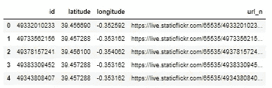

# 数据清理

在检索感兴趣的信息之后，所获得的数据帧仅包含四列:(1) `id`、( 2) `latitude`、(3) `longitude`和(4) `url_n`。这是一个非常简单的数据集；但是，我们不能直接使用它来对数据进行聚类。我们需要先把它清理干净。

数据集不包含缺失值；但是，纬度和经度列的**数据类型被错误检测**。我们需要将这些列转换成浮点数，以便稍后在 **DBSCAN 算法**中使用它们。

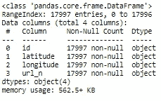

纠正错误的数据类型后，我们分析数据帧是否包含**重复照片**。Flickr 中的每个照片商店都有自己唯一的 id。因此，不可能有两张具有相同 id 的不同图片。正如你在下面可以观察到的，**大部分照片都是重复的**，所以我们需要把它们从数据框中剔除。

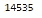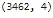

一旦删除了重复的条目，我们就从数据集中删除`id`和`url_n`列，因为不再需要它们了。

现在，我们可以使用这些数据来获得指示该城市最受欢迎的景点的聚类。

# **DBSCAN 算法**

## **理论**

**DBSCAN** (含噪声应用的基于密度的空间聚类)方法是一种**基于密度的聚类算法**，用于将高密度区与低密度区分开。

该算法基于**两个超参数**:

*   **半径( *eps* ):** 被视为邻居的两个样本之间的最大距离。
*   **最小点数( *MinPts* ):** 考虑一个观察核心点的邻域样本数。

基于这些超参数， **DBSCAN 算法**根据以下规则将数据集中的每个观察值分类为**核心、边界或异常点**:

*   **核心点**:在其半径 *eps* 内至少有 *MinPts* 个观测值的数据点。
*   **边界点**:半径 *eps* 小于 *MinPts* 点的数据点；然而，该点在核心点的半径 *eps* 内。
*   **离群点**:既不是核心点也不是边界点的数据点。

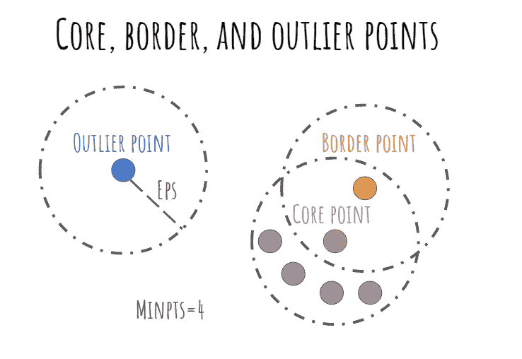

核心点、边界点和异常点—由作者创建的图像

然后，根据聚类的类型将这些点分配给聚类。每个集群包含至少一个核心点和所有可从其到达的边界点。

## 优点和缺点

相对于其他聚类算法，DBSCAN 算法提供了多种优势。DBSCAN 算法的主要优势在于它可以**找出任何形状的簇**。聚类不必具有斑点形状。此外，**在执行算法之前没有必要固定聚类数**，因为我们必须使用 K-means 方法。此外， **DBSCAN 能够检测数据集中的噪声**，这与基于分区的算法(例如将所有点分配到一个聚类的 K-means)形成对比。使用 DBSCAN，位于低密度区域的点不会被分配给任何聚类。

然而，DBSCAN 方法也有一些缺点。**该算法的主要挑战是找到两个超参数(eps 和 MinPts)的正确组合**。这些超参数的选择是任意的，并且高度影响算法获得的结果。一种常见的做法是测试不同的超参数集，并选择一个产生可接受结果的超参数集，同时考虑聚类数和生成的异常值。

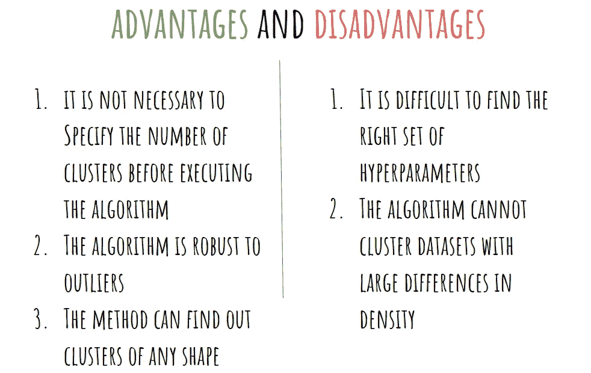

DBSCAN 算法的优缺点——作者创建的图像

# **用散点图可视化观察结果**

下面的图显示了 2019 年在巴伦西亚拍摄的照片的位置(在 Flickr 平台上可用)。 **x 轴代表照片拍摄地的经度**，y 轴代表纬度。如您所见，有些位置显然拍摄了更多照片(高密度区域)。下一步包括使用 **DBSCAN 算法**来识别这些位置。

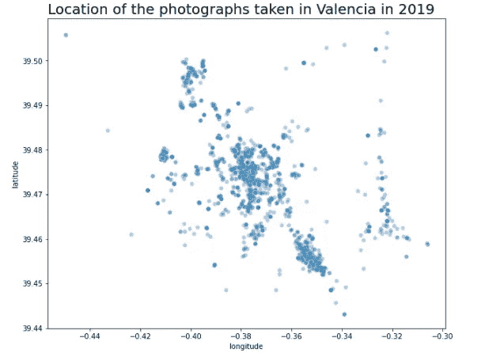

# 用 Scikit-Learn 实现 DBSCAN 算法

为了实现 **DBSCAN 算法**，我们需要首先实例化一个`DBSCAN`模型，它可以从`sklearn.cluster`导入。如下所示，为这个特定数据集选择的超参数是:(1) `eps=`和(2) `min_samples=`。这些参数是通过反复试验确定的。注意，在应用 DBSCAN 算法之前，我们已经用`MinMaxScaler`类对数据点进行了规范化，因此所有属性(纬度和经度)都具有相同的范围【0，1】。

我们可以通过查看标签的唯一值来确定聚类的数量。正如你所看到的，一些观察值的指数等于-1，这意味着这些观察值被算法检测为异常值 T21。

最后，我们可视化排除噪声的集群**(与等于-1 的标签相关联的观察)。此外，我们在聚类中心绘制了与每个组相关联的标签。**

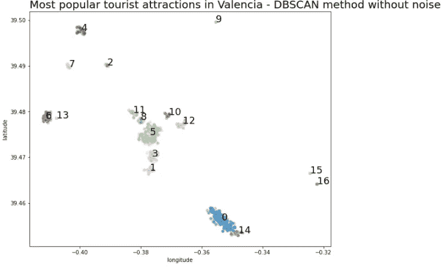

# 在交互式地图上可视化聚类的中心

下一步是**在巴伦西亚**的地图上可视化集群中心。这种方法可以让我们很容易地**将群体的中心和城市中的地点联系起来**。

首先，我们构建一个带有位置和缩放级别的**叶子地图**。这将产生一个给定位置的空地图(在本例中是 Valencia)。然后，我们用`Marker`函数在聚类中心的位置绘制标记。

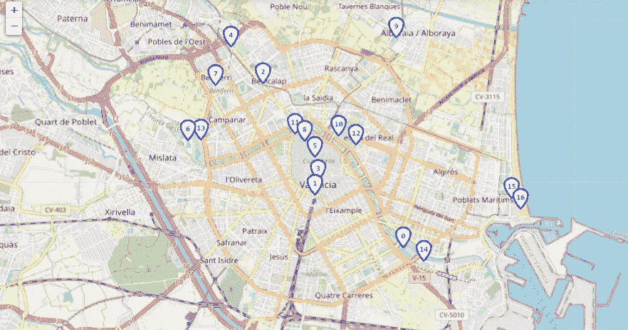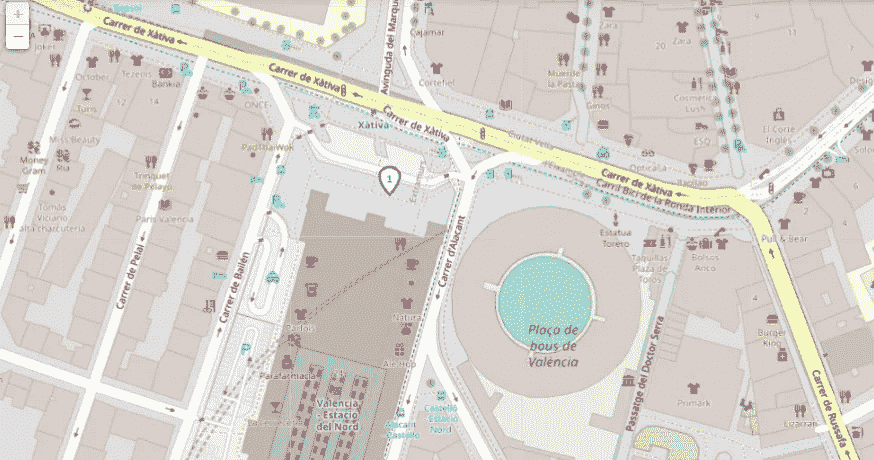

# 集群协会——巴伦西亚最重要的景点

我们可以通过在巴伦西亚地图上可视化这些群体的中心来识别以下兴趣点:

*   集群 0:艺术与科学之城
*   **集群 1** :火车北站
*   第二组 : Burjassot 大街
*   **集群 3** :市政厅广场
*   **第四集群**:贝尼卡拉普公园
*   **第五组团**:城市的历史中心
*   第六组:生物圈公园(动物园)
*   第 7 组:Parroquia San Jose maría escrivá
*   **集群 8** :埃尔卡门街区
*   第九集群:体育中心(朝歌)
*   **集群 10** :瓦伦西亚美术博物馆
*   第 11 组:巴伦西亚现代艺术学院
*   第 12 组:怡和集团
*   第 13 组:卡帕雷拉公园
*   第 14 组:海洋
*   第 15 组:拉斯阿里纳斯度假村
*   第 16 组:马尔瓦罗萨海滩

# 我最喜欢的地方😍

## 集群——城市的历史中心

巴伦西亚的历史中心毫无疑问是这座城市最迷人的部分。如今，这座历史中心是现代巴伦西亚的休闲和贸易中心，商店、餐馆和酒吧林立。中央市场、大教堂、丝绸交易所和埃尔卡门街区是巴伦西亚老城最重要的组成部分。

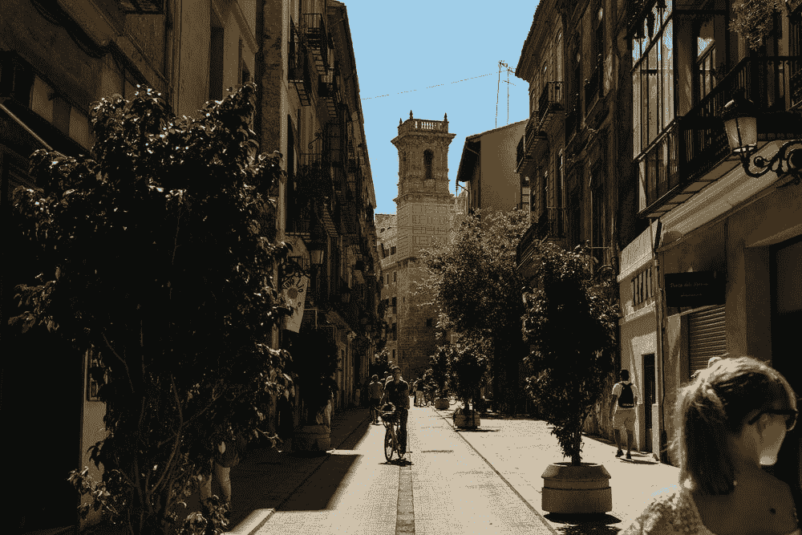

照片由[艾·埃尔默斯](https://unsplash.com/@alelmes)在 Unsplash 上拍摄

## 集群——艺术与科学之城

艺术与科学城是一个由瓦伦西亚建筑师圣地亚哥·卡拉特拉瓦设计的文化与科学综合体。它**位于图里亚河床**的尽头，是巴伦西亚最受欢迎的景点之一。于 1998 年 4 月正式落成的****艺术与科学之城由 7 座建筑组成: **L'Hemisfèric** (1998 年)**El Museu de les ciències feli PE**(2000 年) **L'Umbracle** (2001 年)**L ' oceanograf**(2000 年)该综合建筑全年提供广泛的文化活动和事件。****

****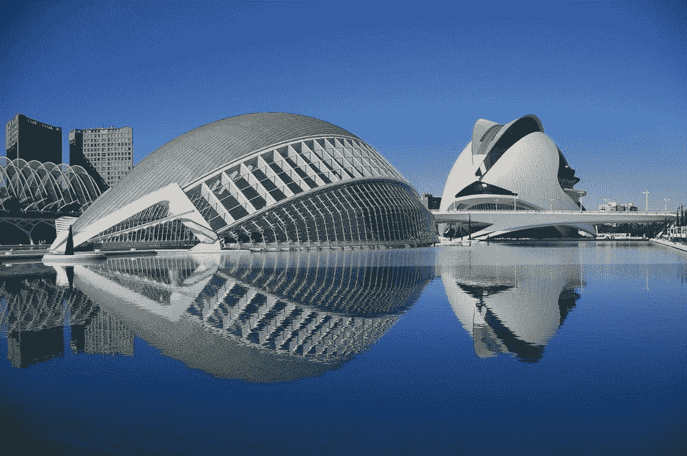****

****照片由[彼得·劳伦斯](https://unsplash.com/@chesterfordhouse)在 Unsplash 上拍摄****

# ****替代可视化—照片的热图****

****分析的最后一步是**使用热图**可视化照片的位置(纬度和经度)。热图使用颜色来显示一个区域中某个量的变化。在这种情况下，我们再次使用 lyum 创建一个热图，覆盖在 Valencia 的地图之上。****

****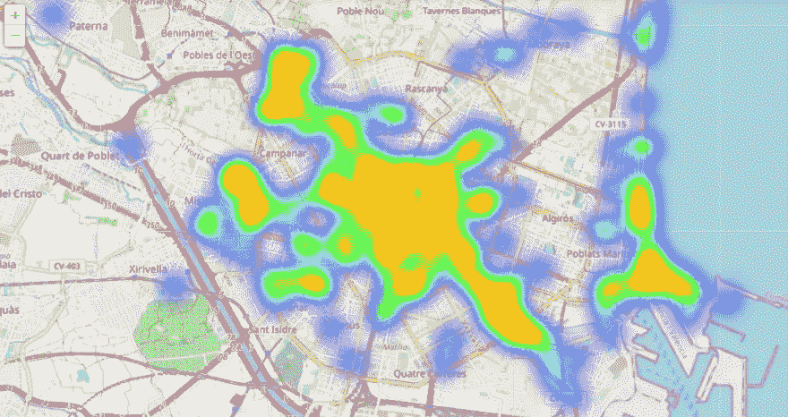****

****如下图所示，历史中心、艺术与科学城、港口和动物园是巴伦西亚最受欢迎的地方。****

****阿曼达·伊格莱西亚斯****