# 利用决策树检测脊柱病变

> 原文：<https://towardsdatascience.com/detection-of-vertebral-column-pathologies-using-decision-trees-ad4e47ae58c2?source=collection_archive---------19----------------------->

## 用 Scikit-learn 库构建决策树

由 [Joyce McCown](https://unsplash.com/@moonshadowpress) 在 [Unsplash](https://unsplash.com/?utm_source=medium&utm_medium=referral) 上拍摄的照片

人工智能在医疗保健领域有着巨大的潜力，并且在过去几年中一直在这一领域不断发展。**医疗行业正在利用人工智能做出更智能、更准确的决策。**机器学习在医疗保健领域的应用非常广泛，从疾病诊断和识别到机器人手术，在大多数情况下都提供了超出人类能力的结果。

在本文中，您将学习如何使用**决策树**构建**二元分类模型**来检测脊柱病变患者。这些模型是使用 **Python** 特别是 **Scikit-learn 库**构建的；然而，重要的是要强调，许多其他编程语言也有可用于轻松构建分类模型的库(例如 R 和 Java)。

为了便于理解文章的内容，**每一节都包含理论介绍和解释性插图**。它们支持更容易地理解用于构建和评估分类模型的编程代码。❤️

# 数据集

本文使用的数据集可在**加州大学欧文分校机器学习知识库**和中获得，包含**六个生物力学特征**，用于将患者分为**两组** : (1)正常，和(2)异常。类别`NO`(正常)包括 100 名没有脊柱疾病的患者，而类别`AB`(异常)包括 210 名患有脊柱问题的患者。

[https://archive.ics.uci.edu/ml/datasets/Vertebral+Column](https://archive.ics.uci.edu/ml/datasets/Vertebral+Column)

# 开源代码库

这个项目的代码可以从 GitHub 上的 Jupyter 笔记本中获得。

 [## amandaiglesiasmoreno -概述

### 阻止或报告 7 月 8 月 9 月 10 月 11 月 12 月 1 月 2 月 3 月 4 月 5 月 6 月 7 日周一周三 Fri amandaiglesiasmoreno 没有活动…

github.com](https://github.com/amandaiglesiasmoreno) 

# 数据读取和清理

分析的第一步包括**使用`pandas.read_csv`函数读取和存储 Pandas 数据帧中的数据**。在 **UCI 存储库**中可用的 **CSV 文件**不包含指示列名的标题，因此它们必须用参数`names`手动指定。

数据集包含 **6 个独立变量**，表示脊柱的生物力学属性:(1) `pelvic_incidence`、(2) `pelvic_tilt`、(3) `lumbar_lordosis_angle`、(4) `sacral_slope`、(5) `pelvic_radius`、(6) `degree_spondylolisthesis`。列`class`表示患者是否患有脊柱疾病。

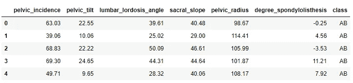

**目标是使用所有生物力学特征建立一个模型，以预测脊柱病理的存在。**在这个特殊的例子中，我们将只使用**决策树算法**来构建模型；然而，一个更深思熟虑的分析将包括使用更多的监督学习算法，目的是找到具有更大预测能力的模型。

# **探索性数据分析**

**探索性数据分析**包括分析数据集的主要特征，通常采用**可视化方法**和**汇总统计**。目标是理解数据，发现模式和异常，并在执行进一步评估之前检查假设。

在 EDA 之初，我们希望了解尽可能多的关于数据的信息，这就是`pandas.DataFrame.info`方法派上用场的时候。该方法打印数据帧的**简明摘要，包括列名及其数据类型、非空值的数量以及数据帧使用的内存量。**

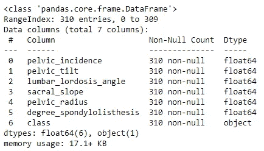

如前所示，**数据集不包含空值，所有数据类型都是正确的**；因此，该数据无需额外修改即可用于分类模型的构建。

在 EDA 过程中，可视化变量的分布以及它们之间的相关性也很有趣。配对图是快速探索这两种事物的简单方法。他们在图的主对角线提供**直方图，以检查数值变量的分布。此外，主对角线之外的位置提供了数字变量**的**散点图，以便于分析它们之间的关系。**

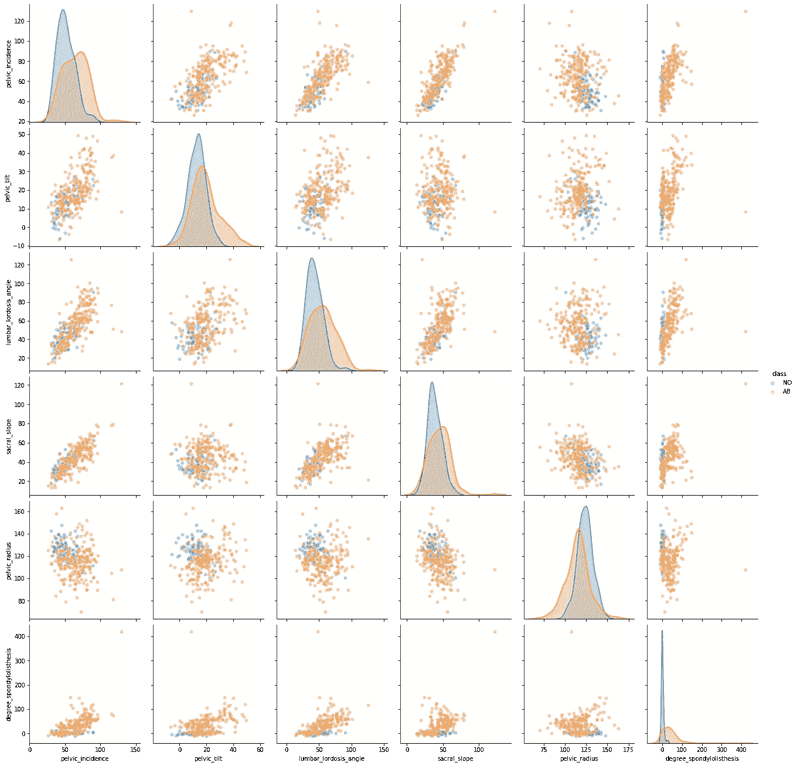

作者用 seaborn 生成的图像

查看配对图，我们可以得出结论，当患者有脊柱问题时，属性`degree_spondylolisthesis`呈现高值，并且根据直方图，预期该属性在对患者进行分类时具有巨大的重要性。

关于其他属性，低`pelvic_radius`的患者更容易出现脊柱异常；然而，当患者是健康的并且没有遭受任何脊柱病变时，其余的属性呈现较低的值。

# **数据拆分:训练集和测试集**

建立模型的第一步是**将数据分成两组**，通常称为**训练和测试集**。机器学习算法使用训练集来构建模型。测试集包含不属于学习过程的样本，用于评估模型的性能。使用看不见的数据来评估模型的质量以保证客观的评估是很重要的。

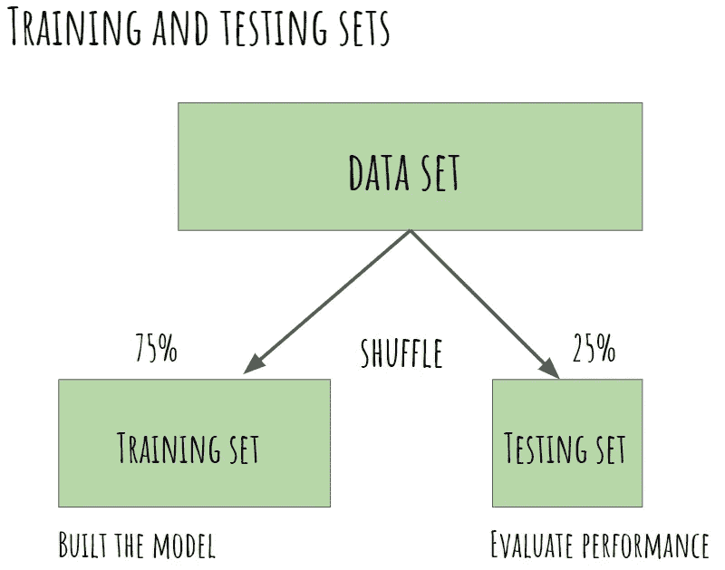

训练集和测试集(图片由作者创建)

首先，我们创建一个变量 X 来存储**独立属性**(生物力学特征)。类似地，我们创建一个变量 y，只包含目标变量(类)。

然后，我们可以使用`sklearn.model_selection`包中的`train_test_split`函数来创建训练集和测试集。

**默认拆分百分比将 75%的观察值分配给训练集，25%分配给测试集**；然而，我们可以使用参数`train_size`和`test_size`来表示不同的分布。在这种情况下，我们使用默认的分割百分比 75/25。

参数`shuffle`决定数据在分割前是否应该洗牌。建议**随机分割数据**，以确保目标变量的**分布在两个数据集**(训练和测试集)中相似，这意味着两个数据集都具有代表性。默认情况下，参数`shuffle`的值为`True`；但是也可以显式指定，表示`shuffle=True`。

重要的是要记住，我们每次运行代码得到的结果都是一样的，因为参数`random_state`被设置为 40，而不是无(默认值)。该参数**控制分割前应用于数据** **的混洗将始终相同。**

分割数据后，建议检查目标变量是否在两组数据中均匀分布。如下所示，**在训练和测试组中，脊柱病变患者的百分比相似**(约 65%)。

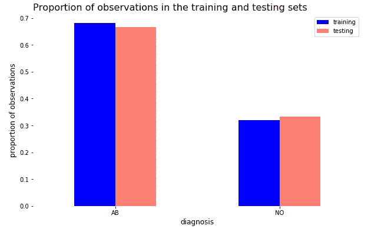

# **决策树算法—理论**

## 元素

决策树是基于一系列分层问题的监督机器学习算法。这些问题会把空间分成多个线性空间来预测结果。响应可以是离散的(一类)或连续的(一个实数)。

决策树是由**的三个元素**组成的:节点、树枝和树叶。**节点**描述了一个属性的测试条件，而**分支**代表了基于该测试条件的结果。**叶**，也称为终端节点，代表决策路径(响应)的终点，与内部节点不同，它们不再进一步分裂。

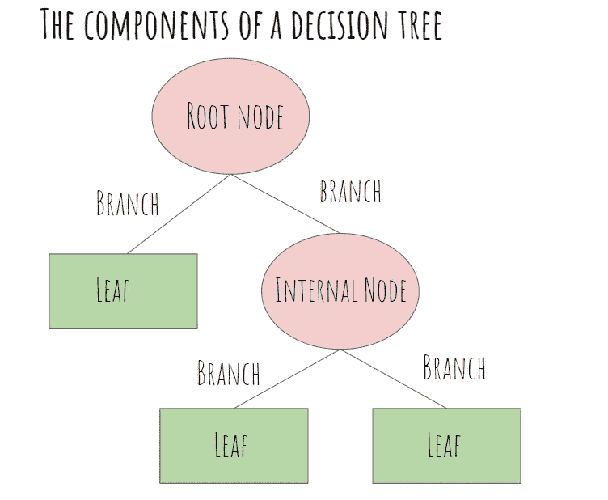

决策树的组成部分(图片由作者创建)

最后，重要的是要提到决策树算法是递归的，这意味着数据被分成更小的块，直到所有的叶子都是纯的(如果没有实施预修剪技术)。

## 优点和缺点

与神经网络等其他机器学习算法相比，决策树的**主要优势在于获得的模型是**高度可解释的**。神经网络在准确性方面比决策树取得更好的结果；然而，它们并没有提出一个容易理解的模型。无法解释决策是如何根据网络的权重做出的。相比之下，即使是非技术人员，决策树也很容易可视化和理解。**

另一个优势是决策树**不需要密集的预处理任务**，例如数据的标准化。存在对变量范围高度敏感的机器学习算法，例如 K-means。K-means 受属性比例的影响，因为是一种基于距离的算法。在这种情况下，规范化是非常必要的。如果没有实现，具有更高值的特征将主导学习过程，并且获得的聚类将是错误的。然而，决策树是基于规则而不是距离的。因此，**它们不受变量范围的影响，也不需要标准化**。此外，当处理分类特征时，**决策树不需要创建虚拟变量**。

决策树是一种强大易用的机器学习算法；然而，它们也存在**缺点**。决策树的主要问题是**过拟合**。决策树**对训练集过于敏感，**学习数据中存在的噪声。如果训练数据存在大量噪声，则获得的树将非常复杂，难以跟踪。幸运的是，大多数机器学习库中已经实现了两种机制来避免过度拟合:预修剪和后修剪技术。

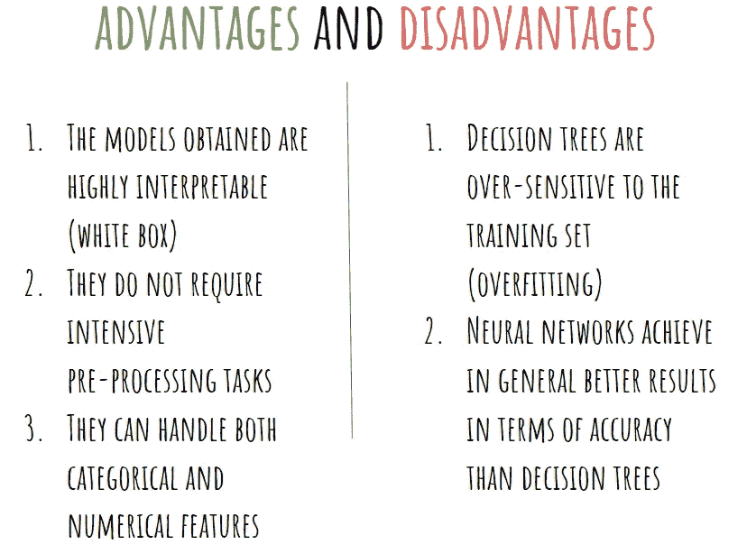

决策树的优缺点(图片由作者创作)

## 分割标准

构建决策树有不同的**分裂标准**。Scikit- learn 库有两个用于测量杂质的标准:(1)基尼指数(默认选项)和(2)熵。

**基尼系数**标准是基于最小化错误分类的可能性。指数 **0 代表完美的分裂**，这意味着所有的观察都属于同一个类别。相反，**指数 0.5 代表可能的最高紊乱(在二元分类中)**。当所有类别的概率都相同时，就会出现这种情况。

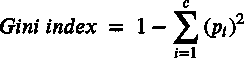

基尼指数公式

在二叉决策树中，分裂的**基尼指数是通过将子节点(左右)的基尼指数乘以每个节点的案例比例来计算的。选择具有最大**基尼系数**(父基尼系数减去分割基尼系数)的属性作为分割属性。**

**熵标准**也常用于在构建决策树时分割数据。如下所示，**这个标准的范围是从 0 到 1** ，其中 0 代表完美分裂(纯节点)，就像基尼标准一样。然而，熵的最大值是 1，而基尼系数的值是 0.5。

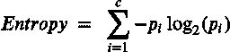

熵公式

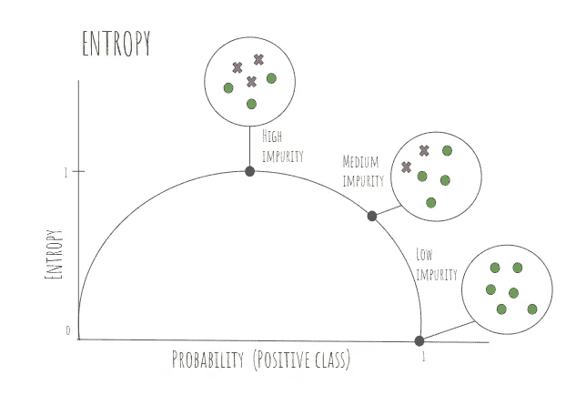

熵(作者创建的图像)

在每个阶段，数据将根据呈现更多**信息增益**(父节点的熵减去子节点的加权平均熵)的属性进行拆分。

需要指出的是**基尼系数和熵值这两种分割方法哪个更合适**并没有确定的规则。事实上，在实践中，两者产生的结果是相似的。

# 用 Scikit-learn 构建决策树

在这个简短的理论解释之后，是时候使用 Scikit-learn 库构建第一个决策树了。

 [## sk learn . tree . decision tree classifier-sci kit-learn 0 . 24 . 2 文档

### 决策树分类器。了解更多信息。参数标准{"gini "，"熵" }，default="gini "该函数用于…

scikit-learn.org](https://scikit-learn.org/stable/modules/generated/sklearn.tree.DecisionTreeClassifier.html#sklearn.tree.DecisionTreeClassifier) 

为此，我们将使用来自`tree`模块的`DecisionTreeClassifier`类。这个类接受几个参数作为输入(所有参数都有一个默认值)。在这种特殊情况下，我们使用熵作为构建树的分裂方法；因此，我们必须设置参数`criterion='entropy'`，因为默认的分割方法是基尼系数。一旦定义了决策树，我们就调用 fit 方法来训练算法。

我们可以用`tree`模块中的`export_graphviz`函数来可视化得到的决策树。该函数以**点格式**导出决策树，可被`graphviz`库用来生成 **png 图像**。

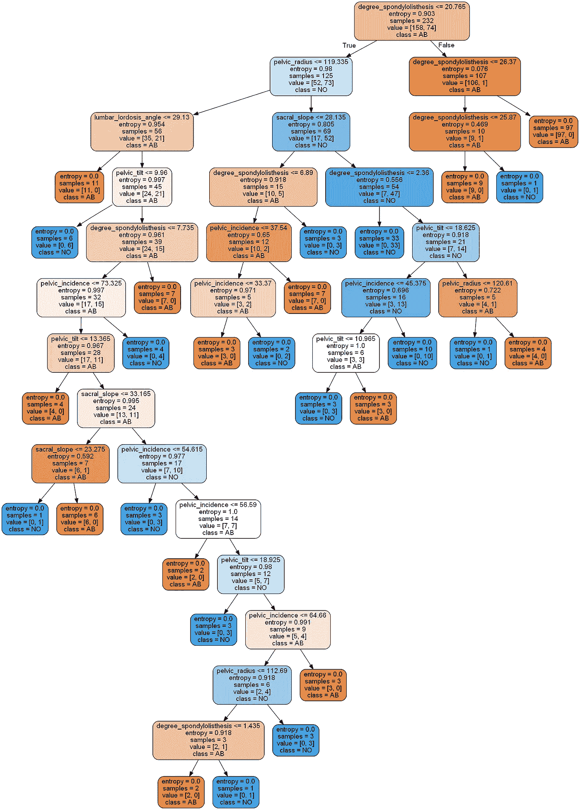

具有默认参数的决策树

没有预修剪，**树会长到所有的叶子都是纯净的**。正如你所观察到的，所有树叶的熵都等于 0。这给出了一个树，其中训练集的所有实例都被正确分类。如果我们不限制树的深度，我们就冒着获得复杂模型的风险，这种模型不能正确地推广到新数据。在接下来的部分中，我们将应用**预剪枝方法来降低树**的复杂度，从而在不损失性能的情况下获得更加简单的决策树。

# 特征重要性

特征重要性表示特征在区分不同类别时的相关程度。在 Scikit-learn 中，我们可以用`feature_importances_`属性获得每个特性的相对重要性。特征的重要性计算为该特征带来的杂质的(标准化)总减少量。

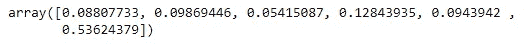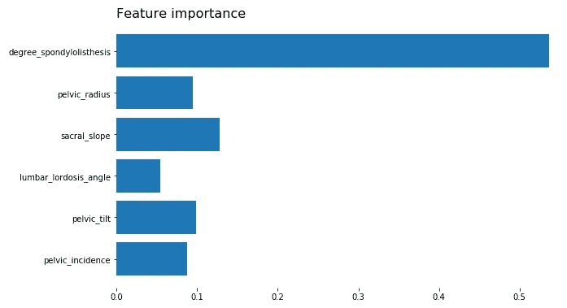

数字越大，特性的重要性越大。如上所示，当预测患者是否有脊柱问题时，属性`degree_spondylolisthesis`表现出更高的重要性。

# 混淆矩阵

**混淆矩阵**，也称为误差矩阵，用于**通过检查正确和错误分类的观察值数量来评估机器学习模型**的性能。**矩阵的每一列包含预测类别，而每一行代表实际类别，反之亦然**。在完美的分类中，除了对角线之外，混淆矩阵将全为零。**主对角线之外的所有元素代表错误分类。**重要的是要记住，混淆矩阵允许我们观察错误分类的模式(错误分类的类别和程度)。

在**二元分类问题**中，**混淆矩阵**是一个由 4 个元素组成的 **2 乘 2 矩阵**:

*   **TP(真阳性)**:被正确归类为患病的脊柱问题患者人数。
*   **TN(真阴性)**:被正确分类为健康的无病变患者的数量。
*   **FP(假阳性)**:被错误归类为患病的健康患者人数。
*   **FN(假阴性)**:被误分类为健康的脊柱疾病患者数量。

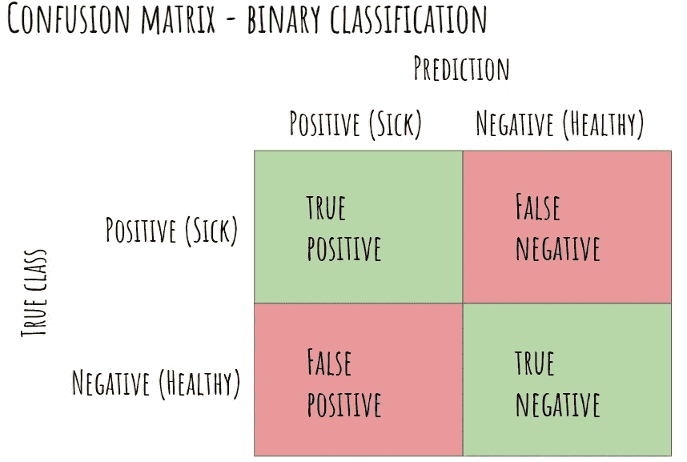

作者创造的形象

**既然模型已经训练好了，是时候使用测试集来评估它的性能了。**首先，我们使用之前的模型(决策树)来预测测试数据的类别标签(使用`predict`方法)。然后，我们使用来自`sklearn.metrics`包的`confusion_matrix`函数构建混淆矩阵，以检查哪些观察值被正确分类。输出是一个 NumPy 数组，其中**行表示真实值**而**列表示预测类**。

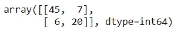

如上所示，测试数据的 65 个观察值被模型正确分类(45 个真阳性和 20 个真阴性)。相反，我们可以观察到 13 个错误分类(7 个假阴性和 6 个假阳性)。

# 评估指标

评估模型的质量是机器学习过程的基本部分。最常用的**绩效评估指标**基于混淆矩阵的元素进行计算。

*   **准确性:**表示预测被正确分类的比例。准确性是最常用的评估指标；但是，请务必记住，在处理不平衡的数据集时，准确性可能会产生误导。

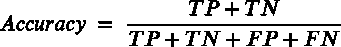

*   **灵敏度:**表示被识别为阳性样本(患病患者)的比例。

*   **特异性:**表示阴性样本(健康患者)的比例。

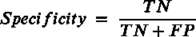

*   **精度:**它代表实际正确的正面预测的比例。

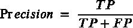

我们可以使用混淆矩阵的数字来手动计算评估指标。或者，Scikit-learn 已经实现了函数`classification_report`，该函数为**提供了关键评估指标**的摘要。分类报告包含每个类别达到的精度、灵敏度、f1 值和支持度(样本数)。

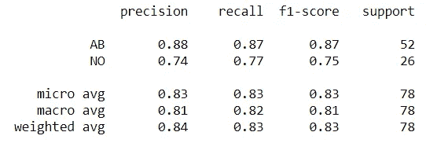

如上所示，我们获得了 0.87 (45/(45+7))的灵敏度**和 0.77 (20/(20+6))的特异性。所获得的模型更准确地预测患有脊柱病变的患者。这不应该让我们感到惊讶，因为**决策树通常偏向于有更多观察的类**(在这个例子中是`AB`)。**

您可能已经注意到，之前的总结不包含分类的准确性。然而，这可以使用`metrics`模块中的函数`accuracy_score`轻松计算。

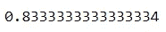

模型做出正确预测的比例为 **83.33%。**

# 预修剪决策树

决策树容易过拟合，为此，通常应用修剪技术来防止树过拟合数据中的噪声。这些技术可以分为两组:

*   **预修剪:**这种方法根据给定的条件阻止树继续生长。
*   **后期修剪**:树长到所有的叶子都是纯净的。然后，不重要的分支被转换成叶子。

下面的**预剪枝方法**可以应用于`DecisionTreeClassifier`构造函数，防止树继续生长:

*   **用参数`max_depth`限制树的最大深度**。此参数采用缺省值 None，这意味着树将一直增长，直到所有训练数据的观察结果都被正确分类。注意该参数的限制是很重要的，因为低值容易产生拟合不足的模型(过于笼统)。
*   **用参数`max_leaf_nodes`限制最大叶片数**。此参数设置决策树可以拥有的最终节点的最大数量。默认情况下，它的值为 None。
*   **用参数`min_samples_split`确定一个节点中继续分裂的最小观察次数**。该参数采用默认值 2，因为具有两个样本的节点可以被分成两个节点(每个节点具有一个样本)。

下面的代码创建了一个带有预修剪的**决策树模型。在这种情况下，决策树的**最大层数**被设置为 8。8 轮吐槽后决策树就要停止生长了。由于这个原因，期望一个比以前简单得多的树，因为没有预修剪，决策树的层数超过 8。**

如下所示，带有预修剪的评估指标与之前获得的非常相似。模型做出正确预测的比例为 **82.05%。**和以前一样，决策树更准确地预测脊柱病变患者(灵敏度高于特异性)。

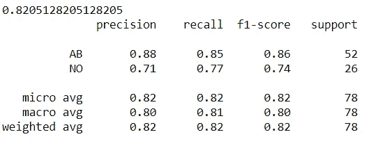

但是，带有预修剪的决策树更简单，也更容易理解，如下图所示。

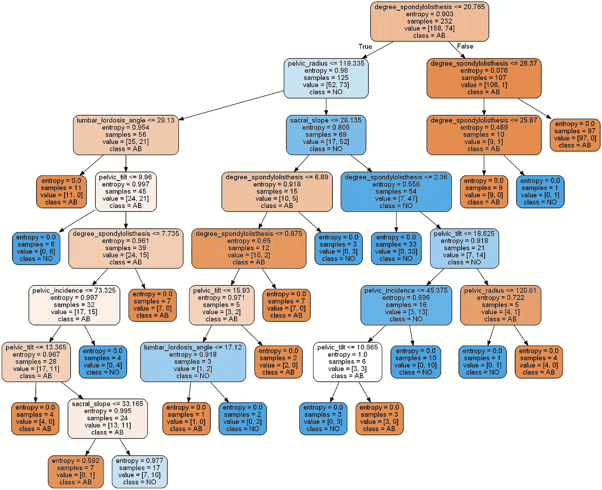

带有预剪枝的决策树

在这种情况下，**决策树并不完全符合训练数据**。有些树叶的熵大于 0。因此，得到的树比前面的树更容易解释。

**预剪枝**方法比**后剪枝**技术更有效(时间复杂度更低)，因为不需要生成整个树，然后删除不能为模型提供更高精度的分支。然而，正如您可能已经想到的，预修剪方法有一个缺点。通常很难精确估计何时停止树木的生长。

# 加权决策树

在一些分类问题中，**存在比其他**更严重的特定错误。在医学诊断问题中，通常更糟糕的是犯下假阴性错误分类，因为这表示将患者诊断为健康，而实际上她/他患有疾病(在这种情况下是脊柱问题)。

**成本矩阵**允许克服这个问题，更严厉地针对代价高昂的误分类(在这种情况下是假阴性)。它基本上**使一些错误分类比其他分类更昂贵**。成本矩阵是 n*n 矩阵(n 等于类的数量)，其中主对角线的所有元素都等于零，因为它们代表正确的分类(真阳性和真阴性)。其余元素将大于零，其中一个非对角线权重大于另一个，以便更严重地惩罚一种类型的错误分类(在这种情况下为假阴性)。

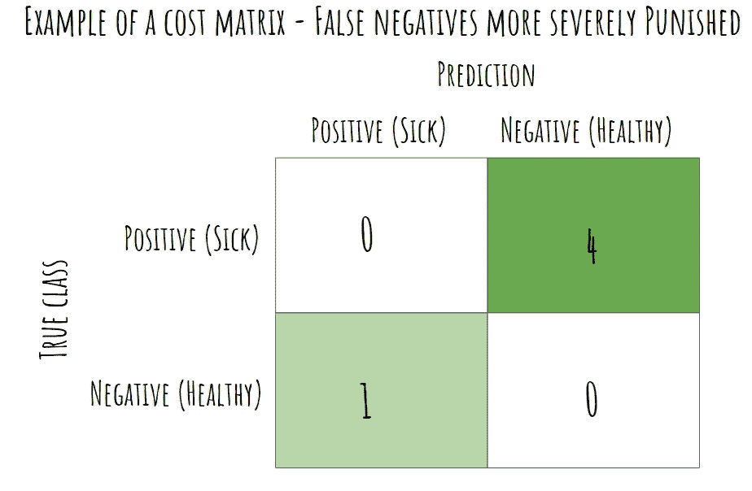

我们可以通过参数`class_weight`在 Scikit-learn 中实现**成本敏感决策树**。该参数是一个字典，其中**键**是**类标签**，而**值**是成本矩阵的**权重。**

在构建决策树时，算法将考虑**错误成本**而不是**信息增益**。在下面的例子中，**假阴性的误分类成本比假阳性的误分类成本大 4 倍**。

因此，加权决策树比以前的模型呈现出**更高的灵敏度(90%)** 。在这种情况下，我们可以更有效地检测出患病的患者，只有 5 例假阴性。消极的一面是特异性的降低。现在，我们检测出表现较差的健康患者。

该模型甚至更偏向于具有更多观察值的类别(`AB` -具有脊柱病理的患者)，这与我们想要以更高的准确度预测的类别相匹配。重要的是要记住，在医疗保健领域，假阴性比假阳性要糟糕得多。告诉病人健康可能会危及生命，因为他们无法接受所需的治疗。

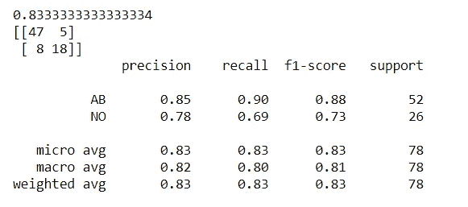

# 选择超参数—网格搜索

**超参数的选择会极大地影响机器学习模型的性能**。网格搜索是寻找最佳超参数的常用方法。使用这种技术，我们分析超参数的所有组合，并最终选择性能最佳的组合。我们可以使用`sklearn.model_selection`包中的`GridSearchCV`类在 Scikit-learn 中轻松实现**网格搜索**。

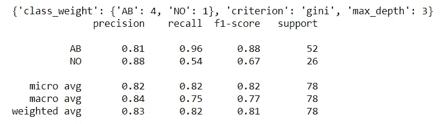

首先，我们使用字典(`grid_parameters`)指定**参数值集**，其中**键**是**超参数**，而**值**是我们想要评估的**选项集**。然后，我们定义了用于尝试不同参数组合的`GridSearchCV`对象。该类将以下参数(以及其他默认值)作为输入:

*   **估计器:**用于超参数调整的机器学习算法。
*   **param_grid:** 包含超参数名称和值的字典。
*   **评分:**我们希望最大化的绩效策略。

拟合网格对象后，我们可以使用`best_params_`属性获得**最佳参数**。在这种特殊情况下，我们希望最大化灵敏度(**回忆分数**)，因为我们希望专注于正确预测患者的病理状态。我们不想把任何生病的病人送回家。

最后，我们使用`GridSearchCV`对象使用最佳参数进行预测({'class_weight': {'AB': 4，' NO': 1}，' criterion': 'gini '，' max_depth': 3})。如上所示，该模型的**灵敏度为 96%** (远大于之前获得的灵敏度)。然而，该模型对无脊柱病变患者的预测准确性较低(特异性为 54%)。

网格搜索是一种广泛使用的超参数调整方法；然而，这种技术有一个主要的缺点——时间复杂性。为每个超参数组合构建一个模型(决策树)(在本例中为 2*9*3=54 个模型)。如果超参数和值的数量非常大，那么要评估的模型数量也会相应增加。

# 重要考虑因素——随机性

在 Scikit-learn 中，当两个分裂并列时，`DecisionTreeClassifier`将**随机选择一个特性，这意味着它们的改进标准是相同的。这就是为什么**不同的代码运行可能提供不同的结果**。因此，如果您重新运行代码并获得与本文中提供的结果不同的结果，请不要担心。为了保证每次代码运行时都有相同的结果，我们应该使用`random_seed`参数设置一个随机种子(在初始化`DecisionTreeClassifier`构造函数时)。**

用 Scikit-learn 构建分类模型是一个简单明了的过程。这是因为已经实现了大量的算法和评估指标，使得构建分类模型的过程非常顺利。决策树不提供深度学习算法所提供的准确性；然而，它们很容易被非技术用户理解。所获得的结果可以帮助医生和研究人员了解哪些特征对脊柱病理影响最大，从而提高他们的检测能力。

感谢你阅读❤️

阿曼达·伊格莱西亚斯