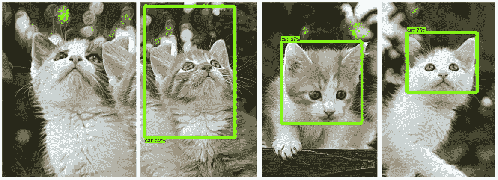
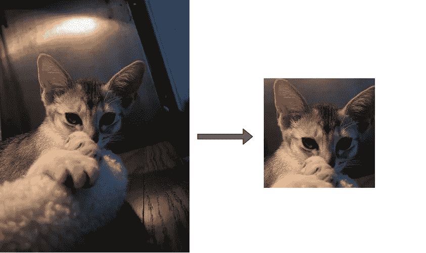
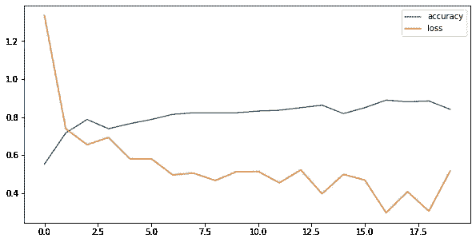
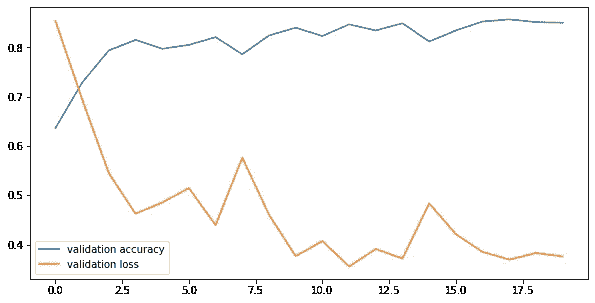
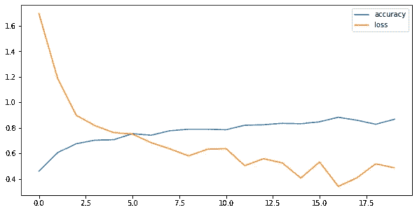
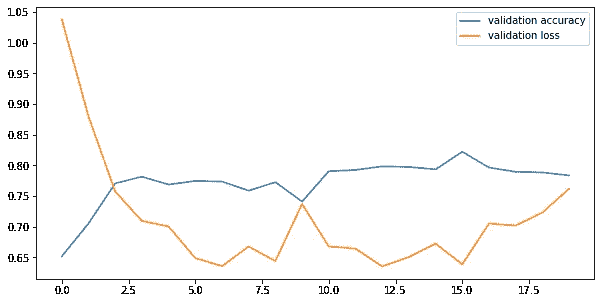
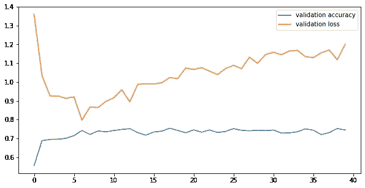
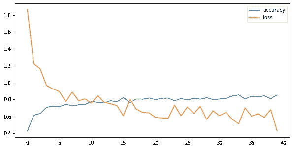
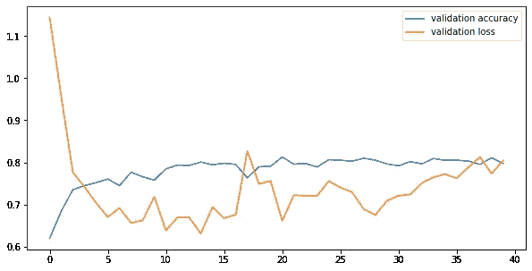

# 具有张量流的检测器-分类器神经网络结构

> 原文：<https://towardsdatascience.com/detector-classifier-neural-network-architecture-with-tensorflow-fc5dd9dce3e?source=collection_archive---------20----------------------->

## 当引入一类新的可检测对象时，构建灵活且易于重新训练的对象检测模型。

在训练和部署对象检测神经网络模型中，一个永远具有挑战性的问题是——如何向已经训练好的模型中添加一个新类？通常，这项任务会变得非常艰巨，包括用扩展数据集重新训练整个模型。对象检测模型的训练可能需要很多小时，如果不是几天的话，更不用说用我们想要引入的新类来标记额外的例子所需的时间了。如果那些新的物体也出现在已经被标记的图像中呢？我们将不得不回去审查他们所有人！

也许有更好的方法来解决这个问题。我想向你展示我为我们的客户想出的解决方案。由于显而易见的原因，我无法提供确切的解决方案。尽管如此，我还是要解释该解决方案中使用的架构，以及它如何在不同的数据集上执行——在本例中为[，牛津-IIIT Pet 数据集](https://www.robots.ox.ac.uk/~vgg/data/pets/)。

我们将通过 TensorFlow 对象检测 API 来检查对象检测模型的训练，即**检测器**，并使用该模型为我们的分类模型提取数据。之后我们将训练**分类器**对猫的品种进行分类。接下来的步骤将集中在这个架构如何帮助我们解决第一句话中提出的问题——向我们的分类器引入另一个类(猫品种)。

我不会在这篇文章中包含太多的代码；为此，请看看我的 [**GitHub**](https://github.com/MadHolm/Detector-Classifer) 上的笔记本。您可以随意在自己的环境中运行它，并使用不同的数据集测试该架构。

准备好了吗？我们走吧！

# 1.检测器—张量流对象检测

## 资料组

如上所述，选择的数据集是[牛津-IIIT Pet 数据集，](https://www.robots.ox.ac.uk/~vgg/data/pets/)它包含“37 个类别的 Pet 数据集，每个类别大约有 200 个图像”。这是训练我们模型的大量数据。

该数据集还包含注释，即图片中动物面部的确切位置。我们将构建只检测猫脸的检测器，因此只需要从数据集中过滤猫的品种。此外，让我们拿出三个品种来添加它们，以测试探测器在面对它从未见过的猫品种时的表现。这将有助于我们测试这个模型在多大程度上概括了“猫”是什么的概念。

用于探测器训练的猫品种——这只是一个范例。我删除了二项式名称，因为我意识到在我训练完检测模型后，我的脚本根本不会加载它们。

## 目标检测模型

对于对象检测，我们将使用 TensorFlow 对象检测(TFOD)。Cat 检测模型基于来自 [TensorFlow 检测模型 Zoo](https://github.com/tensorflow/models/blob/master/research/object_detection/g3doc/tf2_detection_zoo.md) 的 EfficientDet D2 模型。

安装完所有必要的库并准备好数据集后，我们就可以开始模型训练了—这可能需要几个小时！然而，这一步只需要做一次，不管图片中发现的是什么品种的猫，猫探测器都应该能够完成它的任务。

保存 TFOD 模型看起来很复杂，但是非常简单——我们运行一个随库一起安装的脚本，选择输入类型——这可以是一个图像张量，或者一个 B64 编码的字符串——指向我们的配置文件、检查点目录，最后是输出目录。

查看笔记本，了解培训过程的更详细说明。

将已训练的 TFOD 模型另存为。pb 模型文件。

我们已经训练好了模型，现在让我们测试一张有很多猫的图片！


[贾里·海托宁](https://unsplash.com/@jarispics?utm_source=unsplash&utm_medium=referral&utm_content=creditCopyText)在 [Unsplash](/photos/wGraPPO54o8?utm_source=unsplash&utm_medium=referral&utm_content=creditCopyText) 上的照片

啊哦…这看起来不太对。如果图片中有四只猫，为什么模型只检测到一只？

原因很简单——我们的数据集每张图像只有一个注释，所以这也是我们的模型要做的——每张图像只检测一只猫。其他任何东西——即使是一只猫——都被赋予很低的可信度；因此，当我们将置信度阈值设置为 50%时，它不会传到我们的输出中。

让我们来看看模型是如何对上图中的作物进行处理的:



好多了！猫探测器成功地探测到了除一种作物以外的所有作物中的猫。我们可以预期，随着更多的训练时间和/或更多的数据，这个模型会表现得更好，但我们现在拥有的是好的——这个模型学会了什么是猫！

但是，如果我们的数据集内的图像中猫脸的位置已经是已知的，我们为什么还需要一个检测器模型呢？有了这个模型，我们可以从任何图像中创建猫脸的剪影，只要有一个模型可以识别的猫脸。此外，最好根据将要用于分类的数据来训练分类器，这些数据是从检测器输出得到的作物。最后但同样重要的是，分类器可以只专注于分析猫的面部，而不需要处理大得多的图像，在某些情况下，这可能会导致重要信息的丢失，实际上是一个错误的分类。

# 2.分类器——张量流迁移学习



红阿比 _10.jpg ->根据探测器输出进行裁剪。

现在，我们可以使用检测器来检查 cat 数据集，以获得用于训练分类器的剪切片段。目前，只有我们用来训练检测模型的猫品种。

这也是评估探测器性能的好地方！

```
Breeds detecting network never seen before:
Breed: Russian Blue number of files:191 
Breed: British Shorthair number of files:185 
Breed: Maine Coon number of files:200 
Breed: Persian number of files:160 
Breed: Egyptian Mau number of files:180
Breed: Ragdoll number of files:183Breeds used for training:
Breed: Abyssinian number of files:190 
Breed: Bengal number of files:176
Breed: Birman number of files:196 
Breed: Bombay number of files:176 
Breed: Sphynx number of files:197
Breed: Siamese number of files:199
```

假设每个品种有大约 200 个例子，我们可以看到我们的召回率在每个类的 85–90%以上。请记住，探测器是在所选品种数据的一个小子集上训练的，因为缺乏，我们不能使用所有的图像。xml 注释文件。尽管如此，用于训练的品种和其他品种在召回率上没有任何显著差异。这意味着检测器表现非常好，并且理解“猫”通常是什么。

有了这些剪枝——我们最终可以使用迁移学习来训练我们的分类器。这样我们节省了很多时间——在启用 GPU 运行时的 Google Colab 上进行的训练只需要不到 **5 分钟**就可以达到 **85%的准确率**！如果我们想要用新的数据和类定期更新我们的分类器，那么如此短的训练时间是极其重要的。

迁移学习可以通过几行代码完成:

用 TensorFlow 迁移学习。

首先，我们加载 Xception 模型，这是一个已经训练好的图像识别模型。我们省略了模型的顶部分类层，以便我们可以添加适合于我们的检测的分类层。我们冻结加载的模型，以便它不会受到训练的影响——它已经被训练从图像中提取重要特征，这是一项需要花费最多时间和精力来完成的任务。有了迁移学习，我们就不需要再这样做了；我们只训练——在这种情况下——**6 层**，而不是构建 Xception 模型的 **132 层**。



6 类训练的训练集的准确性和损失。



6 类训练验证集的准确性和损失。

在训练集上的最终准确率为 **82.19%** ，在验证集上的最终准确率为 **85.02%** 。训练持续了 **20 个时期**——增加这个数字也可以增加模型的最终精度。每个时期的时间是 6 秒+验证阶段的几秒。

# 3.添加新类别—“未定义/未知”

## 一点理论

我们的分类器只对 6 种猫进行过训练。现在，如果我们给它看一个它没有训练过的猫品种的面部剪影会怎么样？它必须将其归类为这 6 个类别中的一个，无论它是哪一个类别，这种分类都是错误的。

此外——如果我们的探测器输出的是甚至不是猫的东西的剪影呢？同样，我们的分类器仍然会将它归类为这 6 个品种中的一个。

这就是为什么我们引入一个否定类，或者一个伞类来收集我们的检测器输出的所有不属于我们想要分类器学习的任何类的东西。

在猫的例子中，检测器没有输出任何我们可以归类到“未定义/未知”组的东西，但是我们可以通过在从互联网上拍摄的猫的不同图像上运行检测器来模拟它。

为了更好地理解这个问题，让我们考虑这个架构的一个不同的应用——汽车品牌标志检测。在这种情况下，我们可以预期我们的检测器将输出不是汽车标志的剪切部分。根据我们算法中设定的置信度阈值，我们可以控制检测器输出的错误截断程度。但是，请记住，随着置信度阈值的提高，您也牺牲了未达到该阈值的正确检测。我们想要做的是在不牺牲太多**精度**的情况下，最大化**召回**。那些参数是什么？

假设你有一张 10 辆车的图片；每辆车的前保险杠上都有一个汽车品牌标志。你的模型检测到 12 个汽车品牌标识，但其中只有 8 个是汽车标识；剩余的 4 个检测结果是挡风玻璃上的一个奇怪的反射，背景中栅栏上的一个模糊的贴纸，人行道上的一个圆形油渍，以及汽车牌照上的一个字母。

**召回** —如果您的模型在图片中的 10 个品牌标识中检测到 8 个，则意味着召回率为 80%。

**Precision** —我们检测到的车标有多少，在本例中，8/12 或 75%。在本例中，精度也是准确度，因为我们只对一个标签进行分类。

现在，我们可以降低置信度阈值来捕捉这两个未被检测到的徽标，但这样一来，精确度就会下降。这是因为，除了这两个新的检测之外，输出中还会包括一些错误的检测，所以最终，我们会得到 20 个剪切部分——10 个汽车品牌标志和 10 个其他东西。100%的召回率，50%的准确率。

50%的阈值是一个很好的中间值，但是您可以根据您的使用情况和检测器的性能以及分类器的性能来增加或减少它。

## 添加新类别

要添加新的类别，您需要对一组新的图像运行检测过程。在这种情况下——这是我们从必应上下载的猫的图片。如果您想从数据集中引入一个新的猫品种，只需在这些图像上运行检测过程。

如果检测机不仅输出想要分类的对象的剪切图，还输出错误的对象(如车标检测示例中所述)，您需要检查整个剪切图集，并首先将它们分配到正确的文件夹中。

## 回到猫！

在对猫的图片运行检测器后，我们最终得到了 150 个新的剪辑。7 个类别——我们之前提取的 6 个猫品种和一个“未知”类别，该类别包含不属于这 6 个类别中任何一个的猫的图片。

现在，我们可以训练分类器，使它不仅能够对 6 个品种进行分类，还能对其他不属于任何品种的猫进行分类。



用于 6 +未知类训练的训练集的准确性和损失。



6 +未知类训练的验证集的准确性和损失。

经过 **20 个历元**后，训练集上的准确率为 **87.50%** ，验证集上的准确率为 **76.19%** 。这比之前的 6 级训练略低，但未知的级别可能包含已经定义并用于训练的品种，这意味着它们会混淆模型并降低其准确性。

# 3.所有课程的最终培训

## 最终培训——12 节课+未知


用于 12 +未知类训练的训练集的准确性和损失。



12 +未知类训练的验证集的准确性和损失。

在 **40 个历元**之后——比之前的训练长了 20 个历元——模型在训练集上达到了 **78.59%** 的准确度，在验证集上达到了 **74.45%** 。

出于好奇，让我们看看没有“未知”课程的培训过程是什么样的:



12 类训练集的准确性和损失。



12 类验证集的准确性和损失。

在训练集上的最终准确率为 86.25%，在验证数据集上的最终准确率为 79.74%。比以前高！未知类别会降低模型的准确性，因为如前所述，它可能包含属于数据集中已定义品种的猫。此外，多一个类意味着更大的数据集，这需要更多的训练时间，甚至可能需要改变模型架构。

# 4.关键要点

好了，现在我们已经完成了这个过程，并且看到它运行得很好——让我们总结一下这一切吧！

1.  该架构由**两个神经网络** — **检测器**和**分类器**组成。检测器是对象检测神经网络。这一个我们训练——希望——只有一次。我们训练它**只识别一个类**，这个类概括了我们想要分类的东西的**一般特征**——一只猫，一个手机应用程序，一个汽车品牌标志。
2.  然后**检测器**用于提取被检测物体的**切口。根据**置信度阈值**和模型质量，错误检测的数量可能更高或更低。这个想法是捕捉所有正确的类，尽可能少的错误类——高召回率，相当好的精确度。**
3.  有了所有的剪切图，现在是时候进行一些手工操作了——现在每个提取出来的剪切图都必须放在一个合适的文件夹中。这些是分类器要识别的每个类别的文件夹，一个文件夹存储不属于任何这些类别的所有内容。
4.  **然后根据这些数据训练一个分类器**。值得使用**迁移学习**来构建架构。这减少了必要的培训时间，使连续学习或增加一个新的类成为一个相对平稳和快速的过程。
5.  为了**引入新的类别**，必须对新的数据重复该过程——提取剪切块，手动分类到适当的类别中，然后**重新训练分类器**以识别 n+m 个类别，其中 n 是先前类别的数量，m 是新引入的类别的数量。
6.  最后，我们的检测过程看起来是这样的:图像进入检测器，检测器输出剪切部分。然后，剪切块被馈送到分类器，以获得每个剪切块的最终分类，从而获得分析图像中所有检测到的对象。

我希望你发现这篇文章很有见地，有助于解决你的机器学习挑战。请随时询问关于方法或代码的问题——无论是在下面还是在 GitHub 上。

楚斯！