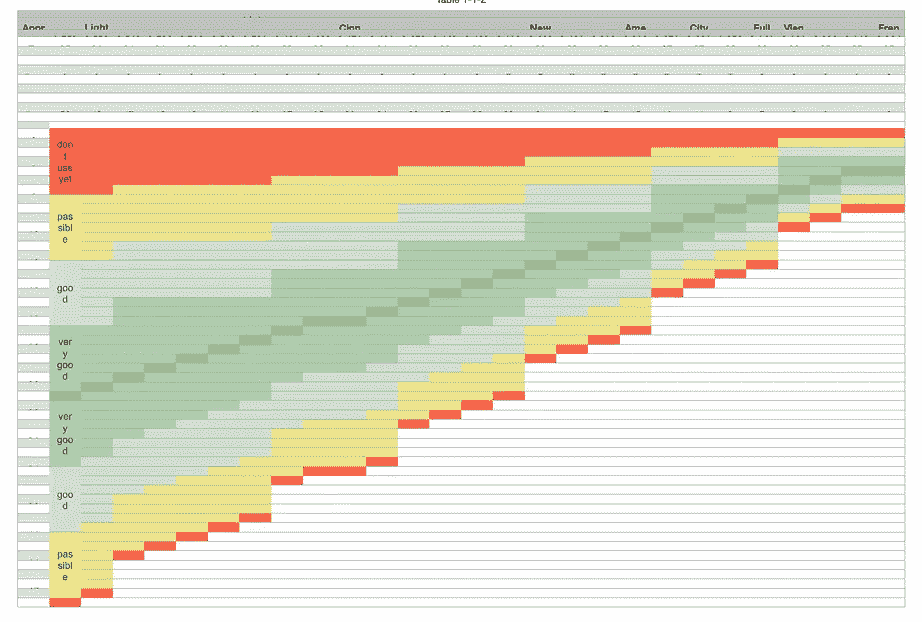
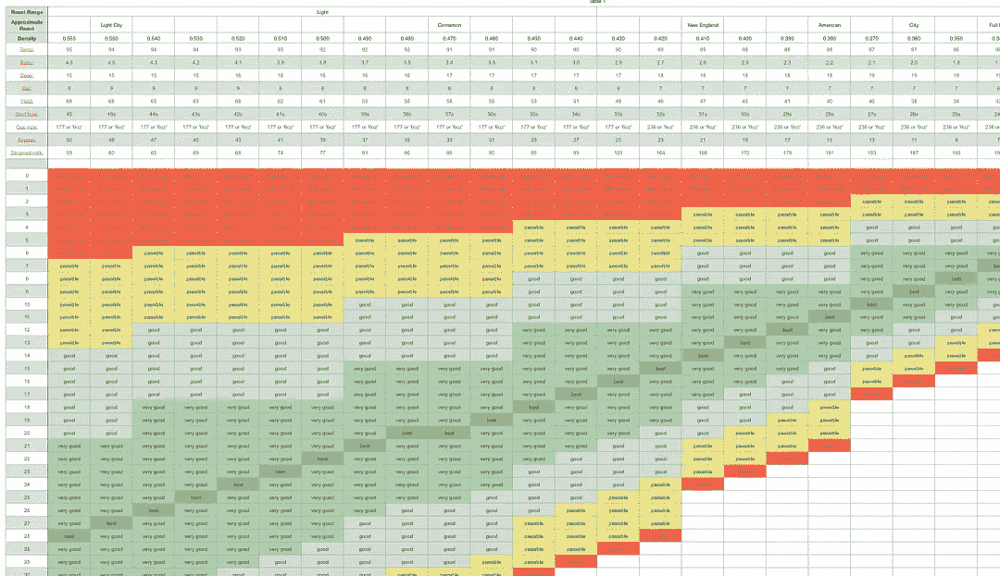
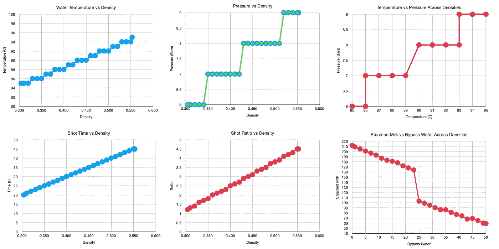
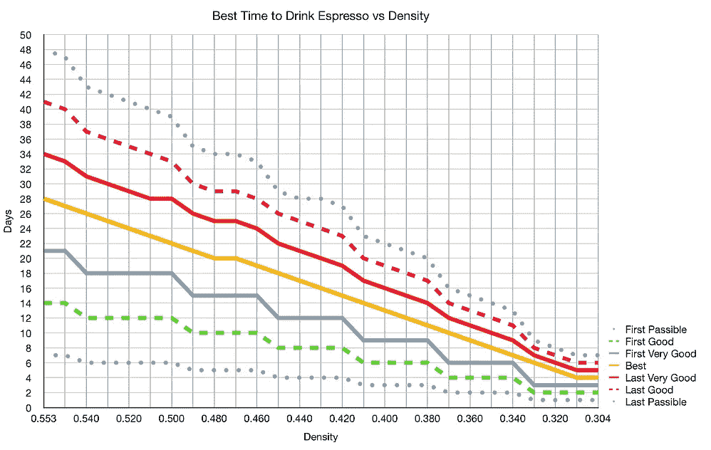
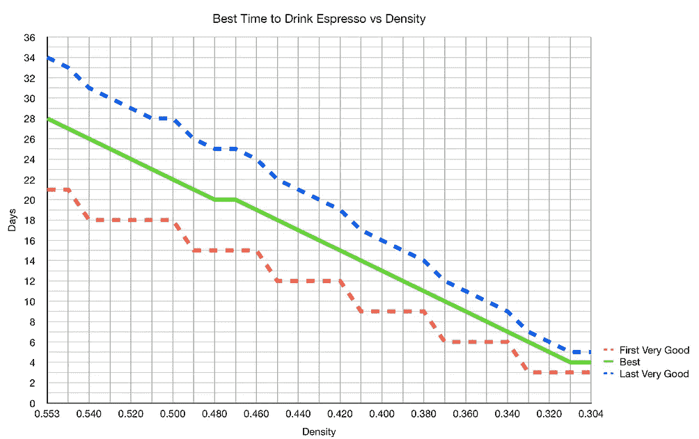
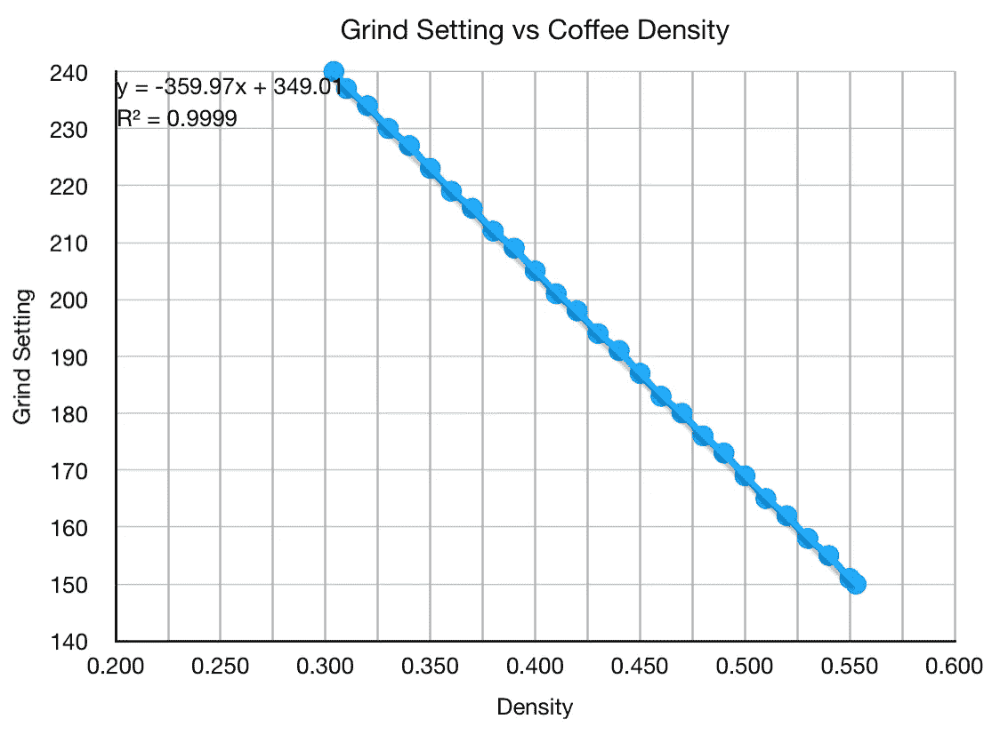

# 利用咖啡豆密度确定咖啡的峰值风味

> 原文：<https://towardsdatascience.com/determining-peak-flavor-of-coffee-using-bean-density-853404db300a?source=collection_archive---------38----------------------->

## 咖啡数据科学

## 对其他人的数据重新排序

几周前，我被指向理查德·梅斯顿的[网站](https://density.coffee/)，在那里他花了几个月的时间探索咖啡豆的密度。他探索用咖啡豆的密度来决定喝咖啡的最佳日期，以及开始使用一袋新咖啡豆的等待时间。

他根据豆子密度优化了其他参数。单次测量有可能为研磨以及其他注射参数(如温度、压力、剂量和输出比)提供一个良好的起点。这种潜力将是咖啡店避免拨号浪费的礼物。

所以我看了一眼他的数据，我觉得有必要重新排序，这样我可以看得更清楚。

# 背景

理查德的主要想法是，如果一个咖啡烘焙师在他们的袋子上印上咖啡豆的密度，这将消除人们如何烘焙的一些变量。这也将有助于烤烤变化。然后豆子的密度可以告诉你什么时候开始使用豆子，这样你就可以减少浪费。

他目前的网站告诉你如何便宜地测量密度，然后如果你输入到他的计算器，它会给你他使用的参数和日期范围。

他通过将相同的绿豆烘焙到不同的程度来评估不同的豆子密度。然后他试着做了意式浓缩咖啡，加旁路水的意式浓缩咖啡(加热水)，然后是加牛奶的意式浓缩咖啡。

# 数据

我不喜欢搜索豆子的密度，我想看看总体趋势。他建立了一个模型来从他的数据中获得更多的粒度，所以我花了一些时间来收集密度间隔为 0.01 的数据。他的数据值从 0.304 到 0.553 克/毫升。

所有图片由作者提供

首先，我观察了几个趋势。他根据密度修改了一些参数，以给出最佳的拍摄效果。我唯一的批评是，他在整个测试中没有测量总溶解固体(TDS)和提取率(EY)，所以这是一个主观的味道测试。他试图通过别人而不是他自己的盲品来减轻一些主观性。

我们可以得到每个密度的日变化范围，然后我们可以把它们画出来。我们可以看“可以”、“好”、“非常好”和“最好”,或者“非常好”和“最好”。趋势是明显的，有趣的是看到越暗的烘焙越快变坏。

我问他是否记录了每密度的研磨设置，他很大方地把数据发给了我。他用的是 Flair Pro 2(45.5 毫米篮筐)，他的研磨机是 Kinu M47。根据他的数据，单位密度的最佳研磨有一个稳定的趋势。

# 建议:

1.  注意烤枣，尤其是颜色较深的烤枣。
2.  以此为指导，发现自己最喜欢什么。
3.  跟踪你的研磨机的豆密度和研磨设置，随着时间的推移，你应该能够有一个更好的研磨设置。
4.  买咖啡时要让你得到最大的味道。

我已经开始为我的家庭烘焙记录豆子的密度。到目前为止，他的数据与我对中度烘焙的[数据和建议](/extraction-over-the-life-of-the-coffee-bean-f777f017718a)一致，中度烘焙在烘焙后 3 到 5 周达到风味和萃取的顶峰。希望在接下来的一年里，我可以通过在我的数据表中包含 bean density 来获得关于这个主题的更好的数据。

如果你愿意，可以在 [Twitter](https://mobile.twitter.com/espressofun?source=post_page---------------------------) 和 [YouTube](https://m.youtube.com/channel/UClgcmAtBMTmVVGANjtntXTw?source=post_page---------------------------) 上关注我，我会在那里发布不同机器上的浓缩咖啡照片和浓缩咖啡相关的视频。你也可以在 [LinkedIn](https://www.linkedin.com/in/robert-mckeon-aloe-01581595?source=post_page---------------------------) 上找到我。也可以在[中](https://towardsdatascience.com/@rmckeon/follow)关注我。

# [我的进一步阅读](https://rmckeon.medium.com/story-collection-splash-page-e15025710347):

[浓缩咖啡系列文章](https://rmckeon.medium.com/a-collection-of-espresso-articles-de8a3abf9917?postPublishedType=repub)

[工作和学校故事集](https://rmckeon.medium.com/a-collection-of-work-and-school-stories-6b7ca5a58318?source=your_stories_page-------------------------------------)

[个人故事和关注点](https://rmckeon.medium.com/personal-stories-and-concerns-51bd8b3e63e6?source=your_stories_page-------------------------------------)

[乐高故事启动页面](https://rmckeon.medium.com/lego-story-splash-page-b91ba4f56bc7?source=your_stories_page-------------------------------------)

[摄影飞溅页](https://rmckeon.medium.com/photography-splash-page-fe93297abc06?source=your_stories_page-------------------------------------)

[使用图像处理测量咖啡研磨颗粒分布](https://link.medium.com/9Az9gAfWXdb)

[改善浓缩咖啡](https://rmckeon.medium.com/improving-espresso-splash-page-576c70e64d0d?source=your_stories_page-------------------------------------)

[断奏生活方式概述](https://rmckeon.medium.com/a-summary-of-the-staccato-lifestyle-dd1dc6d4b861?source=your_stories_page-------------------------------------)

[测量咖啡磨粒分布](https://rmckeon.medium.com/measuring-coffee-grind-distribution-d37a39ffc215?source=your_stories_page-------------------------------------)

[咖啡萃取](https://rmckeon.medium.com/coffee-extraction-splash-page-3e568df003ac?source=your_stories_page-------------------------------------)

[咖啡烘焙](https://rmckeon.medium.com/coffee-roasting-splash-page-780b0c3242ea?source=your_stories_page-------------------------------------)

[咖啡豆](https://rmckeon.medium.com/coffee-beans-splash-page-e52e1993274f?source=your_stories_page-------------------------------------)

[浓缩咖啡用纸质过滤器](https://rmckeon.medium.com/paper-filters-for-espresso-splash-page-f55fc553e98?source=your_stories_page-------------------------------------)

[浓缩咖啡篮及相关主题](https://rmckeon.medium.com/espresso-baskets-and-related-topics-splash-page-ff10f690a738?source=your_stories_page-------------------------------------)

[意式咖啡观点](https://rmckeon.medium.com/espresso-opinions-splash-page-5a89856d74da?source=your_stories_page-------------------------------------)

[透明 Portafilter 实验](https://rmckeon.medium.com/transparent-portafilter-experiments-splash-page-8fd3ae3a286d?source=your_stories_page-------------------------------------)

[杠杆机维护](https://rmckeon.medium.com/lever-machine-maintenance-splash-page-72c1e3102ff?source=your_stories_page-------------------------------------)

[咖啡评论和想法](https://rmckeon.medium.com/coffee-reviews-and-thoughts-splash-page-ca6840eb04f7?source=your_stories_page-------------------------------------)

[咖啡实验](https://rmckeon.medium.com/coffee-experiments-splash-page-671a77ba4d42?source=your_stories_page-------------------------------------)