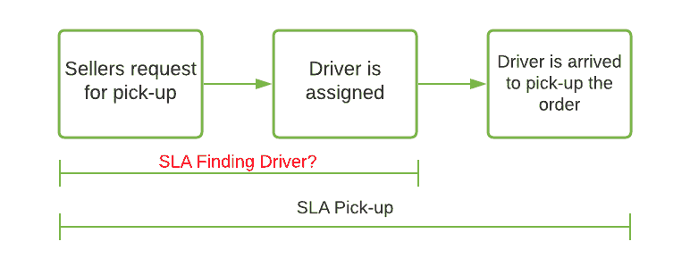
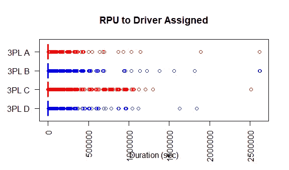
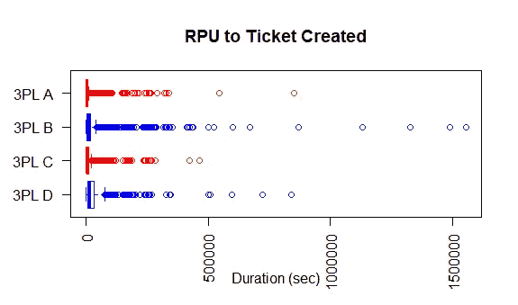
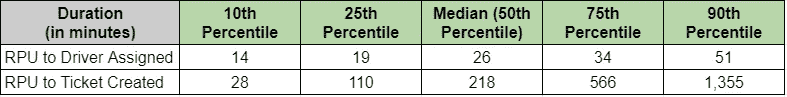

# 确定准时交货的 SLA:描述性统计的应用

> 原文：<https://towardsdatascience.com/determining-sla-for-on-time-deliveries-an-application-of-descriptive-statistics-801be0ad11bc?source=collection_archive---------27----------------------->

## 如何解释商业决策中的百分位数

作为一名在电商平台负责物流服务的数据分析师，我们需要确定让客户对配送服务满意的方法。其中一个重要因素是**确保准时交货**。本着“让它更好”的精神，我们希望消除送货过程中的漏洞，并最大限度地提高卖家对途中发生的事情的了解。几个月前，我们开始与第三方物流(3PL)合作伙伴就寻找司机的持续时间确定服务水平协议(SLA)。

卖家等待司机取包裹的旅程(图片由作者提供)

在实施之前，我们的卖家只能确定司机多久能到卖家地址取包裹(SLA 取货)。然而，这两个过程之间仍然存在漏洞，3PL 的系统需要先指派一名司机，然后再指示司机去取包裹。因此，为了确保提货过程顺利，我们希望通过**确定 SLA 寻找驱动程序应该多长时间**来跟踪寻找驱动程序的活动。为了实现这一点，我们接着采用了描述性分析方法。

**为什么使用描述性分析？**

*   我们希望根据历史条件来确定 SLA。
*   假设历史条件可以代表未来的条件(例如，使用相同的第三方物流合作伙伴，具有恒定的服务质量，相同的驱动能力)。
*   历史性能数据显示了某一段时间内的固定模式。

*针对当前提升预测分析能力的分析趋势，我们认为* ***描述性分析经常被低估。*** *描述性分析在解决现实生活中的问题时仍然非常得心应手，尤其是在有限的时间(和成本)内。因此，我们需要在实施分析时考虑周全，以便既有效又高效，同时还能理解何时使用某种方法。*

*我们应该何时使用预测分析？*

*   *我们希望模拟几个变量发生变化的未来情况(例如，使用具有不同特征的不同第三方物流合作伙伴，针对不同的客户群)。*
*   *我们正在检测当前性能的变化，并希望预测未来的趋势。*

## 步骤 1:确定指标

在确定 SLA 发现驱动因素时，我们要分析 2 个指标:

1.  从卖家要求提货到指派司机的持续时间(从 RPU 到指派司机)。
2.  从卖方请求提货到创建 CS 票证的持续时间(从 RPU 到票证创建)。

第一个指标用于分析我们的第三方物流合作伙伴的表现:他们为我们的卖家分配驱动程序的系统能力有多快。另一方面，第二个指标用于分析**卖家对我们服务的期望**:他们愿意等多久才提交投诉单。通过分析这两个指标，我们旨在优化双方利益相关者的体验。

## 步骤 2:探索性数据分析(EDA)

在深入研究数据集之前，我们需要先通过执行 EDA 来了解数据的分布。我们想知道我们应该通过哪个集中趋势的度量(平均值或中值)进行进一步的分析。通过将两个指标可视化为箱线图，我们可以了解数据是否有偏差。

使用箱线图检查数据分布(图片由作者提供)

从上面的箱线图中，我们发现分配给驾驶员的**RPU**和分配给票证创建者的**RPU**数据都非常右偏，这意味着由于异常值，平均值可能比中值高得多。因此，我们通过分析中值和百分位值来继续分析。

## 步骤 3:分析百分位数

在 EDA 之后，我们将分配给驾驶员的 **RPU 和分配给票证创建者的 **RPU 的**持续时间的百分点分解为第 10、25、50、75 和 90 个百分点。**

测量的每个持续时间的百分位数(虚拟数据)

上面的持续时间表可以解释为:

*   如果我们将 SLA 设置为 **51 分钟**(根据第 90 百分位的 RPU 分配给驾驶员的持续时间)，那么在违反 SLA 之前，大约有 **90%的接送请求**可以被成功分配给驾驶员。但是，我们只能部分解决与查找驱动程序问题相关的 CS 票证，因为**仍有 10–25%的票证**将在 SLA 之前创建。
*   如果我们将 SLA 调整为 **26 分钟**，那么在 SLA 被违反之前**只有 50%的接送请求**可以被成功分配给司机，而**CS 票的数量可以从当前票数量的 10–25%减少到< 10%** 。

## 步骤 4:为第三方物流和销售商确定最佳 SLA

通过分析，我们认识到在确定 SLA 时，在 3PL 分配的驱动程序系统容量和销售者创建的 CS 票证之间有一个**折衷**。所以我们可能需要在分析中再加入一个因素，比如**一个月创造多少接机单和 CS 票**。我们还需要更深入地了解什么是**卖方迟迟找不到驱动系统的后果**。

如果创建的票证数量不太高，我们可以考虑延长 SLA 查找驱动程序的时间。相反，如果票证经常被创建并带有强烈的抱怨，我们需要考虑缩短 SLA。考虑到第三方物流方和卖方都是我们有价值的客户，应该确定最佳 SLA**，以提供最佳体验并最大限度地提高我们客户的满意度**。

通过确定 SLA 寻找驱动因素，现在我们的销售人员不仅可以了解他们的订单何时会被提货，还可以知道是否为他们分配了驱动因素。如果 SLA 已经被违反，并且系统还没有为它们找到驱动程序，卖方也有能力重试提货过程。随着这一新功能的开发，卖家有望获得更好的体验，更好地控制订单的按时交付。