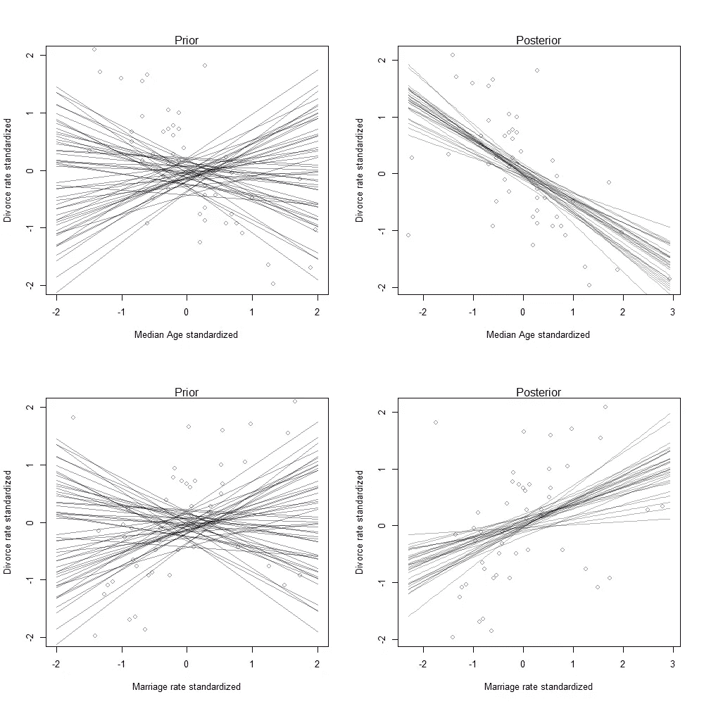
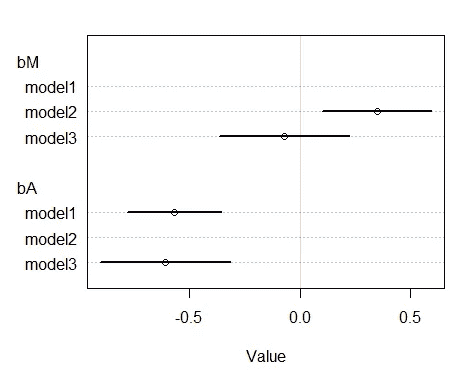
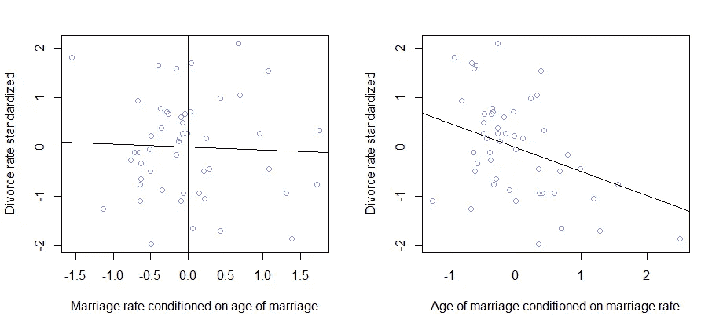

# 贝叶斯线性回归中特征重要性的确定

> 原文：<https://towardsdatascience.com/determining-the-importance-of-predictor-variables-in-bayesian-linear-regression-using-residual-786f5eea0d12?source=collection_archive---------12----------------------->

## 在这里，我们研究一种方法来确定用于训练贝叶斯线性回归模型的最佳特征。

在本文中，我将介绍一种确定多元贝叶斯线性回归模型中预测变量真正重要性的方法。该方法分析不同预测变量之间的残差，以确定哪个特征向我们的后验分布近似值添加了最多信息。这可能看起来太复杂了，在这一点上难以理解，但是当您阅读本文时，我将解释这是一种非常简单和直观的方法，用于理解在创建贝叶斯回归模型时选择哪些特性。

## 引入二次近似( [quap](https://www.rdocumentation.org/packages/rethinking/versions/2.13/topics/quap) )

二次近似，也称为拉普拉斯近似，是一种确定后验分布的*最大后验概率(MAP)* 估计的方法。基本上，贝叶斯统计是一个统计领域，它基于数据本身更新其关于收集数据的总体的信念。在看到任何数据之前，您首先通过估计先验来初始化模型，这是您对总体的初步了解。

```
**> library(rethinking)
> data("WaffleDivorce")
> d <- WaffleDivorce
> head(d[,c(1,4,5,7)])**
    Location MedianAgeMarriage Marriage Divorce
1    Alabama              25.3     20.2    12.7
2     Alaska              25.2     26.0    12.5
3    Arizona              25.8     20.3    10.8
4   Arkansas              24.3     26.4    13.5
5 California              26.8     19.1     8.0
6   Colorado              25.7     23.5    11.6
```

出于解释的目的，我将使用 r 中的[](https://www.rdocumentation.org/packages/rethinking/versions/1.59)*包中的*waffle development*数据集。在该数据集中，我们希望创建一个回归模型来估计美国各州的离婚率。我们将找到一条基于一些预测变量的预测回归线。首先，假设我们想根据美国结婚年龄的中位数来模拟离婚率。假设人们结婚越早，婚姻以离婚告终的可能性就越大是有道理的。我们想用现有的数据来检验这个假设。将你的变量标准化，使它们之间更加兼容，这是一个很好的做法。为此，您可以使用反思包中简单的*标准化*命令。
这是我们将要建模的最终数据集，其中 **A** 代表标准化结婚年龄中位数， **M** 代表标准化结婚率， **D** 代表标准化离婚率。*

```
***> d$A <- standardize(d$MedianAgeMarriage)
> d$M <- standardize(d$Marriage)
> d$D <- standardize(d$Divorce)
> head(d[,c(1,14,15,16)])**
    Location          A           M          D
1    Alabama -0.6062895  0.02264406  1.6542053
2     Alaska -0.6866993  1.54980162  1.5443643
3    Arizona -0.2042408  0.04897436  0.6107159
4   Arkansas -1.4103870  1.65512283  2.0935693
5 California  0.5998567 -0.26698927 -0.9270579
6   Colorado -0.2846505  0.89154405  1.0500799*
```

*现在，我们使用 r 中的重新思考包中的 quap 函数制作第一个模型。*

```
*model1 <- quap(
  alist(
    D ~ dnorm(mu, sigma),
    mu <- a + bA *A,
    a ~ dnorm(0,0.2),
    bA ~ dnorm(0,0.5),
    sigma ~ dexp(1)
  ),data = d
)*
```

*该模型使用您提供的先验知识，根据您当前的信念创建许多回归线，然后使用提供的数据排除可能性较小的回归线，以确定这些线可能位于的真实区间。为了更好地理解这一点，这里有一张图片来说明我们之前对中位结婚年龄离婚率分布的理解，以及在查看数据后我们对分布的最新看法。我还绘制了结婚率的单变量回归作为预测变量:以说明两个不同的预测变量如何与不同州的离婚率相关联。*

**

***左边:**先验预测分布，说明我们在看到数据之前对两个变量之间关系的信念。**右边:**后验回归线，说明我们在查看数据后对两个变量之间关系的最新看法。*

## *多元回归模型*

*在这里，您的直觉可能会告诉您创建一个模型，用预测变量(结婚年龄和结婚率)来预测离婚率，因为每个预测变量和离婚率之间都有很强的相关性。
此时要问的问题是，创建一个带有两个预测变量的回归模型是否有优势，这两个预测变量都是 **M** 和 **A** 。这种模型被称为多元回归模型。问这个问题之所以重要，是因为预测变量之一和离婚率之间可能没有实际的因果关系。*

*结婚率完全有可能取决于结婚年龄；因此，当结婚年龄改变时，结婚率和离婚率都会随之改变。这最终给我们的印象是，结婚率和离婚率之间有因果关系，因为它们是相关的。我们需要问自己的是，在我们已经使用结婚年龄中位数来模拟离婚率之后，知道结婚率是否会给我们带来任何关于离婚率的额外信息。*

*为了理解为什么这很重要，我建立了一个双变量回归模型，以结婚率和结婚年龄中位数作为预测变量。在下图中，我展示了一旦我们向模型中添加额外的预测变量，我们对参数值 bM 和 bA 的置信度是如何变化的。*

**

*模型 1 仅使用中位年龄作为预测变量，模型 2 仅使用结婚率作为预测变量，模型 3 同时使用结婚率和中位结婚年龄作为预测变量。该图显示了所有三个模型中***【bM】***(结婚率系数)和**【bA】**(结婚年龄系数中位数)的变化。*

*在这一点上，重要的是要注意，如果只对结婚率建模导致结婚率和离婚率之间的良好相关性，一旦我们知道结婚年龄，我们对结婚率预测变量系数的信心就会下降。在这里，我们有必要确定结婚率是否与离婚率有因果关系，或者它只是通过依赖与离婚率相同的混杂因素来伪装一种关系。我们如何从这幅图中看出这一点？我们可以看到，即使将结婚率作为一个预测变量，结婚年龄系数与离婚率的关系仍然完全是负的，但这与我们在结婚率系数的变化中看到的并不相反。*

*当然，这不是确定预测变量重要性的好方法，因此我们查看残差图来确定模型中预测变量的真正重要性。*

## *预测残差图*

*预测残差图是一种确定模型中某个要素的真正重要性的方法，它告诉您在已知第一个预测变量后，从第二个预测变量中获得了多少额外的**信息。为了做到这一点，我们用另一个变量作为*条件*变量，然后测量这个*条件*变量与离婚率的关系。我们该怎么做？我们在两个预测变量之间创建另一个二次近似模型。***

```
*model4 <-  quap(
  alist(
    M ~ dnorm(mu, sigma),
    mu <- a + bA * A,
    a ~ dnorm(0,0.2),
    bA ~ dnorm(0, 0.5),
    sigma ~ dexp(1)
  ), data = d
)
mu <- link(model4)
mu_mean <- apply(mu, 2, mean)
mu_resid <- d$M - mu_mean
plot(d$D ~ mu_resid, col = col.alpha(rangi2, 1),
     ylab = 'Divorce rate standardized',
     xlab = 'Marriage rate conditioned on age of marriage')
abline(v = 0)
abline(b = cor(mu_resid, d$D), a= 0)*
```

*在这个代码块中，我们在两个预测变量之间创建了一个模型。*模型 4* 使用结婚年龄中位数来预测结婚率。接下来，我们提取每个州的结婚率值，如使用重新思考包中的 [*链接*](https://www.rdocumentation.org/packages/rethinking/versions/1.59) 函数预测的结婚年龄中位数。最后，我们从实际结婚率中减去预测结婚率。这给了我们结婚率的残差，或者换句话说，这给了我们每个州的结婚率，在以结婚年龄中位数为条件后。此时， *mu_resid* 包含了我们从结婚率预测变量中获得的所有**附加**信息。*

*现在我们看到了这些条件结婚率和离婚率之间的关系，我们可以检查在我们的回归模型中哪个特征更重要。在下图中，我也画出了另一种选择，在右边，结婚年龄取决于结婚率。*

**

***左一:**以结婚年龄为条件后，离婚率与结婚率的关系图。**右边一个**:以结婚率为条件后，离婚率与结婚年龄的关系图*

*我们可以在图中清楚地看到，在我们已经使用结婚年龄作为预测变量后，结婚率对预测没有什么重要性。我们如何看待这一点？在我们将结婚率以结婚年龄为条件后，结婚率和离婚率之间几乎没有关联。这也说明结婚率几乎完全取决于结婚年龄，想想也有道理。如果结婚年龄的中位数下降，我们将会看到结婚率上升，因为年轻人比老年人多。这总结了一种可以用来确定贝叶斯线性回归模型中某个特性的重要性的方法。本文使用的所有代码都可以在[这里](https://github.com/sheharyarakhtar/MediumArticles)找到。*

**

*照片由 [NASA](https://unsplash.com/@nasa?utm_source=medium&utm_medium=referral) 在 [Unsplash](https://unsplash.com?utm_source=medium&utm_medium=referral) 上拍摄*

## *参考*

*[1] Richard McElreath，用 R 和 Stan (2020)中的例子进行统计反思*