# 确定最佳口袋妖怪队的口袋妖怪灿烂的钻石和闪耀的珍珠与纸浆

> 原文：<https://towardsdatascience.com/determining-the-optimal-pokemon-team-for-pokemon-brilliant-diamond-and-shining-pearl-with-pulp-d589ae9b2e68?source=collection_archive---------2----------------------->

## [实践教程](https://towardsdatascience.com/tagged/hands-on-tutorials)


由 [Thimo Pedersen](https://unsplash.com/@thimo?utm_source=unsplash&utm_medium=referral&utm_content=creditCopyText) 在 [Unsplash](https://unsplash.com/s/photos/pokemon?utm_source=unsplash&utm_medium=referral&utm_content=creditCopyText) 上拍摄的照片

像许多 21 世纪初的孩子一样，我喜欢玩口袋妖怪长大。捕捉那些像动物一样的生物，并训练它们与其他口袋妖怪战斗，形成了我童年最美好的回忆。随着经典的*口袋妖怪钻石和珍珠*视频游戏、*灿烂的钻石和闪亮的珍珠*的重拍即将于下个月推出，我认为使用我的数据科学知识来确定口袋妖怪的最佳团队将会很有趣。

# 底漆

首先，给那些不熟悉口袋妖怪系列的人一点背景知识。口袋妖怪是像动物一样的生物，可以被捕获并训练来与其他口袋妖怪战斗。在每个游戏开始时，你可以在三个初始口袋妖怪中进行选择，即所谓的“新手口袋妖怪”。在钻石和珍珠游戏中，这些是草苗龟，草型乌龟口袋妖怪；火苗猴，火型黑猩猩口袋妖怪；还有波加曼，一只水型企鹅口袋妖怪。他们和许多其他口袋妖怪可以经历两次称为进化的蜕变，使他们变得更强大，在某些情况下获得额外的类型。

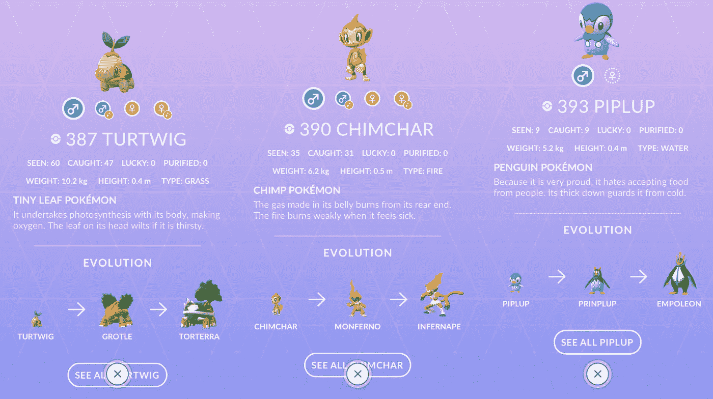

《钻石与珍珠》中的三个初级口袋妖怪，关于它们的一些简单的游戏信息，以及它们在下面的发展。作者图片

大多数游戏的目标是训练最多六只口袋妖怪的队伍，并成为该地区最强的训练者。为了实现这个目标，你必须与八个被称为健身房领导的老板战斗，他们每个人都专注于口袋妖怪的特定元素或类型。比如口袋妖怪吉祥物皮卡丘就是电动型的口袋妖怪。这意味着它对水型口袋妖怪有天然优势，但对地型口袋妖怪有弱点。为了占上风，你想用口袋妖怪强对抗你面对的类型(把它想象成石头、布、剪刀的高级版本)。在你击败所有八个健身房领导后，你可以在口袋妖怪联盟中对抗精英四人组。他们被认为是这个国家最强的训练者，就像健身房的领导一样，专门训练一种特殊类型的口袋妖怪。精英四人组之后是与口袋妖怪冠军的最后一场 boss 战，在*钻石与珍珠*中，她是辛西娅:她使用了无数不同类型的口袋妖怪，被认为是整个系列中最难的 boss 战之一。有 18 种类型，你一次最多可以使用 6 个口袋妖怪。在这种情况下，在辛西娅之前，你能召集的最好的口袋妖怪团队是什么？

# 资料组

我将使用两个数据集，都来自 Kaggle。一个是截至 2013 年的所有口袋妖怪的[列表(这完全符合我们的目的，因为最初的*钻石和珍珠*游戏是在 2006 年发布的)，另一个是不同类型比赛的](https://www.kaggle.com/abcsds/pokemon)[矩阵](https://www.kaggle.com/mrinalshankar/pokemon-types)。我们将使用 Python 中的 pandas 来读取数据:

让我们来看看最初的几个条目:

```
poke_df.head()
```

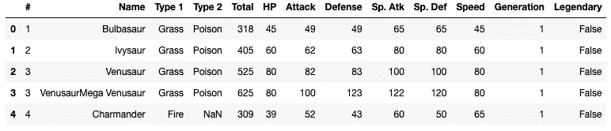

作者图片

每个条目都给出了一个口袋妖怪的名字，它在口袋妖怪国家索引(在游戏中称为 Pokedex)中的编号，它的主要类型(类型 1)和任何次要类型(类型 2，如果没有次要类型，则使用 NaN)，总统计数据(total)和每个统计数据的单独细分(总的来说，这些是表明口袋妖怪有多强的指标)，它是在哪一代引入的，以及它是否是一个传说中的口袋妖怪。对于那些不熟悉术语的人来说，世代指的是口袋妖怪首次亮相的游戏集。比如皮卡丘最早出现在口袋妖怪原版游戏中:*口袋妖怪红蓝黄*。因此，它被认为是第一代口袋妖怪。*口袋妖怪钻石和珍珠*(以及更新版本*白金*)代表了该系列发布的第四套游戏，因此其中引入的任何口袋妖怪都被视为第四代口袋妖怪。游戏的当前周期是第 8 代，因此即将推出的 *Diamond 和 Pearl* 的复刻版将是那一代的一部分(在本文的持续时间内，我在提到原版游戏时将使用缩写 DPPt，而复刻版将使用 BDSP)。另一列，传奇，代表稀有和非常强大的口袋妖怪，带有游戏中的神话，通常在游戏结束时或主要故事情节完成后捕捉。这些口袋妖怪通常有更高的属性，自动赋予任何使用它们的训练者不公平的优势。为了平衡起见，我们将这些口袋妖怪排除在我们的分析之外。你可能也注意到了口袋妖怪 Venusaur 有一个二级入口，Mega Venusaur。这是在第 6 代游戏中引入的游戏机制 Mega Evolution 的一部分。它不存在于 BDSP 中，所以这些条目也将被忽略。

我们希望在主要故事情节中过滤只存在于 DPPt Pokedex 中的口袋妖怪(我假设在翻拍中仍然会存在)。这包括第四代引入的 107 个口袋妖怪，以及前三代口袋妖怪中的 110 个其他口袋妖怪，总共 217 个。

我们将首先重新格式化一些列名，使它们更容易索引，比如将#列重命名为 number 的常见缩写，No。

```
poke_df = poke_df.rename(columns={"#": "No"})
poke_df.head()
```

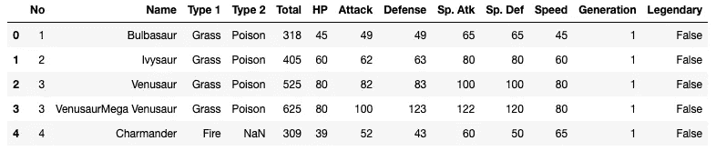

作者图片

接下来，我们将在一个列表中存储第 4 代中引入的口袋妖怪的索引，编号为 387 到 493

```
# Note: Sinnoh is the fictional region these games take place in
sinnoh = list(range(387,494))
```

我们将同样存储游戏中可用的前代口袋妖怪的索引。不幸的是，没有简单的方法从我查看的数据集或任何其他数据集提取这些口袋妖怪的指数，所以我手动记录了来自 Sinnoh Pokedex 中一个著名的口袋妖怪数据库[的单个指数:](https://bulbapedia.bulbagarden.net/wiki/List_of_Pok%C3%A9mon_by_Sinnoh_Pok%C3%A9dex_number)

```
sinnoh_expat = [63, 64, 65, 129, 130, 315, 41, 42, 169, 74, 75, 76,
               95, 208, 66, 67, 68, 54, 55, 265, 266, 267, 268, 269, 
                214, 190, 92, 93, 94, 200, 198, 118, 119, 339, 340, 
                358, 307, 308, 77, 78, 185, 122, 113, 242, 173, 35, 36,
               172, 25, 26, 163, 164, 143, 201, 194, 195, 278, 279, 203,
                298, 183, 184, 223, 224, 72, 73, 349, 350, 226, 215, 207, 
                299, 280, 281, 282, 108, 133, 134, 135, 136, 196, 197,
               333, 334, 175, 176, 228, 229, 81, 82, 114, 193, 357, 111, 
                112, 355, 356, 137, 233, 123, 212, 239, 125, 240, 126, 
                220, 221, 361, 362, 359]
```

通过`len(sinnoh_expat)`快速确认口袋妖怪的预期数量，得出`110`，我们连接这些列表并相应地过滤我们的 Pokedex:

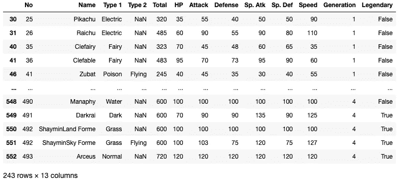

作者图片

我们看到我们有一些重复的条目(例如，条目 492，洁咪)，我们可以使用`drop_duplicates()`功能删除它们(这也删除了任何额外的表单，例如大型进化):

```
sinnoh_dex = sinnoh_df.drop_duplicates(subset=['No'])
sinnoh_dex
```

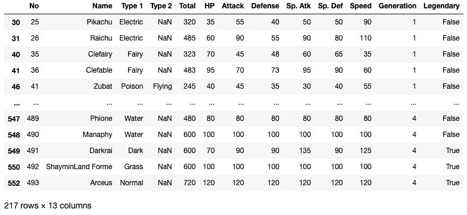

作者图片

厉害！我们已经从 Sinnoh Pokedex 得到了所有 217 个口袋妖怪。我们的数据几乎可以进行分析了。现在我们只需要移除所有传说中的口袋妖怪。幸运的是，因为我们有一个布尔变量用于该类别，所以这是一个非常简单的过滤过程。

```
sinnoh_dex = sinnoh_dex[sinnoh_dex.Legendary == False]
sinnoh_dex
```

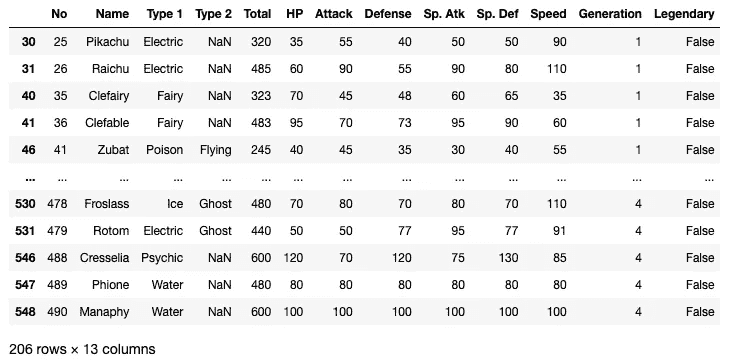

作者图片

现在我们的数据已经准备好进行分析，我们需要准备我们的类型图矩阵。这是我下载的另一个数据集，显示了不同类型的匹配:

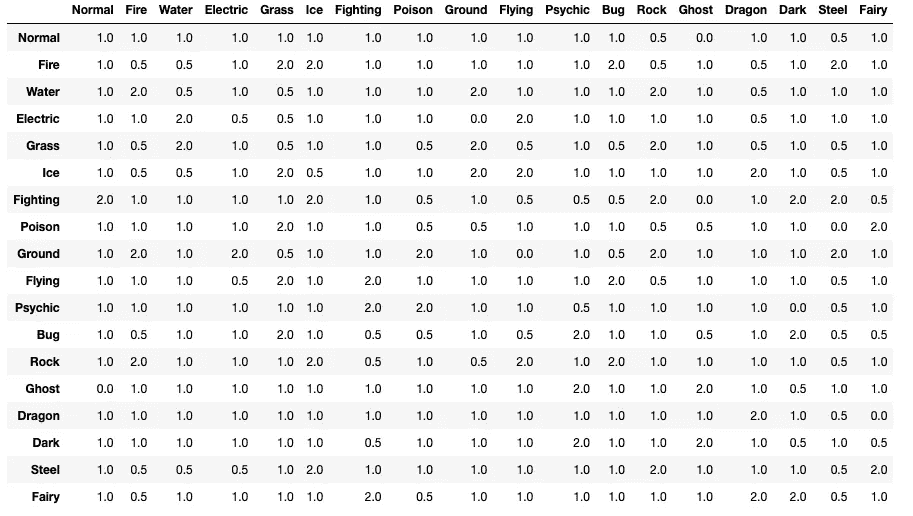

作者图片

让我们来看一下这个图表，行代表我们正在使用的口袋妖怪类型，列代表对手队的类型。2 表示某一类型的口袋妖怪在行中比在列中的对手口袋妖怪更有优势。举个例子，假设电动类型的皮卡丘对一只口袋妖怪发动雷电。如果它用那个动作攻击一个水型口袋妖怪，那它是超级有效的，所以我们用 2 来量化这个效果；相比之下，如果它攻击龙型口袋妖怪，它不会非常有效，所以基线效应将减半，因此，我们在矩阵中的条目中有 0.5。造成中性伤害的招式有 1(例如皮卡丘攻击火系口袋妖怪)。对于电气类型需要指出的一点(这也适用于其他一些类型)是接地类型列下的 0。这意味着电动类型的移动对地面类型的口袋妖怪没有任何效果；后者对它们免疫。

关于健身房领导和精英四，有 12 种类型我们要选择:岩石，草，战斗，水，鬼，钢，冰，电，虫，地，火，心灵，所以我们将相应地过滤我们的类型图表的列:

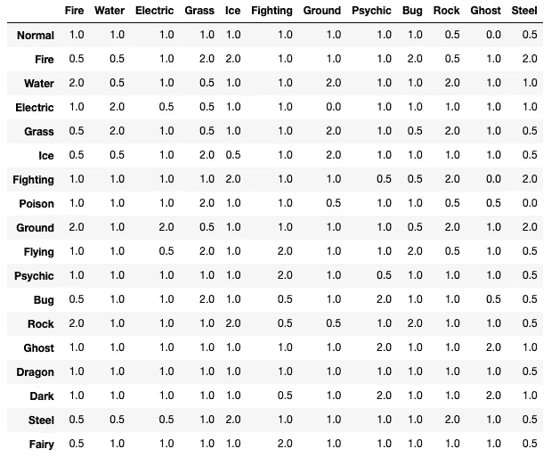

作者图片

重新审视我们的目标，我们想要一个由 6 个口袋妖怪组成的团队，他们的类型很强，可以对抗健身房领导和精英四人组。我们还将施加一个约束，即我们的团队中必须有一个首发口袋妖怪(你不选择的其他人在主要故事情节中是无法获得的)。在所有这些约束条件下追求最佳团队，您可能会认为这是一个优化问题。在这些问题中，我们有一个想要优化的目标函数。在这种情况下，我们希望最大限度地表达

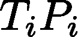

在以下约束条件下:

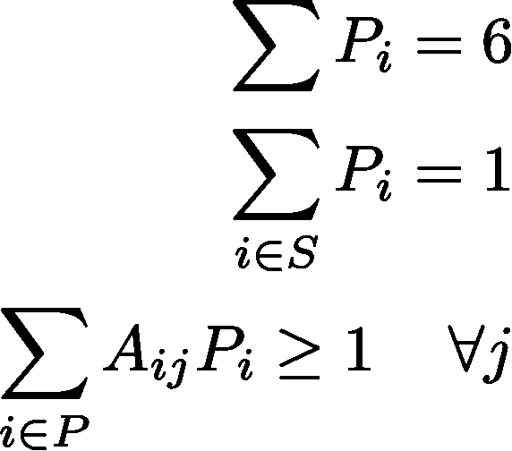

其中 *T* 是口袋妖怪 *i* 的总统计数据(第一个数据集中的列总数)， *P* 是指示该口袋妖怪是否在我的团队中的决策变量， *S* 是起始口袋妖怪(包括它们的进化)的集合， *A* 是指示口袋妖怪 *i* 相对于对手口袋妖怪 *j* (1

为了解决这个优化问题，我们将使用`pulp`包，这是一个直观的库，用于使用[线性编程](/basic-linear-programming-in-python-with-pulp-d398d144802b)来构造和求解这些数学模型。可以通过`conda install pulp`安装。

首先，我们将创建向量和矩阵来存储上述变量。

现在，我们可以创建我们的模型。

我们现在可以拉出产生的六个口袋妖怪:

```
Infernape
Garchomp
Electivire
Dusknoir
Cresselia
Manaphy
```

所以我们的最佳团队是阴尸(火/战斗)、烈咬陆鲨(龙/地)、埃蒂维尔(电)、夜巨灵(鬼)、克雷色利亚(通灵)和玛纳霏(水)。不同类型的团队。然而，敏锐的口袋妖怪爱好者可能会注意到，克雷色利亚实际上是一个传说中的口袋妖怪，而玛纳霏是一个神话中的口袋妖怪。后一个类别在统计数据和游戏中的知识方面基本上与传奇相同，但它们在历史上更难获得(它们通常通过独占事件提供)。不用说，由于他们的属性更高，他们给了我们不公平的优势，但是我们可以通过添加另一个限制他们使用的约束等式来解决这个问题:

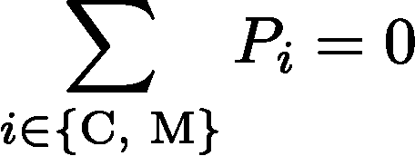

其中 C 和 M 分别指克雷色利亚和玛纳霏。然后，我们可以修改我们的代码，以包括如下限制:

```
Gyarados
Umbreon
Infernape
Garchomp
Electivire
Togekiss
```

现在我们有了一个更加平衡的队伍，有了加拉多斯(水/飞行)，月精灵(黑暗)，阴尸(火/战斗)，烈咬陆鲨(龙/地)，埃蒂维尔(电)和波克基斯(精灵/飞行)。

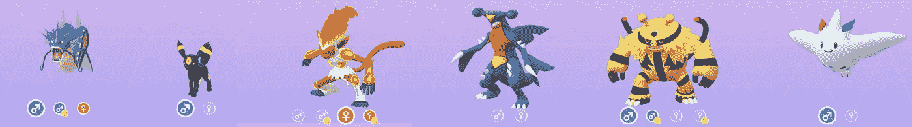

从左至右:加拉多斯、月精灵、因弗纳普、烈咬陆鲨、埃蒂维尔和波克基斯。作者图片

这里一个常见的口袋妖怪是阴尸，火苗猴的进化形式，是你可以选择的入门口袋妖怪之一。让我们假设你喜欢企鹅口袋妖怪波加曼，并想围绕它的进化形式 Empoleon 建立一个团队。你会如何调整算法？

我们可以像这样限制《口袋妖怪入门》只包括波加曼一家

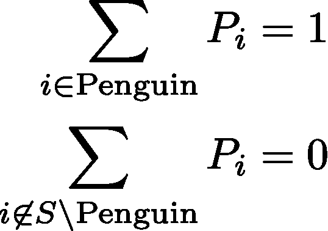

其中企鹅是波加曼及其进化家族(波皇子和 Empoleon)的集合。我们可以这样编码:

```
Snorlax
Empoleon
Garchomp
Electivire
Togekiss
Dusknoir
```


从左到右:卡比兽(正常)、Empoleon(水/钢)、烈咬陆鲨(龙/地)、Electivire(电)、波克基斯(精灵/飞行)、夜巨灵(幽灵)。作者图片

我们同样可以对草苗龟周围的团队进行调整，草地开始:

```
Snorlax
Torterra
Garchomp
Magmortar
Togekiss
Dusknoir
```


从左到右:卡比兽(正常)、土台龟(草/地)、烈咬陆鲨(龙/地)、鸭嘴焰龙(火)、波克基斯(神仙/飞天)、夜巨灵(鬼)。图片作者。

# 结论

在本文中，我向您展示了如何使用线性编程来确定在 Pokemon Brilliant Diamond 和 Shining Pearl 中使用的最佳团队(假设没有偏离原始 Pokedex)。我们可以进一步优化其他所需的定制(例如，额外的口袋妖怪你可能想使用，像皮卡丘；优化某些属性，如攻击和速度，而不是总属性等)。你也可以将此改编到另一个口袋妖怪游戏中，例如最近的主要系列游戏*口袋妖怪剑与盾*。编码快乐！

# 参考资料:

[1]https://www.serebii.net/pokedex-dp/

[2][https://bulbapedia . bulbagarden . net/wiki/List _ of _ Pok % C3 % A9mon _ by _ Sinnoh _ Pok % C3 % A9dex _ number](https://bulbapedia.bulbagarden.net/wiki/List_of_Pok%C3%A9mon_by_Sinnoh_Pok%C3%A9dex_number)

[3][https://hookedondata.org/pokemon-type-combinations/](https://hookedondata.org/pokemon-type-combinations/)

[4][https://towards data science . com/linear-programming-and-discrete-optimization-with-python-using-pulp-449 F3 C5 F6 e 99](/linear-programming-and-discrete-optimization-with-python-using-pulp-449f3c5f6e99)

如果你是新手，欢迎！如果你喜欢这篇文章，并想充分享受我的其他故事，以及无限制地访问其他媒体作家的故事，请考虑使用下面我的个性化链接成为媒体成员；我会赚取你的一部分会员费，不需要你额外付费:[https://medium.com/@jashahir/membership](https://medium.com/@jashahir/membership)