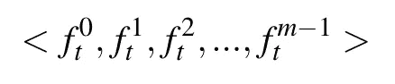
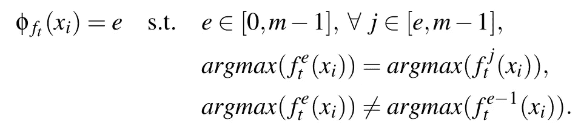
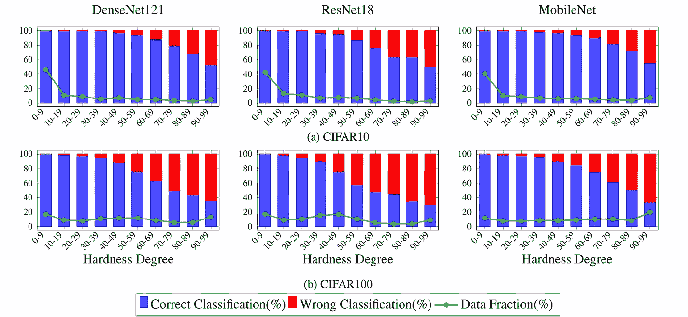

# 使用样本硬度确定基于 DNN 的分类器输出的可信度

> 原文：<https://towardsdatascience.com/determining-the-trust-in-the-dnn-based-classifier-outputs-using-the-hardness-of-samples-f8fa767fc10e?source=collection_archive---------38----------------------->

## [思想与理论](https://towardsdatascience.com/tagged/thoughts-and-theory)，值得信赖的深度学习

## 您只需要样品的硬度

可信机器学习中最重要的挑战之一是测量分类器输出的可信度。在关键和安全敏感的任务中，确定分类器输出的信任度是至关重要的。我们使用样本的硬度作为估计分类器输出可信度的新度量。首先，我们需要定义样品的硬度。

照片由 [**布雷特乔丹**](https://unsplash.com/@brett_jordan) 在 [Unsplash](https://unsplash.com/?utm_source=medium&utm_medium=referral)

由于基于 DNN 的分类器的训练过程是在几个时期中完成的，因此我们可以将分类器训练过程视为一系列分类器，其中最后一个分类器被视为实际使用的最终分类器。假设分类器 *f_t* 被训练了 *m* 个时期。分类器 *f_t* 的训练过程可以表示为如下序列:

其中 *f_t^i* 是第*个*时段结束时的分类器 *f_t* 。在每个时段结束时创建的分类器被称为子分类器，第 *i 个*子分类器 *f_t^i* 是在时段 *i* 结束时创建的分类器。当 *f_t^e* 是由 *f_t^e* 分配的标签等于所有后续子类预测标签的第一个子类时，我们说样本 *x_i* 在时期 *e* 中被学习。一般来说，随着历元数量的增加，分类器 *f_t* 的性能会提高。因此，当一个样本在早期学习时，我们认为它是一个简单的样本，当它在更高的时期学习时，我们认为它是一个更难的样本。

因此，*【ϕ_{f_t}(x_i】*显示的分级机 *f_t* 样品 *x_i* 的硬度直接关系到 f_t 学习 *x_i* 的历元数，因此，*【ϕ_{f_t}(x_i】*定义如下:

硬度范围取决于子类的数量。当我们有 *m* 个子分类器时，样品的硬度在范围[0，m-1]内。我们在 CIFAR10 和 CIFAR100 训练集上训练了三种不同类型的分类器，包括 DenseNet121、ResNet18 和 MobileNet，共 100 个时期。使用动量为 0.9 且批量为 128 的随机梯度下降来训练所有分类器。学习率是 0.1，并且计划在每个时期以常数因子 0.955 减少。我们在每个分类器的训练过程中保存所有 100 个子分类器，用它们来计算一个样本的硬度程度。

图 1 显示了在 CIFAR10 和 CIFAR100 测试集的 10 个硬度范围内，样品被正确和错误分类的百分比。该图表明，随着样品硬度的增加，被正确分类的样品比例减少。超过 99%和 95%的样本在前 30 个时期(硬度< 30) are correctly classified in CIFAR10 and CIFAR100 test sets, respectively. On the other side, less than 55% and 36% of samples being learned in the last 10 epochs (hardness degree ≥ 90) are correctly classified in Cifar10 and Cifar100 datasets, respectively. Therefore, as the hardness degree of a sample is increased, the magnitude of trust in the classifier output for that sample is reduced.

Figure 1: Blue and red bars show that the percentage of test samples in each range of hardness degrees being correctly or wrongly classified, respectively. For each range of hardness degrees, Data Fraction indicates the percentage of CIFAR10 and CIFAR100 test samples whose hardness degrees are in that range.

…

# Reference:

[Amir Mahdi Sadeghzadeh、Amir Mohammad Sobhanian、Faezeh Dehghan 和 Rasool Jalili)被学习。"](https://arxiv.org/abs/2106.11424) HODA:面向硬度的模型提取攻击检测["(2021).](https://arxiv.org/abs/2106.11424)