# 使用 Go 开发一个松弛机器人

> 原文：<https://towardsdatascience.com/develop-a-slack-bot-using-golang-1025b3e606bc?source=collection_archive---------3----------------------->

## 通过这个循序渐进的教程，学习如何在 Go 中构建一个 Slack bot


安德里亚·德·森蒂斯峰在 [Unsplash](https://unsplash.com/s/photos/technology?utm_source=unsplash&utm_medium=referral&utm_content=creditCopyText) 拍摄的照片

[Slack](https://slack.com/intl/en-se/) 是开发者和公司用来分享信息和沟通的沟通工具。近年来它变得非常受欢迎。

在本文中，我们将介绍如何设置和构建一个能够与 Slack 工作空间和通道交互的 bot。我们将研究如何创建斜杠命令和可视化请求，如按钮。bot 应用程序将通过 Websocket 向 Go 后端发送请求，这在 slack 世界中称为 Socket-Mode。

## 创建时差工作区

如果你还没有一个工作空间可以使用，确保通过访问 [slack](https://slack.com) 并按`Create a new Workspace`来创建一个新的工作空间。

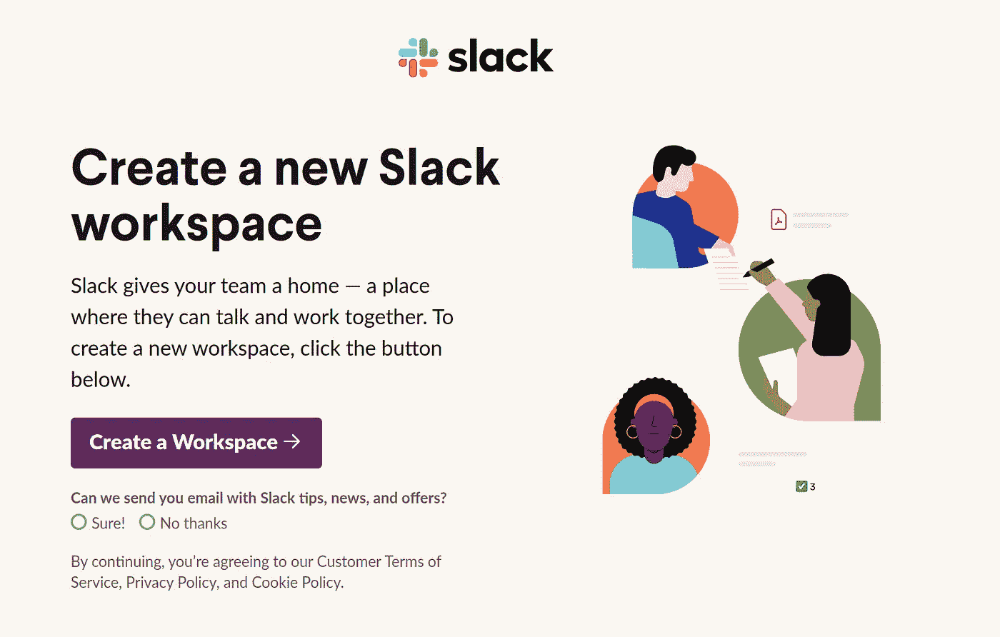

松弛时间-创建新的工作空间按钮

继续填写所有表格，您需要提供团队或公司的名称、新的渠道名称，并最终邀请其他队友。

## 创建松弛应用程序

我们需要做的第一件事是创建 Slack 应用程序。访问 [slack 网站](https://api.slack.com/apps/new)创建应用程序。选择`From scratch` 选项。

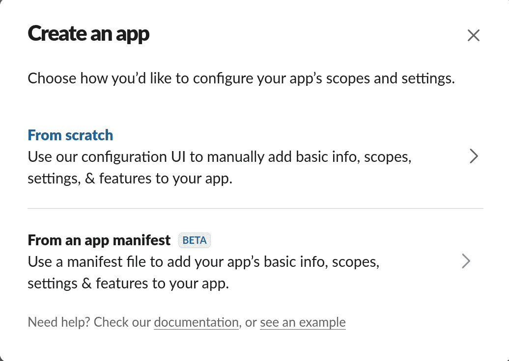

slack——为我们的机器人创建一个新的应用程序

您将看到向应用程序和工作空间添加名称的选项，以允许使用该应用程序。您应该能够看到您连接到的所有工作区。选择适当的工作空间。

一个应用程序有许多不同的用例。您将被要求选择添加什么功能，我们将创建一个机器人，所以选择机器人选项。

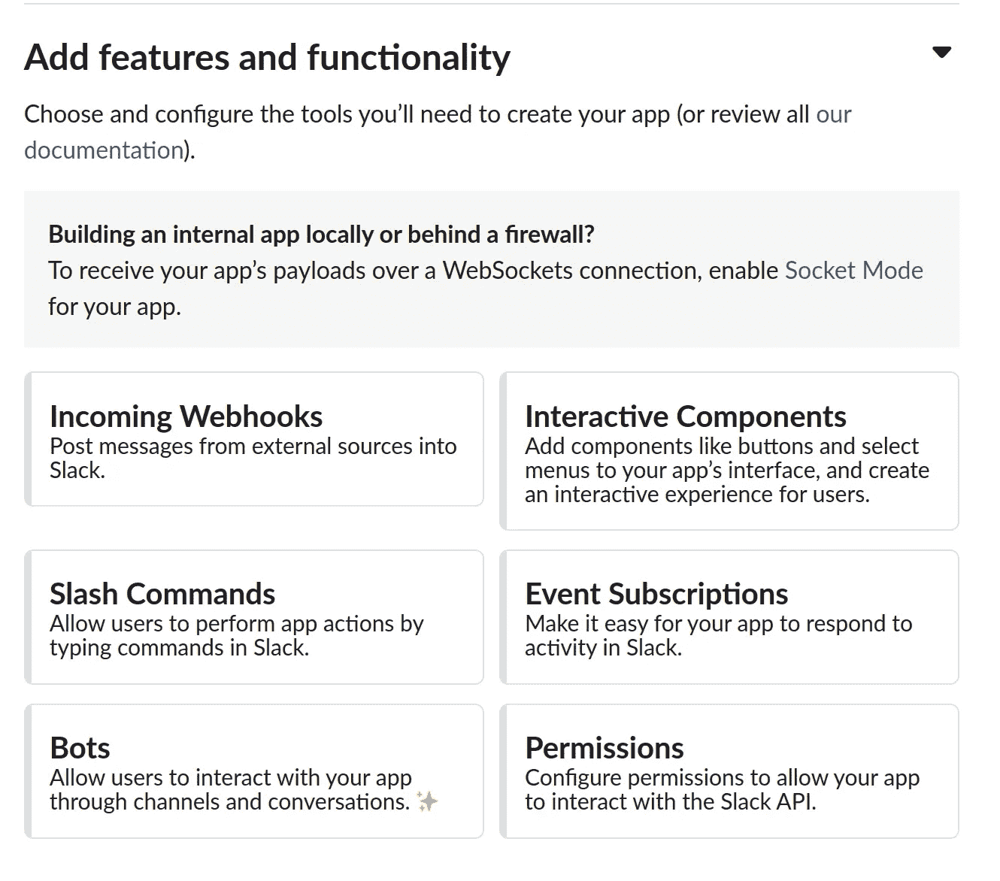

Slack —添加到应用程序中的特性/功能

单击机器人后，您将被重定向到帮助信息页面，选择添加范围的选项。我们需要添加到应用程序中的第一件事是执行任何操作的实际权限。

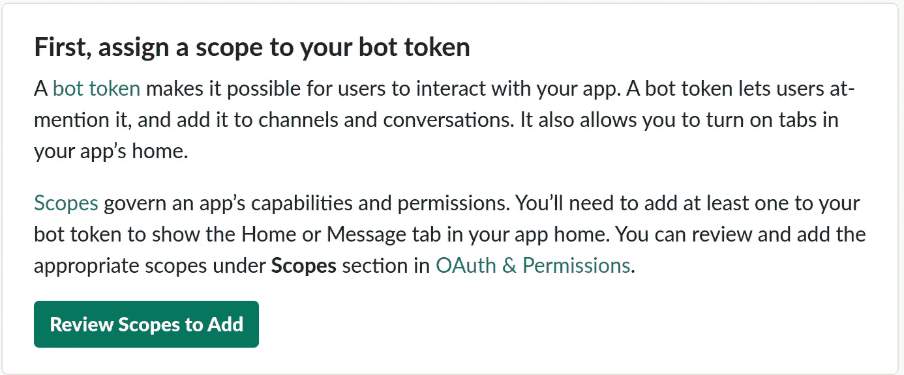

Slack 添加范围以允许 Bot 执行操作

按下`Review Scopes to Add`后，向下滚动到机器人范围，开始添加我已经添加的 4 个范围。图像中显示了范围的说明。

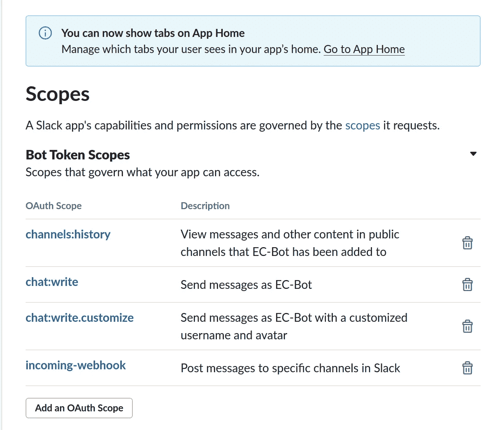

Slack —添加 bot 权限以扫描频道和发布消息

添加范围后，我们就可以安装应用程序了。如果你是应用程序的所有者，你可以简单地安装它，否则，就像我一样，我必须请求管理员的许可。

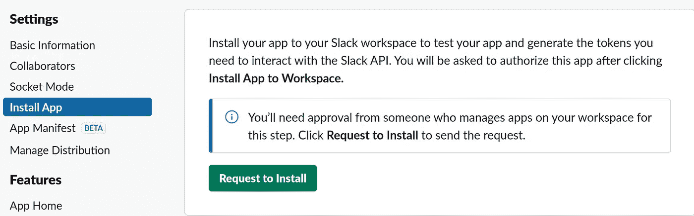

Slack —向工作区请求或安装应用程序

如果你可以安装或被允许安装，你会看到另一个屏幕上的信息，选择适当的渠道，机器人可以用来张贴作为一个应用程序。

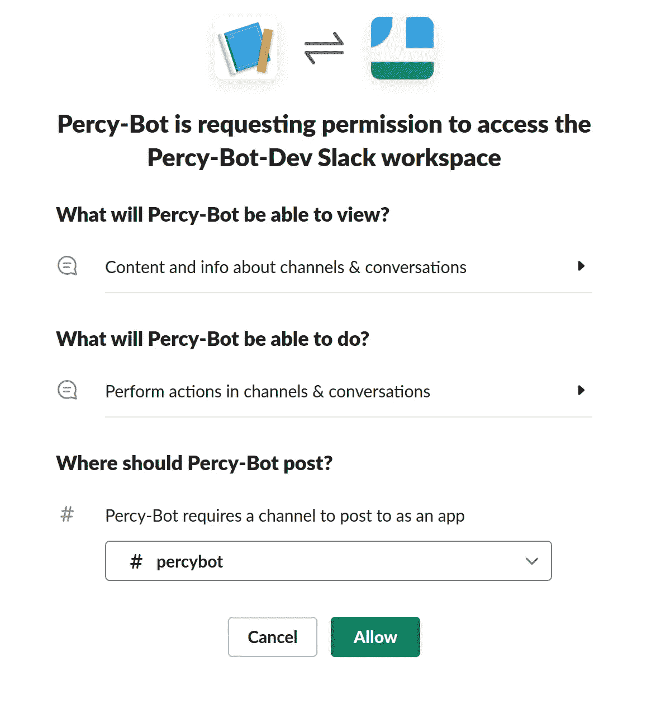

SlackBot —将 Bot 安装到工作区

一旦你点击`Allow`，你会看到一个长字符串、一个 OAuth 令牌和一个 Webhook URL。记住它们的位置，或者把它们保存在另一个安全的地方。

打开您的 slack 客户端并登录到工作区。我们需要将应用程序邀请到一个我们希望他可用的频道中。我使用了一个名为 percybot 的频道。
转到那里，开始输入命令信息，通过用`/`开始信息来完成。我们可以通过输入`/invite @NameOfYourbot`来邀请机器人。

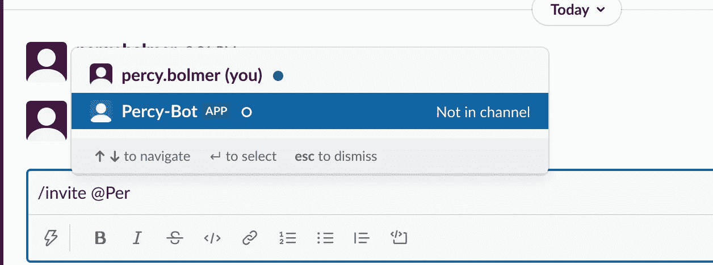

Slack —邀请 bot 进入可以使用它的频道。

## 从 Golang 连接到 Slack

既然我们已经启动了 Slack 应用程序和身份验证令牌，我们就可以开始与 Slack 通道通信了。

我们将使用`[go-slack](http://go get -u github.com/slack-go/slack)`，它是一个支持常规 REST API、WebSockets、RTM 和事件的库。我们还将使用`[godotenv](https://github.com/joho/godotenv)`来读取环境变量。

让我们创建一个新的 golang 包并下载它。

```
mkdir slack-bot
cd slack-bot
go mod init programmingpercy/slack-bot
go get -u github.com/slack-go/slack
go get -u github.com/joho/godotenv
```

首先，我们将创建一个`.env`文件，用于存储您的秘密令牌。我们还将在这里存储一个频道 ID。您可以在创建应用程序的 web UI 中找到令牌，如果您选择频道并按胡萝卜箭头转到`Get channel details`，则可以在 UI 中找到频道。

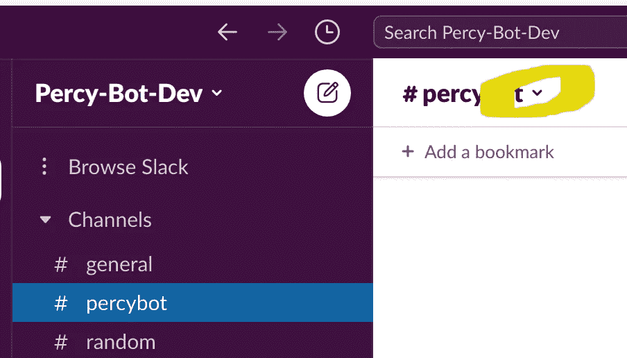

松弛—按黄色圆圈项目查找频道 ID。

。env——我们将在机器人中使用的秘密

创建`main.go`，这样我们就可以开始编码了。我们将从简单地连接到工作区并发布一条简单的消息来确保一切正常开始。

我们将使用`godotenv`来读入`.env`文件。然后创建一个松弛附件，这是一个发送到通道的消息。需要理解的重要一点是，Slack 包利用了一种模式，在这种模式下，大多数功能都采用一个配置片。这意味着可以在每个请求中添加`Option`个函数，并且数量可变。

我们还将在消息中添加一些字段，用于发送额外的上下文数据。

main.go —在松弛信道上发送简单消息

通过运行 main 函数来执行程序，您应该会在 slack 通道中看到一条新消息。

```
go run main.go
```

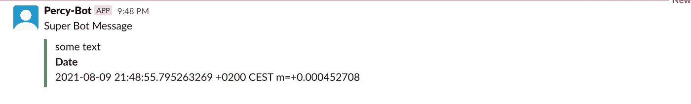

Slack —我们发送的第一条机器人消息

## 使用时差事件 API

松弛事件 API 是处理松弛通道中发生的事件的一种方式。有许多事件，但对于我们的机器人，我们想听提及事件。这意味着每当有人提到这个机器人，它就会收到一个触发事件。事件通过 WebSocket 传递。

您可以在[文档](https://api.slack.com/events)中找到所有可用的事件类型。

您需要做的第一件事是在 [web UI](https://api.slack.com/apps/) 中访问您的应用程序。

我们将激活名为`Socket Mode`的东西，这允许机器人通过 WebSocket 连接。另一种方法是让 bot 托管一个公共端点，但是您需要一个域来托管它。

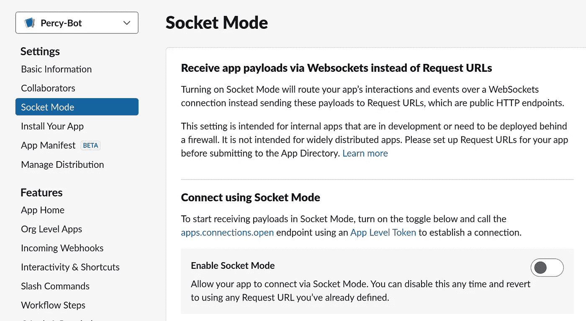

Slack —启用套接字模式以允许 Websocket 而不是 HTTP

那么我们还需要加上`Event Subscriptions`。您可以在“功能”选项卡中找到它，输入并激活它。然后将`app_mentions`范围添加到事件订阅中。这将使提及触发应用程序的新事件

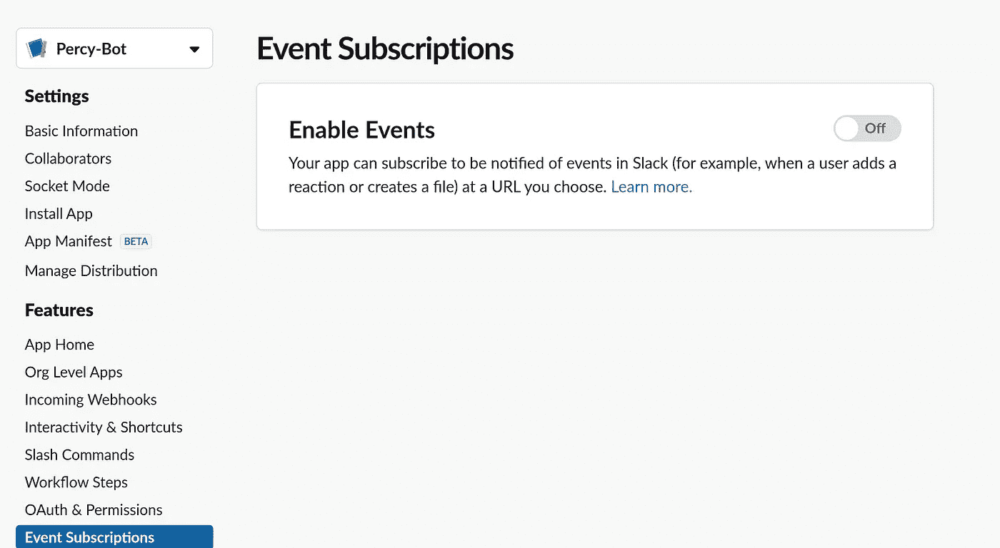

Slack —为应用程序启用事件订阅

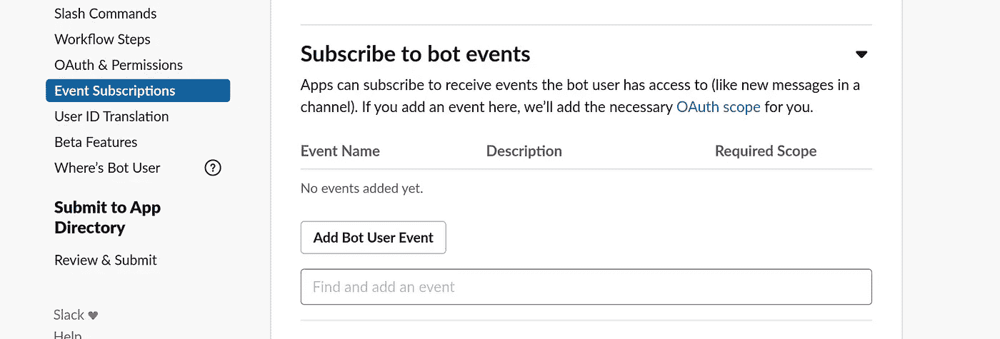

Slack —确保订阅正确的事件，app_mentions

我们需要做的最后一件事是生成一个应用程序令牌。现在我们只有一个 Bot 令牌，但是对于事件，我们需要一个应用程序令牌。

进入`Settings->Basic Information`，向下滚动到名为应用级令牌的章节，按下`Generate Tokens and Scope`，为您的令牌填写一个名称。

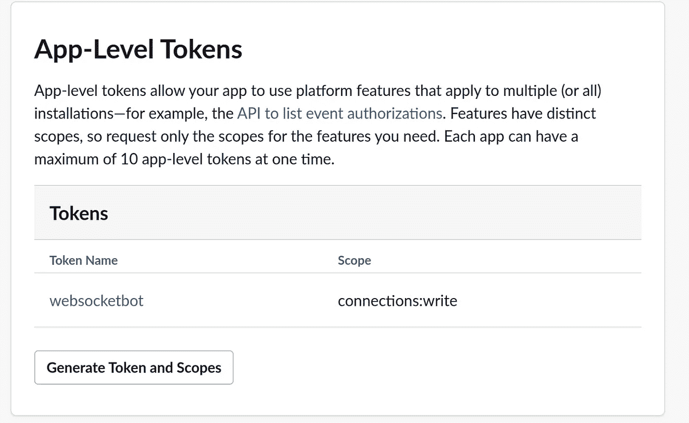

Slack —创建应用程序级令牌

我已经将`connections:write`作用域添加到该令牌中，确保您也保存了该令牌，将其作为`SLACK_APP_TOKEN`添加到`.env`文件中。

。env —将所有必需的字段添加到。包封/包围（动词 envelop 的简写）

要使用套接字模式，我们还需要得到一个叫做套接字模式的`slack-go`的子包。

```
go get github.com/slack-go/slack/socketmode
```

slack 包需要为套接字模式创建一个新的客户机，所以我们将有两个客户机。一个使用常规 API，另一个用于 websocket 事件。让我们从连接开始，以确保所有权限都是正确的。注意 Websocket 客户机是如何通过调用`socketmode.New`创建的，并把常规客户机作为输入。我还在普通客户端的创建中添加了一个`OptionAppLevelToken`,因为现在需要它来连接到套接字。

main.go —创建一个通过 Socketmode 连接到 EventsAPI 的 Bot

确保运行该程序并验证连接的输出，将会有一个 ping hello 发送。

main.go —运行程序的输出

是时候开始选择要监听的所有事件了。在程序的最后，我们调用`socketClient.Run()`，它将在`socketClient.Events`阻塞和接收通道上的新 Websocket 消息。因此，我们可以使用 for 循环来持续等待新事件，slack-go 库也附带了预定义的事件类型，因此我们可以使用类型开关来轻松处理不同类型的事件。所有事件都可以在[这里](https://api.slack.com/events?filter=Events)找到。

由于`socketClient.Run()`正在阻塞，我们将生成一个 goroutine 在后台处理传入的消息。

我们将从每当 Slack 中触发 EventAPI 上的事件时简单地登录开始。因为我们首先需要在 websocket 上键入 switch 消息，如果它是一个`EventsAPI`类型，然后根据实际发生的事件再次切换，我们将把事件处理分解到一个单独的函数中，以避免深度嵌套的切换。

main.go —我们现在监听任何事件并将其打印出来

如果要测试，运行程序然后用`@yourbotname`输入 Slack 和由 bot 提及。

```
go run main.go
```


slack——提到机器人

您应该能够在运行 bot 的命令行中看到记录的事件。

main.go —事件日志的输出

看看打印的事件，你就会明白为什么我们需要使用多种类型的开关。我们得到的事件属于类型`event_callback`，该事件包含一个`payload`，其中包含实际执行的事件。

所以首先我们需要测试它是否是一个回调事件，然后测试它是否是一个`app_mention`有效负载事件。

让我们实现将继续类型切换的`handleEventMessage`。我们可以使用`type`字段来知道如何处理该事件。然后我们可以通过使用`InnerEvent`字段到达有效载荷事件。

handleEventMessagev1 —用于处理回调事件并查看它是否为 AppMentionEvent 的函数

用新的`handleEventMessage`函数替换主函数中打印事件的先前日志。

Main.go 使用 handleEventMessage 而不是嵌套类型开关

现在记录事件并不能成为一个有趣的机器人。我们应该让机器人回应提到他的用户，如果他们说你好，它也应该问候他们。

首先登录到[应用程序](https://api.slack.com/apps/)并将`users:read`范围添加到 bot 令牌。我相信你现在不用指导就能做到，或者回去看看我们以前是怎么做的。

一旦完成，我们将创建`handleAppMentionEvent`函数。这个函数将把一个`*slackevents.AppMentionEvent`和一个`slack.Client`作为输入，这样它就可以响应。
事件在`event.User`中包含用户 ID，因此我们可以使用该 ID 来获取用户信息。在`event.Channel`中也提供了要响应的通道。我们需要的最后一条信息是用户在提及时发送的实际信息，可以在`event.Text`中找到。

handleAppMentionEvent—bot 中提及的处理程序

要开始使用这个函数，我们还需要添加客户机作为输入参数。所以我们要更新`handleEventMessage`才能接受。

handleEventMessage —现在接受客户端作为输入参数

重新启动程序，试着打个招呼，并说些别的话，看看它是否如预期的那样工作。如果您得到一个“missing_scope”错误，那么您已经错过了一些范围。

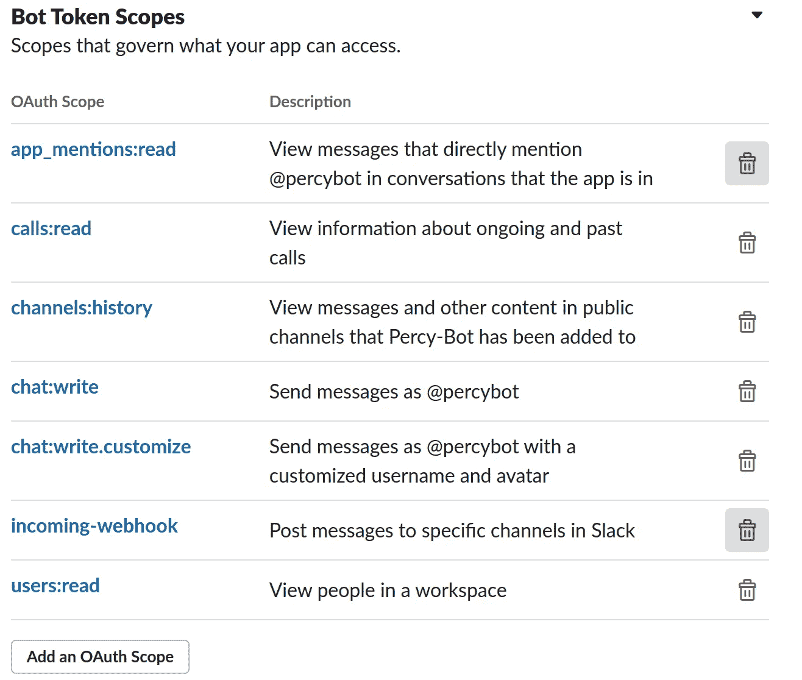

bot 运行当前需要的所有作用域

这是我当前运行的机器人的输出


Slack —机器人按照预期做出响应

是时候向前看，看看如何添加斜杠命令了。

## 向 Slack bot 添加斜杠命令

我经常看到 Slack 机器人使用 slash 命令。这意味着你可以输入/发送一个特殊的命令。有许多内置命令，如`/call`允许您开始通话等。

我们将添加一个自定义命令`/hello`。当这个命令被触发时，我们将让机器人发送一条问候消息。

同样，您需要在 [web UI](https://api.slack.com/apps/) 中添加命令。访问网站并在功能选项卡中选择`Slash Command`。

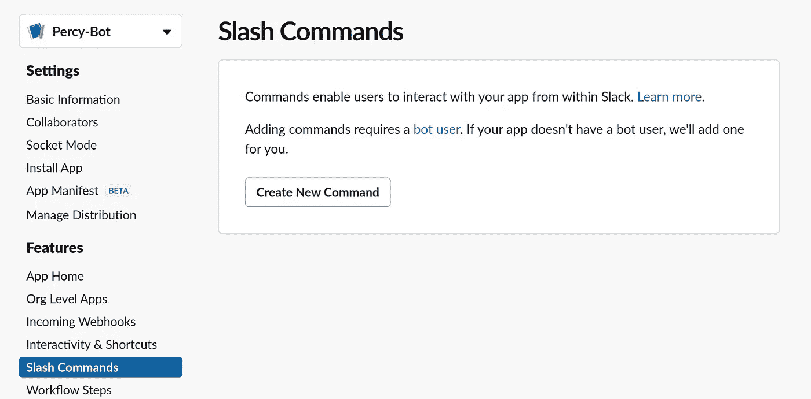

松弛—在 UI 中添加新的斜线命令。

我们将创建一个接受单一参数的命令，该参数是要问候的用户名。

填写要求的字段，注意我们使用套接字模式，因此不需要提供请求 URL。

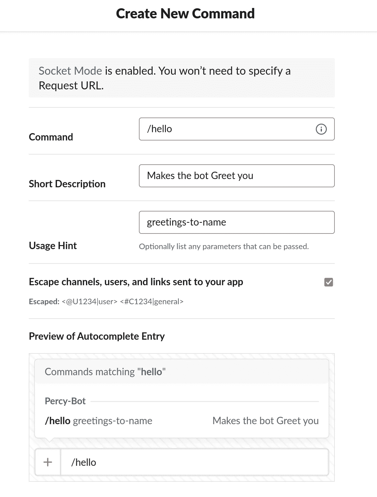

Slack —向 hello 用户名添加新的斜杠命令

添加完命令后，不要忘记重新安装应用程序。这是必要的，因为我们已经改变了应用程序。如果您忘记了如何安装，那么请重新访问本文前面安装应用程序的部分。

您可以通过打开 slack 和应用程序被邀请的通道并键入`/hello`命令来验证所有东西都已安装。

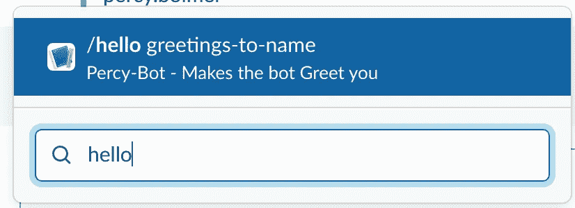

键入/hello 时出现 Percy-Bot

这很简单，让我们重做我们对 EventsAPI 所做的，但是这次我们将为`EventTypeSlashCommand`添加一个类型开关。

我们将在`SlashCommand.Command`中找到调用的命令，在`SlashCommand.Text`中找到输入文本。因此，我们将首先根据命令的输入路由命令，然后将问候语返回到文本字段。

首先更新`main.go`文件，以包含 websocket 上新类型消息事件的监听器。

Main.go 添加了 EventTypeSlashCommand 消息的案例。

不要忘记发送确认，否则您将在 slack 中看到一条错误消息，指出该消息未被正确发送。

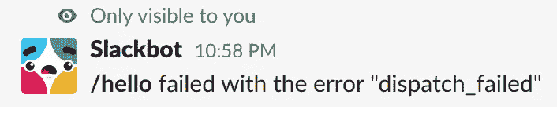

Slack —如果您忘记确认 websocket 消息的检索

我们将有一个名为`handleSlashCommand`的路由器函数，它将简单地重定向到另一个函数。现在这看起来有点大材小用，但是如果你打算添加更多的功能，那么创建多个小功能会更容易。尤其是当你使用单元测试的时候。

实际的响应将来自`handleHelloCommand`，它将简单地获取在`/hello`命令之后设置的用户名，并在通道中发送一个问候。

handleSlashCommand —将/hello 重新路由到正确功能的路由器功能

重启程序并尝试从 slack 客户端发送命令。当我输入`/hello reader`时，我看到下面的输出。

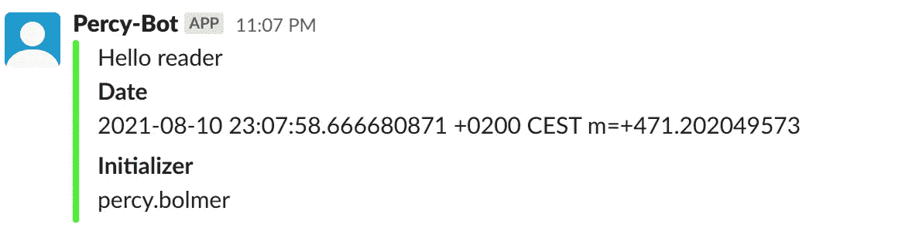

slack——来自/hello 命令的输出

## 前进斜线命令和交互

我们将看看如何实现一个斜杠命令来触发机器人问一个问题，我们可以用是或否按钮来回答。

首先在 Slack web UI 中添加新命令，这样我们就可以触发它。

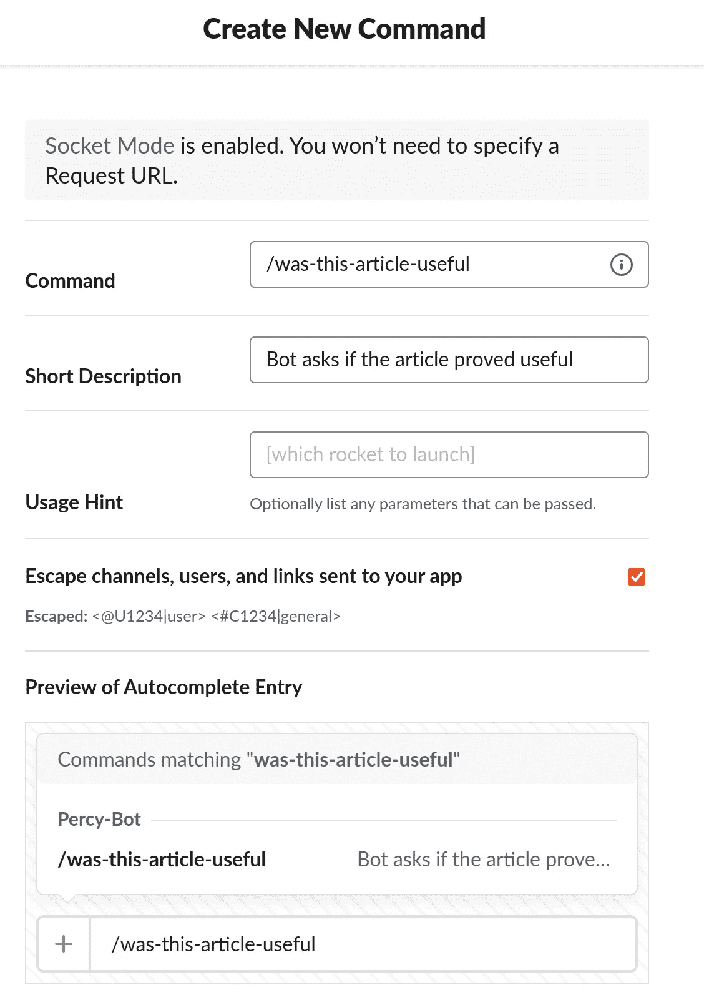

松弛时间—添加新命令

我们将首先对 main 函数做一个小的修改，在接受斜杠命令事件的类型开关中，我们目前在处理消息之前进行确认。我们将改变这一点，并在确认中返回响应，因为这是可能的。

main.go —更新我们接受斜杠命令的类型开关

现在你会看到我们可以多么容易地添加新命令，我们需要做的就是在`handleSlashCommand`中添加一个新的 case 选项来检查。当然，我们也需要处理实际的命令，但是这种结构很容易扩展。我们将更新`handleSlashCommand`,以便它也返回一个`interface{}`。这是将包含在确认中的有效负载响应。

handleSlashCommand —我们现在将两个斜杠命令路由到它们相应的处理程序

我们将路由到一个名为`handleIsArticleGood`的函数，该函数将使用名为 [Block-Kit](https://api.slack.com/block-kit) 的东西向用户触发一个双按钮问卷。这是一个松散的实现，允许我们发送 HTML 组件。有大量的选项和组件要发送，但现在让我们坚持按钮。

这些块被添加到我们之前用来发送简单消息的`slack.Attachment`中。它有一个名为`Blocks`的字段，接受要发送的块的数组。每个块都是要发送的可视组件。

我们将使用一个 Section 块，Slack 库帮助我们使用接受几个参数的`NewSectionBlock()`创建一个。

第一个参数是一个`slack.TextBlockObject`，这是发送文本的标准方式，包含要使用的类型，其中我们将使用 markdown。它还包含要在文本块中显示的值。

第二个参数是要添加的字段，比如我们之前用来添加上下文数据的字段，让它保持为 nil。

第三个参数是一个`slack.Accessory`，它是一个 block 元素的容器，你可以在 slack [文档](https://api.slack.com/messaging/composing/layouts)中找到 JSON 布局。我们将向附件添加一个复选框元素，它包含两个选项，[是，否]。请记住，我们只是返回响应，在这种情况下，我们不像在 hello 处理程序中那样发送它。注意 CheckBoxGroupsBlockElement 中的`answer`，这是用于识别执行了哪种交互的动作。

handleIsArticleGood —构建我们在确认中发送的可视响应的处理程序

重启你的机器人，尝试在 slack 中执行命令。

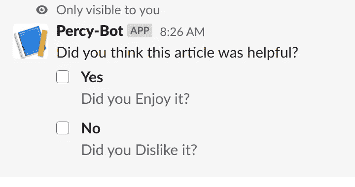

Slack —来自/was-this-article-used 命令的响应

当你选择某样东西时，什么也不会发生，因为我们还不接受后端的响应。这个响应将触发一个`Interaction`事件，所以如果我们想要接受这个响应，我们需要在 main 函数中监听这个事件。

过程和以前一样，转换成正确的消息类型。在这种情况下，它是一个`InteractionCallback`。

main.go —添加对交互的支持

我们将添加一个`handleInteractionEvent`，它将简单地打印关于交互和所选选项的信息。

handleInteractionEvent —打印交互的信息

尝试执行命令，并选择一个选项。

按“是/否”时交互的输出

## 结论

我们已经介绍了开始构建您的机器人所需的大部分项目。

我们已经讨论了这些主题

*   如何设置 Slack-Bot 应用程序
*   从 Golang 服务连接到应用程序
*   收听频道中的机器人提及
*   向 bot 添加斜杠命令
*   使用时差事件 API
*   将可视化的块发送到 Slack
*   监听用户交互

这是这一次，希望你喜欢这篇文章。一如既往，请随时联系我，给我反馈或问题。

现在出去建造一些机器人吧！