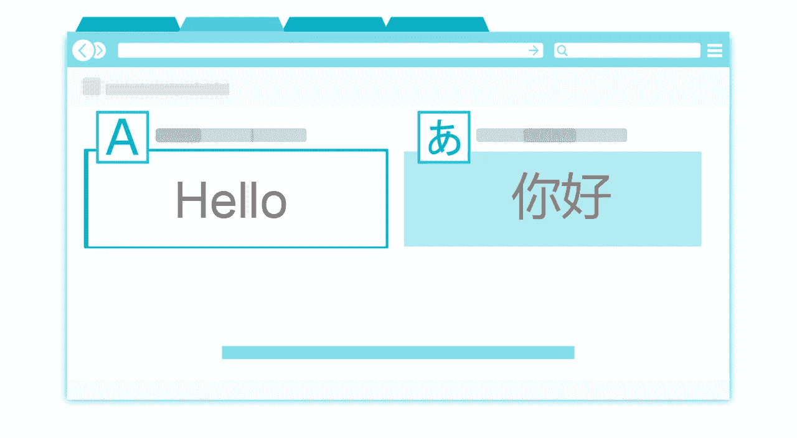
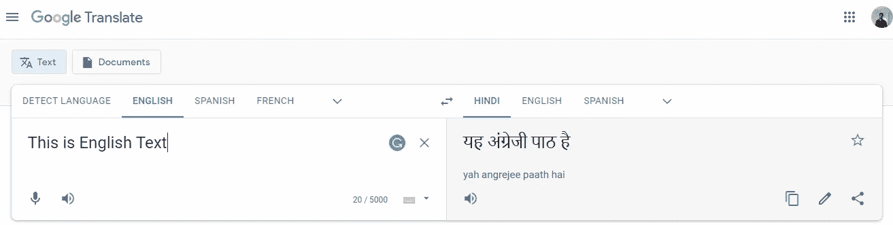
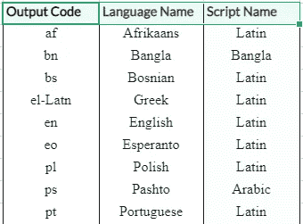
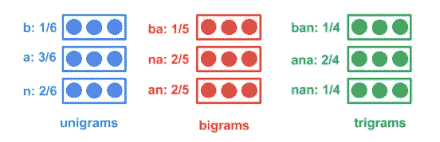
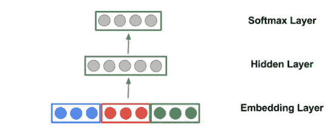
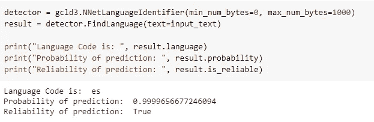
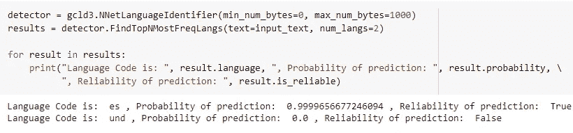
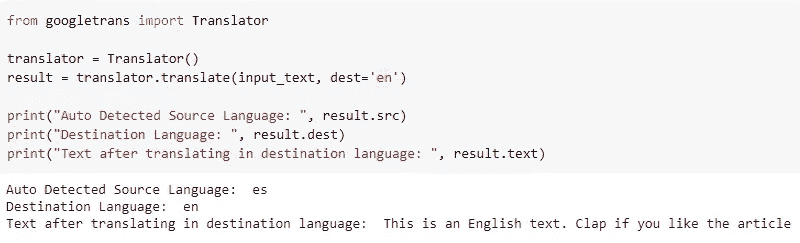

# 用 Python 开发语言翻译系统

> 原文：<https://towardsdatascience.com/develop-a-text-language-detector-and-translator-system-in-python-6537d6244b10?source=collection_archive---------17----------------------->

## 想知道语言检测和翻译系统是如何工作的，使用开源 Python 库用几行代码就可以开发出同样的系统



图片由[皮克斯拜](https://pixabay.com/?utm_source=link-attribution&amp;utm_medium=referral&amp;utm_campaign=image&amp;utm_content=110777)的 Gerd Altmann 提供

文本语言识别是指预测给定文本的语言的过程，而文本翻译是指将给定文本从一种语言翻译成另一种语言的过程。在自然语言处理项目中，我们经常会遇到这样的情况:文本的语言是未知的，或者给定文本文档的语言根据我们的需要而变化。因此，检测文本并将其翻译成另一种语言本身就是一项任务。

在本文中，我们使用了 google 的一些开源库来检测文本的语言，并将其翻译成我们想要的语言。

# Google Compact 语言检测器 v3:



(图片由作者提供)，谷歌翻译 UI

Google Compact Language Detector v3 也称为 **Google CLD3** 是一个基于神经网络的语言识别库。该软件包包含一个经过训练的模型，可以直接用来识别给定文本的语言。目前，它支持约 107 种语言，并预测 BCP 47 风格的语言代码的输出语言。



(图片由作者提供)，一些语言代码

## 引擎盖下的 CLD3:

CLD3 包包含一个推理代码和一个经过训练的神经网络模型。这个包从输入文本中提取 n-grams 字符串，并计算它在文本中的出现频率。

例如，对于给定的字符串“banana”，唯一的单字是:“b”、“a”、“n”。双字是:“把”、“那”、“安”，三字是:“班”、“阿那”、“南”。



(图片由作者提供)，输入文本的 n 元语法:“香蕉”

然后，n 元文法被散列成一个 id，每个 id 由一个密集的向量嵌入来表示，作为训练的输入。

> [神经网络架构:](https://github.com/google/cld3)
> 
> 为了获得输入文本的语言预测，我们简单地通过网络执行一个正向传递。该模型根据分数平均对应于每个 ngram 类型的嵌入，并且平均的嵌入被连接以产生嵌入层。网络的其余组件是一个隐藏(校正线性)层和一个 softmax 层。



([来源](https://github.com/google/cld3/blob/master/model.png))，建筑

## 安装:

CLD3 包可以从 PyPl 安装，使用:

```
**!pip install gcld3**
```

## 用法:

*   **初始化:**安装 CLD3 库后，使用该库的`**NNetLanguageIdentifier()**`函数初始化文本识别的对象。

```
**import gcld3****detector = gcld3.NNetLanguageIdentifier(min_num_bytes=0, max_num_bytes=1000)**
```

> ***对于给定的输入文本:*" Este es un texto en inglés . APL auda si te gusta El artículo "**

*   **单一语言预测:**使用检测器对象预测给定输入文本的最可能语言及其预测概率和可靠性。



(图片由作者提供)，使用 CLD3 预测单一语言的代码

*   **前 N 个预测语言:** CLD3 还具有预测 N 个最有可能的语言列表及其相应概率得分的功能。



(图片由作者提供)，使用 CLD3 预测前 N 名语言的代码

# 谷歌翻译:


图片来自 [Pixabay](https://pixabay.com/?utm_source=link-attribution&amp;utm_medium=referral&amp;utm_campaign=image&amp;utm_content=110777) 的 [Gerd Altmann](https://pixabay.com/users/geralt-9301/?utm_source=link-attribution&amp;utm_medium=referral&amp;utm_campaign=image&amp;utm_content=110777)

Googletrans 是一个实现 Google Translate API 的开源 Python 库。它非常快速可靠，实际上它使用的服务器与 translate.google.com 使用的服务器相同。Googletrans 具有自动语言检测功能，因此不需要指定输入文本的语言。

*   它使用 [Google Translate Ajax API](https://translate.google.com/) 来调用方法进行检测和翻译。
*   Googletrans 对单个文本的最大字符限制是 15k。

## 安装:

Googletrans 包可以从 PyPl 安装，使用:

```
**pip install googletrans**
```

## 用法:

*   **初始化:**安装 Googletrans 库后，使用该库的`**Translator()**`函数初始化文本翻译器的对象。
*   **翻译:** Googletrans 有一个`**translate()**` 功能，可以将输入的文本翻译成想要的语言。如果没有给出源语言，google translate 会尝试检测源语言。



(图片由作者提供)，使用 Googletrans 进行翻译的代码

# 结论:

在本文中，我们讨论了如何使用 Google 的 CLD3 库识别给定文本的语言，以及如何使用 Googletrans 库将文本翻译成所需的语言。Googletrans 库也有检测文本语言的功能。

# 参考资料:

[1] Google CLD3 文档:[https://pypi.org/project/pycld3/](https://pypi.org/project/pycld3/)

[2] Googletrans 文档:【https://pypi.org/project/googletrans/ 

> 感谢您的阅读