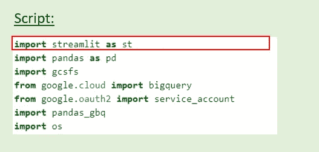
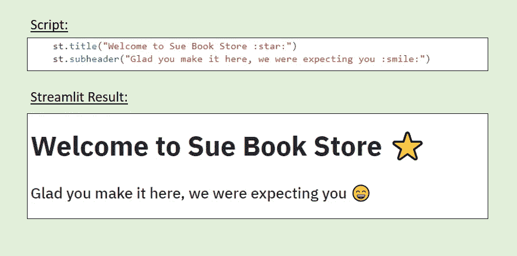
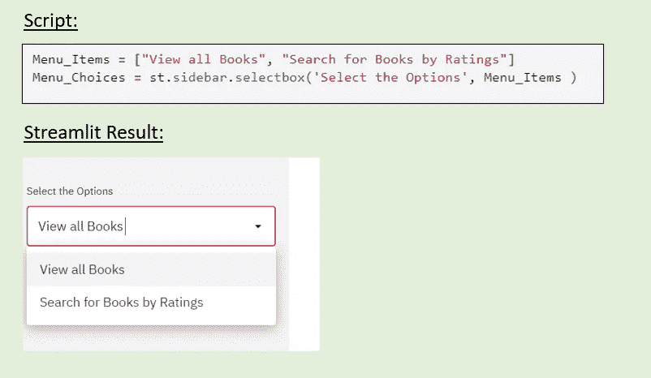
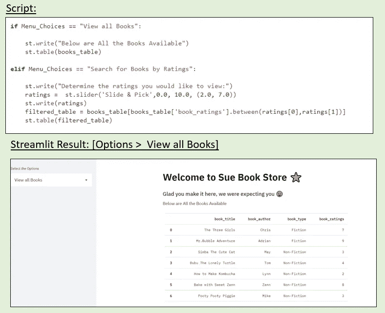
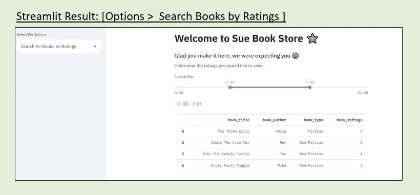
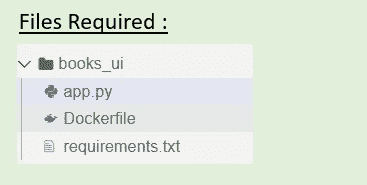
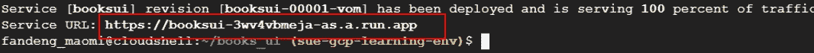

# 使用 Streamlit 为微服务开发交互式 UI

> 原文：<https://towardsdatascience.com/develop-an-interactive-ui-for-a-microservice-using-streamlit-5f8ef59edadd?source=collection_archive---------19----------------------->

## 将您的 python 微服务立即转变为交互式仪表盘


照片由[西格蒙德](https://unsplash.com/@sigmund)拍摄自 [Unsplash](https://unsplash.com/)

## **总结精简**

Streamlit 是一个开源应用程序框架，是数据科学家中一个受欢迎的工具，因为它可以帮助他们快速将开发部署到交互式 GUI /仪表板中。此外，如果您了解 python，实现 Streamlit 并不复杂，只需要投入少量时间来拿起这个工具并开始使用它。

## **概述**

在本文中，我们将在 Google Cloud Run 上部署一个微服务，它将拥有一个使用 python 和 Streamlit 创建的交互式仪表盘。如果你想看原始脚本，可以在 [Github](https://github.com/iamsuelynn/Microservice-using-Streamlit-1) 上找到。

**(1)让我们从准备 Streamlit 应用程序代码开始— *(app.py)***

我们需要导入我们的应用程序将要使用的 python 包。为了让 streamlit 工作，我们需要添加“导入 Streamlit”。



需要导入模块

接下来，我们将准备应用程序的主体，它由 python 函数和 Streamlit 代码组成，这些代码决定了界面上将显示什么。让我们从添加标题、副标题和表情符号开始。



Streamlit:标题、副标题、表情符号

*   **主标题**:适用于定义申请的主标题。
*   **st.subheader** :可以使用的合适标题级别(另一个标题级别将是 **st.header** )。
*   这种方法可以用来给 Interface⭐️.添加表情符号

现在我们已经定义了标题和副标题，让我们在界面的左侧添加一个下拉菜单，这样用户就可以选择了。在本例中，我们将提供 2 个选项供用户选择。



Streamlit:侧栏

*   **st.sidebar** :将我们的小部件钉在左边。
*   **st.sidebar.selectbox** :侧边栏上的下拉菜单，供用户选择选项。

随着选择选项的实施，我们将需要包括导航逻辑，如果用户选择选项**“查看所有书籍”**，将打印所有书籍的表格，如果用户选择选项**“按评级搜索书籍”**，将显示一个交互式滚动条，用户可以按评级查看书籍。这里我们将使用 if…elif 条件。



Streamlit:打印表格

*   **st.write** :可用作瑞士军刀打印文本/变量。
*   **st.table** :打印一个静态表格，整个表格将被打印到屏幕上。打印数据框架表的另一种方法是使用 **st.dataframe** 。



流线:滑块

*   **st.slider** :允许通过使用滑块传递 2 个元素来选择数值范围。

我们就快成功了，主应用程序脚本已经完成，现在我们可以将微服务部署到 Google Cloud Run 上了。

**(2)准备所需的库—*(requirements . txt)***

*   在 requirements.txt 文件中添加“streamlit”

我们需要在 requirements.txt 文件中添加 Streamlit 库，Docker 容器用它来安装这里列出的包。

```
# File: requirements.txt google-api-core
google-cloud-bigquery
pandas
pandas-gbq
gcsfs
**streamlit**
```

**(3)在 Dockerfile 中添加运行我们的 Streamlit 应用程序的命令— *(Dockerfile)***

当我们在 Google Cloud Run 上部署微服务时，我们需要使用 docker 将应用程序容器化。为了运行应用程序，需要在***docker 文件*** 中添加命令“streamlit run”。如果你想了解更多关于 Docker，[你可以参考他们的文档](https://docker-curriculum.com/)。

```
CMD streamlit run --server.port 8080 --server.enableCORS false app.py
```

*你也可以参考 Github 上完整的*[*docker file*](https://github.com/iamsuelynn/Microservice-using-Streamlit-1/blob/main/Dockerfile)*。*

**(4)部署应用&看看我们最后的结果！**

我们将在 Google Cloud Run 上部署我们的应用程序，这是一个无服务器环境平台。为了成功地将我们的应用程序部署到 Google Cloud Run，我们需要构建 docker 映像并将该映像推入 Google Cloud Registry。构建完成后，我们可以在 Cloud Run 上部署新构建的映像。在构建 docker 映像之前，请确保您拥有部署应用程序所需的文件。



构建 Docker 映像所需的文件

下面是在 Google Cloud Run *上部署我们的应用程序的命令(您可以在 Cloud Shell 上运行脚本)*:

```
# Set the Region 
gcloud config set run/region asia-southeast1#Build a new Docker Image
gcloud builds submit --tag gcr.io/sue-gcp-learning-env/books_ui#Deploy the Image
gcloud run deploy --image gcr.io/sue-gcp-learning-env/books_ui --platform managed
```

成功部署后，您可以通过提供的 URL 地址访问应用程序*(您也可以从您的云运行实例中检索链接)*。



完成部署后的应用程序 URL

以下是我们部署的采用 Streamlit 接口的微服务的外观:

简化界面

**结论:**

在本文中，我们将学习如何使用 Streamlit 创建交互式微服务。一个具有*选择选项*、*在表格中打印结果、添加表情符号和使用滑块过滤值*功能的界面。还有更多的你可以用 Streamlit 实现的，本文没有涉及到，比如[进度条](https://docs.streamlit.io/en/stable/getting_started.html#show-progress)、[地图绘制](https://docs.streamlit.io/en/stable/getting_started.html#plot-a-map)、[绘制图表](https://docs.streamlit.io/en/stable/getting_started.html#draw-charts-and-maps)等。我建议你花点时间玩玩 Streamlit，因为我玩得很开心！查看您开发的产品并与之互动是一件有趣的事情。我也希望这篇教程对学习使用 Streamlit 的人有用。如果你有任何问题或者你可能感兴趣的教程，请在评论中告诉我！

**参考和链接:**

[1][https://www . analyticsvidhya . com/blog/2020/10/create-interactive-dashboards-with-streamlit-and-python/](https://www.analyticsvidhya.com/blog/2020/10/create-interactive-dashboards-with-streamlit-and-python/)

[2][https://raw . githubusercontent . com/omnidan/node-e moji/master/lib/e moji . JSON](https://raw.githubusercontent.com/omnidan/node-emoji/master/lib/emoji.json)

[3][https://docs.streamlit.io/en/stable/](https://docs.streamlit.io/en/stable/)

[https://docs.streamlit.io/en/stable/api.html#display-text](https://docs.streamlit.io/en/stable/api.html#display-text)

[https://docs.docker.com/](https://docs.docker.com/)