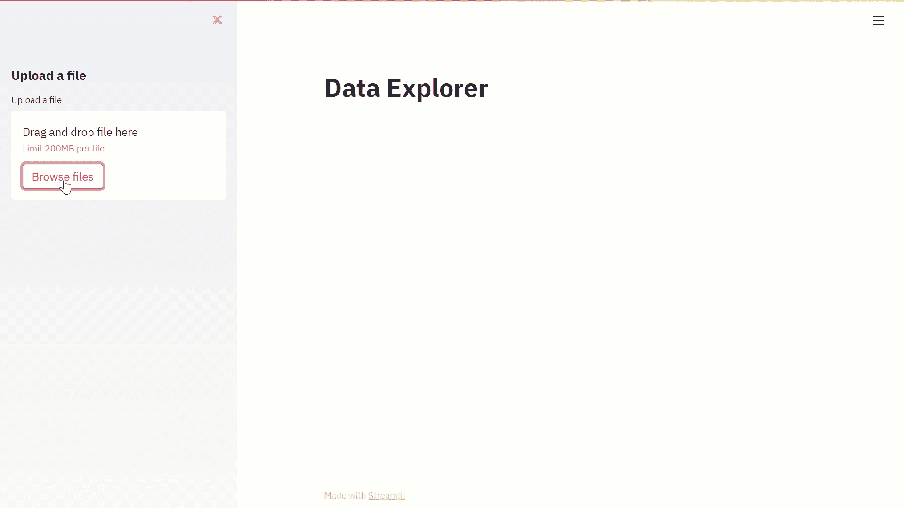
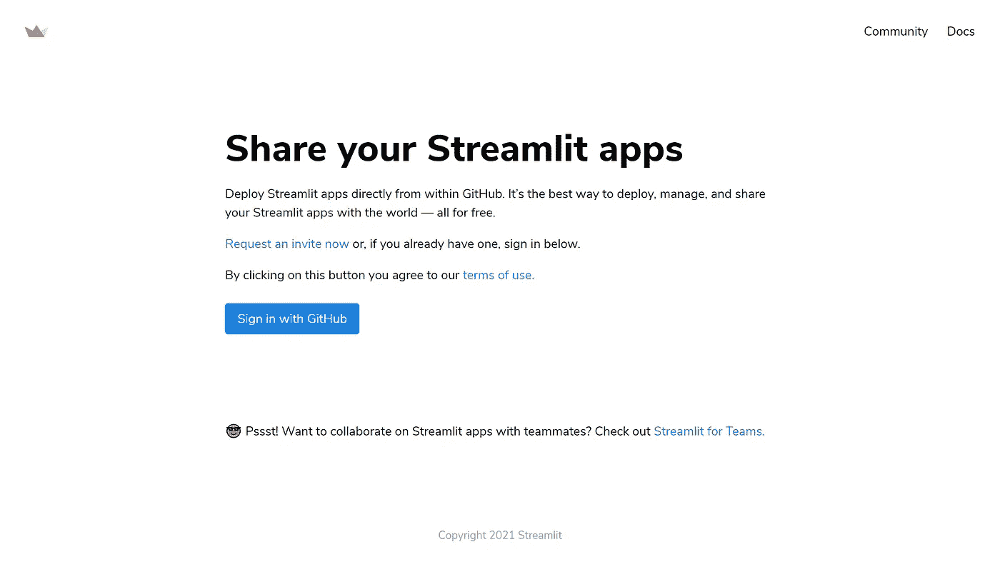
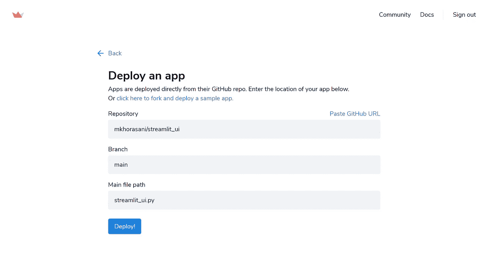
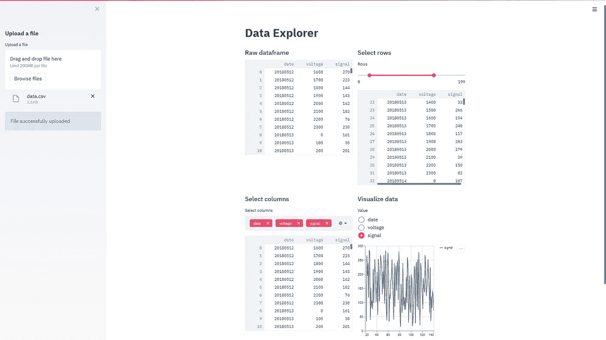

# 用 Python 在 15 分钟内开发和部署一个 UI

> 原文：<https://towardsdatascience.com/develop-and-deploy-a-ui-with-python-in-under-15-minutes-f92e289f754b?source=collection_archive---------23----------------------->

## Streamlit:使应用开发民主化并赋予程序员权力



作者视觉。

## 介绍

我已经做了 14 年的程序员，其中有整整 6 年都是以这样或那样的方式围绕 Python 展开的。作为一名软件开发人员，我已经非常依赖 Python，并虔诚地在工作的各个方面使用它的优点。在那段时间里，我目睹了同事们在我带着熊猫跑在前面的时候被 Excel 卡住了。我观察到一些同事使用糟糕的鼠标记录器来模仿重复的 web 抓取任务，而我为此派出了 Selenium。当我让 Numpy 工作时，我看着同学们在他们的(不)科学计算器上单调乏味地输入一个又一个数组。

然而，我渴望的一件事是能够以图形方式将我的软件展示给全世界，而不是通过命令提示符与它交互。在你使用 PyQt，Tkinter，Flask 或者 Django 之前，我可以说，你已经做到了。虽然这些“遗留”UI 绑定中的每一个都做出了巨大的努力来弥合这一差距，但它们中没有一个真正适合我们这些 Python 忠实者。作为一名 Python 程序员，我几乎可以在后台创造奇迹，但我不能编写 HTML 或 CSS 来拯救我的生命。所以这是事情的前端。我需要的是一个纯 Python 工具包，它可以在我的指尖呈现一个用户界面。然后出现了细流。

## 细流

这是一个不引人注意的夜晚。我正要打瞌睡，但就在那之前，我的电话响了。经检查，我意识到这只不过是另一个讨厌的电子邮件广告。这是一个关于用 Python 构建 web 应用程序的课程，虽然我起初有所保留，但我决定进一步研究。我很高兴我这样做了，否则我今天不会在这里告诉你 Streamlit 是一个多么改变游戏规则的东西！

Streamlit 是一个纯粹的 Python web 框架，几乎填补了 Python 程序员的应用开发空白。这是一个健壮的、可伸缩的 API，学习曲线非常浅，将开发时间从几周减少到几分钟，真的。尽管它被标榜为机器学习和数据科学应用的框架，但事实上这并不明显，因为许多人(包括我自己)已经利用 Streamlit 创建了优雅的通用应用程序。凭借 Streamlit 及其最新功能— [组件](https://www.streamlit.io/components)，极限就是你想象的天花板。

## 用户界面开发

在这里，我将向您展示如何开发和部署您自己的 **Data Explorer** UI。首先，启动 Anaconda 并在您的环境中安装 Streamlit。或者，您可以在 Anaconda 提示符下运行以下命令。

```
pip install streamlit
```

接下来，在刚刚安装 Streamlit 的相同环境中启动您选择的 Python IDE。现在，让我们创建一个简单的用户界面，用户可以上传数据集，改变数据，并同时将其可视化。

继续导入必要的包:

```
import streamlit as st
import pandas as pd
```

为您的用户界面创建标题:

```
st.title('Data Explorer')
```

现在创建一个侧边栏，我们可以在其中创建一个文件上传器小部件:

```
st.sidebar.subheader('Upload a file')uploaded_file = st.sidebar.file_uploader("Upload a file")if uploaded_file is not None:  
    df = pd.read_csv(uploaded_file)
```

下面我们创建一个 info 小部件，通知用户文件已经成功上传:

```
st.sidebar.info('File successfully uploaded')
```

让我们将主页分成两个等间距的栏:

```
col1, col2 = st.beta_columns(2)
```

现在让我们在第一列中将上传的文件显示为数据帧:

```
with col1:
   st.write(df)
```

如果您想改变列，可以使用 multiselect 小部件删除不必要的列，如下所示:

```
with col2:
   columns = list(df.columns)
   columns_sel = st.multiselect('Select columns',columns,columns)
   df = df[columns_sel]
   st.write(df)
```

现在，您可能想要修改数据框中的行数:

```
start, stop = st.slider('Rows',0,len(df)-1,[0,len(df)-1],1)
df = df.iloc[start:stop]
st.write(df.iloc[start:stop])
```

对数据框架进行变异后，是时候对其进行可视化了，但在此之前，您首先需要借助单选按钮选择您希望绘制图表的列:

```
value = st.radio('Select column',columns_sel)
```

继续可视化你的数据框架:

```
df = df[value]
st.line_chart(df)
```

完整的源代码如下:

没错，你没看错，这是一段庞大的 **26** **行**代码(不含空格)。

要在本地运行您的 UI，请在 Anaconda 提示符下键入以下命令。首先，将根目录更改为保存源代码的位置:

```
cd C:/Users/...
```

然后键入以下内容运行您的应用程序:

```
streamlit run file_name.py
```

## 云部署

如果你不能把一个优雅的 UI 部署到云上让全世界看到，那它是什么？在你考虑 AWS、Azure、GCP 或 Heroku 之前，不，只是不。不是说没有人喜欢 IaaS 或 PaaS 提供商，而是有了 Streamlit 的**一键式部署**，生活从未如此简单。

首先将你的代码推送到一个公共的 GitHub 库，然后前往 [Streamlit sharing](https://www.streamlit.io/sharing) ，注册并链接你的 GitHub 账户，如下所示:



图片作者。

选择相关的存储库和脚本，然后点击 **Deploy！**



图片作者。

## **结果**

现在你有了它，一个优雅的、高度交互的、云可部署的用户界面就在你的指尖，用了 **26 行**代码和 **15 分钟**的工作！如果你发现自己处于和我之前相似的困境，那么考虑参加一个在线课程，比如 Coursera 的[**Streamlit Guided Project**](https://click.linksynergy.com/deeplink?id=hOGDdF2uhHQ&mid=40328&murl=https%3A%2F%2Fwww.coursera.org%2Fprojects%2Fdata-science-streamlit-python)。这是一项有价值的投资，会让你很快上手。



图片作者。

如果您想了解更多关于数据可视化和 Python 的知识，请随时查看以下(附属链接)课程:

## 使用 Streamlit 开发 Web 应用程序:

<https://www.amazon.com/Web-Application-Development-Streamlit-Applications/dp/1484281101?&linkCode=ll1&tag=mkhorasani09-20&linkId=a0cb2bc17df598006fd9029c58792a6b&language=en_US&ref_=as_li_ss_tl>  

## 使用 Python 实现数据可视化:

<https://www.coursera.org/learn/python-for-data-visualization?irclickid=xgMQ4KWb%3AxyIWO7Uo7Vva0OcUkGQgW2aEwvr1c0&irgwc=1&utm_medium=partners&utm_source=impact&utm_campaign=3308031&utm_content=b2c>  

## 面向所有人的 Python 专业化:

<https://www.coursera.org/specializations/python?irclickid=xgMQ4KWb%3AxyIWO7Uo7Vva0OcUkGQgW16Ewvr1c0&irgwc=1&utm_medium=partners&utm_source=impact&utm_campaign=3308031&utm_content=b2c>  

## 简化导向的项目:

<https://www.coursera.org/projects/data-science-streamlit-python?irclickid=xgMQ4KWb%3AxyIWO7Uo7Vva0OcUkGQgTzrEwvr1c0&irgwc=1&utm_medium=partners&utm_source=impact&utm_campaign=3308031&utm_content=b2c>  

## GitHub 资源库:

<https://github.com/mkhorasani/streamlit_ui>  

# 新到中？你可以在这里订阅和解锁无限文章[。](https://khorasani.medium.com/membership)