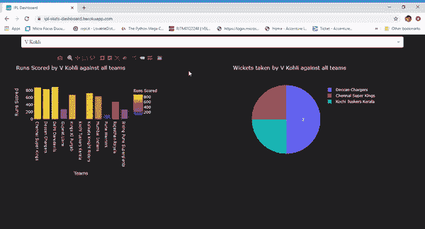
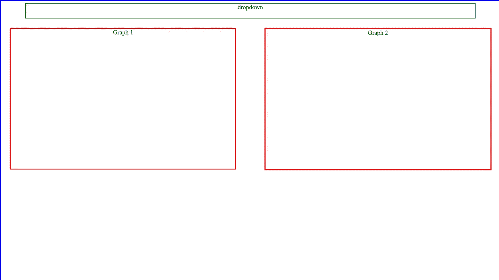
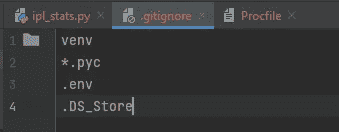
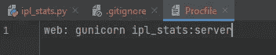
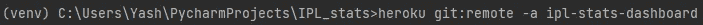

# 使用 Python Dash 开发和部署交互式仪表盘

> 原文：<https://towardsdatascience.com/develop-and-deploy-interactive-dashboards-using-python-dash-66a7e4873429?source=collection_archive---------6----------------------->

## Dash 框架使用指南。


Artem Podrez 在[的照片](https://www.pexels.com/video/a-businesswoman-making-a-presentation-5725962/)

**破折号简介**

Plotly 提出了一个名为 Dash 的新框架，允许用户使用 plotly express 提供的可视化功能创建交互式仪表盘。Dash 核心组件用作每个应用程序的构建模块，在属性方面非常详尽。您可以立即用它为您的 Python 应用程序添加一个界面。

【Dash 入门

例如，我们正在构建一个简单的仪表板，通过图表显示每个球员的 IPL 统计数据(得分、击球次数)。这将让你对应用 Python dash 框架有一个基本的了解，这个框架可以进一步扩展。你可以从[这里](https://www.kaggle.com/patrickb1912/ipl-complete-dataset-20082020/download)下载 IPL 数据集。



作者在 [Heroku](https://ipl-stats-dashboard.herokuapp.com/) 上的图片

你需要确保你的机器上安装了 dash，plotly 和 pandas 库。如果没有，您可以通过在命令提示符下将 CD 放入 python 安装文件夹，或者如果您正在使用 Anaconda，只需打开 Anaconda 提示符并执行下面的行。

```
pip install dash
pip install plotly
pip install pandas
```

Dash 将是 3 个库中最突出的，因为它将有助于在浏览器上呈现仪表板。Plotly 将用于创建图形。最后，我们将使用 pandas 进行数据操作。

除此之外，你还需要非常基本的 HTML 和 CSS，你可以像我一样随时随地学习。

**创建仪表板框架**

好吧，那我们开始吧。让我们首先在仪表板上创建我们的部分(HTML div ),在那里我们将为我们的应用程序放置 dash 组件。我们需要在顶部的仪表板下拉列表的一个部分和显示仪表板图表的两个平行部分。除此之外，我们将把每个部分封装成一个大的部分，这个大的部分将包含我们完整的视口。



作者图片

```
import dash
import dash_core_components as dcc
import dash_html_components as html
import pandas as pd
from dash.dependencies import Input, Output
import plotly.express as pxapp = dash.Dash(__name__)
app.title = "IPL Dashboard"#Creating a section to place our dropdown 
dropdown_box = html.Div(
children = ["dropdown", dcc.Dropdown()], #dash dropdown elementstyle = {'width': '90%', "position": "fixed", "left": "5%",
         'display': 'inline-block', 'height':"5%", "top": "1%", 
         'z-index':'1', 'border': '2px solid green', 
         'text-align': 'center'}
)#Creating a section to place our graphs Graphs = html.Div(children = [
html.Div(children = ["Graph 1", dcc.Graph()], #dash graph elementstyle = {'width': '45%', "position": "fixed", "left": "2%",
         'display': 'inline-block', 'text-align': 'center',
         'top': '10%', 'border': '2px solid red', 'height':'50%'}
),html.Div(children = ["Graph 2", dcc.Graph()], #dash graph elementstyle = {'width': '45%', 'position': 'fixed', 'left': '53%',
         'display': 'inline-block', 'text-align': 'center',
         'top': '10%', 'border': '3px solid red', 'height':'50%'}
)])#creating and adding the main html div which encapsulates all elements on the viewportapp.layout = html.Div(id ="main_div", children=[input_box, Graphs],style = {'background-color': '#FFFFFF', 'padding':'0',           
         'width':'100%', 'height':'100%', 'position': 'fixed',
         'top': '0%', 'left': '0%', 'bottom': '0%', 'height':'100%',
         'border': '2px solid blue'}
)if __name__ == "__main__":
    app.run_server(debug=False, port = 8080)
```

**向仪表板添加交互性**

现在 dashboard 的框架已经准备好了，让我们来创建它的灵魂，使它具有交互性。首先，我们需要为所有的 dash 组件添加一个`id`属性。这将为每个组件提供一个唯一的标识符，该标识符将用于在仪表板上获取输入和显示输出。除此之外，我们将使用更多的下拉属性，如 clearable、placeholder、value 和 options。你可以在这里查看 dash 核心部件[的所有可用属性](https://dash.plotly.com/dash-core-components/dropdown)。

为了增加交互性，dash 提供了一个回调函数，允许我们与仪表板上的组件进行交互。回调函数使用 dash dependencies 类接收输入并抛出输出。我们可以使用每个仪表板组件的`id`和`property`属性从仪表板获取多个输入，同样也可以使用相同的属性呈现输出。我们将在代码中详细看到这一点。限制是— *只能有一个回调函数*。然而，我们可以在这个回调函数中调用多个函数。
因此，我们定义了两个函数来绘制 plotly 图形。我们将从回调函数中调用这些函数。

那么，现在让我们看看如何在 Python 中应用同样的方法。

我们对 CSS 中的框架版本做了一些修改，以增强外观，比如移除边框、改变背景颜色等。

**在 web 上部署仪表板:**

有多种方法可以在网络上部署这个 dash 应用程序。然而，我们同样选择了 Heroku。为此，你需要以下的东西。

1.Git 上的帐户([注册](https://github.com/signup))。

2.Git bash 安装在您的机器上。

3.Heroku 账号([注册](https://signup.heroku.com/))

4.从[这里](https://devcenter.heroku.com/articles/heroku-command-line)下载 Heroku CLI。

5.可选但有用— Pycharm/Visual Studio 安装在您的计算机上。

设置好上述资源后，请按照下面的步骤操作。

*   登录 Heroku，点击- *创建新应用*。
*   为您的应用命名，然后点击- *创建应用*。
*   现在，您需要在 Pycharm/Visual Studio 中创建新项目，万一您没有，也不用担心。您只需要创建一个文件夹，并将我们将在后续步骤中创建的文件放在该文件夹中。
*   打开项目路径，将`.py`文件添加到项目文件夹中。这个文件将包含所有的 Python 代码。
*   在你的。py 文件下`app = dash.Dash(__name__)`添加这一行:`server = app.server`
*   打开终端/命令提示符，并光盘到您的项目文件夹。
*   Pip 安装您的特定版本的所有库。py 文件需要运行。

```
pip install pandas==1.2.0
pip install plotly==4.8.0
pip install dash==1.12.0
pip install gunicorn==20.0.4 #Required to run app on Heroku.
```

*   在项目文件夹中创建一个文件，命名为`.gitignore`。



作者图片

*   在项目文件夹中创建一个文件，将其命名为`Procfile`，并将这一行添加到其中`web: gunicorn YourPythonFileNameWithoutPy:server`



作者图片

返回终端/命令提示符，运行以下命令。

*   pip 冻结> requirements.txt
*   heroku 登录
*   git 初始化
*   heroku git:remote-a yourhoku appname



作者图片

*   git 添加。
*   git commit -am“初始启动”
*   饭桶推 heroku 主人

恭喜你！！！您已经在 web 上部署了 Dash 应用程序。您可以共享 Heroku 应用程序 URL，以便向任何人展示该应用程序。这提供了一个不可思议的解决方案来显示报告或给你的 Python 程序一个用户/客户可以与之交互的接口。

快乐编码，享受乐趣，保持健康。如果你在应用它时遇到任何问题，我只是一个评论。