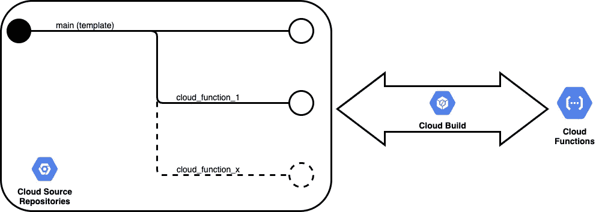
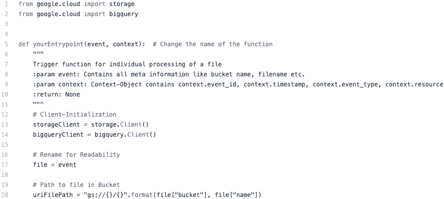
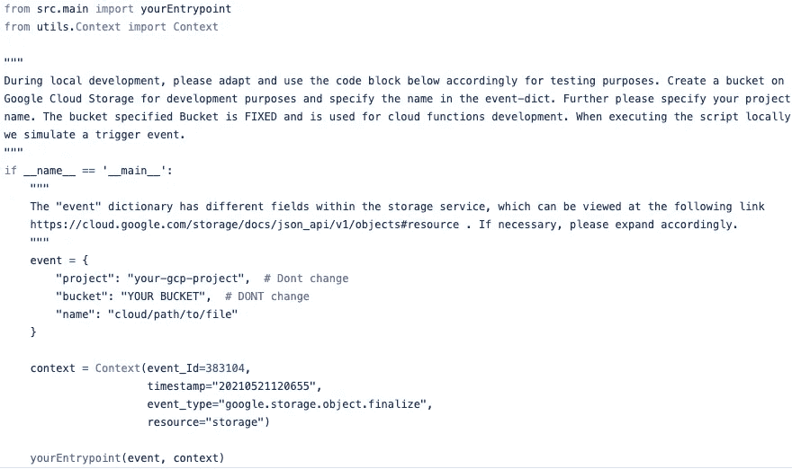
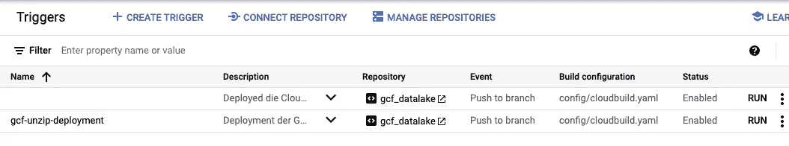

# 在本地开发和测试谷歌云功能并进行部署

> 原文：<https://towardsdatascience.com/develop-and-test-google-cloud-functions-locally-and-deploy-7908d6573f9d?source=collection_archive---------14----------------------->

## 管理、开发和部署 Google 云功能的简单设置和模板

[天空工作室](https://unsplash.com/@skyestudios)在 [Unsplash](https://unsplash.com/) 拍摄的照片

我想在这里描述一下我和我的队友 [Crosi](https://medium.com/u/a322d824778c?source=post_page-----7908d6573f9d--------------------------------) 是如何找到一种方法，让我们在本地开发谷歌云功能，然后使用谷歌构建服务以自动化的方式部署它们。我们已经阅读了无数的文献，现在想在这里整理我们的发现。

目前，我们正致力于建立一个数据湖。我们当时试图找到一种方法，让我们能够开发谷歌云功能，处理来自谷歌云存储的文件。Google 允许在 Google 代码编辑器的 web 界面上编写云函数。然而，它缺少像 PyCharm 这样的普通 IDE 那样的琐碎功能。*无代码完成。没有警告。部署前没有本地测试/执行。我们想要面对这些问题。*

## 先决条件

你的电脑应该安装了 Google Cloud SDK 和 git。我假设你对[谷歌云功能](https://cloud.google.com/functions/docs/how-to)有基本的了解。

我想介绍以下工作流程，并指导您如何建立它。在克隆了我们的模板库之后，你可以在每个新的分支上创建你自己的云函数。每个分支代表一个云函数。之前可以在本地测试或者运行这个云功能。一旦开发完成，使用 Google Cloud Build 服务将这个云功能部署到 Google Cloud Function 服务中。可以说，您的开发与所提供的功能直接相关。未来对云功能分支的每一次推动都会导致云功能的自动重新部署。

目标开发工作流程。您的回购中的每个分支都是一个特定的云功能，将使用云构建进行部署。

# 步伐

## 可选:设置本地 GCP 开发的自动身份验证

如果您 ***没有*** 为本地开发生成密钥文件，请执行以下步骤。

1.  打开你的命令行。
2.  用 *gcloud* : `gcloud config set project your-project-name`切换到当前项目
3.  用 *gcloud* 允许本地开发并生成一个密钥文件:`gcloud auth application-default login`
4.  弹出一个窗口。确认一切。 *gcloud* 现在生成一个 JSON 格式的密钥文件，我们的应用程序通过这个文件自动验证自己的 GCP。所以**代码中不需要指定**凭证！

## 使用我们的回购作为模板

<https://github.com/raki2305/gcp_cloudfunction_dev>  

1.  克隆我们的[库](https://github.com/raki2305/gcp_cloudfunction_dev)并在 [Google 云资源库](https://source.cloud.google.com/)上设置它
2.  克隆您刚刚创建的*云存储库*。

现在用`git branch your-function-name`和 checkout 为每个未来的云功能创建一个单独的分支。

在 *src/* 下，你会发现一个 *main.py* 文件和一个 *requirements.txt* :

*   *main.py* 包含了你未来的云功能。
*   开发完云功能后，在 *requirements.txt* 中指定所有使用的包。

**这是 main.py，你可以单独编辑。**

在 *utils/，*下你会找到一个 *main_local.py* 。您可以使用该文件来模拟触发器。请注意文件中的注释。

这是 main_local.py，用于通过执行这个脚本来模拟触发器。

在 *config/，*下，你会发现一个 *cloudbuild.yaml* 文件，它使用 [Google Cloud Build](https://console.cloud.google.com/cloud-build) 服务自动部署云功能。替换相应的占位符。请注意文件中的注释。你的云函数开发完成后，就可以直接推送到你的 git 了。

## 使用云构建服务进行部署

云构建用于设置 CI/CD 管道。在左侧的 [Google Cloud Build](https://console.cloud.google.com/cloud-build) 服务中，单击“触发器”,然后单击“创建触发器”。

请相应地填写所有内容:

*   在*节事件*中，请选择“推送至分支”。
*   在*部分，来源*请参考你的云储存库和包含你的云功能的分支。

在截面配置中:

*   Type = "云构建配置文件(yaml 或 json)"
*   location =/config/cloud build . YAML

最后点击“创建”。

下面是一个创建的触发器的例子，您也可以通过单击“运行”来手动运行它。

**注意:**每次推送至指定分支，云功能自动部署。

# 结论

现在你可以为每个云函数创建一个新的分支。在这个分支中，您可以开发与其他云功能相隔离的云功能。通过 *main_local.py* 你可以在之前执行它。通过 push 命令上传的云功能的每次更新都会重新部署云功能。

如有疑问，欢迎留言评论。