# 使用短期凭证在 AWS 中开发

> 原文：<https://towardsdatascience.com/develop-in-aws-using-short-lived-credentials-6045069a1997?source=collection_archive---------11----------------------->

## 了解如何快速、免费、安全地刷新 AWS 访问会话，而无需为较小的环境建立联盟

我曾经在亚马逊网络服务公司( [AWS](https://aws.amazon.com/) )担任安全顾问。我们的众多职责之一是确保客户和我们自己的 [DevOps](https://www.redhat.com/en/topics/devops) 和数据科学家团队使用短期凭证。对于我们的许多初级会员和新客户来说，这通常是一项艰巨的任务。这是因为客户刚刚起步，没有完全的[身份联盟](https://aws.amazon.com/blogs/security/aws-federated-authentication-with-active-directory-federation-services-ad-fs/)。在许多情况下，我见过拥有长期证书的开发人员使用标准的静态 IAM 密钥，这些密钥肯定不会每天轮换。

为了满足这一需求，您可以利用 AWS 的一个免费解决方案，称为单点登录(SSO)。您不必担心将生产身份解决方案(如 Active Directory)混合在一起。对于较小的任务，您可以简单地在您的开发或登台环境中部署和使用它。使用我将要向您展示的方法将帮助您让您的网络安全团队更加快乐。

注意:在我们继续之前，我鼓励您使用您自己的 AWS 帐户关注我，以便您对正在发生的事情以及为什么要阐述我的观点有一个战术上的感觉。**继续登录您的 AWS 帐户，让我们开始吧！**

# 为短期编程凭据启用 SSO

即使我们没有外部的 IdP 用于联合，我们仍然可以使用我们自己的 IAM 用户在 SSO 自己的目录服务中集成 SSO。这将要求我们使用 MFA，因为我们为用户设置了 [MFA](https://docs.aws.amazon.com/singlesignon/latest/userguide/enable-mfa.html) 。默认情况下，该角色将持续一个小时。根据您希望重新进行身份认证的频率，您可以随时将此时间更改为 2-4 小时。它将与我们的 [AWS CLI](https://aws.amazon.com/cli/) v2 集成，供我们以后使用。这样，我们就不再需要使用默认凭据了！

**注意**:我们不要求您删除您的静态长期凭证，这些凭证已通过“aws configure”配置为您的默认配置文件。但是，出于生产环境和安全性的原因，您应该通过再次运行 aws configure 并使用假值来这样做，并且始终使用我们将创建的 SSO 概要文件。

启用 AWS SSO。如果出现提示，请启用 AWS 组织并将此帐户设置为您的 root 帐户。在开始之前，建议 t(但**可选** ) 您自定义您将通过选择底部的“自定义”按钮登录以进行身份验证的 SAML 凭据 URL:


AWS SSO 服务控制板

从“选择您的身份源”开始。我们将尽可能启用 MFA，因此提示用户使用 MFA。作为一个好的媒介，让我们通过选择配置来使用“上下文感知”模式:

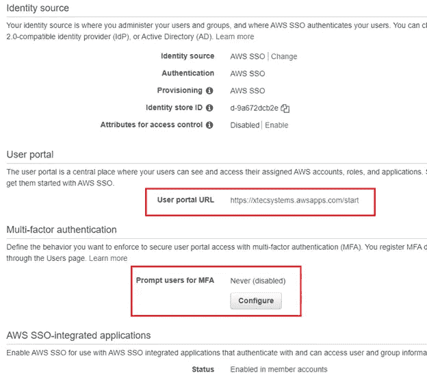

MFA 的 SSO 配置和您的自定义门户 URL

设置上下文感知模式，并允许使用内置授权码和授权码应用程序。要求注册也是一种最佳做法，但是您可以根据自己的喜好进行设置:

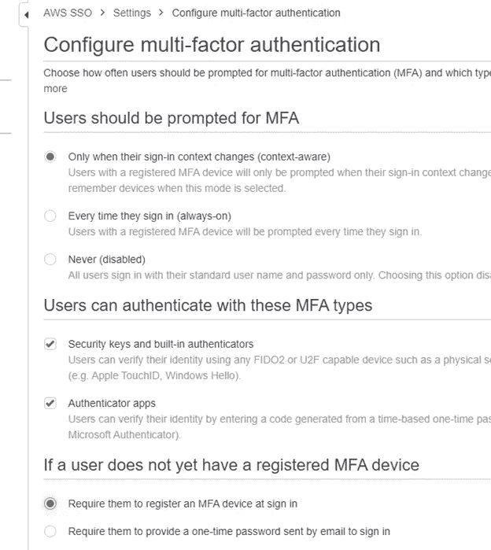

AWS SSO MFA 的选项

使用面包屑返回到您的 AWS SSO 主菜单，然后选择“管理对您的 AWS 帐户的 SSO 访问”。接下来，选择权限集:

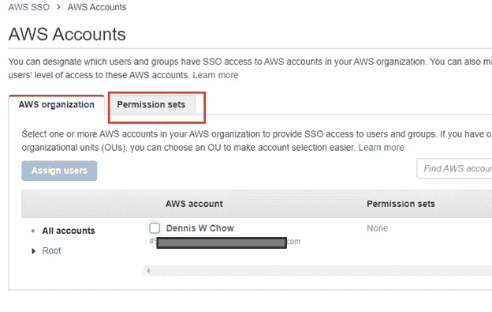

为您的目录帐户设置 AWS SSO 权限集

选择“权限集”后，继续根据“现有工作职能策略”创建一个新的权限集:

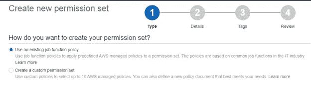

按工作职能创建 AWS SSO 权限集

选择“AdministratorAccess ”,因为只有您在使用它(或者创建一个针对您的安全操作要求的自定义访问权限:

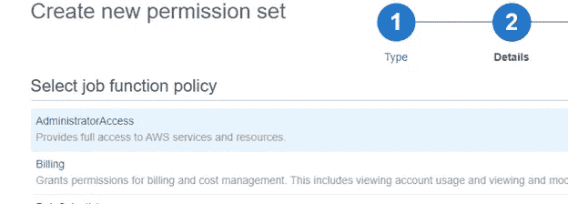

以选择默认工作功能为例

最佳做法是设置您的权限集标记。这些可以是任何键值对，但是我可以推荐一些像您的成本中心、项目名称或部门名称以及一个有意义的值:

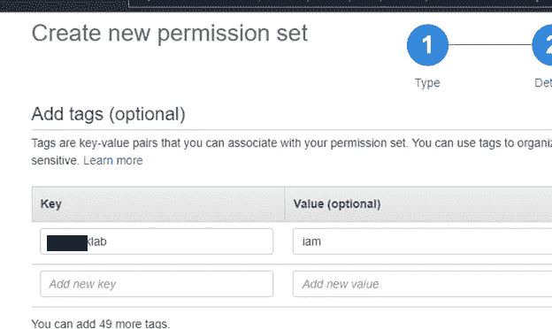

将您的资源标记设置为最佳实践，以便您可以跟踪您的使用情况

检查您的设置，以及如何将默认名称设置为小时。选择创建:

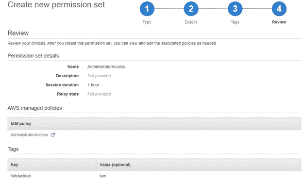

具有管理权限的权限集

您将返回到屏幕，继续选择“AdministratorAccess ”,这样它将打开一个编辑器，并将持续时间设置为(2 小时)和有意义的描述:

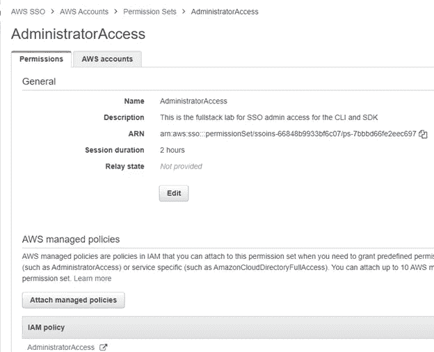

管理员权限集，会话默认持续时间为 2 小时

返回到主 AWS SSO 欢迎屏幕，然后选择“Groups”并创建一个名为 Admins:

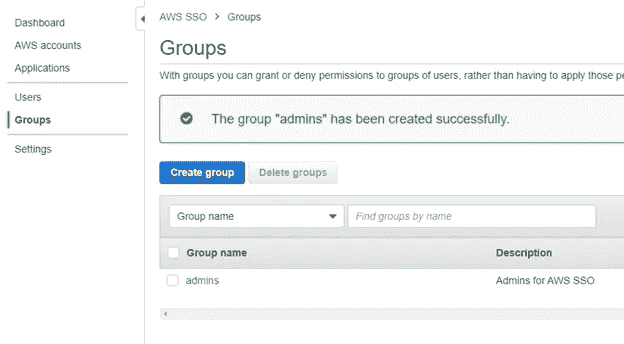

为您的 SSO 目录用户创建组

接下来，选择用户并创建一个新的 SSO 用户，并填写所需的用户名和详细信息。这是一个**独立于 IAM 的**用户，因为 SSO 免费拥有自己的用户目录。如果您是企业，这可能已经联合并同步到您的身份提供商。对于我们的实验室，我们将创建一个手动用户。将其命名为有意义的名称，因为您希望在 MFA 令牌中与 IAM 用户中对其进行不同的识别:

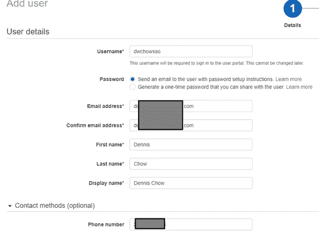

创建新的 SSO 目录用户(不是 IAM 用户)

将您的用户添加到管理员组，并选择“添加用户:”完成

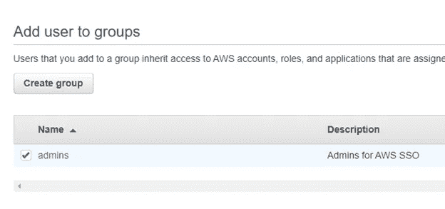

将您的用户添加到您在 SSO 中创建的组中

您将返回到屏幕。按照电子邮件中的说明设置您的密码并注册一个 MFA 软令牌，如“google 认证”应用程序:

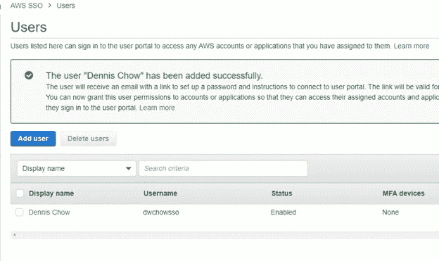

创建您的 SSO 目录用户并注册 MFA

接受邀请，按照说明设置密码并注册 MFA 设备:

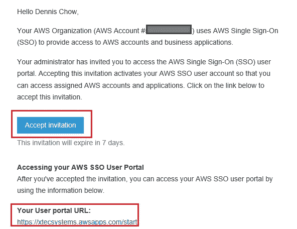

发送到您自己电子邮件的 SSO 门户和邀请示例

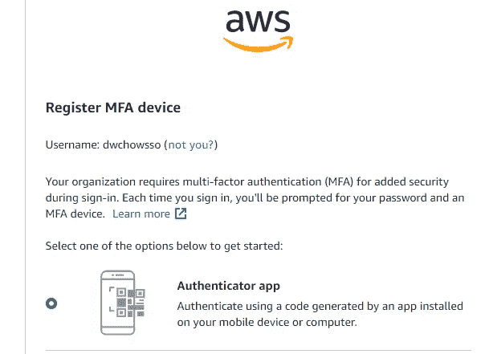

接受注册并开始添加 MFA 软令牌

如果您的 SSO 注册成功，您将被重定向到门户页面。当然，你没有应用程序也没关系:

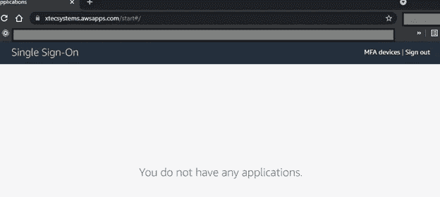

你没有任何应用程序，因为这只是为了验证你的 AWS 帐户

现在返回您的 SSO 页面，转到“AWS 帐户”。选择您的 root 用户帐户，然后选择“分配用户”:

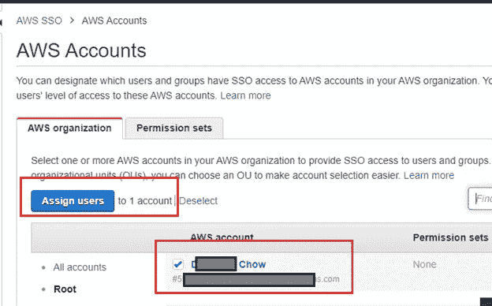

将您的用户添加到您希望使用短期凭据的 AWS 开发帐户

选择您刚刚创建的帐户，然后选择“下一步:权限集”:

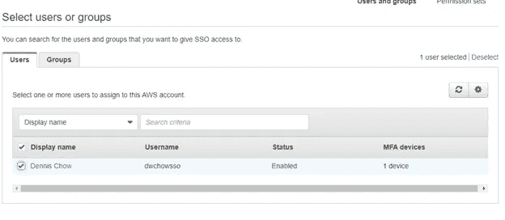

将您的管理权限集分配给您的 SSO 目录帐户

将“AdministratorAccess”权限集添加到您的 SSO 用户，然后选择 finish。

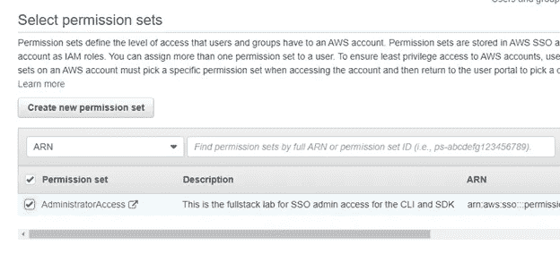

绑定到您的 SSO 目录帐户的原始管理权限集

打开一个终端，输入“aws 配置 sso ”,并输入来自“欢迎使用 AWS SSO”页面的自定义 URL。将您的地区设置为 **us-east-2** ，并设置您的个人资料详情。您还可以将您的配置文件名设置为“sso ”,这样当您指定要使用**短期凭证**时，就不必键入长文件名:

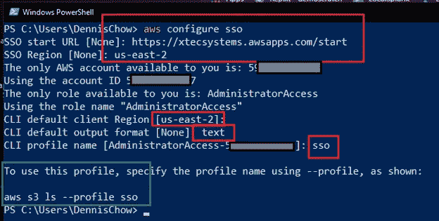

使用 AWS CLI 终端配置使用区域和帐户的 SSO 身份验证

现在，只要您希望使用 CLI 利用刷新的令牌凭据，而不使用长期静态凭据，就可以使用“aws <command></command><parameters>—配置文件 sso”。</parameters>

因为我们都是开发人员，所以我真的不希望不得不每隔 2 小时在 CLI 中为不支持“SSO”认证类型的第三方工具或扩展“手动”刷新我自己的 IAM [会话令牌](https://docs.aws.amazon.com/STS/latest/APIReference/API_GetSessionToken.html)。例子包括 AWS 的 [VSCode 扩展](https://aws.amazon.com/visualstudiocode/)以及在本文撰写之时的 [CDK](https://aws.amazon.com/cdk/) 。为此，我们有另外一个免费的补救措施。输入 [YawSSO](https://github.com/victorskl/yawsso) 。

YawSSO 会把你的新会话信息输入你的默认”。aws/credentials”文件。为此，您需要在 Windows、Mac 或 Linux 上安装 [Pyhon3](https://www.python.org/downloads/) ,并且您可以利用以下工具每隔 1-2 小时安装并同步您的令牌。如下例所示安装和使用:

```
pip3 install yawsso
aws sso login — profile <sso-profile-name-syntax>
yawsso — profile <sso-profile-name-syntax>
```

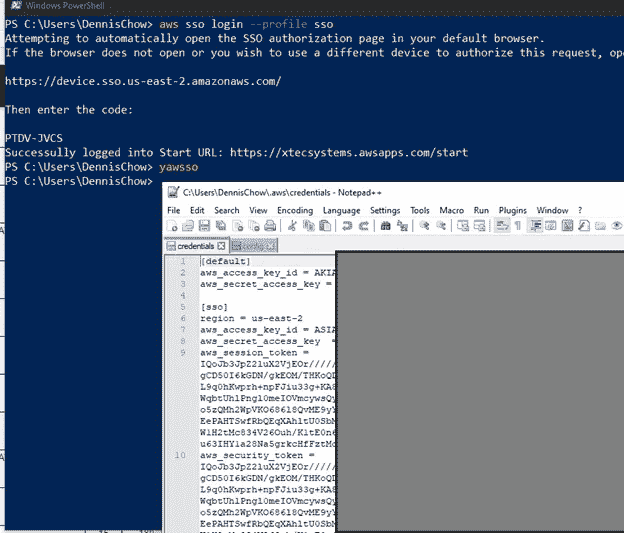

集成了 AWS SSO 的 YawSSO 使用示例

通过创建一个简单的 shell 脚本来进一步实现自动化，该脚本可以作为 cron 作业运行，或者在我的开发主机上作为 8 小时会话刷新程序运行:

```
#!/bin/bash
for i in {1..8}
do
   echo "Getting SSO credentials for an 8 hour day..."
   aws sso login —profile <sso-profile-name-syntax>
   #yawsso will sync your CLIv1 credential profiles
   yawsso —profile <sso-profile-name-syntax>
   sleep 3600 
done
```

你是 Windows 用户吗？没问题，这里有一个简单的 Powershell 一行程序来做同样的事情:

```
1..8 | ForEach-Object { Write-Host "refreshing tokens with sts..."; aws sso login --profile sso; start-sleep 1; yawssso; start-sleep }
```

如果你不使用 YawSSO，另一种方法是当你使用带有 [*AWS 工具扩展*](https://aws.amazon.com/visualstudio/) 的 VSCode 等 IDE 时，手动 [*保持从 STS*](https://aws.amazon.com/blogs/security/aws-single-sign-on-now-enables-command-line-interface-access-for-aws-accounts-using-corporate-credentials/) 导出带有令牌的访问和秘密访问密钥。如果您从未见过 AWS STS 会话令牌，下面是它的样子:

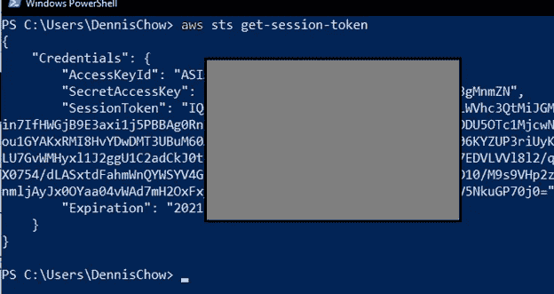

JSON 中的 AWS STS 会话令牌示例

现在，您可以拥有短期凭证，而不必经历可能需要重新架构和等待批准的麻烦，从而以一种简单而免费的方法联合您的开发环境。像往常一样，如果您觉得我的建议很有帮助，或者想就您的安全需求进行更深入的咨询，请随时拨打 www.scissecurity.com[的电话联系我](http://www.scissecurity.com)

快乐*安全*发展！