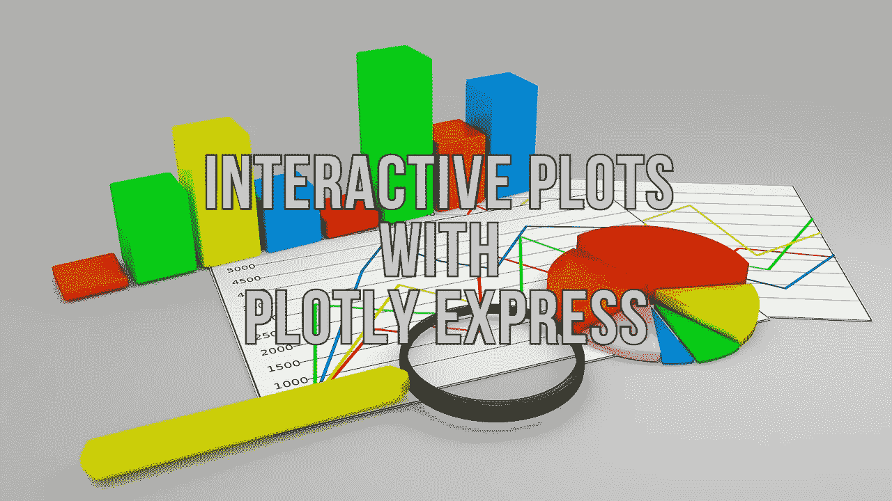
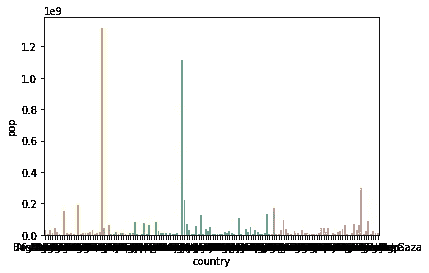
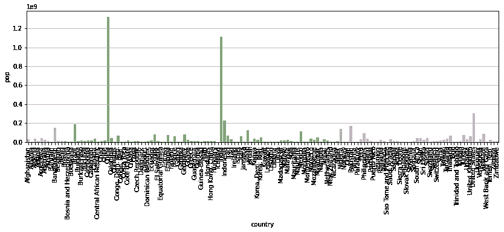
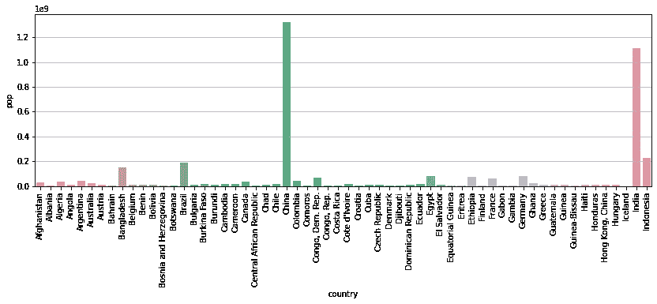
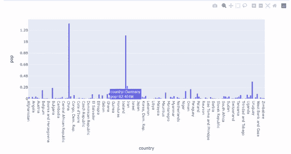

# 在一行 Python 代码中生成交互式绘图

> 原文：<https://towardsdatascience.com/develop-interactive-plots-in-one-line-of-python-code-fde434f39ee8?source=collection_archive---------9----------------------->

## Plotly Express 库基本指南



科林·伯伦斯来自[的图片](https://pixabay.com/?utm_source=link-attribution&amp;utm_medium=referral&amp;utm_campaign=image&amp;utm_content=3068300)

探索性数据分析是数据科学模型开发流程的重要组成部分。数据科学家将大部分时间花在执行 EDA 上，以便更好地理解数据并从中获得洞察力。

有各种单变量、双变量和多变量可视化技术来执行 EDA。Matplotlib、Seaborn 是一些用于生成静态图和图表的流行库。使用 seaborn 和 matplotlib 生成的图本质上是静态的，需要多行 Python 代码来进一步定制图。

在本文中，我们将探索 Plotly Express 库，它可用于生成交互式绘图。

# 为什么是交互式可视化？

Matplotlib 和 Seaborn 是数据科学社区中流行的库，它们可以为可视化生成漂亮的图形和图表，那么交互式可视化的要求是什么呢？

数据科学家必须花费大量时间使用 seaborn 或 matplotlib 库来生成和定制绘图。

> 让我们使用 seaborn 生成一个示例静态条形图，以可视化 2007 年几个国家的人口。

```
**sns.barplot(data=df, x='country', y='pop')
plt.show()**
```



(图片由作者提供)，Seaborn 酒吧图

上面展示每个国家人口的条形图样本不可读。数据科学家必须编写多行 Python 代码来定制条形图，以使其易于理解。需要调整绘图的大小并旋转 x 刻度标签。

```
**plt.figure(figsize=(14,4))
sns.barplot(data=df, x='country', y='pop')
plt.xticks(rotation=90)
plt.grid(axis='y')
plt.show()**
```



(图片由作者提供)，自定义 Seaborn 条形图

X 轴有 142 个类别(国家)，这使得剧情很难解读。为了更好地可视化，必须过滤排名前 60 位的国家。

```
**plt.figure(figsize=(14,4))
sns.barplot(data=df[df['country'].isin(list(df['country'].unique())[:60])], x='country', y='pop')
plt.xticks(rotation=90)
plt.grid(axis='y')
plt.show()**
```



(图片由作者提供)，为前 50 个类别定制 Seaborn 条形图

人们必须编写多行 Python 代码，以使情节美观直观。尽管如此，这些情节本质上是静态的，从情节中获得每个国家的准确人口有点困难。

Plotly Express 是一个高效的库，可以在一行 Python 代码中生成漂亮且可解释的图表。现在让我们使用 Plotly Express 库生成相同的图。

# Plotly Express:

> 来自 [Plotly 文档](https://plotly.com/python/plotly-express/):
> 
> Plotly Express 是一个封装了 Plotly 库的包装器。Plotly Express 的函数 API 旨在尽可能保持一致和易于学习，从而在整个数据探索会话中轻松地从散点图切换到条形图、直方图和日射图。

Plotly Express 在一行 Python 代码中生成直观的交互式绘图。

## 安装:

Plotly Express 可以从 PyPI 安装，使用

```
**pip install plotly**
```

## 用法:

使用 Plotly Express 生成交互式柱状图只需一行 Python 代码。

```
**import plotly.express as px****px.bar(data_frame=df, x='country', y='pop')**
```



(GIF 由作者提供)，使用 Plotly Express 的条形图

Plotly Express 提供了 30 多种功能来创建不同类型的绘图和图形。阅读库[文档](https://plotly.com/python/plotly-express/)以更好地理解代码用法。

# 结论:

Plotly Express 是一个方便的工具，可以生成交互式的图和图形，使 EDA 管道更加直观。用户可以将鼠标悬停在图形上与图形进行交互，并且可以在使用笔记本进行演示时提高效率。

然而，与 seaborn 或 matplotlib 相比，Plotly Express 的绘图不太可定制。因此，seaborn 或 matplotlib 可以优先用于生成可定制的图，而 Plotly Express 可以用于从图中生成快速洞察。

# 参考资料:

[1] Plotly Express 文档:【https://plotly.com/python/plotly-express/ 

> 感谢您的阅读