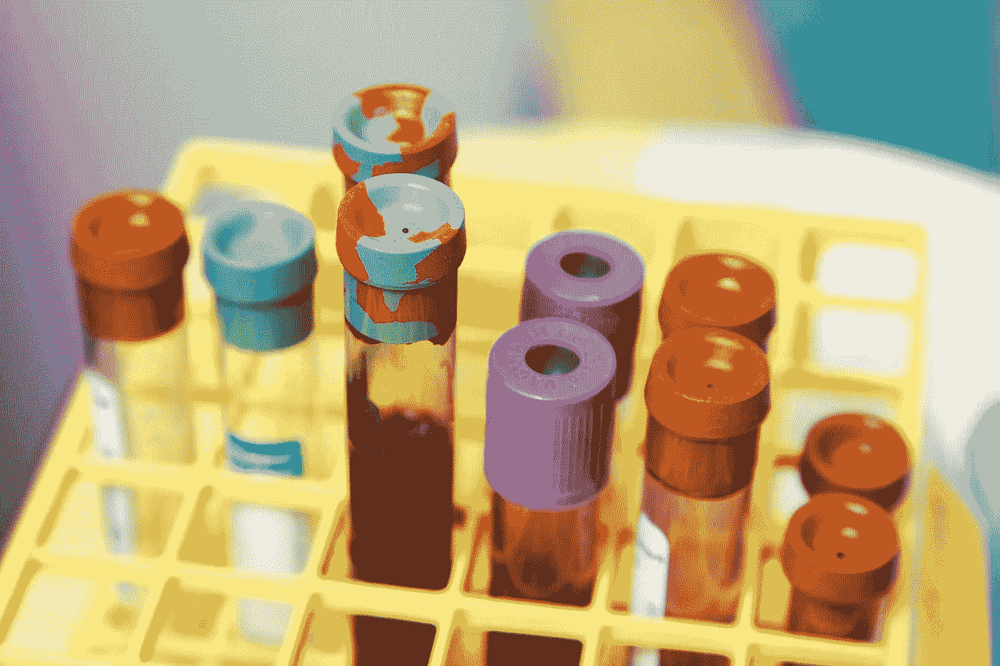

# 发展生命科学行业数据科学家的职业生涯

> 原文：<https://towardsdatascience.com/developing-a-career-as-a-data-scientist-in-the-life-sciences-industry-4025ee386895?source=collection_archive---------12----------------------->

## 挑战和机遇

在大型生命科学(制药、医疗营养、生物技术)公司的研发(R&D)领域，数据科学家是一个相对较新的角色。对于职业生涯早期的数据科学家，或对进入生命科学研究感兴趣的已有数据科学家来说，随着该领域的成熟以及与已有科学学科一起获得认可，该领域的机会越来越多。

[国家癌症研究所](https://unsplash.com/@nci?utm_source=unsplash&utm_medium=referral&utm_content=creditCopyText)在 [Unsplash](https://unsplash.com/s/photos/laboratory?utm_source=unsplash&utm_medium=referral&utm_content=creditCopyText) 上拍摄的照片

要在生命科学研究环境中成为一名成功的数据科学家，尤其是在一家大型公司中，需要与任何其他行业相同的技能和经验。但是有一些显著的不同:

*   比商业意识更重视科学研究专业知识；
*   软技能以及与科学专家建立和保持伙伴关系的能力可能比纯粹的商业咨询技能更有价值。

作为一门新学科，围绕这一点可能是最大的挑战。尝试新事物总是令人兴奋的，但是会带来额外的需求，直到新事物成为常态。

# 成为街区里的新成员会很艰难

在一个成熟的组织中成为一门新学科的最大挑战之一是需要确定这门新学科将带来什么样的额外价值。在生命科学行业尤其如此，因为它的重点是科学研究——R&D 的主要作用是科学发现带来新的商业机会。R&D 生命科学系通常拥有许多学术上令人印象深刻的简历，博士比比皆是，就像长期同行评审的科学出版物参考书目一样。在这种情况下引入数据科学家的新角色可能是敏感的，有时甚至是具有挑战性的，因为这些非常聪明的人多年来一直在做自己的数据分析，这是他们现有工作的重要部分。从这个意义上来说，数据科学家，至少对某些人来说，可以被看作是一个闯入者。数据科学和数据科学家是有些模糊的术语，这使得情况更加复杂。

根据我的经验，新数据科学家需要特别考虑的两个方面是:

*   如何有效地与科学同事合作——可以说是迈出了第一步——在项目或项目负责人是科学家的项目中，这是一种典型的工作方式。以前的项目没有数据科学家，而且很成功，那么为什么现在需要一个呢？
*   一旦参与到项目中，如何在项目活动中获得合适且有回报的角色，以及如何提高数据科学家成为未来项目重要组成部分的机会。

帮助应对这些挑战的一个关键学习是非常了解科学家同事的世界观和观点——设身处地为他们着想。如果以前的类似项目使用经典的统计建模技术(t 检验、非参数、PCA 等)获得成功。)并通常由科学家自己进行，然后提出新的(潜在复杂的)方法，如人工智能、机器学习或高级统计建模，科学家不熟悉的方法可能会失败，导致沮丧和浪费精力。

阿瑟尼·托古列夫在 Unsplash 上拍摄的照片

在项目中引入新的数据科学建模技术可能需要相当的谨慎，并且可能需要以比预期慢得多的速度来完成。这可能会令人沮丧，因为找到一个聪明的新方法来解决现有的问题是令人兴奋的，并且想要全速前进是很自然的。我在这里的建议是要有耐心，它会发生，但要给它时间。良好的软技能是关键，温和地教育并带上同事。当以前的出版物——已经过同行评审，因此被认为具有良好的科学质量——使用现有的建模方法时，一些新方法在纯技术基础上更好的论点可能没有什么吸引力。要考虑的重要一点是采用新方法的用例是什么？是否引人注目？你能让它引人注目吗？

向您介绍一位数据科学家，他拥有大量强大的新功能！—但是不熟悉的建模工具变成一个成功的科学家团队是一种改变，改变需要时间，有些人会接受，有些人不会。我的建议是关注那些拥抱变化的人，赢得他们的信任，然后他们可能会成为你和数据科学的大使，帮助展示数据科学家可以给项目带来的附加值。

# 数据科学的专业标准

将数据科学家引入生命科学研究与将生物统计学家引入临床试验和生物医学研究有一些相似之处。随着更多机会的出现，生物统计学家进入数据科学角色也并不罕见。生物统计学是制药公司从初级职位到高级管理层的一条非常成熟的职业道路。

然而，与 R&D 生命科学协会相比，一个关键的区别是，临床试验是一个高度管制的领域，良好临床实践(GCP)要求任何数据分析都必须由合格人员进行。实际上，这意味着某人拥有统计学方面的正式资格/证书。这种治理框架意味着生物统计学作为一门学科，与科学家和医学研究人员一样拥有保留的地位。但这不是一蹴而就的，临床研究有着非常悠久的历史。数据科学和数据科学家的角色作为一个学科和工作岗位仍然在不断发展。

皇家学会在“[什么造就了数据科学家”中讨论了在生命科学研究中引入数据科学的治理框架和专业标准。为什么专业技能和行为比以往任何时候都更重要](https://royalsociety.org/blog/2020/07/what-makes-a-data-scientist-why-professional-skills-and-behaviours-are-more-important-than-ever/)。这是积极的一步，但考虑到生命科学研发的巨大多样性和范围，这是雄心勃勃的，但也是未来几年值得关注的领域。

# 增长和机遇

虽然生命科学环境中的数据科学仍处于早期阶段，但它已经感觉像是一条与“主流”数据科学完全不同的职业道路。除了上面提到的差异，比如强调科学而不是商业意识，还有许多实际的差异。例如，在我自己的日常工作中， [R](https://www.r-project.org/) 而不是 [Python](https://www.python.org/) 是大多数项目的首选工具，Python 是我们生态系统的一部分，但只是一小部分。这也反映了我在潜在数据科学家候选人中寻找的技能差异。例如，我收到的简历中一个越来越常见的方面是列出候选人有经验的所有不同的技术/ML 框架。这可能适合技术部门的职位，但对于生命科学研发部门的职位来说并不合适。

我在早期职业数据科学家中寻找的是研究能力和对建模技术方法论理解的深度。特定技术或编程语言的经验在我看来更像是一种需要学习的商品。这可能不同于其他部门或角色，在这些部门或角色中，必须在特定语言或框架方面拥有高水平的经验，例如，重点是开发新的数据科学工具以部署到生产中。例如，预测模型或决策支持系统。这与 R&D 生命科学不同，在那里，数据科学活动主要是通过与科学家合作来产生新的研究见解。

总之，作为生命科学行业的数据科学家，职业生涯带来了挑战，但也带来了丰厚的回报——通过为现有数据和建模问题带来新的思维和新工具，有可能真正大放异彩。提供新的突破和创新。毕竟，雇佣数据科学家是有原因的。生命科学家作为兼职数据分析师的多任务处理不会改变，也不应该改变，但通过与科学家同事合作，建立强大的网络和关系，数据科学作为生命科学的职业选择将有一个非常光明的未来。

# 关于作者

这是我，从 2000 年获得博士学位以来，我一直从事生物医学和生命科学研究，特别是生物统计学和数据科学。我目前在荷兰[达能](https://www.danone.com/)的研发数据科学部门工作，在此之前我在[利洁时](http://www.rb.com/)的研发数据科学部门工作。