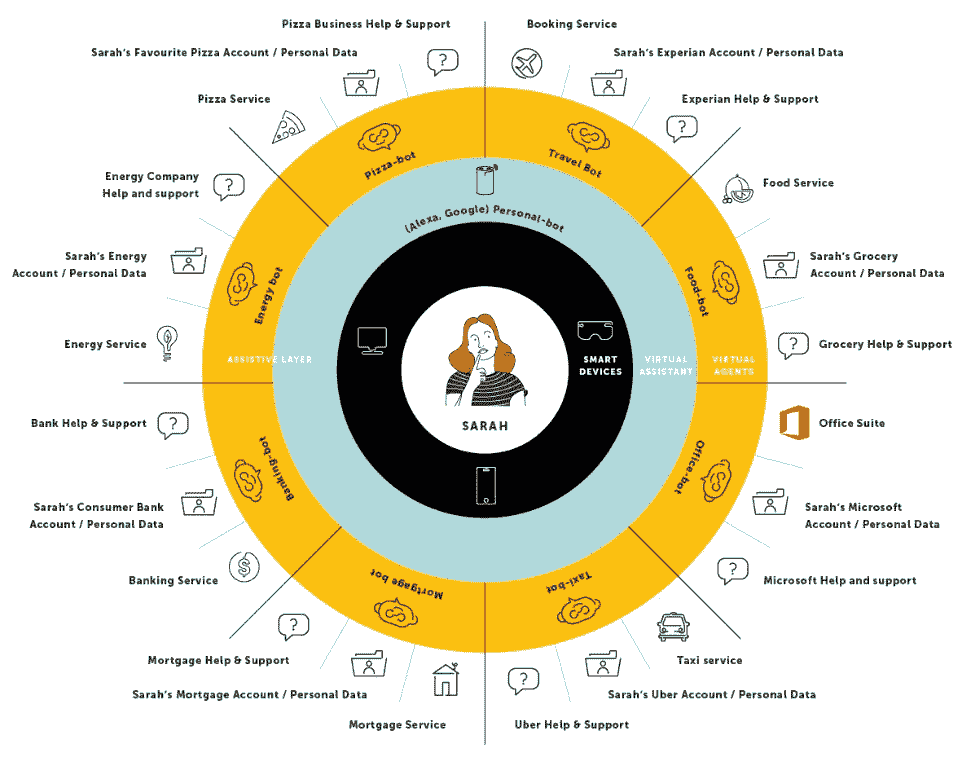

# 开发对话式人工智能程序

> 原文：<https://towardsdatascience.com/developing-a-conversational-ai-program-db94bb89e37f?source=collection_archive---------21----------------------->

## *如何避免常见陷阱并释放客户和业务价值*

*由* [*EPAM 系统有限公司*](https://www.epam.com/conversational-ai?utm_source=towards-data-science&utm_medium=article&utm_campaign=financial-services&utm_term=developing-a-conversational-ai-program&utm_content=alberto-jose-benayas) 产品经理 Rachel Bimbi 负责

信贷:EPAM 系统

对话式人工智能技术在过去十年中发展迅速，聊天机器人、虚拟代理、语音助手和对话式用户界面现在已经成为我们日常生活的一部分。这种向人工智能辅助的爆炸性转变并不是来自单个的技术创新，而是作为我们生活和数字服务之间的辅助层而发展起来的多种创新，无论我们是在问路、在线购物还是在银行。事实上，IDC 预测，从 2020 年到 2024 年，全球在人工智能上的支出将翻一番，增长到超过 1100 亿美元，其中零售银行预计支出最多。

令人惊讶的是，尽管对话式人工智能提供了所有好处，但许多项目都因一开始发现不足而失败，这就是为什么在前期花时间检查正在构建什么以及它将向客户提供的价值至关重要。由于在该领域学到的经验有助于提高成功几率，以下七个步骤可以作为几乎每个行业的企业在着手或推进现有对话式人工智能平台时的指南:

**1。确定你试图解决的问题**

仅从数字来看，聊天机器人的商业价值通常是显而易见的。但是数字本身并不能保证成功。当决定从哪里开始或下一步做什么时，平衡 ROI 和客户需求至关重要。例如，许多银行会花几个月的时间建立一个系统，结果却发现客户对交付的东西毫无兴趣。有多种方法可以在早期与客户一起测试创意。例如，通过 Botmock 或 Botsociety，可以在研究环境中创建快速原型并交付给客户。许多企业使用绿野仙踪方法，该方法允许用户在真实环境中与充当虚拟助理的真实代理进行交互，以测试假设并验证他们做出的风险假设，从使用聊天机器人切换抵押贷款交易到从 Alexa 接收帐户余额。从长远来看，这可以节省几个月浪费的设计和开发时间。

**2。根据对话式人工智能愿景调整组织**

为了确保你的对话式人工智能程序不被视为一个数字副业，创建一个共同的愿景，并确保它是更广泛的接触战略的一个重要支柱。无论是尝试第一个对话式界面，还是开发更复杂的平台和体验能力，企业的利益相关者都应该接受对话式人工智能，不仅仅是一种界面类型，而是实现更大组织目标的一种手段，这一点很重要。为了确保企业围绕共同愿景保持一致，并为实现这一愿景做好组织准备，请主动解决以下四个核心领域的问题:

1.阐明一个现实而又雄心勃勃的未来愿景

2.解决组织孤岛问题

3.知道何时转向

4.灵活构建未来路线图

**3。战略性地考虑你的对话平台架构**

当心那些声称实现这种技术既快又容易的组织的推销。尽管在自然语言生成(NLG)方面取得了进步，但在没有正确方法的情况下，实现和训练对话式人工智能相对来说是手动和耗时的。具有正确构建模块和数据驱动方法的灵活架构是尽可能多地实现流程自动化并快速实现价值的关键。在可能的情况下，利用现有投资，并考虑所有可能希望在未来部署对话式人工智能解决方案的业务部门的需求。将虚拟代理视为具有两个不同的架构阶段是有帮助的:

1.一个与关键通信渠道集成的对话平台，可以无缝地移交给这些渠道中的人工代理。它没有与后端企业系统的任何集成，但它已经可以提供重要的价值。

2.一个带有身份验证的对话平台，可以挂接到后端企业系统，以解锁端到端用例，如事务性查询。

选择合适的 NLU 很重要(IBM Watson，Google Dialogflow 或 Amazon Alexa 等。)和对话构建工具，如果提供 NLU 的平台不能提供满足所需需求的工具。市场上没有最佳方案，因为最佳解决方案将取决于业务需求、更广泛的生态系统和技术以及云提供商。

**4。获得合适的资金并创造动力**

虽然创建一个对话式人工智能程序可能被证明是必要的，但一些程序可能会因为实现和运行一个成功的程序所需的时间和金钱而推迟。因此，从较低的初始投资开始，展示好处，然后扩展到数百万客户，如果这是目标的话。为了帮助做出决策，请回答以下问题:

这项技术是否有助于利用数据比以前更好地了解客户？

员工如何从虚拟代理中受益？

对话式人工智能如何帮助提高收入？

是否有可以通过自动化解决的关键投诉驱动因素？

如何利用这项技术来利用其他形式的人工智能和自动化来真正解决业务和客户问题？

如果人工智能的能力从对话式人工智能中释放出来，这如何再投资？

虚拟代理能够启动或扩展客户想要的更多渠道吗？

虚拟代理如何帮助执行主动营销或参与？

对话式人工智能如何帮助减少欺诈或确保合规？

**5。为合适的人才配备员工:从对话分析师开始**

最重要的一点是，对于 web 或应用程序团队来说，提供出色对话体验所需的角色和技能是不同的。预计将不得不建立新的角色简介，并从外部招聘。困难的部分是找到在这个领域有相关经验的人才，而这个行业对他们的需求如此之大。可能有必要创建当前可能不存在的新角色类型，如对话分析师，他将使用机器学习算法和自然语言处理来研究您的客户说话的方式，并使用这些见解来培训您的虚拟代理，以及对话设计师，文案/UX 设计师，他们可以创建对话流，编写对话，利用丰富的功能(如快速回复，按钮和传送带)，并随着时间的推移优化体验。

**6。尽早为你的对话式人工智能创造一个角色**

实现对话式人工智能的最终目标是创建一个虚拟代理，它是一个具有迷人角色的品牌大使。首先考虑典型客户的人口统计和心理特征。如果可能，使用客户角色；如果没有，从头开始创建。然后创建一个背景故事作为这个对话式人工智能程序的指南。考虑年龄、性别、种族、家庭背景、经历、职称、喜欢、不喜欢和性格特征。进行客户测试，深入了解影响客户个性认知的众多因素，包括入口点和界面的大小、风格和布局、丰富功能的使用、发送消息的长度以及文本气泡的发送速度等等。从参与的角度来看，人物角色很重要，但这也是鼓励客户使用自然语言与您的虚拟代理交谈并释放这项技术的真正力量的唯一方式。

**7。通过敏捷设计和交付优化您的虚拟代理**

为了交付一个成功的对话式人工智能解决方案，采用敏捷的思维方式并拥抱设计思维。许多对话式人工智能团队仍然严重依赖过程映射工具，如 Visio 或 Lucid Chart，来创建设计。相反，选择在无代码、快速原型对话设计工具中进行设计。这使得设计师可以快速创建模型，甚至使用自然语言与原型进行交互。这样做最大的好处是能够在几个小时内和真正的客户一起测试虚拟助理，并快速学习，完全独立于开发团队。

一旦启动，持续监控并根据需要进行改进，以满足并超越客户的需求。毫无疑问，今天的组织有机会站在下一波转型的最前沿，无缝集成对话式人工智能，以解决在旅程的每一步为时间紧迫的客户提供服务和帮助的复杂挑战。当然，对话式人工智能不是万能的解决方案，但几乎可以肯定的是，通过识别能够以最小的努力实现最大价值的客户交互，可以获得立竿见影的效果。