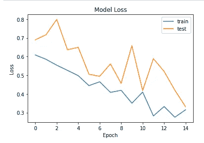

# 使用直接来自图像目录的未标记图像文件开发卷积神经网络模型

> 原文：<https://towardsdatascience.com/developing-a-convolutional-neural-network-model-using-the-unlabeled-image-files-directly-from-the-124180b8f21f?source=collection_archive---------14----------------------->


艾莉娜·格鲁布尼亚克在 [Unsplash](https://unsplash.com?utm_source=medium&utm_medium=referral) 上的照片

## 使用图像生成器将图像自动标记为子目录

卷积神经网络是图像分类的重要工具。它也可以执行其他人工智能任务。但是本文将主要关注图像识别。我有一篇关于卷积神经网络的前向传递如何工作以及如何在 Tensorflow 和 Keras 中实现卷积神经网络的详细文章。请在这里随意查看:

</convolutional-neural-network-good-understanding-of-the-layers-and-an-image-classification-example-a280bc02c13e>  

在上面文章的例子中，每张图片都为我们做了标记。但是在现实世界中，图像并不总是被贴上标签，贴标签需要花费金钱和时间。因此，本文将使用一种不同的技术。

## 问题概述

本文中的示例没有带标签的数据。我们将图像文件作为输入，模型将直接从目录中获取图像文件，并了解图像。最后，如果我们输入一个图像文件，模型应该以相当高的精度对其进行分类。

## 资料组

如果您正在使用卷积神经网络教程搜索图像分类，您可能会发现许多关于胸部 X 射线图像的图像分类以检测肺炎的示例。

> 我还使用了来自 [Kaggle](https://www.kaggle.com/andrewmvd/pediatric-pneumonia-chest-xray/metadata) 的开源二进制数据集，其中包含胸部 x 光图像。[这里是数据集的列表信息](https://www.kaggle.com/andrewmvd/pediatric-pneumonia-chest-xray/metadata)。请随意从这个链接下载数据文件夹[并跟随](https://www.kaggle.com/andrewmvd/pediatric-pneumonia-chest-xray/metadata)。

在本练习中，X 射线图像将以图像文件的形式输入。对于训练，我们将有 1349 个正常胸部状态的图像文件和 3883 个肺炎胸部的图像文件。对于测试，我们有 124 个正常图像文件和 390 个肺炎图像文件。

## 数据预处理

Kaggle 中的数据集已经分别组织在训练和测试文件夹中。所以，我们不必为了训练和测试而拆分文件。此外，在训练文件夹中，正常胸部图像和肺炎胸部图像被分离到单独的子文件夹中。我把数据下载到我的电脑上，直接使用。


这是邮件文件夹，该文件夹包含以下两个子文件夹:


每个子文件夹都有两个子文件夹:


> 这些子目录的名称将用作模型中数据的标签。当子目录的名称为“正常”时，标签也为“正常”，当子目录的名称为“肺炎”时，标签为“肺炎”。

在进入模型之前，让我们检查子目录中的一些图片。首先，我们需要保存正常和肺炎 X 射线图像的目录路径。我只是从培训目录中打印。这些是我笔记本电脑中的文件夹位置。你需要提到你的笔记本电脑中的文件夹位置。

```
import ostrain_normal = os.path.join (r"C:\Users\rashi\OneDrive\Desktop\New folder 1\Launchcode\Tensorflow\chest_x-ray_CNN\Pediatric Chest X-ray Pneumonia\train\NORMAL")train_pneumonia= os.path.join(r"C:\Users\rashi\OneDrive\Desktop\New folder 1\Launchcode\Tensorflow\chest_x-ray_CNN\Pediatric Chest X-ray Pneumonia\train\PNEUMONIA")
```

现在，我们可以简单地将文件名与目录路径连接起来，以找到文件的路径并绘制它们。os.listdir 给出了目录中文件的名称。

```
import matplotlib.image as mpimgnormal_img = [os.path.join(train_normal, file)
              for file in os.listdir(train_normal)[:3]]
plt.figure(figsize=(12, 3))
for i, img_path in enumerate(normal_img):
    sp = plt.subplot(1, 3, i+1)
    sp.axis('Off')
    img = mpimg.imread(img_path)
    plt.imshow(img)

plt.show()
```


作者图片

肺炎目录中的一些图片:

```
pneumonia_img = [os.path.join(train_pneumonia, file)
              for file in os.listdir(train_pneumonia)[:3]]
plt.figure(figsize=(12, 3))
for i, img_path in enumerate(pneumonia_img):
    sp = plt.subplot(1, 3, i+1)
    sp.axis('Off')
    img = mpimg.imread(img_path)
    plt.imshow(img)

plt.show()
```


作者图片

我们需要使用 TensorFlow 的 ImageDataGenerator 函数来识别文件是正常的还是肺炎的。如果需要，ImageDataGenerator 函数可以重新调整数据。然后图像文件将直接从目录中流出。我们将指定图像文件的目标大小为 300x300，文件将自动调整大小。

以下是所有这些的全部代码:

```
import numpy as np
import tensorflow as tf
from tensorflow import keras
from tensorflow.keras import layersfrom tensorflow.keras.preprocessing.image import ImageDataGeneratortrain_datagen = ImageDataGenerator(rescale=1/255)
validation_datagen = ImageDataGenerator(rescale=1/255)train_generator = train_datagen.flow_from_directory(
    r'C:\\Users\\rashi\\OneDrive\\Desktop\New folder 1\\Launchcode\\Tensorflow\\chest_x-ray_CNN\\Pediatric Chest X-ray Pneumonia\\train',
    target_size=(300, 300),
    batch_size=128,
    class_mode='binary'
)validation_generator = validation_datagen.flow_from_directory(
    r"C:\\Users\\rashi\\OneDrive\\Desktop\\New folder 1\\Launchcode\\Tensorflow\\chest_x-ray_CNN\\Pediatric Chest X-ray Pneumonia\\test",
    target_size=(300, 300),
    batch_size = 32,
    class_mode = 'binary'
)
```

输出:

```
Found 5232 images belonging to 2 classes.
Found 624 images belonging to 2 classes.
```

您可以看到，它将两个子文件夹(NORMAL 和 PNEUMONIA)检测为训练和测试数据的两个类别。

数据处理完毕。

## 模型结构

在这个模型中，我使用了四个卷积层，32 个大小为 3×3 的过滤器和 2×2 的最大池层。之后是一个有 512 个神经元的致密层。除了输出层之外，激活功能是“relu”。如果你想了解所有这些元素是如何工作的，请参阅开头提到的文章。

模型如下:

```
model = tf.keras.models.Sequential([
    #Note the input shape is the size of the image 300x300 with 3 bytes color

    tf.keras.layers.Conv2D(16, (3,3), activation='relu', input_shape=(300, 300, 3)),
    tf.keras.layers.MaxPooling2D(2, 2),

    tf.keras.layers.Conv2D(32, (3,3), activation='relu'),
    tf.keras.layers.MaxPooling2D(2,2),

    tf.keras.layers.Conv2D(64, (3,3), activation='relu'),
    tf.keras.layers.MaxPooling2D(2,2),

    tf.keras.layers.Conv2D(64, (3,3), activation='relu'),
    tf.keras.layers.MaxPooling2D(2,2),

    tf.keras.layers.Conv2D(64, (3,3), activation='relu'),
    tf.keras.layers.MaxPooling2D(2,2),

    # Flatten the results to feed into a DNN
    tf.keras.layers.Flatten(),

    tf.keras.layers.Dense(512, activation='relu'),
    tf.keras.layers.Dense(512, activation='relu'),

    tf.keras.layers.Dense(1, activation='sigmoid')
])
```

模型准备好了。模型摘要如下所示:

```
model.summary()
```


下一步是编译模型。我用的是 RMSprop 优化器，学习率 0.0001。你可能会发现精度有点波动。如有必要，请尝试较小的学习速率。

```
from tensorflow.keras.optimizers import RMSpropmodel.compile(loss="binary_crossentropy",
             optimizer=RMSprop(learning_rate=0.0001),
             metrics=['accuracy'])
```

现在是训练时间。模型已准备好接受训练。我只会运行 15 个纪元。这里使用每个时期的步数。这意味着在一个时期完成之前将有 8 个步骤。批量大小将是输入数据除以 8。

```
history = model.fit(
    train_generator,
    steps_per_epoch=8,
    epochs=15,
    verbose=1,
    validation_data = validation_generator,
    validation_steps = 8
)
```

精度在 15 个时期内发生了怎样的变化:

```
import matplotlib.pyplot as plt
plt.plot(history.history['accuracy'])
plt.plot(history.history['val_accuracy'])
plt.title('Model Accuracies')
plt.ylabel('Accuracy')
plt.xlabel('Epoch')
plt.legend(['train', 'test'], loc='best')
plt.show()
```


作者图片

正如你所看到的，验证精度波动很大。让我们看看损失在 15 个时期内是如何变化的:

```
plt.plot(history.history['loss'])
plt.plot(history.history['val_loss'])
plt.title('Model Loss')
plt.ylabel('Loss')
plt.xlabel('Epoch')
plt.legend(['train', 'test'], loc='best')
plt.show()
```



作者图片

正如预期的那样，验证损失也大幅波动。

原因可能是学习率太高。我会尝试用较小的学习率。此外，有可能在整个时期不断改变学习率。这超出了本文的范围。改天我会在单独的练习中解决这个问题。总的准确度是好的。所以，我的教程到此为止。

请随意设计一些不同的模型。以下是一些想法:

1.  尝试不同数量的卷积层和最大池层。
2.  您可以使用不同数量和大小的过滤器。
3.  使用不同的激活功能，而不是“relu”。
4.  请随意尝试不同数量的神经元，并添加更密集的层。
5.  使用不同的优化器而不是 RMSprop。
6.  之前已经讲过学习率了。
7.  此外，尝试更多的纪元。我只运行了 15 个纪元。并且可以像开头提到的文章中提到的那样随意使用回调。

## 结论

希望这篇文章是有帮助的！如果你正在尝试不同的想法，并获得更好更稳定的结果，请随时在评论区分享。还有很多其他的方法来改进一个模型。我很快会带着更多的想法回来。

欢迎随时关注我的推特(Twitter)和我的新 T2 YouTube 频道(T3)。

## 更多阅读

</zooming-in-and-zooming-out-in-matplotlib-to-better-understand-the-data-b4a5f5b4107d>  <https://pub.towardsai.net/text-data-visualization-with-wordcloud-of-any-shape-in-python-8cec334e5c4f>  </a-complete-anomaly-detection-algorithm-from-scratch-in-python-step-by-step-guide-4c115e65d54e>  </all-the-datasets-you-need-to-practice-data-science-skills-and-make-a-great-portfolio-74f2eb53b38a>  </five-common-distance-measures-in-data-science-with-formulas-and-examples-da492e201a66> 