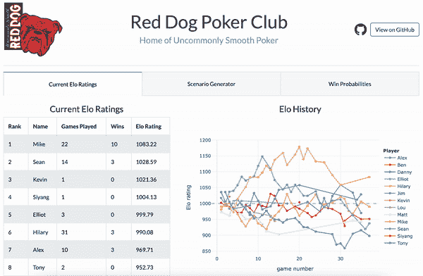

# 为多人游戏开发一个通用的 Elo 分级系统

> 原文：<https://towardsdatascience.com/developing-a-generalized-elo-rating-system-for-multiplayer-games-b9b495e87802?source=collection_archive---------1----------------------->

## [体育分析](https://towardsdatascience.com/sports-analytics/home)

## 用它来证明我是个糟糕的扑克玩家

照片由[艾哈迈德·哈桑](https://unsplash.com/@carsive?utm_source=medium&utm_medium=referral)在 [Unsplash](https://unsplash.com?utm_source=medium&utm_medium=referral) 上拍摄

这篇文章主要是关于多人游戏分级系统的数学设计，它可以应用于任何数量的游戏或运动。在这个过程中，我开发了一个 Python 包，并构建了一个 web 应用程序来展示我(缺乏的)扑克技巧。如果你对这些话题感兴趣，请继续阅读！

Elo 或许是最著名的评级系统。最初发明它是为了衡量棋手的相对技能，从那以后它被应用到许多其他游戏中。近年来，Elo 已经被 FiveThirtyEight 推广开来——例如，他们用它来预测 NFL。

Elo 最大的优点是简单。每个玩家(或团队)在游戏开始前都有一些评级，在我们观察游戏结果后，我们使用一个简单的公式来计算每个玩家的新 Elo 评级。这使得跟踪每个玩家的评级变得容易。如你所料，收视率会发生变化。赢了总会提高玩家的等级，输了总会伤害它。打败一个强大的玩家比打败一个弱小的玩家更有价值。(稍后将详细介绍数学细节。)

一个明显的缺点是 Elo 只对双人游戏有效。许多游戏有两个以上的玩家——赛跑、视频游戏、棋盘游戏等等——我们可能想给这些游戏中的玩家分配等级。如果这些游戏有一个简单的分级系统就好了，但是我们必须超越 Elo。

在和朋友一起玩扑克游戏后，我有动力建立一个多人游戏分级系统。在新冠肺炎疫情期间，扑克是我们被隔离期间的爱好之一——大约每周一次，我们会跳上一个视频电话，每人凑几美元，玩几个小时的扑克。这是一个保持社交距离的好方法，但有一个大问题:我不是一个好的扑克玩家。我一开始也是这么想的，反正我很快意识到我错了。我是一个*糟糕的*扑克玩家。

对你来说幸运的是，亲爱的读者，我也是一个喜欢把数学带入兴趣爱好的大书呆子。我不满足于知道自己是一个糟糕的扑克玩家；我想精确地量化我有多糟糕。所以我开发了一个标准 Elo 评级系统的简单扩展。

# Elo 如何工作

我们先来了解一下 standard Elo 是如何与两个玩家合作的。生成 Elo 评级有三个步骤:

1.  **预期比分:**预测一场比赛的结果。
2.  **实际得分:**观察结果。
3.  **更新:**根据结果增加或减少每个玩家的等级。

让我们更详细地看一下每个步骤。为了预测哪个玩家会赢，我们将每个玩家的当前评级插入一个简单的逻辑函数。假设我们有玩家 *A* 和 *B* ，评级分别为 *Rᴀ* 和 *Rʙ* 。那么玩家 A 的“期望得分”是

等式 1:标准(双人)Elo 的期望得分公式。

期望得分告诉你参与人 A 赢的可能性有多大。例如，0.75 的预期分数意味着玩家 A 将在 75%的时间里击败玩家 B。评级的较大差异导致较高评级玩家的较大预期分数。注意这里有一个变量 *D* 。这是我们可以在 Elo 算法中调整的参数之一，它控制着评分差异如何转化为获胜概率。设置 *D* = 400 是很常见的。

接下来我们观察比赛的结果。让我们使用下面的二进制表示，这样我们就可以很容易地将结果与预期分数进行比较:

等式 2:在标准 Elo 中编码游戏结果。

现在，我们准备更新我们的球员的评级。玩家评分的变化取决于预期结果和观察结果的差异。玩家 A 的新等级是

等式 3:在观察一场比赛的结果后，更新一个玩家的 Elo 等级。

很明显，如果观察到的结果大于(好于)预期分数，评级就会上升。否则就完蛋了。K 值是另一个 Elo 参数，它粗略地决定了一个玩家在一场游戏后的等级可以改变多少。把 *K* 设置成某个固定值很常见，比如 *K* = 32。

有时候浏览一个例子会很有帮助。假设玩家 A 以 1200 的评分开始，玩家 B 以 1000 的评分开始，假设玩家 A 赢了这场游戏。上面的等式告诉我们，玩家 a 的期望分数是 *Eᴀ* = 0.76，实际分数是 *Sᴀ* = 1，新评分是*r*ˇ*ᴀ*= 1207.7。(我在这个例子中用了 *D* = 400 和 *K* = 32。)

# 将 Elo 扩展到多人游戏

这里是我们思考的地方。让我们看看是否可以修改 Elo 计算的每一步，以适应两个以上的玩家。我们将一步一步地解决它，遵循与标准 Elo 相同的三个步骤。

## 预期分数

Elo 只知道一次比较两个球员。让我们将多人游戏重新定义为两两配对的组合。例如，一个有三个玩家的游戏有三个不同的比赛(A 对 B，A 对 C，B 对 C)。更一般地说，一个有 *N* 名玩家的游戏有 *N* ( *N* -1)/2 个不同的两两对决。

让我们使用标准 Elo，使用上一节中的公式来计算所有成对预期分数。然后我们将每个玩家的个人期望分数相加，得到每个玩家的总期望分数。最后，我们将缩放分数，使所有玩家的分数总和为 1(允许我们将分数解释为概率，就像我们在标准 Elo 中所做的那样)。用数学术语来说，我们对玩家 *A* 的期望分数如下:

等式 4:多人游戏 Elo 的期望分数计算。我将让读者来验证所有玩家的期望分数之和是 1，并且当 N = 2 时，这个方程收敛于标准的 Elo 方程。

这个等式看起来有点笨拙，但它与标准的 Elo 过程并没有太大的不同(与上面的等式 1 相比)。第一步，完成。

## 实际分数

接下来是观察和记录结果。这对于 standard Elo 来说非常简单，但在这里会更复杂一些。与标准 Elo 类似，我们希望用这样的分数对结果进行编码:

等式 5:我们如何在多人游戏 Elo 中对结果进行编码的一般形式。

但是 *s* ₁、 *s* ₂、…、 *sɴ* 的价值观到底应该是怎样的呢？对于两个玩家来说，这是微不足道的——胜利者得到 1 分，失败者得到 0 分——但是对于更多的玩家来说，有更多的可能性。是应该 *s* ₁ = 1，还是应该 *s* ₁ + … + *sɴ* = 1？从一个地方到下一个地方，值应该线性增加，还是应该有一些其他的关系？我提出了分数应该满足的几个条件:

*   分数必须单调递减。也就是说，第一名的分数高于第二名，第二名的分数高于第三名，依此类推。
*   最后一名的分数必须为 0。最后一名永远不会提高玩家的评分。
*   所有玩家的得分总和必须为 1。这样，它们与我们上面定义的预期分数处于相同的范围内。

这些规则看起来很合理，但是仍然有不止一种方法来分配满足他们的分数给 *N* ≥ 3 个玩家——事实上，有无数种方法！但这种灵活性实际上对我们的评级体系是一件好事。让我们称任何满足我们三个规则的函数为*得分函数*。考虑以下两个得分函数，我们称之为“线性”和“指数”得分函数:

等式 6:线性(顶部)和指数(底部)得分函数。注意，当α→1 时，指数得分函数收敛到线性得分函数，并且当 N = 2 时，两者都产生二进制得分(证明留给读者)。

在这两个等式中， *N* 是玩家人数， *pᴀ* 是玩家 a 的名次(1 为第一名，2 为第二名，…， *N* 为最后一名)。指数得分函数有一个额外的参数 *α* ，我们可以给它任何大于 1 的值(我也将它称为指数函数的“基数”)。但是，我们不要太纠结于方程式——图形上更清楚:

图 1:N = 5 个玩家的三种不同得分函数的比较。

得分函数在不同玩家之间分享奖励的方式有明显的不同。线性得分函数不在乎你是接近顶端还是底端——从第五名提高到第四名和从第二名提高到第一名一样有价值。另一方面，指数得分函数将更多的奖励给予排名第一的玩家——从第二名提高到第一名价值很大，而第四名仅比第五名多一点奖励。

那么我们应该选择哪个得分函数呢？这取决于我们的用例。我在构建这个评级系统时考虑到了扑克，所以让我们从这里开始，看看它会把我们引向何方。想象一下，你正在参加一场扑克锦标赛——10 名玩家参加，前 3 名将赢得奖金。假设你开始时运不济，发现自己在游戏初期筹码不足。我过于简单化了，但是你有两个基本的选择:

1.  被动玩。尽量避免成为第一个筹码用完的玩家。你很可能不会排在最后，但你几乎没有获胜的机会。你可能会慢慢出血，并在接近中间或底部时结束。
2.  积极进取，做一些高风险高回报的打法。如果成功了，你就有机会赢了。但是很有可能风险得不到回报，你会获得最后一名。

大多数扑克玩家都会同意策略 2 更好。为什么？因为第四名到最后一名都有相同的现实奖励:0 美元。策略 1 可能会让你免于最后一名的尴尬，但你没有赢钱的机会。策略 2 给了你一些机会来赚取红利，不管多小，所以这是一个更好的策略。从概率的角度来看，策略 2 的收益期望值更高。有时候在扑克游戏中，最好像瑞奇·鲍比一样思考:如果你不是第一名，你就是最后一名。

这和分数函数有什么关系？我们应该选择最能反映游戏最优策略的得分函数。如果我们为扑克游戏选择线性得分函数，我们的评级系统将奖励选择次优策略 1 的玩家——通过避免最后一名，他们获得大量 Elo 评级点数。相反，我们应该使用一个指数得分函数，它更强调接近顶端。同样，这完全取决于用例。对于不同类型的游戏——可能是赛车——我们可能会选择使用线性得分函数。

## 更新评级

最后，我们准备在游戏结束后更新每个玩家的 Elo 等级。这一步几乎与标准双人 Elo 版本相同:

等式 7:多人游戏 Elo 的等级更新规则。几乎和标准 Elo 一模一样！

我们所做的唯一调整是，我们根据比赛中的玩家数量进行调整。通过这种方式，获胜的玩家将因击败 *N* -1 名其他玩家而获得足够的奖励，而不仅仅是一名玩家。

就是这样！我们有一个通用版本的 Elo，适用于两个以上玩家的游戏！我最喜欢这个评级系统的特性是，当你只有两名球员时，它会收敛到标准 Elo 将 *N* = 2 代入公式，你就可以看到为什么了。这就是为什么我们可以认为这是 Elo 的通用版本，而不是一个全新的评级系统。

## 处理领带

一些游戏允许平手(包括国际象棋，Elo 评级就是为此而发明的)。在标准的双人 Elo 中，当玩家平手时，实际得分为 0.5。在多人游戏 Elo 中，我们正常计算实际得分曲线，然后平均所有平手玩家的相应值。这样，实际分数的总和仍然是 1，其余的计算可以正常进行。

# Python 实现

现在我们有了一个方法论。太好了。我们实际上如何使用它？

我构建了一个 Python 包！你可以从 GitHub 上我的 [multielo](https://github.com/djcunningham0/multielo) 库安装它。自述和演示笔记本应该包含您开始使用所需的所有信息。

这个包主要实现了上一节中的数学，加上一些类和函数，用于跟踪许多玩家的 Elo 评分。它还包括一些我不会在本文中讨论的东西，比如模拟多人游戏中玩家的获胜概率。如果你对这个包有任何疑问，请在这里或 GitHub 上告诉我！

# 给我看看结果吧！

好了，终于到了扔一些真实数据的时候了。看我悲伤的扑克之旅:

我的扑克组中所有玩家的 Elo 历史。哎哟。

就目前的情况来看，我在最后一名的位置上有一种束缚感，这种束缚感随着每一场比赛的进行而变得更加强烈。不可思议的是，我赢了第一局(注意最左边向上的小光点)，但那一定是新手的运气。从那以后就一直在走下坡路。

我通过计算每个玩家在每场比赛结束时的新 Elo 等级来创建这个图表。每个玩家从 1000(任意值)开始，然后根据他们的结果向上或向下移动。每场比赛结束后，玩家的评分变化取决于他们结束的位置以及其他玩家的参与情况。

扑克爱好者:需要注意的一点是，我们玩的是锦标赛风格的游戏，所以谁第一、第二、第三等等总是很清楚的。如果我们玩的是现金游戏，这种类型的评级系统就不容易应用，因为在游戏结束时不一定有明确的赢家和输家。]

## 交互式网络应用

如果你想更详细地了解收视率，可以查看我在这里制作的网络应用程序:【https://poker-elo-dashboard.herokuapp.com 

我为我的扑克小组创建的[网络应用](https://poker-elo-dashboard.herokuapp.com)的演示。(没错，它是以[一种不知名的威斯康星啤酒](https://en.wikipedia.org/wiki/Red_Dog_(beer))命名的。)

在应用程序中，你会发现我们的扑克游戏的完整历史，加上一些工具来编辑游戏历史和 Elo 参数，看看它会如何影响评级。

我使用 [Dash](https://plotly.com/dash/) 构建了这个应用程序，Dash 是一个仅使用 Python 创建仪表盘和 web 应用程序的流行框架。该应用程序从谷歌工作表中读取数据，并使用我的 multielo 包来计算 elo 评级。该应用程序被托管在云平台 [Heroku](https://www.heroku.com) 上，这让你可以免费托管小型网络应用程序。

web 应用的源代码也可以在 GitHub 的[上找到。这是我开发的第一个 Dash 应用，很容易上手。有很多很棒的 Dash 教程，但如果你想让我详细说明我是如何构建我的应用程序的，请留下评论。](https://github.com/djcunningham0/poker-elo-dashboard)

如果你做到了这一步，我希望你能找到一些有趣或有用的东西。如果您对 Elo 评级系统、Python 包或 web 应用程序有任何问题或建议，请留下评论以便联系。或者你有什么建议可以帮助我提高扑克技巧，我洗耳恭听！

[成为媒体会员](https://medium.com/@djcunningham0/membership)访问成千上万作家的故事！