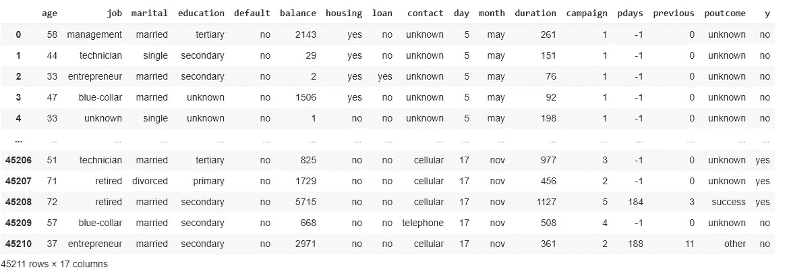
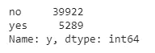
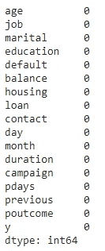
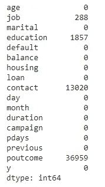
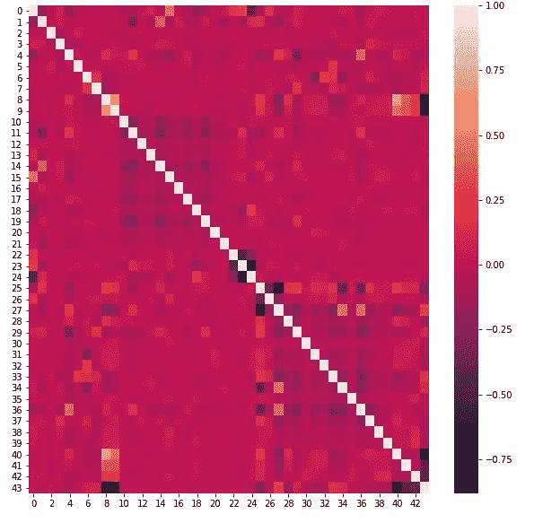
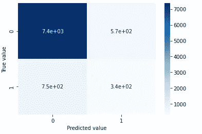
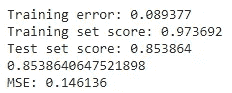

# 为银行营销数据集开发多层感知器

> 原文：<https://towardsdatascience.com/developing-a-multi-layer-perceptron-for-a-bank-marketing-dataset-f754deee49fb?source=collection_archive---------21----------------------->

## 通过分析银行营销数据集预测客户是否会订阅定期存款

克里斯·利维拉尼在 [Unsplash](https://unsplash.com?utm_source=medium&utm_medium=referral) 上的照片

在这篇文章中，我将一步一步地解释如何开发一个多层感知器模型。为此，我将获取一个与葡萄牙银行机构的直接营销活动(电话)相关的数据集(可从 [UCI 机器学习库](https://archive.ics.uci.edu/ml/datasets/bank+marketing#)访问)，并预测客户是否会订阅定期存款。

## 本教程的先决条件

在本教程中，我假设您知道什么是神经网络，神经网络由什么组成，以及学习过程如何在神经网络(NN)中发生:通过不断计算特定训练轮次的误差值并更新学习率。

因此，在本文中，我直接解释什么是多层感知器模型(MLP ),以及如何开发 MLP 来解决现实世界的问题。

在本教程中，我还假设您知道如何使用来自 Google Colab 的 Python 或任何其他工具创建一个基本的神经网络模型。

本文最后给出了本文描述的代码的链接。

本文分为以下几个部分。因此，如果您已经知道某个特定的部分，您可以直接进入您需要了解的部分。

1.  教程所需的背景知识
2.  数据集概述
3.  开发 MLP 神经网络模型

# 1.教程所需的背景知识

在开始理解如何开发 MLP 模型之前，让我们首先确定我们在这些概念上是一致的。

## 什么是人工神经网络中的多层感知器模型？

一个**多层感知器** (MLP)是一个**神经网络**在一个有向图中连接多个层，这意味着连接层中节点的路径只是单向的。除输入节点外，每个节点都有一个非线性激活函数**和**。一个 **MLP** 使用反向传播作为一种监督学习技术[1],以便当考虑到模型已经学习的内容时，误差值可以以一种非常成功的方式更新。

## 银行营销和定期存款领域知识

定期存款有时也称为定期存款，是银行的一种投资形式；它是一笔一次性的金额，按照约定的利率在银行存一段固定的时间。客户倾向于定期存款，以确保他们的钱在未来的几年里得到更多的价值，并且他们能够存下更多的钱，而不是维持一个储蓄账户。

另一方面，银行向客户提供定期存款是有益的，因为这是银行获得更多资金的一种方式。相反，银行向客户提供比储蓄账户更好的利率。

银行开展促销活动，吸引客户在他们那里开立定期存款账户；如电话、电子邮件、广告活动。

# 2.数据集概述

如上所述，该数据集是从 UCI 机器学习储存库中获得的，并且具有以下特征。

作者截图-数据集一瞥

有 17 个变量，包括 16 个特性和类变量。数据集中所有特征的描述在数据源中给出，该数据源可从 [UCI 机器学习库](https://archive.ics.uci.edu/ml/datasets/bank+marketing#)中找到。

当观察数据集时，我们可以看到数据集包含分类名义值(如工作、婚姻状况、住房贷款可用性等。)、分类序数值(如教育，可以从最低点到最高点确定一个顺序)，最后是离散和连续值。

检查类值计数以了解数据集中有多少个类以及每个类标签有多少个值。

作者截图—检查类标签的值计数

通过考虑类变量的计数，我们可以看到数据集是一个不平衡的数据集，因为“否”的数量几乎是“是”类的 8 倍。在本教程中，我不会处理类的不平衡，但可以通过 SMOTE 等技术来处理。

# 3.开发 MLP 神经网络模型

当开发一个神经网络模型时，有三个主要阶段需要我们关注。他们是；

a.按照数据挖掘过程中指定的方式预处理数据集

b.如有必要，执行特征工程

c.将数据集分为训练集和测试集。训练模型，测试和预测预期结果。

现在，我们将研究如何执行上述每个阶段。

## a.按照数据挖掘过程中指定的方式预处理数据集

预处理数据包括处理缺失值和异常值，必要时应用特征编码技术，缩放和标准化特征。

**检查缺失值**

在使用 Pandas 时，我们可以使用 isnull()找到标准缺失值(Pandas 可以检测到的缺失值)，并使用 isnull()获得缺失值的汇总。sum()。[2] [3]

按作者划分的屏幕截图-缺失值的摘要

另一种类型的缺失值是非标准缺失值，这是熊猫自己无法找到的，需要我们的帮助[2]。当手动扫描数据集时，我们可以看到有 4 个字段包含值“未知”。

作者截图—缺失值“未知”的摘要

**处理异常值**

离群值是偏离标准数据集很多的数据点。在训练和构建模型时，数据集中的异常值会影响最终的准确性。因此，我们必须找到并消除这些异常值。

我们只能检查数值特征中的异常值。因此，我一个接一个地检查了每个数字特征，画出箱线图来识别异常值，并去除它们。

我检查过的异常值的数字特征有“年龄”、“余额”、“日”、“持续时间”、“活动”、“天数”和“先前”。成功移除 119 个异常值后，数据集中新的数据点数是 45092(之前是 45211)。

盒式图在笔记本/Colab 文件中一个接一个地显示。

**特征编码**

在这个过程中，分类数据被编码成数字数据。

1.  LabelEncoder 用于对类值进行编码。
2.  OrdinalEncorder 用于对“教育”特征进行编码，因为当考虑该字段中存在的值时，订单可以被视为二级、三级等。
3.  OneHotEncoding 用于对具有其他分类值的要素进行编码。(功能—“工作”、“婚姻”、“联系人”、“月份”、“poutcome”)
4.  手动二进制编码(使用字典)用于对具有是/否值的其余特征进行编码(“默认”、“住房”、“贷款”)

至此，我已经将数据集中的所有值编码成数值

**拆分数据**

我用 20%的测试规模分割了数据。

**特征缩放**

对分类数据进行编码后，数据集由具有不同数据范围的要素组成。这些值是标准化的，特征缩放按如下方式进行。数字特征通过去除平均值和缩放至单位方差(标准缩放器)进行缩放，如下所示。

## b.特征工程

特征选择是机器学习的核心概念之一，它会极大地影响模型的性能。您用来训练机器学习模型的数据特征对您可以实现的性能有着巨大的影响。不相关或部分相关的特征会对模型性能产生负面影响。

**绘制相关矩阵**

因此，我将执行相关系数检查机制，以检查不同特征与输出之间的关系。

这些相关类型中的每一种都可以存在于由从 0 到 1 的值表示的谱中，其中轻微或高度正相关特征可以是类似于 0.5 或 0.7 的值。如果存在强的和完美的正相关，那么结果由 0.9 或 1 的相关分值表示。[4]

作者截图—关联矩阵

我生成的关联矩阵有很多元素，因为在 OneHotEncoding 之后，数据集中的列数增加了。

生成相关矩阵后，我们可以看到，在矩阵的右侧，有一些具有非常高相关性的特征。我们通常会删除相关性高的特征，因为它们与其他特征存在某种线性相关性。这些特征对预测输出贡献很小，但增加了计算成本。[5]

很明显，相关特征意味着它们带来相同的信息，因此移除其中一个是合乎逻辑的。[6]

为了找到具有高相关值的确切列，我执行了下面的代码。我正在检查相关矩阵的上部三角形，因为上部和下部三角形是彼此的镜像，被相关矩阵中的对角线分割。在这里，我检查相关值大于 0.95 的列，希望删除它们。

但是，在执行了上面的代码之后，我们可以看到没有任何列的相关性超过 0.95，因此没有要删除的列。

**应用 PCA**

主成分分析(PCA)是一种降维方法，通常用于降低大型数据集的维数，方法是将一个大型变量集转换为一个较小的变量集，该变量集仍包含大型数据集中的大部分信息。[7]

这里，我没有手动设置 PCA 模型的 n_components。我们希望解释的方差在 95–99%之间。因此，我将 PCA 的 n_components 设置为 0.95 [8]

## c.开发多层感知器模型

我用 scikit 学习包中的 MLPClassifier 制作了 MLP 模型。[9]

**生成混淆矩阵**

使用混淆矩阵，我们可以发现有多少真阳性、假阳性、假阴性和真阴性。

作者截图——我构建的模型的混淆矩阵

上面的混淆矩阵显示有 340 个真阳性和 7400 个假阴性，这对于不平衡的数据集来说仍然是好的。假阳性的数量是 570，真阴性的数量是 750。

最后，我列出了均方差值、训练集分数、测试集分数等。如下。

作者截图—培训测试成绩输出

我们可以看到，我创建的这个模型的训练准确率为 97.369%，而测试准确率为 85.386%。

为这个任务写的代码可以从[这里](https://github.com/dilinipeirs/ann/blob/main/Bank%20Marketing%20-%20Term%20Deposit%20Prediction%20using%20MLP.ipynb)找到。

# 参考

[1] [多层感知器(MLP)——由 Technopedia](https://www.techopedia.com/definition/20879/multilayer-perceptron-mlp)

[2] [用 Python 和 Pandas 清理数据:检测缺失值](/data-cleaning-with-python-and-pandas-detecting-missing-values-3e9c6ebcf78b)

[3] [处理熊猫中的缺失数据](https://www.geeksforgeeks.org/working-with-missing-data-in-pandas/#:~:text=Checking%20for%20missing%20values%20using,null%20values%20in%20a%20series.)

[4] [为什么特征相关性很重要…很多！](/why-feature-correlation-matters-a-lot-847e8ba439c4#:~:text=Each%20of%20those%20correlation%20types,value%20of%200.9%20or%201.)

【5】[如何在 Python 中去掉高度相关的特性？— DeZyre](https://www.dezyre.com/recipes/drop-out-highly-correlated-features-in-python)

[6] [在监督学习中，为什么有关联特征是不好的？](https://datascience.stackexchange.com/questions/24452/in-supervised-learning-why-is-it-bad-to-have-correlated-features)

[7] [主成分分析(PCA)的逐步解释](https://builtin.com/data-science/step-step-explanation-principal-component-analysis)

【8】[PCA—如何选择分量数？](https://www.mikulskibartosz.name/pca-how-to-choose-the-number-of-components/)

[9] [Scikit 学习—MLP 分类器](https://scikit-learn.org/stable/modules/generated/sklearn.neural_network.MLPClassifier.html)