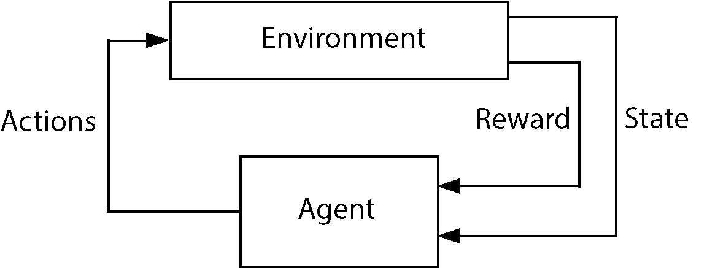
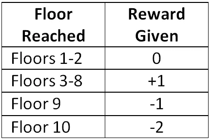
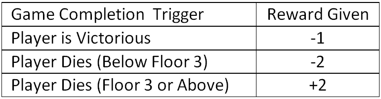
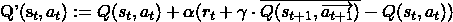
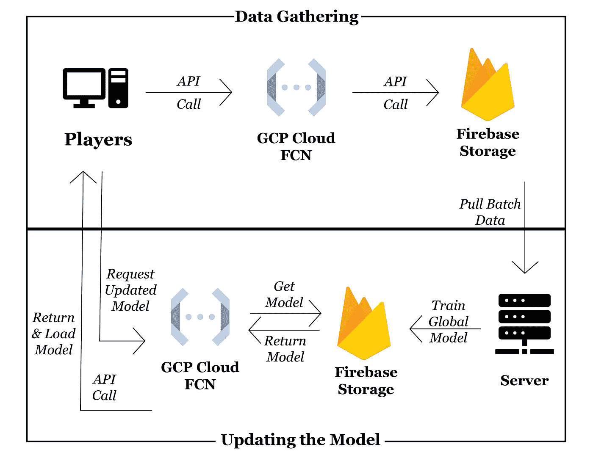

# 使用 GCP 开发一个具有强化学习的类似 rogue 的游戏

> 原文：<https://towardsdatascience.com/developing-a-roguelike-game-with-reinforcement-learning-using-gcp-46a9b2f5ca3?source=collection_archive---------32----------------------->

照片由[西格蒙德](https://unsplash.com/@sigmund?utm_source=medium&utm_medium=referral)在 [Unsplash](https://unsplash.com?utm_source=medium&utm_medium=referral) 拍摄

强化学习(RL)的许多应用都是专门为了将人从循环中解放出来。例如，OpenAI Gym [1]为训练 RL 模型充当 Atari 游戏中的玩家提供了一个框架，并且许多出版物描述了将 RL 用于机器人。然而，一个经常讨论不足的领域是应用 RL 方法来改善人类的主观体验。

为了演示这种应用，我开发了一个简单的游戏，名为“禁冰宫殿的考验”[2]。这款游戏采用强化学习，通过为用户量身定制游戏难度来提高用户体验。

# 游戏如何运作

游戏是传统的 roguelike 游戏:回合制地牢爬虫，有 RPG 元素和大量的程序生成。玩家的目标是逃离冰宫，一层一层地，一路上与怪物战斗，收集有帮助的物品。虽然每个楼层出现的敌人和物品传统上是随机生成的，但这个游戏允许 RL 模型根据收集的数据生成这些实体。

由于强化学习算法是出了名的数据饥渴，所以游戏被创建为具有以下约束以降低 RL 模型的复杂性:

1)游戏共有 10 层，之后玩家获胜

2)每层可以繁殖的敌人和物品数量是固定的

# 强化学习和环境

强化学习的核心概念是自动代理通过观察和采取行动与环境交互，如图 1 所示。通过与环境的互动，代理可以获得奖励(积极的或消极的),代理用这些奖励来学习和影响未来的决策。

图一。用于强化学习的代理和环境之间的交互(图片由作者提供)

对于这个应用程序，代理是 RL 算法，它根据选择产生的实体来调整游戏的难度，游戏是 RL 算法可以观察和控制的环境。

## 状态

状态是代理对环境进行的任何观察，它可以用于决定采取哪些行动。虽然代理可能会观察到大量不同的数据(玩家的健康状况、玩家前进一层所需的回合数等)，但游戏的第一个版本的变量只考虑玩家已经到达的楼层和玩家角色的级别。

## 行动

由于游戏是按程序生成的，代理将决定随机生成怪物/物品，而不是每次都有确定性的决定。由于有很大的随机性，代理人不会以典型的 RL 方式探索/利用，而是控制游戏中不同敌人/物品的加权概率。

当代理选择行动时，基于利用迄今为止最好的学习模式，它将通过学习 Q 矩阵的加权随机抽样来决定在游戏中产生哪个敌人/物品；然而，如果代理人选择探索，代理人将从游戏中的所有实体中以相等的概率产生一个敌人/物品。

## 奖励

强化学习算法的奖励模型对于学习模型应该显示的预期行为的发展至关重要，因为机器学习方法以走捷径来实现其目标而闻名。因为预期目标是最大化玩家的乐趣，所以根据 RL 算法的奖励，已经进行了以下假设来量化乐趣:

-一个玩家在游戏中比早死的人进步更快，会有更多的乐趣

-玩家每次都赢而没有挑战的游戏是无聊的

考虑到这些目标，当玩家前进到表 I 中所示的新楼层时，以及当游戏如表 II 中概述的那样完成时，RL 模型接收奖励。

表 1:玩家进展的奖励模型

表二:游戏完成的奖励模型

考虑到上面的进展和完成评分机制，RL 算法将通过允许玩家进展到第 8 层来最大化奖励，在第 8 层，玩家应该最终迎接他们的死亡。为了尽量减少意外行为的机会，RL 算法也会因玩家过早死亡而受到惩罚。

# 更新模型

RL 算法采用 Q 学习，它已经被修改以适应由代理执行的随机动作。从传统的 Q-Learning [3]修改而来，在传统的 Q-Learning[3]中，代理在状态之间采取 1 个动作，代理的动作被更新，考虑到为楼层产生的所有敌人/物品的概率分布，如下式所示。

其中*Q’(s _ t，a_t)* 是 Q 矩阵的更新值， *Q(s_t，a_t)* 是状态 *s* 和动作 *a* 对在时间步 *t* ， *α* 是学习率， *r_t* 是从过渡到状态 t+1 提供的奖励， *γ* 是

由于强化学习方法需要大量的训练数据，因此从玩家会话中收集游戏数据来训练全局 AI 模型，新玩家可以使用该模型作为起点。

# 通过 GCP 全球化 RL 培训

使用由所有玩家收集的游戏数据来训练全局 AI 模型，并且当玩家还没有玩游戏时，将其用作基础 RL 模型。新玩家在第一次开始时会获得一个全局 RL 模型的本地副本，当他们玩游戏时，它会根据他们自己的游戏风格进行定制，而他们的游戏数据将用于进一步增强未来新玩家的全局 AI 模型。

图 2 数据管道和 RL 模型训练架构(图片由作者提供)

图 2 所示的体系结构概述了如何收集数据以及如何更新和分发全局模型。使用 GCP 是因为他们的免费层使用产品最适合为模型训练收集和存储游戏数据[4]。在这方面，游戏经常调用云函数调用 GCP 来将数据存储在 Firebase 数据库中。

# 结论

本文中介绍的工作描述了如何使用强化学习来增强玩家玩游戏的体验，这与更常见的用于自动化人类动作的 RL 应用相反。使用自由层 GCP 架构的组件收集所有玩家的游戏会话数据，从而允许创建全局 RL 模型。当玩家以全局 RL 模型开始游戏时，他们的个人经历创建了定制的局部 RL 模型以更好地适应他们自己的游戏风格。

# 参考

[1] *奥鹏艾健身房，*https://gym.openai.com T2

【2】*罗格里克尔——禁冰宫试炼，*[https://drmkgray.itch.io/roguelikerl-tfip](https://drmkgray.itch.io/roguelikerl-tfip)

[3]卡尔布林、利特曼和摩尔(1996 年)。强化学习:综述。《人工智能研究杂志》， 4，237–285。[https://arxiv.org/pdf/cs/9605103.pdf](https://arxiv.org/pdf/cs/9605103.pdf)

[4]*https://cloud.google.com/free*、[GCP 自由级](https://cloud.google.com/free)